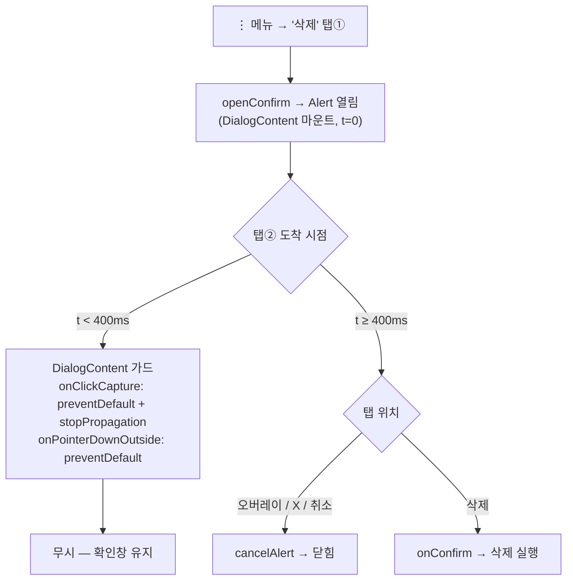

# 모달이 열린 직후 들어온 클릭을 무시하는 가드를 공용 DialogContent로 올리기

> 요약: `useOpenClickGuard`(열린 뒤 400ms 동안 클릭을 무시하는 훅)는 지금 폴더 선택 모달 한 곳에만
> 연결돼 있다. 이를 `shared/ui/atoms/dialog.tsx`의 `DialogContent`로 옮겨 Alert/Confirm을 포함한
> 모든 Dialog 기반 모달에 적용한다.

## Context

**증상(사용자 제보, 2026-09-29)**: 북마크 페이지에서 폴더 ⋮ 메뉴 → "삭제"를 누르면 확인창이
뜨자마자 닫혔다. 사용자는 그 사이에 뭔가를 더 눌렀다는 걸 인지하지 못했다.
("북마크 삭제"라는 이름의 ⋮ 항목은 없다. 폴더 ⋮의 "삭제"(`useFolderActions.ts:69`)로 해석했다.)

### 가설 (재현하지 못했다)

- 메뉴 항목을 누른 **그 탭 한 번**으로는 확인창이 닫히지 않는다. 근거는 두 가지다.
  - Radix DismissableLayer는 바깥 pointerdown 리스너를 `setTimeout(0)` 뒤에야 붙인다.
    터치일 때는 뒤따르는 click까지 기다린다.
  - modal Dialog는 `onFocusOutside`를 항상 `preventDefault`한다
    (`node_modules/@radix-ui/react-dialog/dist/index.mjs:156-159`). 드롭다운이 닫히며 트리거로
    포커스를 돌려도 확인창은 닫히지 않는다.
- 가장 유력한 원인은 **무의식적인 두 번째 탭**이 방금 뜬 확인창에 떨어진 경우다. 떨어지는 곳에 따라
  결과가 갈린다.
  - 오버레이: 확인창이 닫힌다.
  - X·취소 버튼: 확인창이 닫힌다.
  - 삭제 버튼: 의도하지 않은 삭제가 일어난다.
- 폴더 선택 모달에서 이미 고쳤던 증상과 같다(`docs/BOOKMARK.md:168-186`).
  그 수정은 `BookmarkFolderSelectModal.tsx:95-110`에만 연결돼 있다.
- 같은 구멍이 있는 모달(모두 `DialogContent` 기반이고 가드가 없다):
  - Alert/Confirm: 호출처 6곳 — 폴더·게시글·댓글·계정 삭제, 공개 전환, 저장 안 한 변경 확인
  - ImageViewer: `DialogContent`에 `onClick={close}`가 걸려 있다(`ImageViewer.tsx:100`).
    더블탭하면 열리자마자 닫히기 가장 쉬운 구조다.
  - LoginModal, MyPageModal

## 판단이 필요했던 항목

| 항목                  | 결정                                                                                          | 근거·기각한 대안                                                                                                                                                                                                                                   |
| --------------------- | --------------------------------------------------------------------------------------------- | -------------------------------------------------------------------------------------------------------------------------------------------------------------------------------------------------------------------------------------------------- |
| 적용 범위             | 공용 `DialogContent` 한 곳에 적용 → 모든 모달과 Alert에 적용된다(**사용자 선택, 2026-09-29**) | 기각: Alert.tsx에만 적용 — 이미지 뷰어·로그인·마이페이지에 같은 구멍이 남는다                                                                                                                                                                      |
| "열린 시점"의 기준    | `DialogContent`가 마운트된 시점. `useOpenClickGuard(true)`로 호출한다                         | Radix Presence는 열릴 때 Content를 마운트하므로 마운트 시점이 곧 열린 시점이다. 기각: Dialog Root를 래핑해 `open`을 전달 — 코드가 늘어난다. 한계: 닫힘 애니메이션(200ms) 도중 다시 열면 시계가 재시작되지 않는다. 가드가 약해질 뿐 오작동은 아니다 |
| 클릭 차단 방식        | `preventDefault` + `stopPropagation`                                                          | 선례(폴더 모달)는 `stopPropagation`만 쓴다. 이 atom에는 LoginModal의 폼·링크가 들어온다. `stopPropagation`만 걸면 react-router `Link`의 onClick이 실행되지 않아 네이티브 이동(전체 새로고침)이 일어나고, submit 버튼은 네이티브로 제출된다         |
| 가드하는 경로         | 모달 안 클릭(`onClickCapture`)과 바깥 pointerdown(`onPointerDownOutside`)                     | Escape는 가드하지 않는다. 실수로 누를 일이 없고, 키보드 사용자가 즉시 닫는 동작을 유지해야 한다                                                                                                                                                    |
| 시간                  | 기존 `DOUBLE_CLICK_GUARD_MS`(400ms, `const.ts:42`)를 그대로 쓴다                              | 근거는 `docs/DECISIONS.md` 2026-09-21 항목에 있다(Windows 더블클릭 기본값 500ms와 단순 시각 반응시간 200~273ms 사이). 새 값을 만들지 않는다                                                                                                        |
| 폴더 모달의 기존 연결 | 제거한다                                                                                      | atom 가드와 중복이다. 단위 테스트 2개는 같은 모듈(`@/shared/hooks/useOpenClickGuard`)을 mock하므로 atom을 통해 그대로 적용된다                                                                                                                     |
| e2e 대기 방식         | 선례대로 인라인 `page.waitForTimeout(DOUBLE_CLICK_GUARD_MS)`를 쓴다                           | 선례: `e2e/bookmark.spec.ts:110-114`. 가드는 클릭 자체를 삼키므로 관측 가능한 이벤트로는 대체할 수 없다                                                                                                                                            |

## 세부 계획

| 위치                                                                        | 변경 내용                                                                                                                                                                                                                                                                                                                                                |
| --------------------------------------------------------------------------- | -------------------------------------------------------------------------------------------------------------------------------------------------------------------------------------------------------------------------------------------------------------------------------------------------------------------------------------------------------- |
| `src/shared/ui/atoms/dialog.tsx:34-90`                                      | forwardRef 본문을 블록 함수로 바꾸고 `const isOpenClickGuarded = useOpenClickGuard(true)`를 추가한다. `onPointerDownOutside`에서는 뒤로/앞으로 버튼 체크 다음에 가드 중이면 `preventDefault()` 후 return한다. `onClickCapture`를 새로 분리해, 가드 중이면 `preventDefault()`+`stopPropagation()` 후 return하고 아니면 호출자의 `onClickCapture`를 부른다 |
| `src/shared/ui/atoms/dialog.test.tsx` (신규)                                | `select.test.tsx`의 `vi.useFakeTimers({ toFake: ['Date'] })` 선례를 따른다. 케이스: ① 열린 직후 내부 버튼 클릭 무시 ② 400ms 뒤 정상 동작 ③ 열린 직후 바깥 pointerdown으로 안 닫힘 ④ 400ms 뒤 바깥 pointerdown으로 닫힘 ⑤ Content 자체 `onClick`(ImageViewer 형태)도 열린 직후 무시                                                                       |
| `src/features/bookmark/select/ui/BookmarkFolderSelectModal.tsx:8,53,95-110` | `useOpenClickGuard`의 import·호출과 `onClickCapture`·`onPointerDownOutside` prop을 제거한다(`onEscapeKeyDown`은 유지)                                                                                                                                                                                                                                    |
| `src/shared/hooks/useOpenClickGuard.ts:4-10`                                | JSDoc의 사용처 설명을 "DialogContent(모든 모달)"로 갱신한다                                                                                                                                                                                                                                                                                              |
| e2e 7파일                                                                   | 모달이 뜬 뒤 첫 클릭 전에 `await page.waitForTimeout(DOUBLE_CLICK_GUARD_MS)`를 넣는다. 대상: `unsaved-changes`(3곳), `signup-unsaved-changes`(1), `post-visibility`(2), `post-delete`(1), `bookmark-folder-delete`(1), `comment-delete`(2), `protected-nav`(1). `account-update`는 실행해 보고 필요하면 추가한다                                         |
| `e2e/bookmark.spec.ts:110-113`                                              | 주석이 가리키는 가드 위치를 `BookmarkFolderSelectModal.tsx`에서 `dialog.tsx`로 갱신한다                                                                                                                                                                                                                                                                  |
| `docs/BOOKMARK.md:168-186`                                                  | 가드가 `DialogContent`로 올라가 모든 모달에 적용된다고 갱신하고, 문서의 "마지막 검토" 날짜를 갱신한다                                                                                                                                                                                                                                                    |
| `CHANGELOG.md` `[Unreleased]` → `### Fixed`                                 | `shared` 항목 추가: 모달·확인창이 열리자마자 두 번째 탭에 닫히거나 실행되던 문제 수정(`changelog-release` skill 형식)                                                                                                                                                                                                                                    |
| `docs/plans/2026-09-29-dialog-open-click-guard.md` (신규)                   | 이 계획의 스냅샷(§11)                                                                                                                                                                                                                                                                                                                                    |

**작업 절차**: 먼저 `git log origin/main..main`으로 미푸시 커밋이 없는지 확인한다(계획 시점에는 없었다).
그다음 `EnterWorktree`로 들어가 `cp ../../../.env .`, `pnpm install`을 실행한다.
구현과 검증을 마치면 `.gitmessage` 형식으로 `git commit -- <경로...>` 하고, PR을 올려 squash로 머지한다.

## 영향 범위 (§5)

**CRUD**: 데이터 계약·API는 바뀌지 않는다. 삭제·공개 전환·탈퇴 확인 버튼이 열린 뒤 400ms 동안
반응하지 않게 되는데, 이는 의도하지 않은 삭제를 막는 방향이다. 중복 요청·소유권·캐시 무효화 경로는 바뀌지 않는다.

**기존 기능 회귀 후보**

- Alert/Confirm 호출처 6곳(`useFolderActions`, `usePostDelete`, `usePostCard` 공개 전환,
  `useDeleteComment`, `useDeleteAccount`, `useUnsavedChangesGuard`): 열린 뒤 400ms 동안 버튼이 반응하지 않는다.
- `ImageViewer`: 열린 뒤 400ms 동안 탭해서 닫기, 이전/다음, X가 반응하지 않는다.
- `LoginModal`·`MyPageModal`: 400ms 안의 클릭을 무시한다. 입력 포커스는 mousedown에서 일어나므로 영향이 없다.
- `BookmarkFolderSelectModal`: 동작은 같고 가드 위치만 atom으로 옮겨진다. `preventDefault`가 추가된다.
- `dialog.tsx`의 기존 가드(뒤로/앞으로 마우스 버튼, IME 조합 중 Escape)는 순서를 그대로 유지한다.
- 테스트
  - e2e: 위 7파일
  - 단위: `PostCardBookmarkFolderModal.test.tsx`·`PostCreateBookmarkFolderField.test.tsx`(mock 경로가
    유지돼 통과할 것으로 예상). 나머지 Dialog 렌더링 테스트는 `pnpm test`로 확인한다.
- 문서: `docs/BOOKMARK.md`, `useOpenClickGuard` JSDoc, `bookmark.spec.ts` 주석. FE에만 해당하는
  인터랙션이라 BE 문서는 영향이 없다.

## 검증 방법

1. `pnpm type-check` → `pnpm test`(새 `dialog.test.tsx` 포함) → `pnpm lint` → `pnpm check:docs`
2. `pnpm test:e2e`로 전체 실행. 특히 위 7파일과 `bookmark.spec.ts`를 본다.
3. `browser-verification` skill로 Playwright MCP 녹화를 한다.
   - 모바일 뷰포트: 폴더 ⋮ → "삭제"를 더블탭해도 확인창이 유지되는지, 400ms 뒤 취소·삭제가 정상 동작하는지 확인한다.
   - 이미지 썸네일을 더블탭해도 뷰어가 유지되는지 확인한다.
4. §11: PR을 올리기 전에 fresh Explore subagent로 계획과 실제 diff를 대조하고, PR 본문에 `## 계획 대비 구현`을 적는다.
5. 머지 후 `gh run list --branch main --workflow "Frontend Deploy (S3 + CloudFront)"`로 배포 성공을 확인한다.

## 남은 것

- 원인은 가설(두 번째 탭)이고 재현하지 못했다. 가드를 적용한 뒤에도 재발하면 다른 경로를 조사한다
  (예: `Alert.tsx:60-67`의 `location.key` 변경 시 자동 취소).
