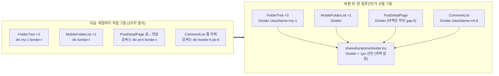

# 구분선 공통 컴포넌트(Divider) 만들기 — 폴더 사이드바·게시글 상세 댓글 영역

> **한 줄 요약**: `src/shared/ui/atoms/divider.tsx`에 **`Divider` 컴포넌트를 새로 만들고**, 지금 각
> 파일이 `div`로 직접 긋고 있는 구분선 6곳을 전부 이 컴포넌트로 바꾼다. **화면은 바뀌지 않는다**
> (선 모양·여백을 그대로 옮긴다).

---

## 0. 현재 상황

화면에 보이는 가로 구분선 6개가 **공통 컴포넌트 없이 파일마다 직접, 그것도 3가지 다른 방식으로**
그려져 있다.

| 화면                                 | 위치                                                      | 지금 코드                                           | 방식                     |
| ------------------------------------ | --------------------------------------------------------- | --------------------------------------------------- | ------------------------ |
| 북마크 사이드바(데스크톱) 구분선 3개 | `widgets/bookmark/folder-tree/ui/FolderTree.tsx:67·85·95` | `<div className="my-1 border-t" />`                 | 빈 div에 윗테두리        |
| 북마크 폴더 목록(모바일) 1개         | `widgets/bookmark/folder-tree/ui/MobileFolderList.tsx:50` | `<div className="border-t" />`                      | 빈 div에 윗테두리        |
| 게시글 상세: 글 ↔ 댓글 사이          | `pages/post/PostDetailPage.tsx:93`                        | `<div className="pt-6 border-t">`(댓글 전체를 감쌈) | 감싸는 div의 테두리+패딩 |
| 게시글 상세: 댓글 작성 폼 아래       | `widgets/comment/comment-list/ui/CommentList.tsx:87`      | `<div className="mt-4 border-b pb-6">`(폼을 감쌈)   | 감싸는 div의 테두리+패딩 |

**왜 문제인가**

- 선 색·두께를 바꾸려면 6곳을 일일이 찾아 고쳐야 하고, 방식이 달라 찾기도 어렵다.
- CLAUDE.md Critical Rule 위반: _raw HTML 요소로 UI를 일회성 구현 금지 → 반복되는 UI는 공통
  컴포넌트로 단일 관리_.
- 계기: 다른 세션(`auth-fe-phase3` 워크트리, 미커밋)이 "가운데 글자가 있는 구분선"
  `LabeledDivider`는 atom으로 만들었는데, 정작 "그냥 구분선"은 공통 컴포넌트가 없다.

---

## 1. 전체 계획 (기존과 어떻게 달라지는가)

**새 컴포넌트 `Divider` 하나를 만들고, 위 6곳이 전부 이걸 쓰게 한다.** `Divider`는 **1px 선만**
그리고, 선 위아래 여백은 쓰는 쪽이 정한다 — 그래서 여백 값을 그대로 옮기면 화면이 바뀌지 않는다.

### 목표 구조



### 새로 만드는 컴포넌트

```tsx
// src/shared/ui/atoms/divider.tsx (신규) — kbd.tsx와 같은 형태
import { cn } from '@/shared/lib/tailwind/utils';

function Divider({ className, ...props }: React.ComponentProps<'div'>) {
  return (
    <div
      data-slot="divider"
      className={cn('h-px w-full shrink-0 bg-border', className)}
      {...props}
    />
  );
}

export { Divider };
```

### 화면이 안 바뀌는 이유

선 모양은 같다 — 빈 div의 `border-t`도, `Divider`의 `h-px bg-border`도 **1px, `--border` 색**이다
(`globals.css:375`의 `* { @apply border-border }`가 모든 테두리 색을 `--border`로 맞춘다).
여백은 자리별로 아래처럼 그대로 옮긴다.

| 자리         | 지금 (위 → 선 → 아래)                                            | 바뀐 뒤                                                 |
| ------------ | ---------------------------------------------------------------- | ------------------------------------------------------- |
| FolderTree   | 부모 `gap-1` 4px + `my-1` 4px → 선 → `my-1` + `gap-1`            | `className="my-1"`을 그대로 넘김 → 동일                 |
| 글 ↔ 댓글    | 부모 `gap-6` 24px → 감싼 div의 윗테두리 → `pt-6` 24px            | 부모 `gap-6` 24px → Divider → 부모 `gap-6` 24px         |
| 댓글 폼 아래 | 폼 → `pb-6` 24px → 감싼 div의 아랫테두리 → 부모 `space-y-6` 24px | 폼 → Divider의 `mt-6` 24px → Divider → `space-y-6` 24px |

### 확정된 결정들

| 항목          | 결정                                                                                                                                                                                                                  |
| ------------- | --------------------------------------------------------------------------------------------------------------------------------------------------------------------------------------------------------------------- |
| 이름·위치     | `Divider`, `src/shared/ui/atoms/divider.tsx`. 사용자 용어이자 `LabeledDivider`와 짝. shadcn `Separator`는 선 하나 때문에 `@radix-ui/react-separator` 의존성을 새로 추가해야 해서 안 씀                                |
| 여백          | **컴포넌트에 넣지 않음.** 자리마다 간격이 의도적으로 다르다(사이드바 8px, 페이지 섹션 24px). 기본 여백을 넣으면 기존 화면이 바뀌고 부모 gap과 겹친다(DECISIONS.md 2026-09-06, 검색 필터 여백이 25~33px로 쌓였던 사례) |
| 세로 방향     | 이번엔 만들지 않음 — 이번 범위에 세로선이 없다                                                                                                                                                                        |
| 접근성        | 지금처럼 역할(role) 없는 div. 스크린리더 동작이 그대로다(`<hr>`로 바꾸면 "구분선"이라고 새로 읽어 동작이 달라짐)                                                                                                      |
| 적용 범위     | 사용자 요청(FolderTree, 게시글 상세 댓글 영역)에 같은 폴더 트리 모듈의 모바일 짝(MobileFolderList)과 댓글 영역의 두 번째 선(폼 아래)을 포함                                                                           |
| 시각 시안(§9) | 만들지 않음 — 화면 변화가 없는 교체라서. 대신 전후 위치를 실제로 재서 0px 차이를 확인                                                                                                                                 |

---

## 2. 세부 계획

### 2-1. 새로 만드는 파일

| 위치                                             | 내용                                                                          |
| ------------------------------------------------ | ----------------------------------------------------------------------------- |
| `src/shared/ui/atoms/divider.tsx` (신규)         | 위 §1 "새로 만드는 컴포넌트" 코드                                             |
| `src/shared/ui/atoms/divider.stories.tsx` (신규) | Default story (atom은 스토리 필수 — CLAUDE.md). `kbd.stories.tsx` 형태를 따름 |

### 2-2. 바꾸는 파일

| 위치                                                      | 변경 전                                                                                                            | 변경 후                                                                                                                                        |
| --------------------------------------------------------- | ------------------------------------------------------------------------------------------------------------------ | ---------------------------------------------------------------------------------------------------------------------------------------------- |
| `widgets/bookmark/folder-tree/ui/FolderTree.tsx:67·85·95` | `<div className="my-1 border-t" />`                                                                                | `<Divider className="my-1" />`                                                                                                                 |
| `widgets/bookmark/folder-tree/ui/MobileFolderList.tsx:50` | `<div className="border-t" />`                                                                                     | `<Divider />`                                                                                                                                  |
| `pages/post/PostDetailPage.tsx:93-95`                     | `<div className="pt-6 border-t">`<br/>`  <CommentList … />`<br/>`</div>`                                           | `<Divider />`<br/>`<CommentList … />`                                                                                                          |
| `widgets/comment/comment-list/ui/CommentList.tsx:86-90`   | `{!isMobile && (`<br/>`  <div className="mt-4 border-b pb-6">`<br/>`    <CommentForm … />`<br/>`  </div>`<br/>`)}` | `{!isMobile && (<>`<br/>`  <div className="mt-4">`<br/>`    <CommentForm … />`<br/>`  </div>`<br/>`  <Divider className="mt-6" />`<br/>`</>)}` |

- PostDetailPage: 감싸던 div를 없애고 `CommentList`를 부모 flex 컨테이너에 바로 둔다. `CommentList`가
  함께 렌더하는 `MobileCommentBar`·`ScrollToCommentFormButton`은 `position: fixed`라 flex 배치와 gap에서
  빠지므로 간격이 달라지지 않는다. 실측에서 차이가 나면 클래스 없는 감싸는 div를 남긴다.
- CommentList: Divider를 폼과 같은 `formContainerRef` div 안, `!isMobile` 조건 안에 둔다(이유는 2-3).

### 2-3. 영향 범위 (깨질 수 있는 기존 동작)

| 기존 동작                                                                                                                                                      | 대응                                                                                                   |
| -------------------------------------------------------------------------------------------------------------------------------------------------------------- | ------------------------------------------------------------------------------------------------------ |
| `ScrollToCommentFormButton.tsx` — `formContainerRef` 영역이 화면 밖으로 완전히 나가면 "댓글 쓰기" 플로팅 버튼이 뜬다. 이 영역 높이가 바뀌면 뜨는 시점이 바뀐다 | Divider를 그 영역 안에 두고 여백을 `mt-6`으로 줘서 높이를 같게 유지(24px + 1px). 전후 height 실측      |
| 모바일 댓글 영역 — 폼이 하단 고정 바로 빠질 때 선이 헤딩 밑에 혼자 남던 버그를 고친 이력(CHANGELOG "댓글 섹션 중복 헤딩·구분선 정리")                          | Divider를 `!isMobile` 조건 안에 둬서 모바일에서는 그리지 않음                                          |
| FolderTree 상단 고정 블록의 `[scrollbar-gutter:stable]` 폭 맞춤                                                                                                | Divider는 폭에 영향 없음 — 변경 없음                                                                   |
| 문서 줄 번호 — `docs/POST-DETAIL-BACK-NAVIGATION.md`가 `PostDetailPage.tsx` 줄 번호를 인용                                                                     | import 1줄 추가로 밀릴 수 있음 → `pnpm check:docs`로 확인하고 갱신(`docs/plans/`는 append-only라 제외) |
| 테스트                                                                                                                                                         | 구분선 클래스에 기대는 unit·e2e 테스트 없음(grep 확인) — 변경 없음                                     |
| CHANGELOG                                                                                                                                                      | 화면·동작 변화 없는 refactor라 항목 추가 안 함                                                         |

데이터·API는 건드리지 않는다(CRUD 영향 없음).

---

## 실행 전략

PR 1개. 순서:

1. 로컬 `main`이 `origin/main`보다 7커밋 뒤(미푸시 커밋은 없음) → `EnterWorktree`(origin/main 기준)
   → `cp ../../../.env .` → `pnpm install`
2. **변경 전** 실측·스크린샷(아래 검증 방법)
3. `divider.tsx` + 스토리 작성 (§2-1)
4. 4개 파일 교체 (§2-2)
5. **변경 후** 실측 → 차이 0px 확인 → 전후 스크린샷을 나란히 보여드림
6. `pnpm type-check` → `pnpm test` → `pnpm lint` → `pnpm check:docs`
7. 이 계획을 `docs/plans/2026-09-29-divider-atom.md`로 복사, `refactor(shared): …` 커밋
   (`git commit -- <경로>`로 대상 지정)
8. fresh Explore 에이전트가 계획과 diff를 대조(§11) → PR 본문 `## 계획 대비 구현` → squash 머지
   → 배포 run 성공 확인

## 검증 방법

**전후 실측** — Playwright MCP(`browser-verification` skill 절차)로 `boundingBox()`를 재서 전후 0px
차이를 확인한다.

| 화면                      | 재는 것                                                                         |
| ------------------------- | ------------------------------------------------------------------------------- |
| `/bookmark` 데스크톱      | 사이드바 구분선 3개의 y·height, 바로 위아래 항목의 y                            |
| `/bookmark` 모바일(390px) | "전체"↔"미분류" 사이 선, 두 행의 y                                              |
| `/post/:id` 데스크톱      | 글 카드 하단 → 선 → "댓글" 헤딩 y, 폼 아래 선 y, `formContainerRef` 영역 height |
| `/post/:id` 모바일        | 폼 아래 선이 없는지, 글↔댓글 선 y                                               |
| 다크모드 1장              | 선 색이 `--border` 그대로인지                                                   |

**명령**: `pnpm type-check`, `pnpm test`, `pnpm lint`, `pnpm check:docs` 전부 통과.

## 남은 것 (이번 범위 밖)

- **`LabeledDivider`** (phase3 워크트리, 다른 세션이 작업 중, 미커밋): 두 작업이 모두 머지된 뒤, 그 안의
  선 2개(`h-px flex-1 bg-border`)를 `<Divider className="flex-1" />`로 바꾼다. 이 PR에서는 손대지 않는다.
- 이번에 안 바꾸는 선들:
  - `PostCard.tsx:326` 좋아요↔댓글 사이 세로선 — 세로 방향 지원이 필요하고 색(`bg-muted-foreground/20`)이 다르다
  - `BookmarkFolderSelectModal.tsx`의 헤더·섹션 라벨·하단 행 테두리 — 선이 아니라 박스 가장자리 성격이다
  - `DropdownMenuSeparator`·`SelectSeparator` — Radix 메뉴 안의 구분선이라 메뉴 접근성 동작이 걸려 있어 유지를 권장한다
