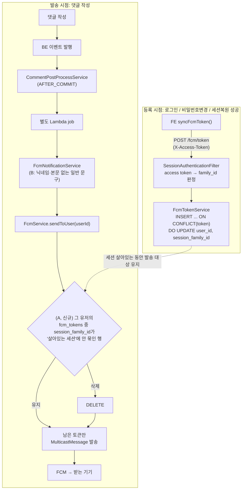

# FCM 푸시 알림 보안 강화 — 세션 바인딩 + 알림 내용 최소화

> Summary: (A) 로그인 세션이 죽으면(자연만료·로그아웃·비밀번호변경·탈취세션 강제폐기) 그
> 기기로의 FCM 푸시도 함께 끊기도록 `fcm_tokens`를 세션 회전 계열(`family_id`)에 묶고,
> (B) 세션이 살아있는 동안에도 잠금화면 등에 댓글 내용이 그대로 노출되지 않도록 알림
> 문구에서 닉네임·본문을 제거해 일반 문구로 바꾼다.

## Context

**문제**: FCM 토큰(`fcm_tokens` 테이블)은 로그인 세션과 완전히 분리된 수명주기를 가진다.
로그인 성공 시 1회 등록되고, 삭제되는 경우는 명시적 로그아웃(`DELETE /fcm/token`)과 FCM이
자체적으로 죽었다고 판정하는 경우(`UNREGISTERED`/`INVALID_ARGUMENT`)뿐이다. 세션이 시간이
지나 자연 만료돼도 이 행은 그대로 남아 계속 푸시를 받는다 — 실제로 사용자가 오래전
로그인한 계정에서 이 상황을 겪었다(알림 클릭 → 이미 로그아웃 상태).

사용자가 제기한 보안 우려: 오래 방치된 계정도 댓글이 달릴 때마다 "닉네임 + 내용 50자"가
담긴 푸시가 그 기기(잠금화면 포함)에 계속 뜬다. 세션이 죽었으면 그 기기로의 알림도 끊겨야
한다.

**지금 이게 가능해진 이유**: 2026-09-28 머지된 인증 개편(BE PR #41~#47,
`docs/plans/2026-09-28-auth-hardening.md`)이 JWT를 버리고 `member_sessions` 테이블 기반
세션 관리로 바꿨다. 이제 로그인 하나 = `family_id`를 가진 회전 계열 하나이고, 로그아웃·
재사용탐지·비밀번호변경 시 그 계열 전체가 `revoked_at`으로 즉시 폐기된다. 이 "기기별
로그인 인스턴스" 식별자를 FCM 토큰에도 묶으면 세션 생명주기와 자동으로 동기화된다.

**목표 A**: 그 기기의 로그인 세션이 살아있는 동안에만(`revoked_at IS NULL AND
refresh_expires_at > now`) 그 기기로 푸시.

**업계 관례 조사 결과 — A는 표준이 아니라 이 레포 맞춤 보강임을 밝힌다**: FCM/APNs 토큰
관리의 표준 트리거는 "로그아웃/계정전환/전송실패"이지 "세션 TTL 만료"가 아니다.

> _"use our SDKs' `clearIdentify` method to disassociate the device token from the user
> in the current session"_ (번역: "SDK의 `clearIdentify` 메서드로 현재 세션의 사용자로부터
> 기기 토큰 연결을 끊으세요") — [Customer.io 공식 문서](https://docs.customer.io/messaging/channels/push/device-tokens/),
> 로그아웃 시 할 일에 대해

이 관례(로그아웃 시 연결 해제, 전송 실패 시 자동 정리)는 이 레포가 이미 하고 있다. 반면
"세션이 자연 만료되면 로그아웃 없이도 그 토큰 발송을 끊는다"는 흐름은 조사한 자료
어디에서도 확인되지 않았다 — A안은 이 레포가 마침 갖춘 세션 인프라(`family_id`)를
활용한 **자체 보강**이지, "다들 이렇게 한다"는 근거는 아니다.

**목표 B — 사용자가 암묵적으로 우려한 두 번째 문제**: "오래 방치했는데 계속 옴"과 별개로,
지금 알림 본문(`"{닉네임}: {내용 50자}"`)은 세션이 **살아있는** 동안에도 잠금화면 등에
댓글 내용을 그대로 노출한다. 업계 표준 대응은 세션 생사와 무관하게 항상 적용되는
"알림 내용 최소화"다.

> _"more apps should handle push notifications similarly to the way Signal does, where
> a ping is sent to wake up the app to check for messages, and the content of that
> message is never sent across servers"_ (번역: "Signal처럼 앱을 깨우는 핑만 보내고
> 메시지 내용 자체는 서버를 거쳐 전송하지 않는 방식을 더 많은 앱이 써야 한다") —
> [EFF, "How Push Notifications Can Betray Your Privacy"(2026-04)](https://www.eff.org/deeplinks/2026/04/how-push-notifications-can-betray-your-privacy-and-what-do-about-it)

> _"an SMS app might display a notification that shows 'You have 3 new text messages,'
> but hides the message contents and senders"_ (번역: "SMS 앱이라면 '새 문자 3개'처럼
> 표시하고 메시지 내용·발신자는 숨길 수 있다") — [Android Developers 공식 문서](https://developer.android.com/develop/ui/views/notifications/build-notification)

A와 B는 서로 다른 문제를 푼다 — A는 "세션이 죽은 뒤"에만 발송을 막고, B는 세션이
살아있어도 항상 내용 노출을 막는다. 사용자 확인 후(2026-09-29) 둘 다 이번 계획에
포함한다.

## 판단이 필요했던 항목

| 항목                                     | 결정                                                                                                           | 근거·기각한 대안                                                                                                                                                                                                                                                                                                                                                    |
| ---------------------------------------- | -------------------------------------------------------------------------------------------------------------- | ------------------------------------------------------------------------------------------------------------------------------------------------------------------------------------------------------------------------------------------------------------------------------------------------------------------------------------------------------------------- |
| 바인딩 단위                              | `family_id`(회전 계열) 단위                                                                                    | userId 단위(대안 D)는 기기 구분이 안 됨 — 공용PC 세션이 만료돼도 폰 세션이 살아있으면 공용PC로 계속 발송되고, 탈취 세션을 강제 폐기해도 피해자가 재로그인하면 공격자 브라우저 토큰으로 다시 발송됨. family는 로그인=새 계열, refresh 회전=계열 유지, 로그아웃/재사용탐지=계열 전체 폐기라 "이 브라우저의 이 로그인"을 정확히 추적함                                 |
| 죽은 토큰 정리 방식                      | 발송 시점(`FcmService.sendToUser`)에 필터링 + DELETE, 별도 배치 없음                                           | 이 BE는 `@Scheduled`가 제거되고 EventBridge→Lambda 방식으로 바뀜 — 새 정리 배치를 놓으려면 EventBridge 룰을 추가해야 해서 과함. 댓글 발생 시점마다 자연 청소되면 충분. **필터만 하고 삭제 안 하면 안 됨** — 그 토큰은 발송 대상에서 빠지므로 FCM의 UNREGISTERED 응답을 영원히 못 받아 사후 삭제 경로 자체가 작동 안 함                                              |
| DELETE 타이밍 레이스 우려                | 안전함, 별도 처리 불필요                                                                                       | rotate의 구행 revoke+신행 insert가 한 트랜잭션으로 커밋됨. PostgreSQL READ COMMITTED는 문장마다 스냅샷을 새로 잡으므로 다른 트랜잭션에는 커밋 전(구행 활성) 또는 커밋 후(신행 활성)만 보이고, 둘 다 죽은 중간 상태는 절대 안 보임                                                                                                                                   |
| FE 토큰 재등록 시점                      | 로그인 성공(기존) + 비밀번호 변경 성공(신규) + 앱 부팅 세션 복원 성공(신규) 3곳                                | 비밀번호 변경은 BE가 `revokeAllForMember` 후 새 세션 발급해서 family가 바뀜 — 재등록 안 하면 방금 비밀번호를 바꾼 정상 사용자의 현재 기기 토큰이 옛(이미 폐기된) family에 묶인 채 다음 발송 때 삭제돼버림. 세션 복원도 마찬가지로 레거시(family 없음) 토큰이 복구가 안 됨. 이 두 경로를 빼면 이번 수정 자체가 "정상 사용자의 알림이 조용히 끊기는" 새 회귀를 만든다 |
| FE 중복 등록 방지 캐시(`sessionStorage`) | 제거                                                                                                           | 지금 사용자가 겪은 상황의 재현 경로 그 자체 — 세션 만료 후 같은 탭에서 재로그인하면 FCM 토큰 문자열이 이전과 같아서 `fcm.ts`의 sessionStorage 체크가 서버 재등록 자체를 건너뜀. 등록은 로그인 성공 시에만 호출되므로 중복 방지의 실익이 거의 없음                                                                                                                   |
| 등록 API 구현 방식                       | 네이티브 `INSERT ... ON CONFLICT(token) DO UPDATE`로 전환                                                      | 기존 `findByToken` 후 분기 저장 로직과, 이번에 발송 쪽에 새로 생기는 DELETE 문이 겹치면 Hibernate가 StaleObjectStateException(500)을 낼 수 있음. 다른 유저에게 토큰 재할당하는 기존 분기도 이 한 문장으로 대체되어 더 단순해짐                                                                                                                                      |
| 세션-토큰 참조 방식                      | JPA 연관관계 매핑 없이 리포지토리 레벨 서브쿼리(JPQL/네이티브)로만 참조                                        | 기존 `fcm_tokens.user_id`도 FK가 아님(레거시 관례). `AccountDeletionService`가 이미 `FcmTokenRepository`를 직접 주입받아 쓰는 선례가 있음                                                                                                                                                                                                                           |
| "알림이 끊겼다" 안내 UX                  | 범위 밖                                                                                                        | 사용자가 요청한 건 보안 우려 해소이지 새 안내 기능이 아님. 세션이 죽으면 어차피 로그인 화면으로 수렴하므로 별도 알림 없이도 재로그인 시 정상 복구됨                                                                                                                                                                                                                 |
| 알림 내용 노출(B안) 대응 방식            | 알림 본문에서 닉네임·댓글 내용 제거, 일반 문구로 교체(제목은 "새로운 댓글"/"새로운 답글"로 유지해 구분만 남김) | EFF·Android 공식 문서가 공통으로 권고하는 "내용 최소화, 세부 내용은 앱을 열어야만" 패턴(위 Context 인용 참고). data 페이로드(`type`/`postId`/`commentId`)는 그대로 유지해 딥링크는 안 깨짐                                                                                                                                                                          |
| B안 적용 범위                            | 알림 문구만 교체(BE 한 파일 중심), FE 변경 없음                                                                | FE는 `payload.notification.title`/`body`를 그대로 표시만 할 뿐(useFcmForegroundMessage.ts, firebase-messaging-sw.js) 내용을 가공하지 않으므로 BE가 보내는 문구만 바뀌면 자동으로 반영됨                                                                                                                                                                             |

## 세부 계획

### 백엔드 (`link-sphere_BE_NEW`, [PR #50](https://github.com/BAECHAN/link-sphere_BE_NEW/pull/50))

BE 세부 계획·구현은 BE 레포의 같은 파일(`docs/plans/2026-09-29-fcm-session-binding.md`)에
있다 — 중복 기록하지 않는다.

### 프론트엔드 (`link-sphere_FE_NEW`, 이 PR)

| 위치                                    | 변경 내용                                                                                                                                                                                                                                                                                                            |
| --------------------------------------- | -------------------------------------------------------------------------------------------------------------------------------------------------------------------------------------------------------------------------------------------------------------------------------------------------------------------- |
| `src/shared/lib/firebase/fcm.ts`        | `registerTokenToServer`의 `sessionStorage` 중복 체크 제거                                                                                                                                                                                                                                                            |
| `src/entities/auth/api/auth.queries.ts` | `useChangePasswordMutation.onSuccess`(`setAuth(data.accessToken)` 다음 줄)에 `void requestAndRegisterFcmToken();` 추가                                                                                                                                                                                               |
| `src/entities/auth/hooks/useAuth.ts`    | `restoreAuth`의 성공 분기(`setAuth(authData.accessToken)` 다음)에 `void requestAndRegisterFcmToken();` 추가                                                                                                                                                                                                          |
| `docs/FCM-PUSH-NOTIFICATION.md`         | §1·§5·§6·§7·§8·§9·§11을 세션 바인딩·알림 내용 최소화 반영해 갱신. 기존 §11.1(동기 트랜잭션)·§11.2(DELETE 무인증)·§11.3(50자 truncation) 서술은 이미 해소된 상태라 제거(§11.1은 CommentPostProcessService 비동기화로, §11.2는 FcmTokenController의 Authentication 요구로, §11.3은 B안으로 truncation 자체가 없어져서) |

## 영향 범위

**CRUD 관점**: BE 쪽(등록 upsert·발송 시 stale 토큰 삭제)은 BE PR 참고. FE는 API
계약 변경 없이 호출 시점만 늘어난다 — 실패해도(네트워크 오류 등) 로그만 남기고
조용히 넘어가는 기존 `requestAndRegisterFcmToken`의 에러 처리를 그대로 재사용한다.

**기존 회귀 위험**

- `vi.mock('@/shared/lib/firebase/fcm')`로 목킹하는 `account.queries.test.ts`,
  `useUpdateAccount.test.tsx`는 이미 `requestAndRegisterFcmToken`/`unregisterFcmToken`
  둘 다 mock으로 제공하고 있어 별도 수정 불필요(직접 확인).
- `useAuth.test.tsx`·`useAppInitialization.test.tsx`는 fcm 모듈을 목킹하지 않고
  실제 모듈을 통과시킨다 — jsdom에 `navigator.serviceWorker`가 없어
  `requestAndRegisterFcmToken`이 `messaging === null`로 즉시 반환되므로 안전하다
  (직접 실행해 확인).
- **배포 순서**: BE PR #50의 SQL 마이그레이션·BE 배포가 먼저 끝나야 한다 — FE가
  먼저 나가도 구 BE에서는 새로 보내는 요청이 기존과 동일하게 처리되어 무해하다
  (familyId는 BE가 access 토큰에서 직접 판정하므로 FE가 새로 보내는 필드가 없다).

## 검증 방법

1. `pnpm type-check && pnpm test && pnpm lint` — 전부 통과 확인(직접 실행)
2. 로컬 시나리오 — 비밀번호 변경: 변경 성공 후 같은 브라우저에서 알림이 계속 수신되는지 확인(재등록 누락 시 다음 발송부터 끊기므로 이 케이스로 회귀 검증됨)
3. 로컬 시나리오 — 세션 복원: 탭을 새로고침해 세션이 복원될 때 FCM 재등록 네트워크 요청이 발생하는지 확인
4. `pnpm check:docs` — `docs/FCM-PUSH-NOTIFICATION.md` 갱신에 따른 경로·줄 번호 정합성 확인

## 남은 것

- (B안) "누가 무슨 댓글을 달았는지 미리보기로 바로 알 수 있던" 기존 UX가 사라진다 — 알림을 봐도 "새 댓글이 달렸다"는 사실만 알 수 있고 내용은 앱을 열어야 확인 가능. 이 트레이드오프는 2026-09-29 사용자에게 A/B 조합 선택지를 제시하고 "A+B 둘 다"로 명시적 확인을 받았다
- 세션 절대 수명(7일) 동안 재로그인하지 않으면 그 사이 알림은 못 받는다 — 이건 이번 변경의 의도된 효과(세션이 죽으면 알림도 죽어야 한다)이지 버그가 아니다
- BE PR #50이 머지·배포되기 전까지는 FE의 재등록 호출이 늘어난 효과가 없다(구 BE가 무시함) — 두 PR이 모두 배포된 뒤에야 완전히 동작한다
