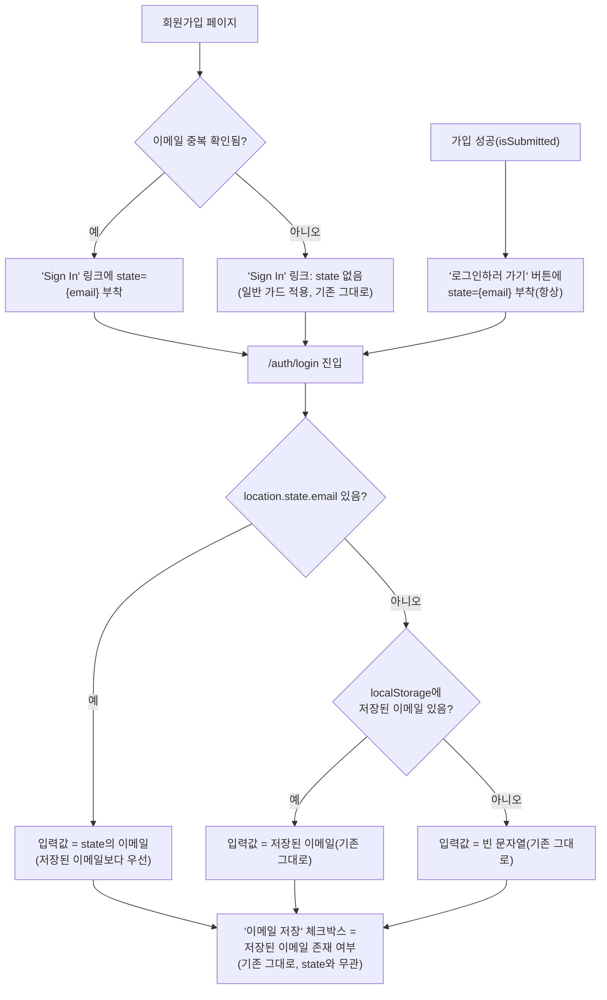

# 회원가입 → 로그인 이동 시 이메일 값 전달

> 이메일 중복이 확인된 상태(또는 가입 성공 후)에 "로그인" 관련 링크를 눌러 로그인 페이지로
> 가면, 이미 알고 있는 이메일을 다시 치게 하지 않고 로그인 폼에 미리 채워둔다.

## Context

**문제**: 회원가입 중 이메일이 이미 가입된 것으로 확인되면 "Sign In" 링크로 로그인 페이지에
갈 수 있는데, 방금 직접 입력하고 서버가 중복이라고 확인까지 해준 그 이메일을 로그인 폼에서
또 쳐야 한다. 가입 성공 후 "로그인하러 가기" 버튼도 마찬가지로, 방금 그 이메일로 계정을
막 만들었는데 로그인 폼은 비어 있다.

**근거**: Erik D. Kennedy, [15 Tips for Better Signup / Login UX](https://www.learnui.design/blog/tips-signup-login-ux.html)는
로그인→비밀번호 재설정 전환을 예로 들어 _"이미 아는 정보로 사용자를 귀찮게 하지 마라"_
(번역, "don't pester them for information you already know")고 말한다 — 이 출처가 다룬
사례(로그인→재설정)와 지금 사례(회원가입→로그인)는 정확히 같지는 않지만, "화면을 넘어갈 때
이미 확인된 값을 다시 요구하지 않는다"는 같은 원리다. Nielsen의 "recognition rather than
recall" 휴리스텁도 같은 방향이다.

**기존 코드 확인**: `useLogin.ts`는 렌더 중 동기적으로 `localStorage`(`saved-email`)를
읽어 `useForm`의 `defaultValues.email`에 바로 넣는다(`useEffect`/`setValue` 없음,
`useLogin.ts:24-33`) — 이 레포는 화면 간 값 전달에 `location.state` 선례가 이미 있다:
`PostCard.tsx`(보내는 쪽, `<Link state={{ backSource }}>`, `docs/DECISIONS.md:1319-1320`
결정 기록) → `usePostDetail.ts`(받는 쪽, 로컬 인터페이스 선언 + `location.state as
XxxState | null` 캐스팅, Zod 검증 없음). `docs/DECISIONS.md:3458`도 "직렬화 가능한 값은
`location.state`로 넘긴다"는 결정을 명시한다. 이번에도 이 패턴을 그대로 따른다.

**새로 발견한 것**: 최근 다른 세션(PR #237, 이메일 인증 기능)이 회원가입 성공 흐름을
바꿔놨다 — 가입 성공 시 더 이상 로그인 페이지로 자동 이동하지 않고 "메일함을
확인해주세요" 화면(`isSubmitted`)으로 전환되며, 거기 별도의 "로그인하러 가기" 버튼이
있다(`useSignUp.ts`, `SignUpForm.tsx`). 즉 로그인으로 가는 진입점이 두 곳이다 —
(a) 이메일 중복 확인 시의 "Sign In" 링크, (b) 가입 성공 후 "로그인하러 가기" 버튼.

## 판단이 필요했던 항목 (사용자 확인 완료)

| 항목                                          | 결정                                                             | 근거                                                                                                                                             |
| --------------------------------------------- | ---------------------------------------------------------------- | ------------------------------------------------------------------------------------------------------------------------------------------------ |
| 저장된(기억된) 이메일과 값이 다를 때 우선순위 | **회원가입에서 넘어온 이메일이 이긴다**                          | 방금 직접 친, 가장 명확한 의도. 기억된 값은 지난 방문의 오래된 값일 수 있다                                                                      |
| "이메일 저장" 체크박스 초기 상태              | **기존 그대로**(`!!savedEmail`, `state`와 무관)                  | 체크박스는 "지금 실제로 저장된 게 있는가"만 반영. `state`로 넘어온 값은 1회성 편의이지 저장 여부를 바꾸지 않는다 — 요청받지 않은 동작 추가 안 함 |
| 적용 범위                                     | **이메일 중복 링크 + 가입 성공 후 "로그인하러 가기" 둘 다 포함** | 같은 훅·같은 패턴이라 구현 비용이 거의 안 들고, 성공 케이스는 오히려 "이 이메일로 로그인할 것"이 더 확실하다                                     |

## 세부 계획

| 위치                                          | 변경 내용                                                                                                                                                                                                                                                                                                                                                                                                                                                                                                                                                         |
| --------------------------------------------- | ----------------------------------------------------------------------------------------------------------------------------------------------------------------------------------------------------------------------------------------------------------------------------------------------------------------------------------------------------------------------------------------------------------------------------------------------------------------------------------------------------------------------------------------------------------------- |
| `src/features/auth/signup/hooks/useSignUp.ts` | `onLoginLinkClick` 바로 아래에 두 값 계산 후 반환: `loginLinkState = emailCheck.isDuplicate ? { email: watchedEmail } : undefined`(중복 링크용), `postSignupLoginState = { email: watchedEmail }`(성공 후 버튼용, 항상). 반환 객체에 둘 다 추가                                                                                                                                                                                                                                                                                                                   |
| `src/features/auth/signup/ui/SignUpForm.tsx`  | "이미 계정이 있으신가요? Sign In" `<Link>`에 `state={loginLinkState}` 추가. "로그인하러 가기" `<Link>`(Button asChild 안)에 `state={postSignupLoginState}` 추가                                                                                                                                                                                                                                                                                                                                                                                                   |
| `src/features/auth/login/hooks/useLogin.ts`   | `useLocation` import 추가. 로컬 `interface LoginLocationState { email?: string }` 선언(`usePostDetail.ts`의 `PostDetailLocationState` 패턴 그대로). `emailFromState = (location.state as LoginLocationState \| null)?.email`. `defaultValues.email`을 `emailFromState \|\| savedEmail`로 교체. `saveEmail: !!savedEmail`은 그대로 유지                                                                                                                                                                                                                            |
| `e2e/signup.spec.ts`                          | ① 첫 번째 테스트("중복확인을 통과하고 가입하면...")의 "로그인하러 가기" 클릭 뒤 단언을 `toBeVisible()`에서 이메일 입력값이 `'new@example.com'`인지로 강화. ② "이미 가입된 이메일이면..." 테스트에 이어서 "Sign In" 링크 클릭 → `/auth/login` 이동 + 이메일 입력값이 `'taken@example.com'`인지 확인하는 단계 추가. ③ 신규 테스트: `e2e/fixtures/auth.fixture.ts`와 같은 `page.addInitScript` + `STORAGE_KEYS.AUTH.SAVED_EMAIL` 패턴으로 다른 이메일을 먼저 저장해두고, 회원가입 중복 확인 후 "Sign In" 클릭 시 저장된 값이 아니라 방금 입력한 이메일이 뜨는지 확인 |
| `docs/AUTH.md`                                | §6 상태 모델의 `saved-email` 행 바로 아래 문단에, 로그인 폼 이메일 입력 초기값이 `location.state.email`(회원가입에서 이미 가입된 이메일로 확인됐을 때 함께 넘어오는 값)의 영향도 받으며 이 저장값보다 우선한다는 것, `saveEmail` 체크박스 자체는 영향받지 않는다는 것을 `useLogin.ts:줄` 참조와 함께 추가                                                                                                                                                                                                                                                         |
| `docs/TESTING.md`                             | `e2e/signup.spec.ts` 행 설명에 이메일 전달 검증 내용 반영                                                                                                                                                                                                                                                                                                                                                                                                                                                                                                         |
| `CHANGELOG.md`                                | `[Unreleased]` → `### Added`(가장 마지막 `### Added` 섹션의 첫 번째 `### Fixed` 헤더 **바로 앞**, 즉 기존 `### Added` 항목들 끝)에 새 항목 추가. **편집 전 파일을 다시 읽어 현재 구조를 확인하고, 편집 후 헤더 중복이 없는지 재확인**(오늘 오후 발견했던 구조 문제 재발 방지)                                                                                                                                                                                                                                                                                     |

**작업 순서**: `git worktree list` + `git log origin/main..main`으로 미푸시 커밋 확인 →
`EnterWorktree` → 부트스트랩(`cp ../../../.env .` + `pnpm install`) → 위 표 순서로 구현 →
검증 → `browser-verification` skill로 실제 BE 대상 브라우저 녹화(중복 이메일 → Sign In →
로그인 페이지에 이메일 채워짐, 저장된 이메일이 있어도 방금 입력한 이메일이 우선하는 것) →
PR(squash).

## 영향 범위

- **회귀 후보**: `useLogin.ts`의 `defaultValues.email` 계산 로직이 바뀌므로, `location.state`
  없이(직접 URL 입력, 사이드바 등 기존 경로로) 로그인 페이지에 오는 모든 기존 케이스는
  `emailFromState`가 `undefined`라 `savedEmail`로 그대로 폴백 — 동작 변화 없음
- **로그인 모달**(`LoginModal.tsx`)도 같은 `LoginForm`을 쓰지만, 회원가입 페이지의 링크는
  실제 페이지 이동(`/auth/login`)이라 모달이 열리는 경로와 무관 — 모달 쪽 `location.state`엔
  `email` 키가 없으므로 옵셔널 체이닝으로 안전하게 `undefined` 처리됨(기존 `loginModalOpen`
  등 다른 state 키와 충돌 없음)
- **데이터 계약 변경 없음** — 클라이언트 라우팅 값 전달만, API·스키마 영향 없음
- 새로 만드는 것: `LoginLocationState` 타입(로컬), `loginLinkState`/`postSignupLoginState`
  (훅 반환값)

## 검증 방법

1. `pnpm type-check` → `pnpm test` → `pnpm lint` → `pnpm format:check` → `pnpm check:docs`
2. `pnpm test:e2e e2e/signup.spec.ts e2e/signup-unsaved-changes.spec.ts e2e/unsaved-changes.spec.ts`
   (이탈 가드 관련 스펙도 회귀 없는지 같이 확인 — `onLoginLinkClick`이 있는 같은 파일)
3. `browser-verification` skill — 실제 BE 대상으로 ① 이메일 중복 확인 후 Sign In → 로그인
   페이지 이메일 필드에 그 이메일이 채워짐 ② 다른 이메일이 이미 저장된 상태에서도 회원가입
   중복 이메일이 우선함 ③ 가입 성공 → "로그인하러 가기" → 그 이메일이 채워짐을 녹화로 확인

## 남은 것

- 로그인 모달(T1 오버레이)로 진입하는 다른 경로들(장바구니성 액션 후 로그인 유도 등)에는
  이번 변경이 적용되지 않는다 — 애초에 이메일을 미리 알 방법이 없는 경로라 범위 밖
