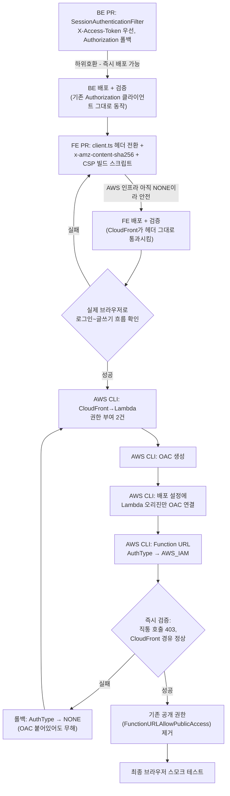

# BE Phase 7(OAC) + FE Phase 6(OAC 대응 + CSP) — 서버 직통 주소 완전 차단

> `docs/plans/2026-09-28-auth-hardening.md` §2-1 Phase 7 / §2-2 Phase 6를 실행한다.
> Lambda Function URL을 CloudFront Origin Access Control(OAC)로 잠그고, FE 인증
> 헤더를 그에 맞게 바꾸고, 인라인 스크립트 해시 기반 CSP를 추가한다.

## Context

### 지금 상황 (실측)

계획 문서는 "BE Phase 7과 FE Phase 6은 동시 배포 필요(하나만 배포하면 API 전체가
끊김)"라고만 적어뒀다. 실제로 무엇이 어떻게 끊기는지, 지금 얼마나 위험한 상태인지
직접 확인했다.

- **로컬 BE 루트 체크아웃이 오래돼 있었다** — Phase 3(세션 기반 인증)가 이미
  `origin/main`에 병합·배포됐는데도 로컬 파일은 그 이전(JWT 기반) 상태를 보여줬다.
  `gh api`로 `origin/main`을 직접 조회해 바로잡았다 — 아래 사실은 전부 `origin/main`
  기준이다.
- **`SessionAuthenticationFilter.kt`의 `resolveToken()`은 `Authorization: Bearer
<token>`만 읽는다** — 이 한 곳만 바꾸면 된다(BE 저장소, 경로는 아래 세부 계획 참고).
- **"Phase 0" 임시 잠금이 이미 코드로는 들어가 있지만 실제로는 꺼져 있다.**
  `LambdaHandler.kt`에 `FunctionUrlOriginGuard`가 있고, CloudFront가 `X-Origin-Verify`
  헤더를 보내면 `ORIGIN_VERIFY_SECRET` 환경변수와 대조하는 구조다. 그런데 직접 조회한
  결과(`aws lambda get-function-configuration --function-name link-sphere-api
--qualifier prod`) **`ORIGIN_VERIFY_SECRET` 자체가 설정돼 있지 않다** — 코드 주석이
  말하는 "fail-open(설정 누락 시 통과)" 상태 그대로다.
- **CloudFront 오리진 설정도 미보호 상태다** — `aws cloudfront get-distribution-config
--id E1ZZPXFS3GSVZ6`로 확인한 결과 Lambda 오리진(`452wlgf5pesg75zbpiaotptq7i0ckrsb.lambda-url.ap-northeast-1.on.aws`)에
  `OriginAccessControlId`도 `CustomHeaders`도 없다. S3 오리진(`link-sphere-fe-bucket...`)에는
  이미 OAC(`E1HAECI8JSDH7Q`)가 붙어 있어 대조된다.
- **즉 Function URL(`AuthType: NONE`)은 지금 완전히 공개 상태다.** Phase 7은
  이론적 하드닝이 아니라 실제로 열려 있는 구멍을 막는 작업이다 — CloudFront의 WAF도
  이 직통 경로는 거치지 않는다.
- **AWS 자격증명**: 이 세션은 `link-sphere-user`(IAM 사용자, 계정 `185353921021`)로
  Lambda·CloudFront 조회에 전부 성공했다. 쓰기 권한(`lambda:UpdateFunctionUrlConfig`,
  `lambda:AddPermission`, `cloudfront:CreateOriginAccessControl`,
  `cloudfront:UpdateDistribution`)은 아직 실측 전이다 — 실행 단계에서 처음 시도하는
  명령이 실패하면 그 자리에서 권한 문제로 판단하고 사용자에게 알린다.
- **`x-amz-content-sha256` 요구사항은 AWS 공식 문서로 확인했다.** [Restrict access
  to an AWS Lambda function URL origin](https://docs.aws.amazon.com/AmazonCloudFront/latest/DeveloperGuide/private-content-restricting-access-to-lambda.html):
  _"PUT이나 POST 메서드를 Lambda 함수 URL에 쓴다면, 사용자가 직접 바디의 SHA256을
  계산해 x-amz-content-sha256 헤더에 넣어 CloudFront로 보내야 한다. Lambda는
  서명되지 않은 페이로드를 지원하지 않는다."_ (번역) — CloudFront가 바디를
  오리진으로 스트리밍하기 때문에 자신은 이 해시를 계산할 수 없다는 게 이유다.
  같은 문서에서 서명 방식을 "Always sign"(계획이 이미 정한 값)으로 하면 **CloudFront가
  뷰어의 `Authorization` 헤더를 자신의 SigV4 서명으로 덮어쓴다** — FE가 토큰을
  `Authorization` 대신 `X-Access-Token`으로 보내야 하는 이유가 바로 이것이다.
  CloudFront→Lambda 권한 부여는 같은 문서에 **`add-permission` 호출이 두 번**
  필요하다고 나온다(`lambda:InvokeFunctionUrl` 하나, `lambda:InvokeFunction` 하나) —
  BE 계획 문서의 한 줄보다 실제 명령은 하나 더 많다.

### 전체 흐름



## 판단이 필요했던 항목

| 항목                     | 결정                                                                                                                                                                                                                                              | 근거·기각한 대안                                                                                                                                                                                                                                                                                        |
| ------------------------ | ------------------------------------------------------------------------------------------------------------------------------------------------------------------------------------------------------------------------------------------------- | ------------------------------------------------------------------------------------------------------------------------------------------------------------------------------------------------------------------------------------------------------------------------------------------------------- |
| 배포 순서                | 위 3단계(BE 코드 → FE 코드 → AWS 인프라 전환)로 분리                                                                                                                                                                                              | 계획 문서의 "동시 배포"는 실제로는 AWS 인프라 전환 순간에만 해당하는 제약이다(Context 참고) — 두 레포의 독립된 CI/CD로는 진짜 "동시"가 애초에 불가능하고, 단계별로 쪼개면 각 단계마다 되돌릴 지점이 생긴다. 사용자 확인 완료(AskUserQuestion, 2026-09-29)                                               |
| AWS CLI 실행 주체        | 내가 직접, 단계별 설명 + 즉시 검증 + 준비된 롤백 명령과 함께 실행                                                                                                                                                                                 | 이미 동작하는 자격증명이 있다. 사용자 확인 완료(AskUserQuestion, 2026-09-29)                                                                                                                                                                                                                            |
| `X-Access-Token` 값 형식 | `Bearer` 접두어 없이 토큰 원문만                                                                                                                                                                                                                  | 커스텀 헤더라 HTTP `Authorization` 스킴을 흉내 낼 이유가 없다. `Authorization` 폴백 쪽만 기존처럼 `Bearer ` 접두어를 유지(Swagger의 `bearerAuth` 스킴이 이 형식을 그대로 보내므로)                                                                                                                      |
| CSP 적용 방식            | 빌드 스크립트가 `index.html`에 `<meta http-equiv="Content-Security-Policy">`를 직접 주입(이번 PR로 완결) + `docs/DEPLOY.md`에 CloudFront 응답 헤더 정책(더 강력하고 `frame-ancestors` 등 meta로 못 하는 지시어 포함) 수동 설정 절차를 별도로 기록 | 계획 문서가 "빌드 파이프라인(스크립트)"과 "docs/DEPLOY.md 콘솔 설정 절차"를 원래 별개 항목으로 나눠뒀다 — 이 구분을 그대로 따른다. meta 태그만으로도 즉시 검증 가능한 1차 방어가 생기고, CloudFront 헤더 정책은 별도 수동 작업이라 이번 실행 범위에서 AWS 응답 헤더 정책 자체를 CLI로 건드리지는 않는다 |
| `img-src` 범위           | `https:` 허용(특정 호스트로 제한하지 않음)                                                                                                                                                                                                        | 이 앱은 사용자가 등록한 임의의 외부 링크에서 OG 이미지를 긁어와 보여준다 — 허용 목록을 고정할 수 없는 구조다                                                                                                                                                                                            |
| `style-src` 범위         | `'self' 'unsafe-inline'`                                                                                                                                                                                                                          | Tailwind + Radix UI 조합이 런타임에 인라인 스타일을 넣는다 — nonce 기반으로 막으려면 훨씬 큰 리팩터링이 필요해 이번 범위 밖으로 둔다                                                                                                                                                                    |

### 뒤집힌 전제

| 발견                                                                       | 그래서 바뀐 것                                                                         |
| -------------------------------------------------------------------------- | -------------------------------------------------------------------------------------- |
| 계획 문서는 "동시 배포 필요"라고만 적었다                                  | 실제로 묶여 있는 건 AWS 인프라 전환 순간뿐이라는 걸 확인해 3단계로 분리했다            |
| Phase 7을 "다음에 할 하드닝"으로 여기고 있었다                             | 실측 결과 Function URL이 이미 완전히 열려 있다 — Phase 0 임시 잠금조차 비활성 상태였다 |
| BE 계획 문서는 "CloudFront에 Function URL 호출 권한 부여"를 한 줄로 적었다 | AWS 공식 문서 확인 결과 실제로는 `add-permission` 호출이 두 번 필요하다                |

## 세부 계획

### BE (`link-sphere_BE_NEW`) — Phase 7 코드

| 위치                                                                                                | 변경 내용                                                                                                                                                       |
| --------------------------------------------------------------------------------------------------- | --------------------------------------------------------------------------------------------------------------------------------------------------------------- |
| `src/main/kotlin/com/example/linksphere/domain/auth/SessionAuthenticationFilter.kt`(`resolveToken`) | `X-Access-Token` 헤더를 먼저 읽어 그 값을 그대로 토큰으로 쓴다. 없으면 기존처럼 `Authorization` 헤더에서 `Bearer ` 접두어를 벗겨 읽는다(로컬 개발·Swagger 호환) |
| `docs/DEPLOY.md` §5(Function URL 설정)                                                              | `--auth-type NONE` 예시를 `AWS_IAM`으로, 관련 서술을 갱신                                                                                                       |
| `docs/DEPLOY.md`(배포 후 검증)                                                                      | `curl <function-url>/actuator/health` 예시가 OAC 적용 후 403을 반환하게 됨을 명시                                                                               |
| `docs/LAMBDA-CONFIG-ROLLBACK.md`                                                                    | Function URL AuthType/CloudFront OAC 롤백 절차 추가(아래 "AWS 인프라 전환" 롤백 명령 그대로)                                                                    |
| `CHANGELOG.md`                                                                                      | `[Unreleased]`에 항목 추가                                                                                                                                      |

CLAUDE.md §1 "위험 관리" 3번("세션 구조를 바꾸는 백엔드 Phase 3와 OAC(Phase 7)는
병합 전 한 번 더 검토 단계를 거친다")에 따라 이 PR은 병합 전 `pr-review-toolkit`
리뷰를 돌린다.

이 PR은 배포 즉시 검증한다: 기존 FE(아직 `Authorization`만 보냄)로 로그인이
그대로 되는지 확인 — 하위 호환이 실제로 유지되는지 배포 직후 바로 눈으로 본다.

### FE (`link-sphere_FE_NEW`) — Phase 6 코드

| 위치                                                                        | 변경 내용                                                                                                                                                                                                                                                                                                                                                                                                                                                    |
| --------------------------------------------------------------------------- | ------------------------------------------------------------------------------------------------------------------------------------------------------------------------------------------------------------------------------------------------------------------------------------------------------------------------------------------------------------------------------------------------------------------------------------------------------------ |
| `src/shared/api/client.ts`(`getAuthHeaders`)                                | `Authorization` 대신 `headers['X-Access-Token'] = accessToken`(접두어 없음)                                                                                                                                                                                                                                                                                                                                                                                  |
| `src/shared/api/client.ts`(`request`, `isAuthEndpoint` 관련 주석)           | 헤더 이름 변경에 맞춰 주석 갱신. "인증 없는 엔드포인트에서 헤더 제거" 로직은 헤더 이름만 바꿔 그대로 유지                                                                                                                                                                                                                                                                                                                                                    |
| `src/shared/api/client.ts`(바디 직렬화 지점, `post`/`put`/`patch`/`delete`) | 바디 문자열이 있으면 `crypto.subtle.digest('SHA-256', new TextEncoder().encode(body))` → hex 인코딩 → `x-amz-content-sha256` 헤더로 추가. 새 유틸 함수 하나로 만들어 네 메서드가 공유(예: `hashRequestBody(body: string): Promise<string>`)                                                                                                                                                                                                                  |
| `src/entities/auth/api/auth.queries.ts`(주석)                               | "Authorization 헤더 포함됨" 주석을 `X-Access-Token`으로 갱신                                                                                                                                                                                                                                                                                                                                                                                                 |
| `scripts/inject-csp.js`(신규)                                               | `vite build` 이후 실행. `dist/index.html`의 `src` 없는 인라인 `<script>` 블록(RUM 로더, 테마 FOUC 방지 스크립트 — 정확히 2개, 텍스트 내용 그대로 해시) 각각을 `sha256-<base64>`로 해시하고, `<meta http-equiv="Content-Security-Policy" content="...">`를 `<head>`에 주입. 압축 플러그인(`vite-plugin-compression`)이 `index.html.gz`를 만들기 **전에** 실행되도록 `package.json`의 `build` 스크립트 순서를 조정(`vite build && node scripts/inject-csp.js`) |
| `vite.config.ts`                                                            | 별도 플러그인 추가 없음(빌드 스크립트가 `vite build` 이후 단계로 실행되므로)                                                                                                                                                                                                                                                                                                                                                                                 |
| `.github/workflows/deploy.yml`                                              | paths 필터에 `scripts/inject-csp.js` 추가(누락 시 이 파일만 바뀌어도 배포가 트리거 안 됨, FE 조사에서 확인된 필터 구조 참고)                                                                                                                                                                                                                                                                                                                                 |
| `docs/DEPLOY.md`                                                            | CloudFront 응답 헤더 정책 콘솔 설정 절차 추가: HSTS, Referrer-Policy, X-Content-Type-Options, 그리고 meta로 못 넣는 CSP 지시어(`frame-ancestors 'none'` 등)를 다루는 응답 헤더 정책. 수동 작업이라 이번 실행 범위에서 CLI로 실행하지 않고 문서만 남긴다                                                                                                                                                                                                      |
| `CHANGELOG.md`                                                              | `[Unreleased]`에 항목 추가                                                                                                                                                                                                                                                                                                                                                                                                                                   |

**CSP 값 초안** (`inject-csp.js`가 조립):

```
default-src 'self';
script-src 'self' 'sha256-<RUM로더해시>' 'sha256-<테마스크립트해시>' https://client.rum.us-east-1.amazonaws.com;
connect-src 'self' https://dataplane.rum.ap-northeast-1.amazonaws.com https://*.supabase.co;
img-src 'self' data: https:;
style-src 'self' 'unsafe-inline';
font-src 'self';
object-src 'none';
base-uri 'self';
```

`connect-src`의 Supabase 도메인은 업로드(`upload.api.ts`의 `uploadFileDirectly`)가
서명 URL로 직접 요청하는 대상이라 포함한다.

이 PR은 배포 직후 실제 브라우저로 로그인 → 글쓰기 → 댓글 작성까지 전체 흐름을
확인한다 — AWS 인프라가 아직 `NONE`이라 CloudFront가 헤더를 그대로 통과시키므로
안전하게 검증 가능한 마지막 지점이다.

### AWS 인프라 전환 (코드 PR 아님 — 두 배포·검증이 끝난 뒤에만 진행)

값: 계정 `185353921021` · 리전 `ap-northeast-1` · 함수 `link-sphere-api` · alias
`prod` · Function URL `https://452wlgf5pesg75zbpiaotptq7i0ckrsb.lambda-url.ap-northeast-1.on.aws/` ·
CloudFront distribution `E1ZZPXFS3GSVZ6`(도메인 `dbw3brui6htwk.cloudfront.net`) ·
기존 공개 권한 statement id `FunctionURLAllowPublicAccess`.

1. **백업**: `aws cloudfront get-distribution-config --id E1ZZPXFS3GSVZ6 --output json`
   결과를 그대로 보관(ETag·전체 설정 — 문제 생기면 대조용).
2. **CloudFront→Lambda 권한 부여** (AWS 공식 문서 기준 2건, `arn:aws:cloudfront::185353921021:distribution/E1ZZPXFS3GSVZ6`로 이 배포로만 범위 제한):

   ```bash
   aws lambda add-permission --function-name link-sphere-api --qualifier prod \
     --statement-id AllowCloudFrontServicePrincipal \
     --action lambda:InvokeFunctionUrl --principal cloudfront.amazonaws.com \
     --source-arn arn:aws:cloudfront::185353921021:distribution/E1ZZPXFS3GSVZ6

   aws lambda add-permission --function-name link-sphere-api --qualifier prod \
     --statement-id AllowCloudFrontServicePrincipalInvokeFunction \
     --action lambda:InvokeFunction --principal cloudfront.amazonaws.com \
     --source-arn arn:aws:cloudfront::185353921021:distribution/E1ZZPXFS3GSVZ6
   ```

3. **OAC 생성** (`SigningBehavior=always`는 계획이 이미 정한 값):
   ```bash
   aws cloudfront create-origin-access-control --origin-access-control-config \
     Name=link-sphere-api-lambda-oac,SigningProtocol=sigv4,SigningBehavior=always,OriginAccessControlOriginType=lambda
   ```
   결과의 `Id`를 다음 단계에 쓴다.
4. **배포 설정에 OAC 연결** — Lambda 오리진 하나만 정확히 겨냥한다(S3 오리진의
   기존 OAC는 절대 건드리지 않는다): 현재 설정을 JSON으로 받아 `jq`로 Lambda
   오리진(`DomainName`이 `.lambda-url.` 포함)의 `OriginAccessControlId`만
   채운 뒤, `ETag`를 `IfMatch`로 옮겨 `update-distribution`.
5. **Function URL AuthType 전환**:
   ```bash
   aws lambda update-function-url-config --function-name link-sphere-api \
     --qualifier prod --auth-type AWS_IAM
   ```
6. **즉시 검증** (수 초 내):
   - `curl -o /dev/null -w '%{http_code}' https://452wlgf5pesg75zbpiaotptq7i0ckrsb.lambda-url.ap-northeast-1.on.aws/actuator/health` → `403` 기대
   - `curl https://dbw3brui6htwk.cloudfront.net/api/post?page=0&size=1` → 정상 JSON 기대
   - 실제 브라우저로 로그인 → 글쓰기까지 확인
   - **실패 시 즉시 롤백**: `aws lambda update-function-url-config --function-name
link-sphere-api --qualifier prod --auth-type NONE` 한 줄이면 충분하다(OAC가
     오리진에 붙어 있어도 Function URL이 `NONE`이면 서명을 그냥 무시하므로 무해).
     원인 파악 후 3~5단계부터 다시 시도.
7. **검증 통과 시에만** 기존 공개 권한 제거:
   ```bash
   aws lambda remove-permission --function-name link-sphere-api --qualifier prod \
     --statement-id FunctionURLAllowPublicAccess
   ```
8. 최종 스모크 테스트: 직통 호출이 권한 제거 후에도 여전히 403인지, 로그인·글쓰기·
   댓글·북마크까지 브라우저로 한 번 더 확인.

## 영향 범위

- **CRUD 관점**: 이 작업은 데이터를 만들거나 지우지 않는다 — 인증 경로와 오리진
  접근 방식만 바뀐다. 유일한 실패 지점은 "AWS 인프라 전환" 6단계에서 CloudFront
  경유 요청이 401/403/500 등으로 실패하는 경우이고, 그 경우의 대응은 위 롤백 한 줄이다.
- **회귀 위험**:
  - `docs/AUTH.md §11`(리프레시 엔드포인트가 만료된 `Authorization` 헤더를 무시한다는
    전제)은 헤더 이름이 바뀌면 같이 갱신해야 한다.
  - Swagger(운영 URL로 직접 접근 시)는 CloudFront를 거치지 않고 Function URL을
    직접 두드리므로, AWS 인프라 전환 이후에는 **운영 Swagger UI 자체가 403을
    받는다.** 로컬 개발에서는 그대로 동작한다(Function URL을 거치지 않으므로).
    이건 계획이 이미 알고 받아들인 트레이드오프다.
  - EventBridge 웜업 핑·RSS 잡·CI 5회 연속 호출 검증·Lambda self-invoke는 전부
    `lambda:InvokeFunction`(Invoke API)을 쓰지 CloudFront/Function URL을 거치지
    않아 이번 변경과 무관하다 — 확인 완료.
  - `warmUp()`은 완전히 인프로세스(MockMvc)라 무관하다 — 확인 완료.
- **배포 순서**: 위 3단계(BE → FE → AWS 인프라) 순서를 반드시 지킨다. AWS 인프라
  전환을 BE/FE 코드보다 먼저 하면 그 즉시 모든 인증 요청이 끊긴다.

## 검증 방법

- BE PR: `./gradlew test`, 병합 전 `pr-review-toolkit` 리뷰, 배포 후 기존 FE로
  로그인 확인(하위 호환 검증).
- FE PR: `pnpm type-check && pnpm test && pnpm lint`, 브라우저로 CSP 위반 콘솔
  에러 없이 로그인~글쓰기~댓글~북마크~이미지 업로드까지 전체 흐름 확인, 배포된
  `index.html`의 CSP meta 태그와 해시값을 직접 열어 확인.
- AWS 인프라 전환: 위 세부 계획의 6·8단계 그대로(직통 호출 403, CloudFront 경유
  정상, 브라우저 스모크 테스트).

## 남은 것

- CloudFront 응답 헤더 정책(HSTS·Referrer-Policy·X-Content-Type-Options·CSP 헤더화)은
  문서화만 하고 이번 라운드에서 콘솔 설정까지는 하지 않는다 — 별도로 진행 여부를
  다시 확인한다.
- `link-sphere-user`의 CloudFront 쓰기 권한(`CreateOriginAccessControl`,
  `UpdateDistribution`)이 실제로 있는지는 실행 단계에서 처음 확인된다 — 없으면
  그 자리에서 사용자에게 알리고 중단한다.
- 운영 Swagger UI가 이번 변경 이후 403을 받게 되는 트레이드오프를 사용자에게
  최종 보고 시 다시 한번 명시한다.
