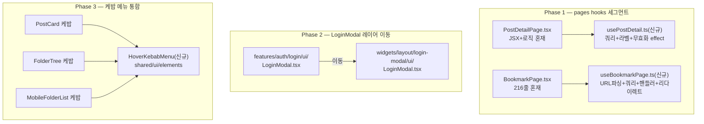

# pages 레이어 hooks/ 세그먼트 도입 + 레이어 배치 정리 3건

> pages 레이어에 로직을 둘 자리(`hooks/`)가 없어 PostDetailPage·BookmarkPage에 로직이
> 인라인으로 쌓인 문제를 고치고, 같은 조사에서 발견한 레이어 배치 불일치 2건
> (LoginModal 위치, 케밥 메뉴 마크업 중복)을 함께 정리한다.

## Context

`PostDetailPage.tsx`가 `PostEditPage`·`PostSubmitPage`와 달리 로직을 그대로 갖고
있는 이유를 조사하다가 원인을 확인했다: `.claude/CLAUDE.md`의 "레이어별 허용
세그먼트" 표가 `pages`에 `hooks/`를 허용하지 않는다. 그래서 `useQueryClient()`를
쓸 자리가 없어 `eslint.config.js:986-988`에 이 파일 하나만 빼주는 lint 예외가
생겼고(#48, 2026-09-09), 이후 #100(2026-09-14)에서 `resolveBackLabel`이 같은
파일에 추가로 쌓였다.

같은 기준으로 pages 전체를 훑은 결과 `BookmarkPage.tsx`(216줄)가 더 심한
사례였다 — URL 파싱·쿼리 호출·파생 상태·핸들러 3개·리다이렉트 effect가 전부
페이지 파일 안에 있다. `pages/post/index.tsx:9`는 반환값을 쓰지 않는
`useFetchCategoryOptionQuery()` 호출도 갖고 있다(`PostListSearch`가 이미 같은
쿼리를 호출 중 — `docs/DECISIONS.md` 2026-09-09 항목에 죽은 코드로 이미
지목돼 있었지만 제거되지 않은 상태).

이어서 "widget으로 뺄 만한 것"을 브리핑하는 과정에서 레이어 배치가 어긋난
사례 2건을 추가로 확인했다:

- **`LoginModal`**: `RootLayout.tsx`가 앱 루트에 한 번 마운트하는 전역 UI
  4개(`Navbar`·`Sidebar`·`BottomTabBar`·`LoginModal`) 중 3개는 `widgets/layout/`에
  있는데 `LoginModal`만 `features/auth/login/ui/`에 있다. `MyPageModal`
  (feature 하나를 감싸고 자체 오케스트레이션 로직을 가진 전역 모달)과 역할이
  같은데 레이어만 다르다.
- **케밥 메뉴 중복**: `PostCard.tsx:134-176`·`FolderTree.tsx:277-293`·
  `MobileFolderList.tsx:168-185`가 거의 같은 마크업(ghost 아이콘 버튼 +
  `MoreVertical` + `DropdownMenu`)을 각자 구현하고 있다. 엔티티 로직이 없는
  순수 UI 패턴이라 widget이 아니라 `shared/ui/elements` 후보다.

세 건 모두 서로 무관한 변경이라 `.claude/CLAUDE.md`의 커밋 단위 원칙("서로
무관한 변경끼리만 별도 커밋으로 분리")에 따라 PR 3개로 나눈다.

## 판단이 필요했던 항목

| 항목                                                                                          | 결정                                                                  | 근거·기각한 대안                                                                                                                                                                                                                                                                                                                  |
| --------------------------------------------------------------------------------------------- | --------------------------------------------------------------------- | --------------------------------------------------------------------------------------------------------------------------------------------------------------------------------------------------------------------------------------------------------------------------------------------------------------------------------- |
| 페이지 전용 로직(라벨 계산·무효화 effect·404 리다이렉트·URL 파싱)을 어디에 둘지               | `pages/<domain>/hooks/` 신설                                          | FSD v2.1 마이그레이션 가이드가 "재사용 필요가 생기기 전까지는 페이지 안에 둔다"고 명시(번역, [migration guide](https://feature-sliced.design/docs/guides/migration/from-v2-0)). 대안(widgets로 승격)은 FSD 공식 규칙("페이지 콘텐츠 대부분을 차지하고 재사용 안 되면 widget이 되면 안 된다")과 정면으로 배치돼 기각               |
| `UpdatePostForm`·`CreatePostForm` 등 폼을 features에 유지할지                                 | 현행 유지(이번 계획에 포함 안 함)                                     | 폼 5개(Signup/Login/Create/Update/UpdateAccount)가 전부 features에 있는 기존 선례(`.claude/CLAUDE.md` "features 슬라이스 명사 허용 각주") + FSD 공식 Authentication 가이드가 `features/login/`을 그대로 씀. "재사용 안 되니 pages로"를 적용하면 이동 비용이 큰 완결 단위(검증+뮤테이션+테스트)를 옮겼다 되돌리는 비용이 커서 기각 |
| pages에서 entity 쿼리를 직접 호출하는 걸 허용할지(widgets §8의 "1쿼리+trivial 파생" 예외처럼) | 허용 안 함 — features와 동일하게 hooks/ 안에서만                      | widgets의 §8 예외는 이미 "ESLint로 강제 안 함, 사람 판단"으로 문서화돼 있다(`docs/FE-ARCHITECTURE.md:583-586`). pages에 같은 예외를 새로 만들면 ESLint 룰에 판단 로직이 필요해져 복잡해지므로, features처럼 예외 없는 쪽이 더 단순함(CLAUDE.md §2)                                                                                |
| `LoginModal` 위치                                                                             | `features/auth/login/ui/` → `widgets/layout/login-modal/ui/`          | 앱 루트 마운트 전역 UI 4개 중 3개(Navbar/Sidebar/BottomTabBar)가 이미 widgets/layout에 있음. entities/features 어느 파일도 `LoginModal` 컴포넌트를 직접 import하지 않고 전부 `loginModal.store`(shared)만 거쳐 열어서(직접 확인 완료) 레이어 역방향 import 위험 없음                                                              |
| 케밥 메뉴 중복을 widget으로 뺄지 shared로 뺄지                                                | `shared/ui/elements/HoverKebabMenu`                                   | FSD 공식 정의상 widget은 엔티티 데이터를 조합하는 블록인데, 케밥 메뉴는 엔티티 로직이 전혀 없는 순수 트리거+메뉴 셸이라 widget 기준에 안 맞음. `ActionButton`·`FilterChip` 등 기존 `shared/ui/elements` 컴포넌트와 같은 성격                                                                                                      |
| pages의 entity 쿼리 직접 import를 lint로 막을지                                               | 막는다 — 기존 `no-entity-query-import-outside-hooks`를 pages까지 확대 | dayjs 규칙·features 쿼리 규칙 모두 문서로만 남겨뒀을 때 각각 5개월(`docs/DECISIONS.md` 2026-09-08)·수개월(2026-09-09) 위반을 못 잡은 선례가 이 레포에 이미 2번 있음                                                                                                                                                               |

## 세부 계획

### Phase 1 — pages에 hooks/ 세그먼트 도입 (PR 1)

| 위치                                                     | 변경 내용                                                                                                                                                                                                            |
| -------------------------------------------------------- | -------------------------------------------------------------------------------------------------------------------------------------------------------------------------------------------------------------------- |
| `src/pages/post/hooks/usePostDetail.ts` (신규)           | `useSuspenseFetchPostDetailQuery` 호출, `resolveBackLabel` 함수, `invalidateViewedSortOnPostView` effect를 옮겨 `{ post, backLabel, goBack }` 반환                                                                   |
| `src/pages/post/hooks/usePostNotFoundRedirect.ts` (신규) | 404 감지 + 토스트 + `navigate(ROUTES_PATHS.POST.ROOT, { replace: true })` effect를 옮김                                                                                                                              |
| `src/pages/post/PostDetailPage.tsx`                      | 위 두 훅 호출 + JSX만 남김. `PostDetailErrorFallback`은 `isNotFound` 분기 JSX만 유지                                                                                                                                 |
| `src/pages/bookmark/hooks/useBookmarkPage.ts` (신규)     | `parseFolderKey`/`parseSort`, `useBookmarkFolderListQuery`, `activeFolderKey`/`currentFolderName`/`isMobileListMode` 파생, `setFolderKey`/`setSort`/`goToFolderList` 핸들러, 폴더 삭제 리다이렉트 effect 전체를 옮김 |
| `src/pages/bookmark/BookmarkPage.tsx`                    | 훅 호출 + 3분기(모바일 폴더목록/모바일 게시글/데스크톱) JSX만 남김                                                                                                                                                   |
| `src/pages/post/index.tsx:9`                             | 쓰이지 않는 `useFetchCategoryOptionQuery()` 호출 제거                                                                                                                                                                |
| `eslint.config.js:986-988`                               | `no-direct-query-import`의 `ignores`에서 `'src/pages/post/PostDetailPage.tsx'` 제거                                                                                                                                  |
| `eslint.config.js:1009` 부근                             | `no-entity-query-import-outside-hooks` 블록의 `files`에 `'src/pages/**/*.{ts,tsx}'`, `ignores`에 `'src/pages/**/hooks/**/*.{ts,tsx}'` 추가. 주석도 "widgets는 대상 아님" 옆에 "pages는 포함" 명시                    |
| `.claude/CLAUDE.md` "레이어별 허용 세그먼트" 표          | `pages` 행에 `hooks/` 추가, 비고에 "페이지 전용 오케스트레이션 로직(데이터 조회 포함)만 — 여러 페이지에서 필요해지면 entities/features로 승격"                                                                       |
| `docs/FE-ARCHITECTURE.md` §3                             | 디렉터리 트리의 `pages/` 항목에 `post/hooks/`·`bookmark/hooks/` 반영                                                                                                                                                 |

### Phase 2 — LoginModal을 features → widgets/layout으로 이동 (PR 2)

| 위치                                                                                                       | 변경 내용                                                                                   |
| ---------------------------------------------------------------------------------------------------------- | ------------------------------------------------------------------------------------------- |
| `src/features/auth/login/ui/LoginModal.tsx` → `src/widgets/layout/login-modal/ui/LoginModal.tsx`           | 파일 이동, 내용 변경 없음                                                                   |
| `src/features/auth/login/ui/LoginModal.test.tsx` → `src/widgets/layout/login-modal/ui/LoginModal.test.tsx` | 동행 이동                                                                                   |
| `src/app/routes/layouts/RootLayout.tsx:16-18`                                                              | lazy import 경로를 `@/widgets/layout/login-modal/ui/LoginModal`로 수정                      |
| `docs/FE-ARCHITECTURE.md` §3                                                                               | `features/auth/login` 트리에서 LoginModal 제거, `widgets/layout` 트리에 `login-modal/` 추가 |

### Phase 3 — 케밥 메뉴 중복 제거: HoverKebabMenu 신설 (PR 3)

| 위치                                                               | 변경 내용                                                                                                                                                                                                                                                       |
| ------------------------------------------------------------------ | --------------------------------------------------------------------------------------------------------------------------------------------------------------------------------------------------------------------------------------------------------------- |
| `src/shared/ui/elements/HoverKebabMenu.tsx` (신규)                 | `DropdownMenu` + ghost 아이콘 트리거(`MoreVertical`) + `aria-label`을 감싼 compound 컴포넌트. `hoverReveal`(bool, 기본 false), `open`/`onOpenChange`(옵션, controlled 지원), `triggerClassName`(포지션 커스텀용) prop. 메뉴 항목은 `children`으로 호출부가 채움 |
| `src/shared/ui/elements/HoverKebabMenu.stories.tsx` (신규)         | Critical Rules — elements 추가 시 스토리 동반 필수                                                                                                                                                                                                              |
| `src/widgets/post/post-card/ui/PostCard.tsx:134-176`               | `HoverKebabMenu`로 교체. `hoverReveal={false}`(항상 노출), `open={isMenuOpen} onOpenChange={setIsMenuOpen}`(usePostCard가 소유한 controlled state 그대로 전달), 메뉴 항목(수정/공개전환/삭제)은 children 유지                                                   |
| `src/widgets/bookmark/folder-tree/ui/FolderTree.tsx:277-293`       | `HoverKebabMenu`로 교체. `hoverReveal={true}`(데스크톱 hover-reveal), 메뉴 항목(이름변경/삭제) 유지                                                                                                                                                             |
| `src/widgets/bookmark/folder-tree/ui/MobileFolderList.tsx:168-185` | `HoverKebabMenu`로 교체. `hoverReveal={false}`, `triggerClassName="absolute top-1 right-1 h-7 w-7"`로 기존 포지션 유지, 메뉴 항목(이름변경/삭제) 유지                                                                                                           |

**주의**: 3곳의 동작 차이(PostCard=controlled state+항상노출, FolderTree=hover-reveal, MobileFolderList=항상노출+absolute 포지션)를 그대로 보존해야 한다 — 통합 과정에서 어느 한 곳이라도 달라지면 회귀다.

## 영향 범위

| Phase | 회귀 가능 지점                                                                                                                                                                           | 기존 e2e 커버                                                                                                                                                                                   |
| ----- | ---------------------------------------------------------------------------------------------------------------------------------------------------------------------------------------- | ----------------------------------------------------------------------------------------------------------------------------------------------------------------------------------------------- |
| 1     | 열람 시 "최근 열람순" 캐시 무효화 타이밍, 404 리다이렉트+토스트, 돌아가기 라벨 분기(feed/default/기타), 북마크 URL 파라미터 동기화, 삭제된 폴더 리다이렉트, 모바일/데스크톱 3분기 렌더링 | `post-detail-back.spec.ts`, `post-detail-not-found.spec.ts`, `bookmark.spec.ts`, `bookmark.mobile.spec.ts`                                                                                      |
| 2     | lazy import 경로 오타 시 빌드/런타임 깨짐                                                                                                                                                | `login.spec.ts`, `guest-guard.spec.ts`                                                                                                                                                          |
| 3     | 3곳의 호버/컨트롤드/포지션 차이가 통합 후에도 동일해야 함                                                                                                                                | `post-card-hover-menu.spec.ts`, `bookmark-folder-hover-menu.spec.ts`, `bookmark-folder-menu-press-drag.spec.ts`, `post-delete.spec.ts`, `post-update.spec.ts`, `bookmark-folder-delete.spec.ts` |

데이터 계약(스키마·API 응답 형태) 변경 없음 — 전부 프론트엔드 파일 재배치·추출이라 배포 순서 이슈 없음.

## 검증 방법

1. `pnpm type-check`
2. `pnpm test` — 특히 `LoginModal.test.tsx`가 새 경로에서 정상 실행되는지
3. `pnpm lint` — Phase 1의 확대된 `no-entity-query-import-outside-hooks`가 새 `pages/**/hooks/**`를 오탐 없이 통과하는지, `HoverKebabMenu.tsx`가 `no-raw-color` 등 기존 규칙을 통과하는지
4. `pnpm test:e2e` 중 위 "영향 범위" 표의 관련 스펙만 우선 실행
5. Phase 3은 `browser-verification` skill로 PostCard·FolderTree(데스크톱)·MobileFolderList 3곳의 케밥 메뉴가 리팩터 전후 동일하게 동작하는 화면을 녹화해 확인(순수 리팩터라 CLAUDE.md §9의 "반영 전 승인" 대상은 아니지만, 동작 동일성은 검증)

## 남은 것

- pages 밖에서 발견된 로직 혼재 4건(`LoginModal`의 effect 3개 자체 — 위치만 옮기고 내부 로직은 그대로 둠, `CommentList.tsx`의 위젯 훅 미분리, `PostListSearch.tsx`의 낙관적 상태 다수, `Navbar.tsx`의 로그아웃 지연·검색 제출 로직)는 이번 범위 밖 — 각각 후속 PR로 별도 진행
- `HoverKebabMenu`가 이후 다른 곳(예: `MyCommentCard`)에도 필요해지면 그때 소비처를 추가
