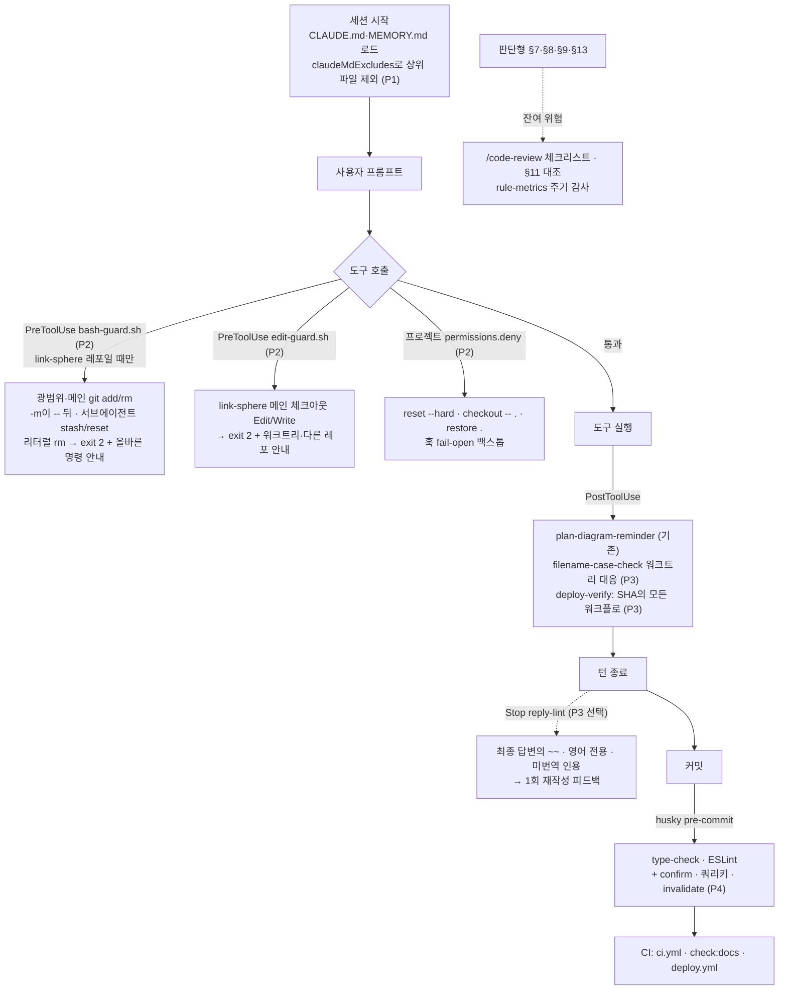

# Claude 규칙 준수 강화 — 결정적 가드 우선, 환경 동작은 스파이크로 먼저 확인, CLAUDE.md 다이어트는 마지막

> 요약: CLAUDE.md는 "맥락"이지 "강제"가 아니다(공식 문서). 위반 물량의 대부분은 `tool_input`만 보고 판정할 수 있는 **도구 행동**에 몰려 있으므로, 먼저 **지킬 수 없는 규칙·모순을 고치고(Phase 1)** 그다음 **PreToolUse 훅으로 결정적으로 막는다(Phase 2)**. 응답 스타일·정적 규칙 승격·CLAUDE.md 다이어트는 측정 결과를 보고 착수 시점에 각자 계획을 세운다(Phase 3~5).
>
> 이 파일은 Phase 1 PR에서 `docs/plans/2026-09-29-rule-enforcement-hardening.md`로 커밋한다(§11). 답을 받아 확정된 내용만 커밋한다(append-only라 분기를 그대로 넣으면 고칠 수 없다).

## Context

### 왜 하는가

**규칙이 있는데도 위반이 반복된다. 원인은 "잊어서"보다 "지킬 수 없는 규칙, 서로 충돌하는 규칙, 로드되지 않은 규칙, 강제 수단 없음" 쪽이 크다.** 트랜스크립트 재분석(메인 180개·서브에이전트 575개, 2026-08-31~09-29, 로컬 실측·정규식 휴리스틱이라 오탐 약 1/25) 결과:

- **git add 340건**: 58%가 새 파일, 16%가 rebase·merge 충돌 해결(git이 add를 요구), 96%가 워크트리 안.
- **`did not match any file(s) known to git` 211건**: 86건은 `-m`을 `--` 뒤에 둔 인자 순서 오류, 105건은 새 파일. 커밋 오류 209건 중 136건이 3번 안에 git add로 우회됨.
- **rm 거부 192건**: 같은 턴 재시도율 44% → 메모리 도입 후 16%. 복사 가능한 명령 제시율 53%.
- **git stash 27회, reset --hard 3회**: 규칙 신설(09-27) 다음 날에도 발생.
- **BE cwd 세션이 FE 메인 체크아웃을 26회 직접 편집**: BE cwd 세션에는 FE CLAUDE.md가 로드되지 않는다.
- **메인 스레드 영어 블록 12.5%**: 모델별 Sonnet 5 13.6% / Opus 5.5 5.3% / Opus 5 0.7%. 압축을 겪은 세션은 압축 전 11.7% → 압축 후 29.1%.
- **이번 세션에서도 4건**: `AskUserQuestion` 한글을 `\uXXXX`로 손수 인코딩, 영어 원문 + "(번역: …)" 인용, plan mode에서 `rm -rf` 포함 명령 시도, 출처 오귀속. 셋 다 memory 인덱스로 컨텍스트에 있던 규칙이다.

### 현재 상태(로컬 실측, 2026-09-29)

- **상시 로드 분량**: FE `.claude/CLAUDE.md` 990줄·83,820B(`**Never**` 33개, 날짜 붙은 사고 서사 약 60줄·13KB). 여기에 상위 `/Users/baechan/project/CLAUDE.md`(219줄, plancard·REDCAP용)가 매 세션 로드되는데, **배럴 import 필수·camelCase 유틸·npm을 가르쳐 link-sphere ESLint와 정면 충돌**한다.
- **모순**: CLAUDE.md "끝난 워크트리는 remove" ↔ memory(2026-09-14 사용자 결정) "요청 시에만 remove". CLAUDE.md "Never git add" ↔ 새 파일은 `git commit -- <경로>`로 커밋 불가(git 문서).
- **강제 수단**: ESLint 커스텀 규칙 15개·husky·CI는 있음. Claude 훅은 PostToolUse 2개뿐이고, 그중 `filename-case-check.sh`는 설치 이후 발동 0회(`${CLAUDE_PROJECT_DIR}`가 메인 체크아웃에 고정돼 워크트리 경로를 건너뛰는 것으로 **추론**). PreToolUse·Stop·SessionStart 훅 없음. hookify는 켜져 있으나 규칙 0개.
- **권한**: `~/.claude/settings.json`의 `Bash(git:*)` allow가 add·stash·reset·push를 프롬프트 없이 통과시킨다. deny는 rm·sudo·.env뿐.
- **버전·브랜치**: 실행 중인 확장 2.1.280, 설치본 2.1.283, PATH CLI 2.1.263(`/doctor prompt-audit`은 2.1.283+). **FE 로컬 main이 origin/main보다 7커밋 뒤처짐.**
- **트랜스크립트 보존**: `~/.claude/projects` 1.0GB, `cleanupPeriodDays` 미설정 → 기본 30일. **기준선 시작일(08-31) 기록이 곧 삭제되기 시작한다.**

### 리서치 요약 — 출처가 말하는 것

조사 7갈래(공식 문서 2, Anthropic 실사례, 커뮤니티·타 도구, 연구, 로컬 환경, 위반 근본원인) → 인용 528개 중 328개 원문 대조 확인, 54개 의역 인정, **6개(오인용 1·근거 없음 5)는 제외**.

> CLAUDE.md나 skill에 쓴 ".env를 수정하지 마라" 같은 지시는 요청이지 보장이 아니다. 그 편집을 막는 PreToolUse 훅이 강제다. (번역)
>
> — Claude Code 공식 문서 Features overview, https://code.claude.com/docs/en/features-overview

- Claude Code [memory 문서](https://code.claude.com/docs/en/memory)는 CLAUDE.md를 _"강제 설정이 아니라 맥락으로"_ (번역) 다룬다고 쓰고, _"CLAUDE.md 파일당 200줄 미만을 목표로 한다. 길수록 컨텍스트를 더 쓰고 준수율이 떨어진다"_ (번역)고 권한다. 두 규칙이 모순되면 _"Claude가 임의로 하나를 고를 수 있다"_ (번역)고 경고하고, 관련 없는 상위 파일은 `claudeMdExcludes`로 제외하라고 한다.
- Claude Code [permissions 문서](https://code.claude.com/docs/en/permissions)에 따르면 exit 2로 막는 훅은 권한 규칙 평가보다 먼저 호출을 멈춘다(그래서 `Bash(git:*)` allow를 이긴다). 동시에 Bash 규칙은 명령 문자열 매칭이라 보안 경계가 아니라고 밝힌다.
- Claude Code [sub-agents 문서](https://code.claude.com/docs/en/sub-agents)에 따르면 내장 Explore·Plan은 CLAUDE.md를 로드하지 않고, settings 훅은 서브에이전트 안에서도 실행된다.
- [git-commit 문서](https://git-scm.com/docs/git-commit)는 경로 인자 커밋의 파일을 _"Git이 이미 알고 있어야 한다"_ (번역)고 명시하고, [git-worktree 문서](https://git-scm.com/docs/git-worktree)는 링크된 워크트리가 index를 따로 가진다고 설명한다.
- **실무자**: [Trail of Bits](https://github.com/trailofbits/claude-code-config)는 상시 파일을 약 100줄로 두고 언어별 규칙은 `paths:` 규칙으로, 반드시 지킬 것은 훅으로 나눈다. [Shrivu Shankar](https://blog.sshh.io/p/how-i-use-every-claude-code-feature)는 코드 품질은 쓰기 시점이 아니라 커밋 시점에 막는다. [HumanLayer](https://www.humanlayer.dev/blog/writing-a-good-claude-md)는 _"린터가 할 일을 LLM에게 시키지 말라"_ (번역)고 쓴다. [이슈 #34358](https://github.com/anthropics/claude-code/issues/34358)의 사용자 자가 보고는 exit 2 훅으로 막은 규칙 위반율 0%, 권고형 규칙은 거의 100%였다.
- **연구**: [IFScale](https://arxiv.org/abs/2507.11538)은 지시 500개에서 최상위 모델도 정확도 약 68%(키워드 포함 과제라 코딩 규칙에 직접 적용은 어려움). [OctoBench](https://arxiv.org/abs/2601.10343)는 Claude Code 스캐폴드에서 항목별 준수 85.64%지만 작업 단위 완전 준수는 28.11%(Opus 4.5)이고, 충돌 시 메모리 파일이 시스템 프롬프트·사용자 질의에 밀린다고 보고했다.
- **반대 근거**: [McMillan(프리프린트, arXiv 2605.10039)](https://arxiv.org/abs/2605.10039)은 Claude Code 세션 1,650개에서 CLAUDE.md 크기·위치·분할·모순 변수 모두 규칙 1개 준수에 유의한 효과가 없었고, 가장 큰 효과는 세션 안에서 함수가 하나 늘 때마다 준수 오즈가 약 5.6% 주는 것이었다(사후 발견). [ETH AGENTS.md 평가(arXiv 2602.11988)](https://arxiv.org/abs/2602.11988)는 컨텍스트 파일이 성공률을 전반적으로 높이지 않고 비용을 20% 넘게 늘린다고 보고했다.

### 우리 판단

- **도구 행동은 `tool_input`만으로 판정 가능하고, 위반 물량이 여기 몰려 있다 → 가장 먼저 한다.**
- **다만 지킬 수 없는 규칙을 훅으로 강제하면 정당한 작업이 막힌다 → 문구 교정이 가드보다 먼저다.**
- **"200줄"은 공식 권고지만 수치 근거는 공개되지 않았고 반대 연구도 있다 → 다이어트는 마지막, 측정으로 유지 여부를 판정한다.**
- **확장에서 훅 출력이 모델에 전달되는지 같은 환경 동작은 문서만으로 확정할 수 없다 → 각 Phase 첫 단계에서 스파이크로 확인한다.**
- **판단형 규칙(§7·§8·§9·§13)은 스크립트로 판정할 수 없다 → 잔여 위험으로 명시한다.**

### 세 설계안 비교(워크플로 채점)

| 설계안                | 사건 감소 | 근거 강도 | 단순성 | 정당 작업 차단 위험(높을수록 안전) | 판정                                              |
| --------------------- | --------- | --------- | ------ | ---------------------------------- | ------------------------------------------------- |
| A. 결정적 가드 우선   | 9         | 8         | 6      | 6                                  | **뼈대로 채택**                                   |
| B. 컨텍스트 위생 우선 | 6         | 7         | 6      | 8                                  | 규칙을 지킬 수 있게 고치기·모순 제거 차용         |
| C. 측정·피드백 우선   | 7         | 8         | 6      | 8                                  | 측정기·유지/되돌림 기준·"두 번 위반 시 승격" 차용 |

## 판단이 필요했던 항목

| 항목                                                                                      | 결정                                                                                                                                                                                                  | 근거·기각한 대안                                                                                                                                                                                                                                                          |
| ----------------------------------------------------------------------------------------- | ----------------------------------------------------------------------------------------------------------------------------------------------------------------------------------------------------- | ------------------------------------------------------------------------------------------------------------------------------------------------------------------------------------------------------------------------------------------------------------------------- |
| 워크트리 안 git add·git rm (**사용자 결정 2026-09-29**)                                   | 한 번도 추적되지 않은 새 파일만 `git add -- <파일>`, rebase·merge 충돌 해결 중 add 허용, 워크트리 안 `git rm <경로>` 허용. 메인 체크아웃에서는 add·rm 모두 금지, 광범위 add는 어디서나 금지           | git add 340건 중 58%가 새 파일이고 `git commit -- <경로>`로는 새 파일을 커밋할 수 없다. 워크트리는 index가 따로다. rm 전역 차단 상태에서 git rm까지 금지하면 파일 삭제 경로가 없다. BE 09-27 예외와 통일. 기각: git rm 금지 유지, 워크트리 명시 경로 전부 허용, 현행 유지 |
| 메인 체크아웃 편집 차단 예외 (**사용자 결정**)                                            | gitignore된 로컬 파일(`git check-ignore`로 판정)만 예외                                                                                                                                               | 현행 "코드 수정은 워크트리에서"와 가장 가깝다. 기각: docs/·CLAUDE.md 예외(병렬 세션 충돌 위험), 예외 없음                                                                                                                                                                 |
| stash·reset --hard 등 (**사용자 결정**)                                                   | 서브에이전트는 전부 exit 2. 메인 스레드는 stash만 JSON `ask`(승인 프롬프트), `reset --hard`·`checkout -- .`·`restore .`·`clean -f*`는 exit 2. 백스톱 `permissions.deny`는 FE·BE 프로젝트 settings에만 | 되돌릴 수 없는 명령만 막고 다른 프로젝트엔 영향 없음. 기각: 전부 차단(프로젝트/사용자 층), 서브에이전트만 차단                                                                                                                                                            |
| 트랜스크립트 보존 (**사용자 결정**)                                                       | `cleanupPeriodDays: 120`                                                                                                                                                                              | 전후 비교 창 전부를 덮는다. 디스크 약 4GB 추정. 기각: 60일, 변경 안 함                                                                                                                                                                                                    |
| 순서                                                                                      | 문구 교정·측정 → 도구 가드 → (배포·응답) → (정적 승격) → (다이어트)                                                                                                                                   | 다이어트를 먼저 하면 아직 강제되지 않은 규칙까지 잘리고 지표가 한꺼번에 움직여 원인을 가를 수 없다                                                                                                                                                                        |
| 가드 수단                                                                                 | 네이티브 PreToolUse command 훅, 차단은 **exit 2 + stderr**. 사용자 확인이 필요한 경우만 JSON `permissionDecision: "ask"`                                                                              | exit 2가 권한 평가보다 먼저라는 점이 문서로 보장되고 기존 `.claude/hooks/*.sh` 선례와 같다. **hookify 기각**: warn은 사용자용 `systemMessage`로만 나가고 block은 이유 없이 거부된다는 이슈(#5290·#4260)와 로컬 소스 대조 결과(추론, 실측 안 함)                           |
| 가드 등록 층                                                                              | 사용자 레벨(`~/.claude/settings.json`)에 등록, 스크립트 안에서 대상이 link-sphere FE·BE일 때만 정책 적용                                                                                              | BE cwd 세션은 FE 프로젝트 settings를 로드하지 않는다(#3). 레포 판정으로 다른 프로젝트엔 영향 없음                                                                                                                                                                         |
| 스크립트 위치 (추천 기본값)                                                               | FE 메인 체크아웃 `.claude/hooks/`에 커밋, 사용자 settings에서 절대경로로 호출                                                                                                                         | 선례와 같고 리뷰·이력이 남는다. 대가: 병합 후 **로컬 main pull이 필요**하고, 파일이 없으면 exit 127 비차단 오류로 가드가 조용히 꺼진다 → 발동 수(M12) 0이면 경보. 기각: `~/.claude/hooks`로 복사 설치(설치 스크립트 추가), `~/.claude`에만 둠(버전 관리 없음)             |
| 상위 CLAUDE.md (추천 기본값)                                                              | FE·BE 각 커밋된 `.claude/settings.json`에 `claudeMdExcludes: ["/Users/baechan/project/CLAUDE.md"]`                                                                                                    | 프로젝트 settings는 cwd의 `.claude/`에서만 로드되므로 두 레포 각각에 넣는다. 사용자 레벨 제외는 plancard 세션까지 영향                                                                                                                                                    |
| 워크트리 정리 규칙 (추천 기본값)                                                          | CLAUDE.md를 2026-09-14 memory 결정("사용자가 요청할 때만 `ExitWorktree(remove)`")에 맞춤                                                                                                              | 더 최근에 사용자가 명시한 결정. 두 규칙이 정반대라 임의 선택 위험                                                                                                                                                                                                         |
| §11 검증자 (추천 기본값)                                                                  | Explore → general-purpose 서브에이전트                                                                                                                                                                | Explore는 CLAUDE.md를 로드하지 않아 규칙을 모른다(sub-agents 문서). 토큰은 더 든다                                                                                                                                                                                        |
| rm 가드 범위                                                                              | `if: "Bash(rm *)"` 리터럴 `rm`만. `/bin/rm`·`unlink`·`find -delete` 우회는 측정만 하고 2회 이상이면 승격                                                                                              | 우회형까지 막으려면 모든 Bash에 훅을 걸어야 하고 사용자 레벨이라 다른 프로젝트까지 막힌다(§2·§7)                                                                                                                                                                          |
| `includeGitInstructions:false`                                                            | 지금은 안 함                                                                                                                                                                                          | git status 스냅샷·내장 PR 지침까지 사라진다. 해로운 부분(광범위·메인 add)은 훅이 막는다                                                                                                                                                                                   |
| UserPromptSubmit 매 턴 재주입, prompt/agent Stop 훅, `/goal`, `autoMode.classifyAllShell` | 기각                                                                                                                                                                                                  | 강제력 없음 또는 비결정적·매 턴 비용. 주입 지시도 조용히 건너뛰어질 수 있다는 보고(#59515는 SessionStart 주입 사례)                                                                                                                                                       |
| 쓰기 시점 코드 스타일 차단                                                                | 기각                                                                                                                                                                                                  | pre-commit ESLint와 PostToolUse 피드백이 이미 있다. 쓰기 시점 차단은 에이전트를 혼란스럽게 한다는 실무 경험담(Shrivu Shankar)                                                                                                                                             |
| 강조·반복 추가                                                                            | 기각                                                                                                                                                                                                  | 여러 줄을 강조하면 어느 것도 눈에 띄지 않는다(best-practices). 대문자 3회 반복에도 위반한 사례(#15443)                                                                                                                                                                    |
| §13 AskUserQuestion 훅                                                                    | **2026-09-09 기각 유지**                                                                                                                                                                              | 당시 사유 중 "매칭 가능한지 불확실"은 hooks 문서로 해소됐지만, 주된 사유 "객관적 임계값이 없다"는 그대로다                                                                                                                                                                |
| DECISIONS.md 기록                                                                         | 안 함                                                                                                                                                                                                 | 모든 항목이 설정 한 줄이나 훅 제거로 되돌아간다. 계획 파일·PR 본문으로 충분                                                                                                                                                                                               |

### 뒤집힌 전제

| 기존 전제                                           | 확인된 사실                                                                                       |
| --------------------------------------------------- | ------------------------------------------------------------------------------------------------- |
| "git add 전면 금지"는 워크트리에도 필요하다         | 워크트리는 index가 따로다(git-worktree 문서). "세션 간 인덱스 오염" 근거는 메인 체크아웃에만 성립 |
| `git commit -- <경로>`로 모든 파일을 커밋할 수 있다 | Git이 아는 파일만 된다(git-commit 문서). pathspec 오류 105건의 원인                               |
| 훅 스크립트를 main에 병합하면 바로 적용된다         | 사용자 settings가 메인 체크아웃 경로를 호출하므로 **로컬 main pull**이 필요(현재 7커밋 뒤처짐)    |
| 트랜스크립트는 계속 남는다                          | 기본 30일 뒤 삭제([data-usage 문서](https://code.claude.com/docs/en/data-usage))                  |
| §11의 Explore 검증자는 프로젝트 규칙을 안다         | 내장 Explore·Plan은 CLAUDE.md를 로드하지 않는다                                                   |
| `${CLAUDE_PROJECT_DIR}`는 워크트리를 따라간다       | 세션 시작 루트에 머물고, 입력의 `cwd`만 워크트리를 따라간다(hooks 문서)                           |

## 전체 흐름 — 규칙 유형별로 어디서 잡히는가



## 세부 계획

**공통 원칙**

- 훅 스크립트는 기존 `.claude/hooks/*.sh` 양식을 따른다: `set -uo pipefail`, jq, jq 없으면 fail-open, case 기반 경로 매칭, 메시지에 CLAUDE.md 절 인용.
- **차단 메시지만 읽어도 새 정책이 완결되게 쓴다**(무엇이 막혔는지 + 허용되는 올바른 명령 예시). CLAUDE.md는 세션 시작 때 스냅샷되므로 옛 규칙을 읽은 세션도 메시지만으로 바르게 행동해야 한다. 문구는 사실 서술형으로 쓴다(hooks 문서: 외부 명령처럼 포장된 텍스트는 프롬프트 인젝션 방어를 유발할 수 있다).
- 레포 편집은 전부 워크트리에서, 커밋은 `git commit -m "<msg>" -- <경로...>`. 사용자 설정(`~/.claude/*`) 변경은 git 밖이므로 PR 본문에 적용 내역을 남긴다.

### Phase 0 — 사용자 설정과 환경 스파이크(레포 변경 없음)

| 위치                                                                           | 변경 내용                                                                                                                                                                                                                                                                                                                                                                                                               |
| ------------------------------------------------------------------------------ | ----------------------------------------------------------------------------------------------------------------------------------------------------------------------------------------------------------------------------------------------------------------------------------------------------------------------------------------------------------------------------------------------------------------------- |
| `~/.claude/settings.json`                                                      | **승인 직후 가장 먼저** `"cleanupPeriodDays": 120` 설정(기준선 트랜스크립트 보존. 정리는 세션 시작 시 일어날 수 있으므로 새 세션을 열기 전에)                                                                                                                                                                                                                                                                           |
| (사용자 작업) 에디터 리로드                                                    | 확장을 2.1.283으로. 그 뒤 `/doctor prompt-audit`·`/doctor`를 **읽기 전용**으로 돌려 보고서만 저장(편집 적용 안 함, Phase 5 입력)                                                                                                                                                                                                                                                                                        |
| `~/.claude/settings.json` 임시 스파이크 훅(스크래치패드 스크립트, 끝나면 제거) | **S0-1** PreToolUse가 `Bash(echo HOOK_SPIKE*)`·`Bash(rm *)`에서 exit 2 + 고유 마커를 stderr로 → 확장 새 세션의 tool_result에 마커가 보이는지, settings deny와 겹칠 때 어느 문구가 가는지. **S0-2** general-purpose·Explore 서브에이전트 안에서도 발동하는지, stdin에 `agent_id`가 있는지. **S0-3** `cd x && git add -A`, `git -C x add .`, heredoc 커밋 메시지 안의 "git add" 문자열이 `if` 필터·파싱에 어떻게 걸리는지 |
| 결과 반영                                                                      | S0-1 실패 시 JSON `permissionDecisionReason` 방식으로 재시도, 둘 다 실패하면 차단만 두고 안내는 CLAUDE.md 문구에 맡긴다. 결과표는 Phase 1 PR 본문에                                                                                                                                                                                                                                                                     |

### Phase 1 — 규칙을 지킬 수 있게 고치고 모순 제거, 측정기 도입(FE PR + BE PR)

**행동을 막지 않는다. 문구와 로드 대상만 바꾼다.** 이 PR 자체의 새 파일 커밋에도 2026-09-29 사용자가 승인한 정책(새 파일만 `git add -- <파일>`)을 적용한다 — 세션 스냅샷의 옛 문구보다 사용자 결정이 우선이며, #21처럼 Claude가 스스로 만든 예외가 아니다.

| 위치                                                         | 변경 내용                                                                                                                                                                                                                                                                                                                                                                                                                                                                                                  |
| ------------------------------------------------------------ | ---------------------------------------------------------------------------------------------------------------------------------------------------------------------------------------------------------------------------------------------------------------------------------------------------------------------------------------------------------------------------------------------------------------------------------------------------------------------------------------------------------- |
| `docs/plans/2026-09-29-rule-enforcement-hardening.md` (신규) | 답을 받아 확정한 이 계획. Phase 3 이후는 "착수 시 결정"으로만                                                                                                                                                                                                                                                                                                                                                                                                                                              |
| FE·BE `.claude/CLAUDE.md` 커밋 규칙                          | 두 레포 문구 통일: ① `git commit -m "<msg>" -- <경로...>`(옵션은 `--` 앞) ② 메인 체크아웃에서 git add·git rm 금지 ③ 워크트리 안: 한 번도 추적되지 않은 새 파일만 `git add -- <파일>`, 충돌 해결 중 add, `git rm <경로>` 허용 ④ `-A`·`.`·`-u`·`--all`·`commit -a`는 어디서나 금지                                                                                                                                                                                                                           |
| FE `.claude/CLAUDE.md` 모순·보완                             | ① 워크트리 정리 규칙을 memory 결정에 맞춤 ② §11 검증자 → general-purpose ③ §10 "원문 문장은 싣지 않는다. 번역문 + (번역) + 링크"로 명확화(이번 세션 b·#17) ④ §4에 "plan mode에서는 실측 대신 문서·기존 기록을 근거로, 실측은 계획의 검증 단계로" 한 줄(이번 세션 c)                                                                                                                                                                                                                                        |
| FE·BE `.claude/settings.json`                                | `"claudeMdExcludes": ["/Users/baechan/project/CLAUDE.md"]`                                                                                                                                                                                                                                                                                                                                                                                                                                                 |
| `.claude/scripts/rule-metrics.mjs` (신규)                    | 트랜스크립트 사후 감사(stdlib Node ESM, 로컬 전용, package.json·CI 미등록, 출력은 집계·session id만). 이번 Phase에 필요한 카운터만: **M1** git add(메인/워크트리, 광범위/명시, 충돌 중) **M2** pathspec 오류(인자 순서/미추적) **M3** stash·reset --hard·checkout -- .(메인/서브에이전트) **M4** rm 거부·같은 턴 재시도·코드블록 제시율·우회형 **M5** 메인 스레드 영어 블록(모델별·압축 전후) **M10** link-sphere 메인 체크아웃 Edit/Write **M12** 훅별 발동 수. 규칙 생성일(`git blame`) 이전 위반은 제외 |
| memory `never-run-rm.md` + `MEMORY.md` 인덱스                | "1~2회 이내 포기" → "첫 거부 즉시, 재시도·우회 없이 절대경로 rm 명령을 코드블록으로 제시"                                                                                                                                                                                                                                                                                                                                                                                                                  |
| PR 본문                                                      | 기준선 결과표(`node .claude/scripts/rule-metrics.mjs --since 2026-08-31 --until 2026-09-29`) + Phase 0 스파이크 결과표                                                                                                                                                                                                                                                                                                                                                                                     |

### Phase 2 — 도구 행동 가드(FE PR + 사용자 설정)

**착수 조건: Phase 1 병합, S0-1~S0-3 결과.**

| 위치                                 | 변경 내용                                                                                                                                                                                                                                                                                                                                                                                                                                                                                                                                                                                                                                                                                                                                                                                                                                                                                                                                                                                                                                                                                                                                                                                                                                                                                                                                                                                                              |
| ------------------------------------ | ---------------------------------------------------------------------------------------------------------------------------------------------------------------------------------------------------------------------------------------------------------------------------------------------------------------------------------------------------------------------------------------------------------------------------------------------------------------------------------------------------------------------------------------------------------------------------------------------------------------------------------------------------------------------------------------------------------------------------------------------------------------------------------------------------------------------------------------------------------------------------------------------------------------------------------------------------------------------------------------------------------------------------------------------------------------------------------------------------------------------------------------------------------------------------------------------------------------------------------------------------------------------------------------------------------------------------------------------------------------------------------------------------------------------- |
| `.claude/hooks/bash-guard.sh` (신규) | PreToolUse Bash, `if: "Bash(git *)"`·`if: "Bash(rm *)"` 두 항목. **파싱**: heredoc 본문·따옴표 문자열 제거 → `&& \|\| ; \|`·개행으로 분할 → 선행 `cd <dir>`·`-C <dir>`를 payload `cwd` 기준으로 추적. **레포 판정**: `git rev-parse --show-toplevel`이 `link-sphere_FE_NEW`·`link-sphere_BE_NEW` 아래일 때만, 아니면 exit 0. **워크트리 판정**: `--git-dir` ≠ `--git-common-dir`. **G1** 광범위 스테이징(`-A`·`--all`·`.`·`-u`·`:/`·`commit -a`) → exit 2. **G2** 메인 체크아웃 add·rm → exit 2 + "EnterWorktree 후 그 안에서". **G2′** 워크트리 add(사용자 결정: 새 파일만): 인자마다 `git ls-files`로 추적 여부 전개, 추적 파일이 섞이면 exit 2 + 분리 명령 안내, 새 디렉터리 전체 미추적이면 허용, `-N`도 add로 취급, `rebase-merge`·`rebase-apply`·`MERGE_HEAD`·`CHERRY_PICK_HEAD`가 있으면 충돌 파일 add 허용. 워크트리 안 `git rm <경로>`는 허용(광범위 `git rm -r .` 등은 G1과 같이 차단). **G3** `git commit`에서 `-m`·`-F`·`--amend` 등이 `--` 뒤 → exit 2 + 교정된 명령. **G4** stash(list·show 제외)·`reset --hard`·`checkout -- .`·`restore .`·`clean -f*`: `agent_id` 있으면 exit 2. 메인 스레드는 stash만 JSON `permissionDecision: "ask"`(승인 프롬프트), 나머지는 exit 2. **rm** 리터럴 → exit 2 + "이 환경에서 rm은 영구 차단. 재시도·우회(find -delete, unlink, 미추적 파일에 대한 git rm 시도) 없이 절대경로 rm 한 줄을 코드블록으로 사용자에게 제시. 추적 파일 삭제는 처음부터 워크트리 안 git rm" |
| `.claude/hooks/edit-guard.sh` (신규) | PreToolUse `Edit\|Write\|NotebookEdit`. `file_path`가 link-sphere FE·BE 아래인데 `*/.claude/worktrees/*`가 아니고 gitignore된 로컬 파일(`git check-ignore -q`)도 아니면 exit 2. 같은 레포면 "EnterWorktree 후 같은 상대 경로 편집", **다른 레포면(#3)** "이 세션의 EnterWorktree는 현재 레포 워크트리만 만든다. 다른 레포 수정은 사용자에게 그 레포 세션을 열어 달라고 요청"                                                                                                                                                                                                                                                                                                                                                                                                                                                                                                                                                                                                                                                                                                                                                                                                                                                                                                                                                                                                                                           |
| FE·BE `.claude/settings.json`        | `permissions.deny`에 `Bash(git reset --hard *)`·`Bash(git reset --hard)`·`Bash(git checkout -- .)`·`Bash(git restore .)` (프로젝트 층 백스톱, 훅 fail-open 대비)                                                                                                                                                                                                                                                                                                                                                                                                                                                                                                                                                                                                                                                                                                                                                                                                                                                                                                                                                                                                                                                                                                                                                                                                                                                       |
| `~/.claude/settings.json`            | 두 훅 등록. **적용 순서**: ① PR 병합 → ② `git -C <FE 메인> pull --ff-only` → ③ 스크립트 존재 확인 후 **사용자가 직접** 등록 블록을 붙여넣음(Claude의 사용자 설정 훅 편집은 auto mode 분류기가 Self-Modification으로 거부 — 2026-09-29 실측. settings 훅 변경은 재시작 없이 반영 — 같은 날 실측) → ④ 합성 payload + 실제 세션 1회로 첫 발동 확인 → ⑤ 실행 중 세션은 `/clear` 또는 재시작(CLAUDE.md 스냅샷 갱신)                                                                                                                                                                                                                                                                                                                                                                                                                                                                                                                                                                                                                                                                                                                                                                                                                                                                                                                                                                                                         |
| `docs/`                              | 커밋·워크트리 절차 서술이 있으면 새 정책으로 갱신(`grep -rn "git add" docs/`로 대상 확정)                                                                                                                                                                                                                                                                                                                                                                                                                                                                                                                                                                                                                                                                                                                                                                                                                                                                                                                                                                                                                                                                                                                                                                                                                                                                                                                              |

### Phase 3~5 — 로드맵(착수 시 각자 계획 파일 작성)

| Phase                 | 내용                                                                                                                                                                                                                                                                                                                                                                                                                                                                                              | 착수 조건·착수 시 물을 것                                                                                                                                               |
| --------------------- | ------------------------------------------------------------------------------------------------------------------------------------------------------------------------------------------------------------------------------------------------------------------------------------------------------------------------------------------------------------------------------------------------------------------------------------------------------------------------------------------------- | ----------------------------------------------------------------------------------------------------------------------------------------------------------------------- |
| 3. 배포·응답·훅 위생  | ① `verify-deploy.sh` + PostToolUse `deploy-verify.sh`(`git push`·`gh pr merge`, **해당 SHA의 모든 워크플로** 결과를 기다려 반환 — #5·#6·#24) ② `filename-case-check.sh` 경로 계산을 `git rev-parse --show-toplevel`로(워크트리 대응) ③ 언어: `"language": "korean"` 설정 → 부족하면 SessionStart `compact` 사실 한 줄 주입, 각 단계 14일 M5로 유지/되돌림 ④ (선택) Stop `reply-lint.sh`: `last_assistant_message`에서 코드펜스·URL 제거 후 `~~`·영어 전용·미번역 인용을 1회 피드백 ⑤ hookify 끄기 | Phase 2 14일 지표. 배포 대기 방식(동기/실패 시만/스크립트만), reply-lint 도입, 언어 실험, 메인 스레드 모델(영어 비율이 Sonnet 5에 몰림)                                 |
| 4. 정적 규칙 승격     | ESLint: `confirm`/`window.confirm`, features의 `invalidateQueries`, `*.keys.ts` 밖 인라인 `queryKey`. `check:docs`에 미번역 인용 검사(새·변경 문서만). `/code-review`에 "시각 결정의 사용자 확인 링크", "외부 인용의 fetch URL" 두 줄                                                                                                                                                                                                                                                             | 각 규칙의 기존 위반 수를 `pnpm lint`로 먼저 확인. 시각 변경 PR에 사용자 확인 섹션을 요구하는 CI 체크(#13·#23)를 둘지                                                    |
| 5. CLAUDE.md 다이어트 | 규칙 원장(R-001…, 분류 E 기계강제/F 사실/P 절차/S 경로한정/R 응답형식/N 서사/J 판단/X 폐기)으로 한 줄씩 이동. E는 "Y를 쓴다, X 금지 (ESLint `rule` / `bash-guard` G1)" 한 줄로, N은 기능 문서나 블록 HTML 주석으로(주입 전 제거됨), P는 skill(`worktree-ops`)로. 목표 300줄 이하(1차), 200줄 도전                                                                                                                                                                                                 | Phase 2~4 병합 후 14일 안정. 사고 서사를 HTML 주석으로 옮길지(규칙의 "왜"가 Claude에게 안 보이게 됨). 두 개 14일 창에서 어느 지표든 상대 20% 넘게 악화하면 해당 절 복원 |

## 영향 범위

- **기존 훅**: `plan-diagram-reminder.sh`는 변경 없음. `filename-case-check.sh`는 Phase 3에서 경로 계산만 바뀜.
- **권한 상호작용**: 훅 exit 2와 프로젝트 `permissions.deny`는 `Bash(git:*)` allow보다 먼저 적용된다. link-sphere에서 Claude는 reset --hard·checkout -- .·restore .를 실행할 수 없고 사용자가 직접 입력해야 한다. 다른 프로젝트는 영향 없음.
- **정당한 작업 차단**: 메인 체크아웃의 한 줄 문서 수정도 막힌다(gitignore된 로컬 파일만 예외 — 사용자 결정). 메인 스레드 `git stash`는 매번 승인 프롬프트가 뜬다. 충돌 해결 중 add는 rebase·merge 상태를 감지해 허용. heredoc 안의 "git add" 문자열은 파싱 전에 제거하지만 오탐이 남을 수 있어 **과거 명령 재생으로 오탐률을 먼저 잰다**.
- **가드가 조용히 꺼질 위험**: 스크립트 경로 없음·jq 없음·timeout은 fail-open. 메인 체크아웃을 pull하지 않으면 옛 스크립트가 돈다 → M12가 0이면 경보.
- **병렬 세션**: 훅은 등록 즉시 모든 실행 중 세션에 적용, CLAUDE.md는 세션 시작 스냅샷 → 차단 메시지를 자기완결적으로 쓰고 적용 순서 ⑤에서 세션을 새로 시작. 열린 워크트리는 origin/main을 반영해야 새 CLAUDE.md를 본다.
- **서브에이전트**: settings 훅은 서브에이전트 안에서도 실행(S0-2로 실측). 서브에이전트의 stash·reset은 항상 막힌다.
- **BE 레포**: 사용자 레벨 훅이 BE 세션에도 적용. BE 커밋 규칙 문구도 FE와 같아지고, BE에만 있던 새 파일 예외(09-27)는 2026-09-29 사용자 결정(새 파일만 add + 워크트리 git rm 허용)으로 통일. BE PR은 BE 워크트리에서 별도로.
- **확장(VS Code/Cursor)**: 차단 메시지 전달(S0-1)은 실측 전까지 미검증.
- **디스크**: `cleanupPeriodDays`를 늘리면 트랜스크립트가 커진다(현재 30일 1.0GB, 120일이면 약 4GB 선형 추정).
- **CHANGELOG**: 개발 도구·규칙 변경이라 앱 동작 불변. 구현 시 `changelog-release` skill 기준으로 다시 판단.
- **되돌리기**: 모든 훅·설정은 등록 한 줄 삭제로 원복. CLAUDE.md 문구는 git revert.

## 검증 방법

**Phase 0**: `jq '.cleanupPeriodDays' ~/.claude/settings.json` 확인, 이틀 뒤 08-31 트랜스크립트 잔존 확인. S0-1~S0-3 결과표(명령·기대·관찰·session id).

**Phase 1**

- `rule-metrics.mjs`가 이번 조사 수치를 ±5% 안에서 재현: git add 340~346, pathspec 오류 211~236, rm 거부 192, 영어 12.5%(Sonnet 5 13.6%·압축 후 29.1%), 메인 체크아웃 편집 26. 카운터마다 25건 표본 수동 확인.
- 병합 후 워크트리 세션의 `/context`에 `/Users/baechan/project/CLAUDE.md`가 없어야 함. `/doctor prompt-audit` 재실행 시 배럴·camelCase·워크트리 정리 모순 소멸.
- `pnpm check:docs` 통과(CLAUDE.md 수정).

**Phase 2 — 합성 payload(적용 전 필수)**

```bash
W=/Users/baechan/project/link-sphere/link-sphere_FE_NEW/.claude/worktrees/x   # 테스트용 워크트리
M=/Users/baechan/project/link-sphere/link-sphere_FE_NEW
t(){ printf '%s' "$1" | bash .claude/hooks/bash-guard.sh; echo "exit=$?"; }
t '{"tool_input":{"command":"git add -A"},"cwd":"'$W'"}'                             # 2
t '{"tool_input":{"command":"cd '$W' && git add ."},"cwd":"'$M'"}'                   # 2
t '{"tool_input":{"command":"git add src/a.ts"},"cwd":"'$M'"}'                       # 2 (메인 체크아웃)
t '{"tool_input":{"command":"git add -- src/features/new-dir/"},"cwd":"'$W'"}'      # 0 (전부 미추적, B안)
t '{"tool_input":{"command":"git add -- src/new.ts src/tracked.ts"},"cwd":"'$W'"}'  # 2 (혼합 → 분리 안내)
t '{"tool_input":{"command":"git commit -- a.ts -m msg"},"cwd":"'$W'"}'             # 2 (순서 교정 안내)
t '{"tool_input":{"command":"git commit -m x -- a.ts"},"cwd":"'$W'"}'               # 0
t '{"tool_input":{"command":"git stash"},"cwd":"'$W'","agent_id":"a1"}'             # 2
t '{"tool_input":{"command":"git -C /Users/baechan/project/plancard add -A"},"cwd":"'$W'"}' # 0 (다른 레포)
t '{"tool_input":{"command":"rm -rf /tmp/x"},"cwd":"'$W'"}'                         # 2 (안내 문구 확인)
printf '%s' '{"tool_input":{"file_path":"'$M'/src/a.ts"},"cwd":"'$M'"}' | bash .claude/hooks/edit-guard.sh; echo $?                                                  # 2
printf '%s' '{"tool_input":{"file_path":"'$M'/src/a.ts"},"cwd":"/Users/baechan/project/link-sphere/link-sphere_BE_NEW"}' | bash .claude/hooks/edit-guard.sh; echo $?   # 2 (다른 레포 안내)
```

- heredoc 커밋 메시지 케이스, 충돌 해결 케이스(스크래치패드 임시 레포에서 rebase 충돌 생성)도 확인.
- **과거 명령 재생**: 트랜스크립트의 git·rm 명령 전체를 훅에 다시 넣어 판정표 작성. 정당한 작업을 막은 비율 3% 미만, 광범위·메인 체크아웃 add 통과 0건이 기준.
- 적용 후 첫 실제 세션에서 hook error 없음, M12 > 0.
- **14일 뒤 목표**: M1 광범위 add 0·메인 add 0 / M2 인자 순서 오류 86→5 이하, 미추적 경로 오류 105→10 이하 / M3 서브에이전트 stash·reset 0 / M4 같은 턴 재시도 16%→5% 미만, 코드블록 제시 53%→85% 이상 / M10 메인 체크아웃 편집 0.

**코드 변경이 있는 모든 PR**: `pnpm type-check` → `pnpm test` → `pnpm lint` → `pnpm check:docs`. PR 전 §11 대조(general-purpose 서브에이전트).

## 남은 것

- **2026-09-29 실측으로 확인됨**: 확장에서 exit 2 stderr가 Claude에게 전달되고 settings deny와 겹쳐도 훅 문구가 간다(S0-1), general-purpose·Explore 서브에이전트 안에서도 발동하며 `agent_id`·`agent_type`이 온다(S0-2), `if` 필터는 복합 명령을 하위 명령 단위로 매칭하고 heredoc 본문엔 오탐하지 않지만 `git -C <dir> add`는 `Bash(git add *)`로 못 잡는다(S0-3). 반대로 따옴표·파이프가 복잡한 명령에서는 실제 rm이 없어도 `Bash(rm *)`가 발동했다 — 가드 스크립트는 필터를 믿지 말고 자체 파싱으로 최종 판정한다(S0-3d). 결과표는 스크래치패드 `spike-results.md` → Phase 1 PR 본문으로.
- **미검증 환경 동작**: 커밋된 프로젝트 settings의 `claudeMdExcludes` 적용(Phase 1 검증), `.claude/CLAUDE.md` 압축 후 재주입·워크트리 경로의 `paths:` 매칭(Phase 5 착수 전 InstructionsLoaded 로깅으로).
- **추론으로 남은 것**: hookify 메시지가 Claude에게 안 간다는 판단, filename 훅 발동 0회의 원인, 압축 후 영어 증가가 영어 요약의 프라이밍 때문이라는 설명(상관관계).
- **우회 경로**: Bash 문자열 매칭은 `/usr/bin/git`·`python3 -c`·`node -e`·스크립트 작성으로 우회 가능(permissions 문서도 보안 경계가 아니라고 명시). M4에서 따로 센다.
- **판단형 규칙**: §7·§8·§9·§13, #13 색상·#23 UI 정렬·#22 스니펫 인용·#19 유니코드 오자는 결정적 수단이 없다 — 체크리스트·§11 대조·주기 감사로 관리.
- **세션 길이**: McMillan 사후 발견(함수당 준수 오즈 약 -5.6%)과 best-practices("같은 문제로 두 번 교정 실패하면 `/clear`")는 운영 습관 문제라 Phase 5 원장의 "운영 사실" 후보로만 둔다.
- **정량 근거의 한계**: "지시가 많을수록 준수율 저하"는 여러 연구에서 재현됐지만 과제가 코딩 규칙과 다르거나 프리프린트다. CLAUDE.md 줄 수와 준수율의 정량 관계를 보여주는 공식 자료는 없다.
