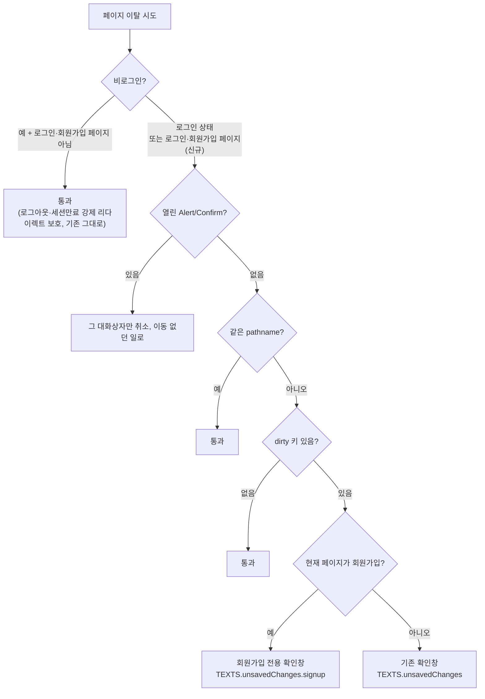
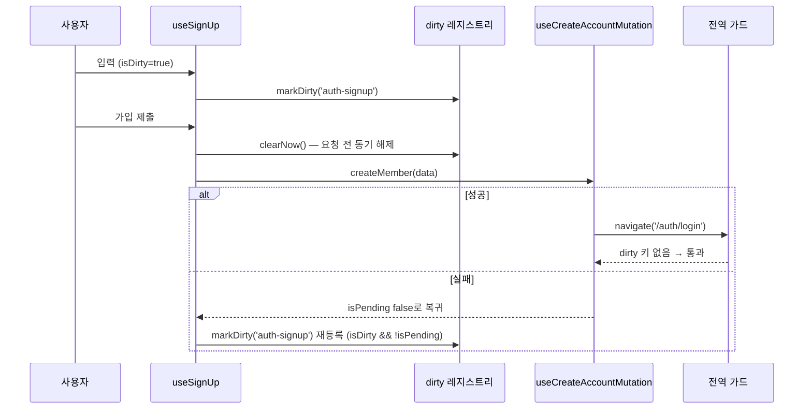

# 회원가입 폼 이탈 확인(Unsaved Changes Guard 확장)

> 회원가입 입력 중 "Sign In"·로고·뒤로가기로 나가면 입력이 조용히 사라진다 — 게시글 폼과
> 같은 전역 이탈 가드를 회원가입에도 적용하고, 회원가입 전용 문구로 확인창을 띄운다.

## Context

**문제**: 회원가입 페이지에서 입력하다 하단 "Sign In" 링크를 누르면 확인 없이 로그인 페이지로
넘어가 입력이 사라진다. 게시글 등록/수정·댓글 폼에는 이미 이탈 확인이 있다.

**조사 결과 — 기존 가드를 그대로 붙이면 동작하지 않는다**

- 이탈 방지는 폼별 blocker가 아니라 전역 레지스트리 방식이다. 폼은 `useUnsavedChanges(key, isDirty)`로
  dirty 키만 등록하고(`src/shared/hooks/useUnsavedChanges.ts`), `RootLayout`에서 1회 도는
  `useUnsavedChangesGuard`(`src/shared/hooks/useUnsavedChangesGuard.ts`)가 `useBlocker` 하나로 막는다.
- 그 가드의 첫 분기 `useUnsavedChangesGuard.ts:10` — **비로그인이면 무조건 통과**. 로그아웃·세션 만료 시
  `ProtectedRoute` 강제 리다이렉트를 막지 않으려는 것(`docs/DECISIONS.md` 2026-08-06).
- 회원가입(`/auth/sign-up`)은 `GuestGuard` 아래(`src/app/routes/index.tsx`)라 방문자가 항상 비로그인
  → 키를 등록해도 앱 내 이동은 안 막히고 `beforeunload`(새로고침) 경고만 뜬다.
- blocker는 라우터당 1개만 유효 — 회원가입에 `useBlocker`를 따로 달면 전역 가드가 조용히 죽는다
  (`src/shared/hooks/useNewVersionReload.ts:8-10`).

**회원가입 페이지 이탈 경로** (`src/features/auth/signup/ui/SignUpForm.tsx`, origin/main 기준)

- 하단 "Sign In" 링크, 이메일 중복 시 뜨는 "Sign In" 링크, 상단 로고 링크(`/post`)
- 브라우저 뒤로가기, 새로고침·탭 닫기

**가입 성공 경로**: `useCreateAccountMutation`의 `onSuccess`가 `navigate('/auth/login')`
(`src/entities/auth/api/auth.queries.ts:114-116`) — `useSignUp`의 `await createMember()`가 풀리기
**전에** 실행되므로, 가드를 켜면 성공 이동까지 막힌다.

**작업 기준 브랜치**: 로컬 main(`f06a90f`)이 `origin/main`(`794d99d`, #222)보다 뒤처져 있다.
origin/main엔 비밀번호 확인 칸(`confirmPassword`)이 추가돼 필드가 4개다 → 워크트리는 `origin/main` 기준.

**병렬 세션과의 겹침 검토(사용자 확인 완료)**: `auth-fe-phase3`(PR #223, 미병합, e2e 체크 실패 중)가
`SignUpForm.tsx`(label prop 3줄 → `TEXTS.labels.*`)와 `texts.ts`(여러 곳에 새 키 추가, `unsavedChanges`
블록 자체는 안 건드림)를 건드려 파일이 겹친다. 단 편집 위치가 이번 계획과 겹치지 않아(SignUpForm은
label prop vs 이메일 중복 Link의 onClick, texts.ts는 다른 네임스페이스 vs `unsavedChanges.signup`)
내용 충돌은 없다. `route-paths.ts`(`PUBLIC_PATHS`에 2개 경로 추가)는 이번 계획이 읽기만 해서 무관.
`useSignUp.ts`·`useCreateAccountMutation`은 phase3가 아예 안 건드림. **결정: `origin/main` 기준으로
바로 착수한다.** phase3가 먼저 병합되면 `SignUpForm.tsx`·`texts.ts`에서 줄 위치만 어긋나는 가벼운
rebase가 필요할 수 있다(내용 충돌 아님).

정정(사용자에게 처음 보여준 겹침 표에서 빠졌던 두 파일):

- `CHANGELOG.md` — phase3도 `[Unreleased]`에 19줄을 추가해, 나중에 병합하는 쪽에서 충돌이 거의 확실하다(해소는 단순)
- `e2e/signup.spec.ts` — phase3는 지금 이 파일을 안 건드리지만, label을 한글(`닉네임`·`이메일`·`비밀번호`)로
  바꿔 이 파일의 `getByLabel(/^Nickname/)` 등이 더 이상 맞지 않는다. #223 e2e 실패 원인으로 **추정**된다(로그 미확인).
  고치면서 이 파일을 수정할 가능성이 높다 → **새 테스트는 별도 파일에 두고, label 대신 phase3 전후로
  변하지 않는 placeholder 셀렉터(`TEXTS.placeholders.*`)를 쓴다**

## 판단이 필요했던 항목

| 항목                            | 결정 (사용자 확인: 1·3·4 선택지)                                                                                      | 근거·기각한 대안                                                                                                                                                                                                                                                                                                                                                 |
| ------------------------------- | --------------------------------------------------------------------------------------------------------------------- | ---------------------------------------------------------------------------------------------------------------------------------------------------------------------------------------------------------------------------------------------------------------------------------------------------------------------------------------------------------------- |
| 1. 방식                         | **전역 가드 확장** — 링크·로고·뒤로가기·새로고침 모두 기존 폼과 같은 경로로 막는다                                    | 기각: SignUpForm 링크 클릭만 가로채기 — 뒤로가기를 못 막고, `DECISIONS.md` 2026-08-06이 한 곳으로 모은 확인창 로직이 둘로 갈라진다                                                                                                                                                                                                                               |
| 2. 비로그인 예외를 좁히는 기준  | 현재 페이지가 `PUBLIC_PATHS`(로그인·회원가입, `route-paths.ts:27` — 선언만 있고 미사용)면 예외에서 뺀다               | 이 두 페이지는 `GuestGuard`라 잃을 인증이 없어 "강제 리다이렉트에 갇힘" 위험 자체가 없다. 기각: `isProtectedPath` 기준 — 공개 페이지(피드·상세) 전체 동작이 바뀌어(로그아웃 후 상세 댓글 폼 등) 회귀 면이 넓다                                                                                                                                                   |
| 3. 중복 이메일 "Sign In" 링크   | **확인창 없이 이동** — 클릭 시 `clearNow()`. 단 ⌘/Ctrl/Shift/Alt 클릭(새 탭·창)은 페이지에 머무르므로 해제하지 않는다 | 로그인하러 가려는 의도가 명확. [NN/g(Jakob Nielsen)](https://www.nngroup.com/articles/confirmation-dialog/): _"너무 자주 외치면 사람들은 질문에 주의를 기울이지 않게 되고, 확인창은 오류를 막는 힘을 잃는다"_ (번역)                                                                                                                                             |
| 4. 확인창 문구                  | **회원가입 전용 문구** `TEXTS.unsavedChanges.signup.*` — 가드가 현재 pathname이 회원가입이면 전용 문구를 고른다       | 기각: dirty 키별 문구 등록 — 스토어 shape(`Set`→`Map`)와 `useUnsavedChanges` 시그니처를 바꿔야 해 범위가 커진다. 회원가입 페이지엔 폼이 하나뿐이라 pathname 기준으로 충분                                                                                                                                                                                        |
| 5. 가입 성공 이동이 막히지 않게 | 요청 직전 `clearNow()` + 등록 조건을 `isDirty && !isPending`으로 → 실패 시 `isPending` 복귀로 자동 재등록             | 선례: `useCreatePost.ts`(이동 직전 `clearNow()`). 기각: entity `onSuccess` 수정 — "레이어 계약 유지" 위반. 기각: `!isPending`만 쓰기 — pending 렌더→effect가 응답보다 먼저 온다는 타이밍에 의존해 결정적이지 않다                                                                                                                                                |
| UX 근거(§8)                     | 입력이 있을 때만, 페이지 내 링크·이동에서 띄운다                                                                      | [Cloudscape — Communicating unsaved changes](https://cloudscape.design/patterns/general/unsaved-changes/): _"페이지의 버튼·링크로 데이터가 사라지는 동작을 하려 할 때 페이지 내 모달을 띄운다"_, _"변경한 게 없으면 잃을 데이터가 없으므로 필요 없다"_ (번역). 이 근거는 `docs/UNSAVED-CHANGES-GUARD.md`에 남긴다(되돌리기 쉬운 결정이라 DECISIONS.md 대상 아님) |

**전용 문구 초안** (승인 시 이대로, 톤은 `texts-conventions` skill의 해요체 규칙 확인):

| 키        | 문구                                     |
| --------- | ---------------------------------------- |
| `title`   | 회원가입을 그만둘까요?                   |
| `message` | 지금 나가면 입력한 가입 정보가 사라져요. |
| `confirm` | 나가기                                   |
| `cancel`  | 계속 가입하기                            |

## 세부 계획

| 위치                                                              | 변경 내용                                                                                                                                                                                                                                                                              |
| ----------------------------------------------------------------- | -------------------------------------------------------------------------------------------------------------------------------------------------------------------------------------------------------------------------------------------------------------------------------------- |
| `src/shared/hooks/useUnsavedChangesGuard.ts:8-12`                 | 지역 함수 `isGuestOnlyPage(pathname)` = `PUBLIC_PATHS.some((path) => path === pathname)`. 첫 분기를 `!isAuthenticated && !isGuestOnlyPage(currentLocation.pathname)`로, 주석에 결정 2 한 줄 추가                                                                                       |
| `src/shared/hooks/useUnsavedChangesGuard.ts:39-74`                | `useLocation()`의 `pathname`이 `ROUTES_PATHS.AUTH.SIGNUP`이면 `TEXTS.unsavedChanges.signup`, 아니면 `TEXTS.unsavedChanges`로 `openConfirm` 문구 선택(결정 4). effect deps에 `pathname` 추가                                                                                            |
| `src/shared/config/texts.ts` (`unsavedChanges`)                   | `signup: { title, message, confirm, cancel }` 추가(위 초안)                                                                                                                                                                                                                            |
| `src/features/auth/signup/hooks/useSignUp.ts`                     | `useUnsavedChanges('auth-signup', form.formState.isDirty && !isPending)`(키는 `<domain>-<slice>` 선례 `'post-create'`를 따름). `onSubmit`에서 `createMember` 전 `clearNow()`(결정 5). `onDuplicateLoginClick(e)` — 수정키 클릭이면 return, 아니면 `clearNow()`(결정 3). 반환값에 추가  |
| `src/features/auth/signup/ui/SignUpForm.tsx` (중복 이메일 `Link`) | `onClick={onDuplicateLoginClick}`                                                                                                                                                                                                                                                      |
| `e2e/signup-unsaved-changes.spec.ts` (신규)                       | 신규 테스트 5개(검증 방법 참고). `@playwright/test` 직접 사용(`auth.fixture`는 has-session을 심어 로그인 흐름을 타므로 쓰지 않음), 입력은 `getByPlaceholder(TEXTS.placeholders.*)`로 — phase3의 label 한글화 전후 모두 동작. `e2e/signup.spec.ts`는 건드리지 않음(병렬 세션 충돌 회피) |
| `e2e/unsaved-changes.spec.ts:19-20`                               | "비인증이면 블로커가 무조건 통과" 주석을 "로그인·회원가입 페이지 제외"로 정정                                                                                                                                                                                                          |
| `docs/UNSAVED-CHANGES-GUARD.md`                                   | 범위 문장·§1 순서도·§5 1번 판정·폼별 dirty 표·"의도적으로 막지 않는 경우"(중복 이메일 링크)·§6 키 표(`'auth-signup'`)·§8 코드 지도·§9(e2e 반영)·§11(아래 "남은 것")·마지막 검토일. 결정 3·4의 UX 근거(NN/g·Cloudscape 인용)를 §5에 기록                                                |
| `docs/TESTING.md` (e2e 표, `signup.spec.ts` 행 아래)              | `signup-unsaved-changes.spec.ts` 행 신규 추가(기존 `signup.spec.ts` 행은 수정하지 않음)                                                                                                                                                                                                |
| `.claude/skills/texts-conventions/SKILL.md:47`                    | 트리에 `unsavedChanges.signup.*` 추가                                                                                                                                                                                                                                                  |
| `CHANGELOG.md` `[Unreleased]`                                     | feat 항목(`changelog-release` skill 형식)                                                                                                                                                                                                                                              |
| `docs/plans/2026-09-29-signup-unsaved-guard.md` (신규)            | 이 계획 스냅샷(§11)                                                                                                                                                                                                                                                                    |

**작업 순서**: `git worktree list` 확인 → `EnterWorktree`(origin/main 기준, 로컬 미푸시 커밋 없음 확인됨)
→ `cp ../../../.env . && pnpm install`(Node 24) → 위 표 순서로 구현 → 검증 → PR(squash).

## 영향 범위 (§5)

**CRUD — dirty 레지스트리(`unsavedChanges.store.ts`)의 `'auth-signup'` 키**

- 등록: 첫 입력 시 `markDirty`. `Set`이라 중복 무해
- 조회: blocker 판정 시점·`beforeunload`에서 `hasUnsavedChanges()`
- 해제: 제출 직전 `clearNow()` / 입력을 전부 지워 `isDirty=false` / 언마운트 cleanup / 중복 이메일 링크 클릭
- 동시 요청: 제출 중 버튼·입력 disabled(`isPending`), `clearNow` 멱등. 실패 시 재등록

**기존 동작 회귀 후보**

- **로그인 페이지**(`LoginForm.tsx`): 이제 비로그인이어도 Alert 분기가 적용된다 → 세션 만료로 Alert가 열린 채
  로그인 페이지에 왔을 때 뒤로가기는 이동 대신 Alert 취소(다른 페이지와 같은 T0 동작). 로그인 폼은 키를 등록하지 않아 dirty 판정 영향 없음
- **로그아웃·세션 만료 강제 이동**: 출발지가 보호/공개 페이지라 첫 분기에서 기존대로 통과 — 회귀 없음
- **가입 성공 이동**: `e2e/signup.spec.ts` 성공 테스트의 "dialog 0개" 단정이 `clearNow`로 계속 통과해야 함
- **기존 4개 폼 문구**: pathname 분기라 `TEXTS.unsavedChanges` 그대로
- **`useSignUp.test.tsx`**: `MemoryRouter` 사용, `useUnsavedChanges`는 스토어만 써 영향 없음(언마운트 cleanup으로 테스트 간 누수 없음)
- **새로 생기는 동작**: 회원가입 입력 중 새로고침·탭 닫기 시 브라우저 기본 경고(기존 폼과 동일, 의도)
- **옛 계약을 서술하는 문서·주석**: `docs/UNSAVED-CHANGES-GUARD.md`, `e2e/unsaved-changes.spec.ts:19-20` — 세부 계획에서 갱신
- **병렬 세션(PR #223)**: 겹치는 파일과 대응은 Context의 "병렬 세션과의 겹침 검토" 참고. 추가로 #223이 먼저 병합되면
  `PUBLIC_PATHS`에 비밀번호 찾기/재설정이 들어와 그 두 페이지에도 비로그인 예외 해제가 적용된다 — 그 폼들은 dirty 키를
  등록하지 않아 확인창은 안 뜨고, 열린 Alert가 있을 때의 뒤로가기만 다른 페이지와 같은 T0 동작이 된다(무해)
- 데이터 계약(API·스키마) 변경 없음 → 배포 순서 무관, BE 문서 영향 없음

## 검증 방법

1. `pnpm type-check` → `pnpm test` → `pnpm lint` → `pnpm check:docs`
2. `pnpm test:e2e e2e/signup-unsaved-changes.spec.ts e2e/signup.spec.ts e2e/unsaved-changes.spec.ts e2e/post-create.spec.ts` — 신규 테스트:
   - 입력 후 하단 "Sign In" → 전용 문구 확인창 → "계속 가입하기"면 URL·입력값 유지, "나가기"면 `/auth/login`
   - 입력 없이 "Sign In" → 확인창 없이 즉시 이동
   - `/auth/login`에서 "Sign Up" 링크로 진입(라우터 이동 필수 — `goto` 직입은 history `idx`가 없어 POP blocker가 무시됨,
     `unsaved-changes.spec.ts:30-33`) → 입력 → `page.goBack()` → 확인창
   - 이메일 중복 → 중복 안내의 "Sign In" → 확인창 없이 `/auth/login`
   - 가입 요청 500 실패 후 하단 "Sign In" → 확인창(재등록 확인)
   - 기존: 가입 성공 → `/auth/login` + dialog 0개
3. `browser-verification` skill — Playwright MCP 녹화로 링크·로고·뒤로가기·새로고침(브라우저 기본 경고)·중복 이메일 링크를 직접 확인
4. §11 — 계획 스냅샷 커밋 + fresh Explore subagent로 계획 대비 diff 대조 → PR 본문 `## 계획 대비 구현`
5. PR 직전 `gh pr view 223 --json state`로 #223 병합 여부 확인 — 병합됐으면 `origin/main`으로 rebase 후 1~2 재실행
   (`CHANGELOG.md` 충돌 해소, 신규 e2e가 한글 label 상태에서도 통과하는지 확인)

## 남은 것

- **FE Phase 5(인증 강화 계획, 가입 후 "메일 확인" 안내 화면)**: 성공 시 `navigate`가 없어지면 `isPending` 복귀로
  키가 재등록돼 안내 화면의 "로그인하러 가기"가 확인창에 막힌다 → 그 Phase에서 성공 시 `form.reset()` 또는
  등록 조건에 `isSubmitSuccessful` 추가 필요. `docs/UNSAVED-CHANGES-GUARD.md` §11에 기록
- 로그인 폼 이탈 확인은 범위 밖(요청 없음)
- `PUBLIC_PATHS` 주석("인증이 필요없는 공개 경로들")은 실제 의미(게스트 전용 경로)와 어긋남 — 이번엔 언급만
