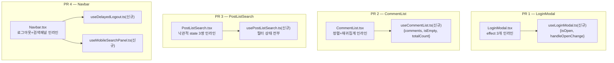

# widgets/features 4곳 위젯 훅 분리

> 이전 계획(pages hooks 세그먼트·LoginModal 이동·HoverKebabMenu, #227-229)이 병합되며
> "남은 것"으로 남겨둔 4건 — LoginModal 이펙트, CommentList 정렬/집계, PostListSearch
> 낙관적 상태, Navbar 로그아웃/검색 로직 — 을 각각 위젯 훅으로 분리한다.

## Context

이전 세션에서 pages 레이어를 정리하며 "UI 파일은 훅을 호출하고 JSX만 렌더링한다"(FE-ARCHITECTURE.md
§6·§8) 기준으로 레포 전체를 훑었을 때, pages 밖에서도 같은 문제(로직이 컴포넌트 파일에 인라인으로
있음)를 가진 파일 4개를 발견해 범위 밖으로 미뤄뒀다. 이번엔 그 4건을 처리한다.

fresh Explore agent가 4개 파일을 전부 읽고 조사한 결과:

- **파일 겹침 없음** — 4건이 서로 다른 `ui/` 파일과 각자의 새 `hooks/` 파일만 건드린다. 순서
  상관없이 병렬로 진행 가능하고, 이전처럼 PR 4개로 나눈다.
- **CommentList는 이미 문서화된 부채다** — `docs/FE-ARCHITECTURE.md:598-600`에 정확히 이 문구가
  있다: _"같은 위젯의 `CommentList.tsx`는 정렬·재귀 집계(톰스톤 포함 댓글 수)·파생 2개가 있어
  widget hook으로 빼야 한다... 2026-09-09 기준 아직 안 뺀 상태로 남아 있다"_. 다만 그 문장이 인용한
  선례("`usePostList`의 `flatMap` 파생")는 이미 낡았다 — 지금 `usePostList.ts`는 `flatMap`을 쓰지
  않는다. 이번에 그 문장 자체를 갱신한다.
- **PostListSearch·Navbar는 각자의 테스트 회귀망이 있다** — `usePostList.test.tsx`(PostListSearch를
  PostList와 함께 렌더해 `flushSync`→`startTransition` 순서를 검증하는 시나리오 A/B/C/C-2/D)와
  `e2e/logout.spec.ts`(700ms 지연 + `TEXTS.nav.loggingOut` 문구에 의존)는 훅 분리 후에도 그대로
  통과해야 한다. 로직만 옮기고 실행 순서·타이밍은 바꾸지 않는다.
- **`docs/SEARCH.md`가 `PostListSearch.tsx`·`Navbar.tsx`의 특정 줄 번호를 인용한다**(L169·175·176·178).
  코드를 옮기면 그 줄 번호가 깨지므로 각 PR에서 같이 갱신한다.
- 4건 모두 재사용처가 없다(`grep -rl` 확인 완료) — 다른 곳에서 이 컴포넌트를 import하는 곳은
  마운트 지점(RootLayout·PostDetailPage·post/index.tsx·AppLayout)과 각자의 테스트뿐이다.

## 판단이 필요했던 항목

| 항목                                                                                                                                                    | 결정                                                         | 근거·기각한 대안                                                                                                                                                                                                                                |
| ------------------------------------------------------------------------------------------------------------------------------------------------------- | ------------------------------------------------------------ | ----------------------------------------------------------------------------------------------------------------------------------------------------------------------------------------------------------------------------------------------- |
| Navbar를 훅 1개로 합칠지 2개로 쪼갤지                                                                                                                   | 2개(`useDelayedLogout`, `useMobileSearchPanel`)              | 로그아웃과 모바일 검색은 서로 무관한 관심사다. `usePostList.ts`가 훅 2개를 한 파일에 두는 선례가 있지만 그건 둘 다 "URL 파라미터"라는 같은 관심사를 공유해서다 — 로그아웃/검색은 공유하는 상태·트리거가 없어 기각                               |
| `PostListSearch`의 훅을 기존 `usePostList.ts`에 합칠지 새 파일로 뺄지                                                                                   | 새 파일(`usePostListSearch.ts`)                              | 관심사가 다르다(필터 UI 낙관적 미러 vs 데이터 조회·URL 동기화). `usePostList.ts`는 이미 2개 훅으로 충분히 크다                                                                                                                                  |
| `useMobileSearchPanel`이 `useRecentSearches`를 내부에서 호출할지, Navbar가 계속 따로 호출해 필요한 값만 넘길지                                          | Navbar가 계속 따로 호출, `addRecentSearch`만 파라미터로 전달 | `useRecentSearches`의 반환값 대부분(`recentSearches`·`removeRecentSearch`·`clearRecentSearches`)을 Navbar가 `NavbarSearch`·`RecentSearchPanel` 자식에게 그대로 내려줘야 해서, 새 훅 안에 감추면 오히려 그 값들을 다시 꺼내는 간접 계층이 생긴다 |
| `docs/FE-ARCHITECTURE.md:598-600`의 "CommentList는 아직 안 뺐다" 불릿 처리                                                                              | 제거(더 이상 사실이 아니므로)                                | §8의 그 목록은 "현재 유효한 예외"를 나열하는 자리지 변경 이력이 아니다 — 해소된 항목을 남겨두면 다음 사람이 또 부채로 오인한다. 바로 위 `CommentItem.tsx` 불릿(여전히 유효한 예외)은 그대로 둔다                                                |
| `CommentList`의 `scrollToHashedComment` effect(URL 해시로 스크롤+하이라이트), `Navbar`의 `publishNavbarHeight` effect(--navbar-height 게시)도 같이 뺄지 | 범위 밖                                                      | 둘 다 "파생 상태 계산"이 아니라 DOM을 직접 조작하는 부수효과라 §8이 요구하는 대상이 아니다. 애초에 지목했던 4건 목록에도 없었다(CLAUDE.md §3 "요청된 것만 수정")                                                                                |

## 세부 계획

### PR 1 — LoginModal

| 위치                                                          | 변경 내용                                                                                                                                                                                                         |
| ------------------------------------------------------------- | ----------------------------------------------------------------------------------------------------------------------------------------------------------------------------------------------------------------- |
| `src/widgets/layout/login-modal/hooks/useLoginModal.ts`(신규) | 3개 effect(로그인 성공 콜백, pendingAction 재개, auth 페이지 이동 시 닫기) + `handledSuccessRef`/`openedRef` + `onOpenChange` 핸들러를 옮겨 `{ isOpen, handleOpenChange }` 반환. 경합을 막는 ref 주석도 함께 이동 |
| `src/widgets/layout/login-modal/ui/LoginModal.tsx`            | 훅 호출 + `Dialog`/`DialogContent` JSX만 남김                                                                                                                                                                     |

**영향**: `LoginModal.test.tsx`는 블랙박스 테스트(컴포넌트를 렌더해 `location.state`·store·mock 호출만 관찰)라 내부 구현이 바뀌어도 그대로 유효하다 — 단, 세 effect의 실행 순서(성공 effect → pendingAction effect → auth 페이지 effect)는 그대로 유지해야 한다.

### PR 2 — CommentList

| 위치                                                             | 변경 내용                                                                                                                                                                                                                           |
| ---------------------------------------------------------------- | ----------------------------------------------------------------------------------------------------------------------------------------------------------------------------------------------------------------------------------- |
| `src/widgets/comment/comment-list/hooks/useCommentList.ts`(신규) | `countComments` 함수, `useSuspenseComments(postId)` 호출, `sorted`(dayjs 최신순 정렬), `isEmpty`, `totalCount`를 옮겨 `{ comments, isEmpty, totalCount }` 반환. Suspense 훅이라 `AsyncBoundary` 안(`CommentListContent`)에서만 호출 |
| `src/widgets/comment/comment-list/ui/CommentList.tsx`            | 훅 호출로 교체, `isMobile`·refs·`scrollToHashedComment` effect·JSX는 그대로 유지                                                                                                                                                    |
| `docs/FE-ARCHITECTURE.md:598-600`                                | "아직 안 뺀 상태" 불릿 제거                                                                                                                                                                                                         |
| `docs/FE-ARCHITECTURE.md` §3                                     | `comment-list/` 트리에 `hooks/` 추가                                                                                                                                                                                                |

**영향**: `CommentList.test.tsx`는 없음(브라우저 검증으로 대체).

### PR 3 — PostListSearch

| 위치                                                          | 변경 내용                                                                                                                                                                                                                                                                                                                                                                                                                                                                                                                              |
| ------------------------------------------------------------- | -------------------------------------------------------------------------------------------------------------------------------------------------------------------------------------------------------------------------------------------------------------------------------------------------------------------------------------------------------------------------------------------------------------------------------------------------------------------------------------------------------------------------------------- |
| `src/widgets/post/post-list/hooks/usePostListSearch.ts`(신규) | `optimisticFilters`/`optimisticCategoryTags`/`optimisticHideBots` 3쌍 + 각 동기화 effect, `handleToggleFilter`/`handleToggleHideBots`/`toggleCategoryTagInSearch`/`handleClearSearch`, `SCOPE_FILTERS`·`computeAppliedFilterCount`를 옮겨 `{ categoryOptionList, selectedCategories, toggleCategoryTagInSearch, isClickedBookmark, isClickedMyPosts, isClickedPrivate, handleToggleFilter, optimisticHideBots, handleToggleHideBots, appliedCount, handleClearSearch }` 반환. 내부에서 기존 `usePostListParams`(`usePostList.ts`) 호출 |
| `src/widgets/post/post-list/ui/PostListSearch.tsx`            | 훅 호출 + JSX만 남김                                                                                                                                                                                                                                                                                                                                                                                                                                                                                                                   |
| `docs/SEARCH.md:175-176`                                      | `PostListSearch.tsx` 줄 번호 인용 갱신                                                                                                                                                                                                                                                                                                                                                                                                                                                                                                 |

**영향**: `flushSync`→`startTransition` 순서를 그대로 보존해야 `usePostList.test.tsx`의 시나리오 A/B/C/C-2/D가 계속 통과한다. `PostListSearch.test.tsx`(DOM 블랙박스 3건)는 영향 없음.

### PR 4 — Navbar

| 위치                                                            | 변경 내용                                                                                                                                                                                                                                                                                                |
| --------------------------------------------------------------- | -------------------------------------------------------------------------------------------------------------------------------------------------------------------------------------------------------------------------------------------------------------------------------------------------------- |
| `src/widgets/layout/navbar/hooks/useDelayedLogout.ts`(신규)     | `useAuth().logout`, `isLoggingOut` state, `handleLogout`(700ms 지연)을 옮겨 `{ isLoggingOut, handleLogout }` 반환                                                                                                                                                                                        |
| `src/widgets/layout/navbar/hooks/useMobileSearchPanel.ts`(신규) | `useLocation`/`useNavigate`(내부 자체 호출), `isMobileSearchOpen` 파생, `openMobileSearch`/`closeMobileSearch`/`handleSearchSubmit`을 옮김. `addRecentSearch`를 파라미터로 받아 `handleSearchSubmit` 안에서 호출. `{ isMobileSearchOpen, openMobileSearch, closeMobileSearch, handleSearchSubmit }` 반환 |
| `src/widgets/layout/navbar/ui/Navbar.tsx`                       | 훅 2개 호출로 교체. `useRecentSearches()`·`useNavigate()`(메뉴 클릭용)·`publishNavbarHeight` effect는 그대로 유지                                                                                                                                                                                        |
| `docs/SEARCH.md:169,178`                                        | `Navbar.tsx` 줄 번호 인용 갱신                                                                                                                                                                                                                                                                           |

**영향**: `Navbar.test.tsx`(테마 토글 5건 + 데스크톱 최근검색 1건)는 로그아웃·모바일검색을 다루지 않아 영향 없음. `e2e/logout.spec.ts`는 700ms 지연과 `TEXTS.nav.loggingOut` 문구가 그대로 유지돼야 통과한다.

## 영향 범위

4건 모두 순수 리팩터(로직 위치만 이동, 데이터 계약·렌더 결과·타이밍 불변)라 배포 순서 이슈 없음.
CRUD/데이터 계약 변경 없음 — 전부 프론트엔드 파일 내 로직 재배치.

| PR  | 회귀 가능 지점                                         | 기존 테스트 커버                                                             |
| --- | ------------------------------------------------------ | ---------------------------------------------------------------------------- |
| 1   | 로그인 성공/취소/pendingAction 재개 타이밍             | `LoginModal.test.tsx`(3건)                                                   |
| 2   | 댓글 정렬 순서·톰스톤 포함 카운트                      | 없음 — 브라우저 검증으로 대체                                                |
| 3   | 필터 칩 낙관적 반응·`flushSync`/`startTransition` 순서 | `PostListSearch.test.tsx`(3건), `usePostList.test.tsx`(A/B/C/C-2/D 시나리오) |
| 4   | 700ms 로그아웃 지연, 모바일 검색 열림/닫힘/제출        | `Navbar.test.tsx`(6건), `e2e/logout.spec.ts`                                 |

## 검증 방법

각 PR마다 순서대로:

1. `pnpm type-check`
2. `pnpm test` — 특히 PR 1은 `LoginModal.test.tsx`, PR 3은 `usePostList.test.tsx`(시나리오 전부),
   PR 4는 `Navbar.test.tsx`가 그대로 통과하는지
3. `pnpm lint`
4. `pnpm check:docs` — PR 2·3·4는 문서 줄 번호 갱신이 실제로 맞는지 이 스크립트로 확인
5. PR 4는 `pnpm test:e2e -- logout`으로 700ms 지연 회귀 확인
6. `browser-verification` skill로 실제 화면에서 로그인 모달 흐름·댓글 목록·검색 필터 칩·
   로그아웃 버튼이 리팩터 전후 동일하게 동작하는지 확인(순수 리팩터라 CLAUDE.md §9 "반영 전
   승인" 대상은 아니지만 동작 동일성은 검증)

## 남은 것

- `CommentList`의 `scrollToHashedComment`, `Navbar`의 `publishNavbarHeight`는 이번 범위 밖 —
  DOM 부수효과라 §8 대상이 아니라고 판단했지만, 나중에 다시 문제가 되면 별도로 검토
- 이번 4건을 끝으로 이전 세션에서 "pages 밖 로직 혼재"로 지목했던 항목은 전부 처리됨
