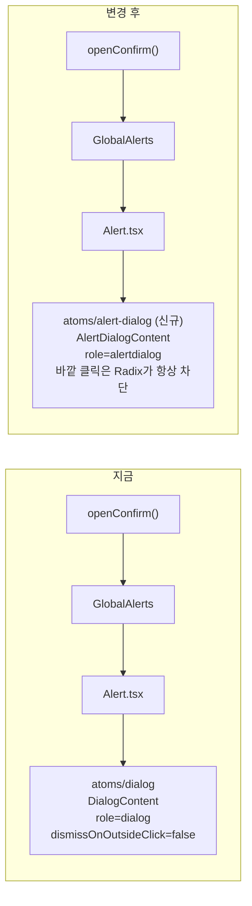
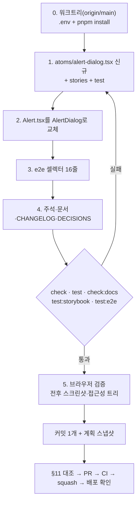

# 확인창(Alert)을 Radix AlertDialog로 교체 — 스크린리더에 "경고 대화상자"로 안내

> `Alert.tsx`가 공용 Radix `Dialog`(role=`dialog`) 대신 Radix `AlertDialog`(role=`alertdialog`)를
> 쓰게 한다. 눈으로 보는 동작·모양은 바꾸지 않는다. PR 1개.

## Context

삭제·이탈·공개 설정 확인창 6종은 모두 `useAlert().openConfirm()` → `GlobalAlerts` → `Alert.tsx`
한 컴포넌트가 띄운다. 이 컴포넌트는 일반 `Dialog`라 스크린리더가 "대화상자"로만 안내한다.
[W3C APG Alert Dialog](https://www.w3.org/WAI/ARIA/apg/patterns/alertdialog/)는 alertdialog를
_"중요한 메시지를 알리고 응답을 받기 위해 사용자의 작업 흐름을 끊는 모달 다이얼로그"_ (번역)로
정의한다. 확인창은 이 정의에 해당한다.

방법 A(`DialogContent`에 role만 덮어쓰기)와 B(Radix `AlertDialog`로 교체)를 비교해 보였다.
사용자는 **B로 확정**했다(2026-09-30). #267로 확인창이 이미 바깥 클릭에 안 닫혀 체감 결과가 같다는
점도 설명한 뒤의 결정이다.

### 사전 조사 (`origin/main` e32247d, 설치된 `@radix-ui/react-alert-dialog@1.1.15` 소스 직접 확인)

- **확인창 호출처 6곳**: `usePostDelete.ts:11`, `useDeleteComment.ts:14`, `useFolderActions.ts:70`,
  `useDeleteAccount.ts:24`, `usePostCard.ts:78`(공개 설정), `useUnsavedChangesGuard.ts:76`(이탈).
  `openAlert`(단일 버튼)는 스토어에만 있고 호출처는 0곳이다.
- **AlertDialog 소스 사실**(`node_modules/@radix-ui/react-alert-dialog/dist/index.mjs`):
  - `role: "alertdialog"`(67행), Root는 `modal: true` 고정(20행)
  - Content가 `onPointerDownOutside`·`onInteractOutside`를 **무조건 `preventDefault`**(75–76행)하고,
    사용자가 넘긴 값은 무시한다
  - `onOpenAutoFocus`는 `composeEventHandlers(사용자, 내부)`(71행)라서, 우리가 `preventDefault`하면
    Cancel 자동 포커스를 건너뛴다
  - context scope가 분리돼 있어 `atoms/dialog`의 `DialogTitle`·`DialogDescription`·X(`DialogClose`)를
    그 안에서 쓸 수 없다 → `AlertDialog*` 부품이 따로 필요하다
  - 설명(Description)이 없으면 `console.warn`(`DescriptionWarning`). `Alert.tsx`는 항상 설명을 렌더한다
- **런타임에서 `[role=dialog]`로 창을 감지하는 코드는 0곳**(`git grep`). role 변경이 영향을 주는 곳은
  e2e 셀렉터뿐이다. 유닛 테스트의 `getByRole('dialog')`는 모두 폴더 선택창과 atoms 자체 테스트라 무관하다.

## 판단이 필요했던 항목

| 항목                                  | 결정                                                                                                          | 근거·기각한 대안                                                                                                                                                                                                     |
| ------------------------------------- | ------------------------------------------------------------------------------------------------------------- | -------------------------------------------------------------------------------------------------------------------------------------------------------------------------------------------------------------------- |
| 구현 방식                             | **B: Radix `AlertDialog` 기반 새 atom** (사용자 확정 2026-09-30)                                              | 기각 A(role 덮어쓰기 1줄): 체감 결과는 같지만 사용자가 B를 선택. 트레이드오프(바깥 클릭 정책 위치가 공용 prop과 AlertDialog 내부 고정값 두 곳으로 갈림, 가드 코드 중복)는 선택 전에 설명함                           |
| 새 atom 위치·이름                     | `src/shared/ui/atoms/alert-dialog.tsx`, `AlertDialog*` 이름                                                   | 선례: `atoms/dialog.tsx`의 파일 구조(Overlay·Content·Panel 분리·Header/Footer/Title/Description)와 shadcn/ui의 `alert-dialog` 템플릿 이름. `docs/FE-ARCHITECTURE.md` §18 규칙(alert/confirm 전용 = `Alert`)과 맞음   |
| 옮겨 심을 가드                        | **열린 직후 안쪽 클릭 가드(`onClickCapture` + `useOpenClickGuard`)와 IME 조합 중 ESC 무시**만 옮긴다          | 바깥 클릭 관련 2개(열린 직후 바깥 pointerdown, 마우스 뒤로가기 버튼)와 `dismissOnOutsideClick`은 AlertDialog가 바깥 pointerdown을 항상 막아(소스 75행) 필요가 없다                                                   |
| 가드·클래스 공유 방식                 | **`alert-dialog.tsx`에 복제**하고 주석으로 `dialog.tsx`를 가리킨다                                            | shadcn도 dialog/alert-dialog 템플릿이 클래스를 각자 가진다. 공용 헬퍼로 뽑으면 잘 동작하는 `dialog.tsx`를 함께 고쳐야 한다(§3 최소 범위). 기각: 공용 훅·클래스 상수 추출                                             |
| 가드를 Presence 안쪽 패널에 두는 구조 | `dialog.tsx`와 같이 `AlertDialogContentPanel` 분리                                                            | `dialog.tsx:45-49` 주석: 닫힌 채 마운트된 뒤 열리면 가드 시계가 안 돌던 버그(2026-09-30) 재발 방지                                                                                                                   |
| X 닫기 버튼                           | **유지**. `AlertDialogPrimitive.Cancel`로 같은 클래스·`sr-only "Close"`                                       | 지금 `Alert`는 `DialogContent` 기본값(`showCloseButton=true`)이라 X가 보인다. 없애면 시각 변경이라 §9 대상. Cancel은 `DialogClose`와 같아 누르면 `onOpenChange(false)` → 취소                                        |
| 열릴 때 포커스                        | confirm은 지금처럼 강조 버튼. **alert(단일 버튼)는 확인 버튼에 명시적으로 포커스**                            | 지금 alert형은 Radix 기본값(첫 포커스 가능 요소 = 확인 버튼)에 기대고 있다. AlertDialog 기본값은 Cancel(없으면 아무 데도 안 감)이라 명시해야 같아진다. 호출처는 0곳이지만 스토리(`Alert.stories.tsx` Default)가 쓴다 |
| e2e 셀렉터                            | 확인창을 찾는 곳은 `alertdialog`로. **"창이 안 떴다"는 무이름 `toHaveCount(0)`는 `dialog.or(alertdialog)`로** | role만 바꾸면 무이름 `getByRole('dialog')...toHaveCount(0)`은 확인창이 떠도 조용히 통과한다(약화). `.or()`로 기존 검사 강도를 유지한다. Playwright 1.57 지원                                                         |
| CHANGELOG                             | `[Unreleased] ### Fixed`에 추가                                                                               | 스크린리더 안내가 바뀌는 동작 변경(`changelog-release` skill: fix는 기록 대상)                                                                                                                                       |
| DECISIONS.md                          | **새 항목 추가**(A/B 비교와 선택)                                                                             | 메모리 `decisions-md-usage-criteria`: 실제 대안 비교 + 되돌리기 비용(새 atom). 둘 다 충족                                                                                                                            |

## 세부 계획

### 1. 새 atom `src/shared/ui/atoms/alert-dialog.tsx` (+ stories, test)

| 위치                                                  | 변경 내용                                                                                                                                                                                                                                                                                                                                                                                                                                                                                                                                                             |
| ----------------------------------------------------- | --------------------------------------------------------------------------------------------------------------------------------------------------------------------------------------------------------------------------------------------------------------------------------------------------------------------------------------------------------------------------------------------------------------------------------------------------------------------------------------------------------------------------------------------------------------------- |
| `src/shared/ui/atoms/alert-dialog.tsx` (신규)         | `@radix-ui/react-alert-dialog` 래핑. `AlertDialog`(Root), `AlertDialogPortal`, `AlertDialogOverlay`(`dialog.tsx`의 Overlay와 같은 클래스), `AlertDialogContent`(Portal+Overlay+Panel), `AlertDialogHeader`/`Footer`(같은 클래스), `AlertDialogTitle`(`text-section-title tracking-tight`), `AlertDialogDescription`(`text-sm text-muted-foreground`). Panel은 `dialog.tsx`와 같은 Content 클래스를 쓰고, `useOpenClickGuard(true)` + `onClickCapture` 가드 + `onEscapeKeyDown` `isComposing` 가드를 둔다. `showCloseButton`(기본 true)이면 `Cancel` 기반 X를 렌더한다 |
| `src/shared/ui/atoms/alert-dialog.stories.tsx` (신규) | `Shared/UI/Atoms/AlertDialog`. Default(트리거 + 제목·설명 + 취소/확인) 1개. CLAUDE.md 규칙: 새 atom은 같은 커밋에 스토리 필수                                                                                                                                                                                                                                                                                                                                                                                                                                         |
| `src/shared/ui/atoms/alert-dialog.test.tsx` (신규)    | `dialog.test.tsx` 구조를 따른다: role=`alertdialog` / 열린 직후 안쪽 버튼 클릭 무시 / 가드 시간이 지난 뒤 클릭 정상 / 가드 시간이 지난 뒤 바깥 pointerdown에도 안 닫힘 / ESC로 닫힘 / 조합 중 ESC(`isComposing`)는 무시 / 닫힌 채 마운트됐다 열려도 가드가 동작                                                                                                                                                                                                                                                                                                       |

### 2. `src/shared/ui/elements/dialog/alert/Alert.tsx`

| 변경 전                                                                                 | 변경 후                                                                                                       |
| --------------------------------------------------------------------------------------- | ------------------------------------------------------------------------------------------------------------- |
| `atoms/dialog`의 `Dialog`·`DialogContent`·`DialogHeader`·`Footer`·`Title`·`Description` | `atoms/alert-dialog`의 `AlertDialog*` (className·구조 그대로)                                                 |
| `dismissOnOutsideClick={false}` + 그 주석                                               | 삭제하고, 바깥 클릭은 AlertDialog가 항상 막는다는 주석으로 교체                                               |
| `onOpenAutoFocus`: confirm일 때만 `preventDefault` + 강조 버튼 포커스                   | 항상 `preventDefault` + 포커스. alert형은 확인 버튼이 포커스 대상(`emphasizedButtonRef`를 확인 버튼에도 연결) |

`handleConfirm`·`handleCancel`·location 변경 시 취소 effect·버튼 순서·강조 로직은 건드리지 않는다.

### 3. e2e 셀렉터 (16줄: 확인창 10 + "안 떴다" 단언 6)

| 위치                                                                                                                                                                                                                                                             | 변경                                                                                                                           |
| ---------------------------------------------------------------------------------------------------------------------------------------------------------------------------------------------------------------------------------------------------------------- | ------------------------------------------------------------------------------------------------------------------------------ |
| `bookmark-folder-delete.spec.ts:80`, `comment-delete.spec.ts:75·130`, `dialog-outside-click.spec.ts:46`, `post-delete.spec.ts:64`, `post-visibility.spec.ts:71·120`, `signup-unsaved-changes.spec.ts:27`, `unsaved-changes.spec.ts:44`, `post-create.spec.ts:64` | `getByRole('dialog', …)` → `getByRole('alertdialog', …)`(확인창을 가리키는 곳). 같은 줄 근처 주석의 "dialog로 스코프"도 맞춘다 |
| `bookmark-folder-delete.spec.ts:118`, `post-create-folder-picker.spec.ts:48`, `signup.spec.ts:52`, `signup-unsaved-changes.spec.ts:97·106`, `protected-nav.spec.ts:88`                                                                                           | 무이름 `getByRole('dialog')).toHaveCount(0)` → `getByRole('dialog').or(page.getByRole('alertdialog'))).toHaveCount(0)`         |

그대로 두는 것: 로그인 창·폴더 선택 창을 가리키는 셀렉터(`guest-guard`, `bookmark*`, `post-create-folder-picker:34`, `protected-nav:45·57`, `dialog-outside-click:72`). `guest-guard.spec.ts:53·93`의 `toHaveCount(1)`은 "로그인·폴더 창이 겹치지 않는다"는 의도라 그대로 둔다.

### 4. 주석·문서

| 위치                                                                    | 변경 내용                                                                                                |
| ----------------------------------------------------------------------- | -------------------------------------------------------------------------------------------------------- |
| `atoms/dialog.tsx:39` JSDoc, `dialog.stories.tsx:62`                    | `dismissOnOutsideClick={false}` 사용처 예시에서 확인창을 빼고 "로그인 모달(입력 중)"만 남김              |
| `useOpenClickGuard.ts:10`, `dialog.test.tsx:10`, `docs/BOOKMARK.md:204` | "Alert/Confirm을 포함한 모든 Dialog 기반 모달" → 확인창은 `AlertDialogContent`가 같은 가드를 가짐을 반영 |
| `docs/FE-ARCHITECTURE.md` §18 각주(1112행 근처)                         | "`Alert.tsx`는 일반 `Dialog`라 alertdialog가 아니다(별도 작업)" → "Radix `AlertDialog` 기반(2026-09-30)" |
| `docs/DECISIONS.md` (신규 항목)                                         | 2026-09-30 확인창 AlertDialog 교체: 배경·A/B 비교표·선택·트레이드오프(정책 위치 분산, 가드 복제)         |
| `CHANGELOG.md` `[Unreleased]` `### Fixed`                               | 확인창을 스크린리더가 "경고 대화상자"로 안내(포맷은 `changelog-release` skill을 읽고 맞춘다)             |
| `docs/plans/2026-09-30-alert-dialog.md` (신규)                          | 이 계획 스냅샷                                                                                           |

`docs/DECISIONS.md`의 #267 항목(바깥 클릭 정책)은 과거 기록이라 고치지 않는다. 표의 "Alert/Confirm = 바깥 클릭 무시"는 여전히 사실이다.

## 영향 범위 (§5)

**CRUD 실패 지점**: 서버 데이터·API·스토어 계약 변경 없음. `alert.store.ts`(`openConfirm`·`cancelAlert`·
`getOpenAlertId`)는 그대로라 이탈 가드(`useUnsavedChangesGuard`)의 판정 경로도 그대로다.

**기존 기능의 회귀 후보**

| 회귀 후보                                        | 소유 파일                             | 확인 방법                                                             |
| ------------------------------------------------ | ------------------------------------- | --------------------------------------------------------------------- |
| 확인창 모양(패딩·폭·버튼 배치·X·오버레이)        | `Alert.tsx`, 새 atom                  | 전후 스크린샷(데스크톱·375px) 비교                                    |
| 열린 직후 더블클릭 관통(삭제 오확정)             | 새 atom Panel의 `onClickCapture` 가드 | 유닛 테스트 + e2e `post-delete`·`comment-delete`                      |
| 한글 조합 중 ESC로 히스토리 두 번 뒤로           | 새 atom Panel의 `isComposing` 가드    | 유닛 테스트                                                           |
| 강조 버튼 초기 포커스                            | `Alert.tsx` `onOpenAutoFocus`         | 브라우저 검증(포커스 링) + 기존 e2e                                   |
| ESC·취소·뒤로가기로 닫힘, 확인 시 onConfirm 순서 | `Alert.tsx`                           | e2e `dialog-outside-click`·`unsaved-changes`·`bookmark-folder-delete` |
| "확인창이 안 떴다" 단언 약화                     | e2e 6곳                               | `.or()`로 교체(3번)                                                   |
| 스토리 a11y(axe)                                 | `Alert.stories.tsx`, 새 스토리        | `pnpm test:storybook`                                                 |
| 스크린리더 안내 변화                             | 전체 확인창 6종                       | 의도된 변경, CHANGELOG `Fixed`                                        |

배포 순서: FE 단독, BE 영향 없음.

## 검증 방법

1. `pnpm check`, `pnpm test`(새 `alert-dialog.test.tsx` 포함), `pnpm check:docs`, `pnpm test:storybook`, `pnpm test:e2e`
2. `pnpm build-storybook` → `storybook-static/index.json`에 `shared-ui-atoms-alertdialog--default` 존재
3. `browser-verification` skill을 따른다. 게시글 삭제 확인창을 대상으로:
   - 변경 전(main)·후 스크린샷 비교(데스크톱, 375px)
   - 접근성 스냅샷에서 `alertdialog` 확인
   - 바깥 클릭으로 안 닫히고 ESC·취소로 닫히는지, 초기 포커스가 강조 버튼에 있는지
4. §11: fresh `general-purpose` 서브에이전트에 계획 스냅샷 + diff 대조 → PR 본문 `## 계획 대비 구현`
5. CI `Storybook a11y`가 실패하면 로그에서 `optimized dependencies changed. reloading`부터 확인(기존 간헐 실패, #269에서 3회 발생)
6. squash 머지 후 Frontend Deploy run이 그 SHA로 success인지 확인하고 보고

## 남은 것

- 바깥 클릭 정책이 두 곳(공용 `dismissOnOutsideClick` prop과 AlertDialog 고정값)으로 갈리는 점은 DECISIONS 항목에 남긴다
- CI Storybook a11y 간헐 실패(Vite 의존성 재최적화 리로드)는 이 PR 범위 밖이다. 별도 이슈로 다룰지는 사용자에게 따로 제안한다
