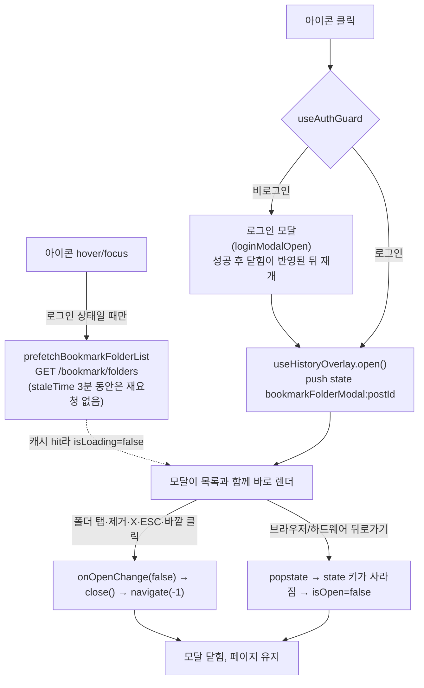

# 북마크 폴더 모달 UX 4건 수정

## Context

게시글 카드·상세의 북마크 버튼을 누르면 뜨는 폴더 선택 모달(`BookmarkFolderSelectModal`)에서 사용자가 네 가지를 지적했다.

1. 제목 `'보관함'`이 북마크와 연결되지 않는다 → **"북마크에 저장"으로 변경**(사용자 선택).
2. 열린 직후 400ms 안에 바깥을 눌러도 닫힌다. `useOpenClickGuard`가 `DialogContent`에 이미 배선돼 있는데도(#245, 2026-09-29 배포 완료) 막히지 않는 **버그**다.
   - 바깥 클릭으로 닫을지 말지의 정책은 **범위에서 제외**한다. 사용자 결정: "alert·dialog·modal 전체를 한 번에 따로 다룬다".
3. 모달을 연 뒤에야 `GET /bookmark/folders`를 요청하기 때문에, 작게 뜬 모달이 목록이 들어오면서 늘어난다 → **아이콘 hover/focus 시 프리페치**.
4. 모달이 열린 상태에서 뒤로가기를 누르면 이전 페이지로 이동한다 → **히스토리 엔트리로 관리해 뒤로가기로 모달만 닫히게** 한다.

## 전체 흐름

## 선례

- 히스토리 오버레이: [src/shared/hooks/useHistoryOverlay.ts](src/shared/hooks/useHistoryOverlay.ts). 로그인 모달(`useAuthGuard.ts:29`)과 이미지 뷰어(`imageViewer.store.ts`)가 쓴다. 정책은 `docs/DECISIONS.md` 2026-08-07 "뒤로가기 정책"의 T1에 해당한다.
- hover 프리페치:
  - `prefetchBookmarkFolderPosts`([bookmark-folder.queries.ts:81](src/entities/bookmark/folder/api/bookmark-folder.queries.ts#L81))와 `useFolderTree.ts:21`의 `prefetchFolder` 래핑
  - `prefetchPostDetail`과 `usePostCard.ts:135`의 `handlePrefetchDetail`
  - `PostCard.tsx:185`에서 `onMouseEnter`·`onFocus`로 호출한다.
- 로직을 hook으로 분리하는 방식: `docs/FE-ARCHITECTURE.md` §6(Feature Hook)

## 세부 계획

### 1. 제목 변경

- [texts.ts:338](src/shared/config/texts.ts#L338): `selectorTitle: '보관함'`을 `'북마크에 저장'`으로 바꾼다.
- 등록 폼의 `PostCreateBookmarkFolderField`도 같은 키를 쓰므로 함께 바뀐다(사용자 확인 완료).
- 주석의 "보관함" 표현(`BookmarkPostButton.tsx:18`, `BookmarkFolderSelectModal.tsx:33,237-238`, `usePostCreateBookmarkFolderField.ts:66`)은 이 모달을 가리키는 것만 "북마크 모달"로 맞춘다.
- `docs/BOOKMARK.md:86`의 YouTube Music "보관함에 저장"은 외부 제품명이므로 그대로 둔다.

### 2. 400ms 가드 버그: 재현이 먼저

정적 추적으로는 원인을 찾지 못했다. 추적 범위는 `dialog.tsx:56-78`, `useOpenClickGuard.ts`, Radix `usePointerDownOutside`(터치는 click 시점, 마우스는 pointerdown 시점에 판정)였다. 그래서 다음 순서로 진행한다.

1. Playwright로 재현한다. 기존 `e2e/bookmark.spec.ts`·`bookmark.mobile.spec.ts`의 모킹을 재사용하고, 다음 시나리오를 돌린다.
   - (a) 아이콘 더블클릭(데스크톱)
   - (b) 아이콘 더블탭(mobile-chrome)
   - (c) 열고 100~300ms 안에 오버레이 클릭
   - (d) 첫 로딩 중(목록 API를 지연시킨 상태) 빠른 바깥 클릭
2. 확인할 가설:
   - 가드 시계(`useEffect`로 `openedAt` 기록)가 첫 클릭보다 늦게 잡힌다.
   - 로딩 중에는 모달이 헤더 높이로만 작게 떠 있다. 그래서 사용자가 목록이 나올 자리를 눌렀는데 그곳이 그 순간엔 "바깥"이었다. 이 경우는 3번 프리페치로 대부분 해소된다.
   - 트리거와 오버레이 사이의 기타 이벤트 경로.
3. 재현되면: 실패하는 테스트를 먼저 추가하고(`src/shared/ui/atoms/dialog.test.tsx` 또는 e2e), 원인을 고친 뒤 통과를 확인한다.
4. 재현되지 않으면: 코드를 추측으로 고치지 않는다. 사용자에게 재현 환경(기기·브라우저·조작)을 다시 묻고 멈춘다.

### 3. hover 프리페치

- `entities/bookmark/folder/api/bookmark-folder.queries.ts`에 `prefetchBookmarkFolderList(queryClient)`를 추가한다. `useBookmarkFolderListQuery`와 같은 키·queryFn(`bookmarkFolderKeys.list`, `bookmarkFolderApi.fetchBookmarkFolderList`)을 쓴다.
- **로그인 상태일 때만 호출한다.** 비로그인이면 401이 나고, `queryClient.ts:57`의 QueryCache 전역 에러 토스트까지 이어지기 때문이다.
- 트리거는 선례와 같은 `onMouseEnter`와 `onFocus`다.

### 4. 뒤로가기로 닫기 + 로직 hook 분리

- 새 파일 `features/bookmark/toggle/hooks/useBookmarkPostButton.ts`가 다음을 소유한다.
  - `useHistoryOverlay(\`bookmarkFolderModalOpen:${postId}\`)`. 피드에 카드가 여러 개라 **postId별로 고유한 키**가 필요하다.
  - `useAuthGuard`
  - 프리페치 핸들러
  - 반환값: `isOpen`, `handleClick`, `handleOpenChange`(false면 `close()`), `handlePrefetch`
- `BookmarkPostButton.tsx`는 `useState`를 걷어내고 훅 호출과 JSX만 남긴다.
- 로그인 후 재개 경로는 추가 작업이 필요 없다. `useLoginModal.ts:47-73`이 로그인 모달의 `close()`(navigate(-1))가 반영된 **뒤에** `pendingAction`(= `open()`)을 실행하므로 모달이 겹치지 않는다.
- `useHistoryOverlay.open()`은 state를 `{[key]: true}`로 **통째로 교체**한다. 그 결과 상세 페이지에서 모달이 열려 있는 동안 `backSource`와 `location.key`가 바뀌어, 뒤쪽의 "목록으로" 라벨이 "뒤로가기"로 바뀐다(`usePostDetail.ts:24-37`).
  - 모달을 닫으면(pop) 원래 엔트리로 돌아가 복구된다. 로그인 모달도 지금 같은 현상이 있다.
  - 이 계획에서는 **고치지 않고 알려진 현상으로 기록만** 한다. 공용 훅을 바꾸면 다른 오버레이 4종에 영향이 가기 때문이다. 고치길 원하면 별도로 진행한다.

### 문서

- `docs/BOOKMARK.md`: 모달을 T1(히스토리 오버레이)로 분류했다는 것과 postId별 키, hover 프리페치, 2번의 원인·수정(재현 결과)을 기록한다.
- `CHANGELOG.md` `[Unreleased]`에 fix 항목을 추가한다.
- 계획 스냅샷 `docs/plans/2026-09-30-bookmark-modal-ux-fixes.md`를 같은 PR로 커밋한다.

## 영향 범위(§5)

| 대상                                    | 깨질 수 있는 것                                                                                      | 대응                                                                                         |
| --------------------------------------- | ---------------------------------------------------------------------------------------------------- | -------------------------------------------------------------------------------------------- |
| 북마크 저장·이동·제거(C/U/D)            | 핸들러의 `onOpenChange(false)`가 `navigate(-1)`로 바뀐다. 연달아 호출되면 back이 두 번 나갈 수 있다. | `useHistoryOverlay`의 `backSentRef` 래치가 막는다. 저장 후 페이지에 머무는지 e2e로 확인한다. |
| 폴더 목록 조회(R)                       | 프리페치와 모달 쿼리가 같은 키를 쓰는데, 키가 어긋나면 이중 요청이 생긴다.                           | 같은 key 상수를 쓴다. 네트워크 탭에서 1회만 나가는지 확인한다.                               |
| 비로그인 hover                          | 401과 에러 토스트                                                                                    | `isAuthenticated`로 가드한다.                                                                |
| 피드 가상화(`post-list-virtualization`) | 모달이 열린 카드가 언마운트된다.                                                                     | 모달이 스크롤을 잠가서 사실상 발생하지 않는다.                                               |
| 새로고침                                | state가 남아 있어 모달이 다시 열린다.                                                                | 기존 T1 오버레이와 같은 동작이다.                                                            |
| 기존 테스트                             | `PostCardBookmarkFolderModal.test.tsx`, e2e `bookmark*.spec.ts`, 텍스트 '보관함' 단정                | 전부 돌려 보고 필요한 곳만 고친다.                                                           |
| 등록 폼 폴더 선택                       | 제목만 바뀐다. 히스토리·프리페치는 **범위 밖**이다.                                                  | —                                                                                            |

## 핵심 파일

- `src/shared/config/texts.ts`
- `src/features/bookmark/toggle/ui/BookmarkPostButton.tsx`
- `src/features/bookmark/toggle/hooks/useBookmarkPostButton.ts` (신규)
- `src/entities/bookmark/folder/api/bookmark-folder.queries.ts`
- 2번 원인에 따라 `src/shared/ui/atoms/dialog.tsx` 또는 `src/shared/hooks/useOpenClickGuard.ts`
- `docs/BOOKMARK.md`, `CHANGELOG.md`

## 실행 순서

1. `git log origin/main..main` 확인 → `EnterWorktree` → `.env` 복사 → `pnpm install`
2. 2번 재현(Playwright)으로 원인을 확정한다. 재현이 안 되면 사용자에게 묻고 멈춘다.
3. 1 → 3 → 4 → 2 수정 순으로 구현하고, 기능 단위로 커밋한다.
4. 검증, 문서, PR(§11 계획 대비 구현 대조 포함)

## 검증 방법

- `pnpm type-check`, `pnpm test`, `pnpm lint`, `pnpm check:docs`
- e2e(`pnpm test:e2e`)에 다음 시나리오를 추가하거나 확인한다.
  - 상세 페이지에서 모달 열기 → `page.goBack()` → 모달이 닫히고 URL은 그대로 `/post/:id`
  - 뒤로가기를 한 번 더 누르면 이전 페이지로 이동
  - 폴더 선택으로 저장 → 모달 닫힘, 페이지 유지
  - hover → `/bookmark/folders` 요청이 1회 → 클릭 시 추가 요청 없이 목록이 바로 보임
  - 2번 재현 시나리오 통과
- `browser-verification` skill 절차로 데스크톱·모바일 녹화를 공유한다.

## 남은 것(범위 밖)

- alert·dialog·modal 전체의 바깥 클릭 닫기 정책. 사용자가 별도 작업으로 결정했다. 조사 근거는 이번 대화에 있으니 그때 `DECISIONS.md`에 기록한다.
- 모바일은 hover가 없어서 첫 탭에는 여전히 로딩이 보인다(이후 3분은 캐시로 즉시 뜬다).
- 상세 페이지에서 오버레이가 열린 동안 뒤로가기 라벨이 바뀌는 현상(공용 `useHistoryOverlay`)
- 등록 폼 폴더 선택 모달의 히스토리 연동
