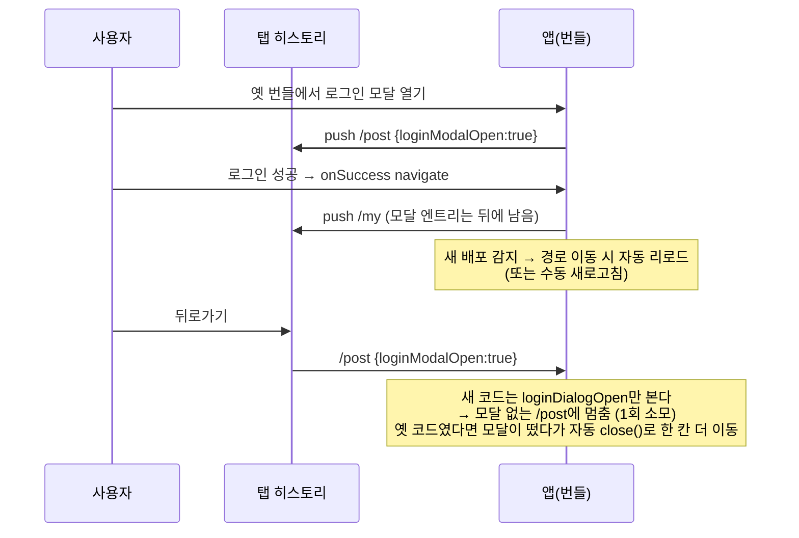
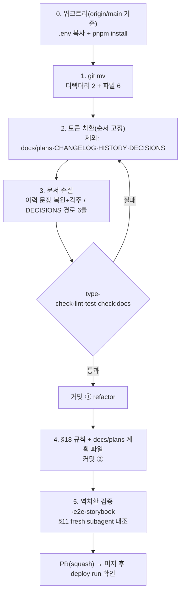

# Dialog/Modal/Alert 명칭 통일 — 식별자·경로만 개명하는 refactor

> 코드 식별자에서 창 자체는 `Dialog`, 성질은 `modal`, alert/confirm 전용은 `Alert`로 통일한다.
> 동작 변경 없음(히스토리 키 문자열 변경에 따른 일회성 부작용 1건만 있음, 아래 참고). PR 1개.

## Context

같은 종류의 UI를 코드에서 Dialog·Modal·Alert로 섞어 불러 헷갈린다. 업계 기준으로 이 셋은
동의어가 아니라 층위가 다르다(아래 인용은 2026-09-30 이전 세션 조사에서 재인용 — 구현 시
원문을 다시 열어 문구를 확인한 뒤 문서에 싣는다):

- Dialog = 창 자체 — [W3C APG Dialog (Modal)](https://www.w3.org/WAI/ARIA/apg/patterns/dialog-modal/):
  _"다이얼로그는 기본 창이나 다른 다이얼로그 창 위에 겹쳐진 창이다"_ (번역)
- modal = 성질(뒤쪽을 조작 불가로 만듦) — 같은 APG 문서,
  [NN/g Modal & Nonmodal Dialogs](https://www.nngroup.com/articles/modal-nonmodal-dialog/)
- AlertDialog = 특수한 dialog — [W3C APG Alert Dialog](https://www.w3.org/WAI/ARIA/apg/patterns/alertdialog/)
- 라이브러리: Radix는 `Dialog` + `modal` prop + 별도 `AlertDialog`. [MUI Modal 문서](https://mui.com/material-ui/react-modal/)는
  _"모달 다이얼로그를 만든다면 Dialog를 써라"_ (번역). [React Aria](https://react-aria.adobe.com/Modal)는
  `<ModalOverlay><Modal><Dialog>` 구조.

우리 코드는 Radix `Dialog` 기반 컴포넌트를 `*Modal`로 부른다. 제안 원본: 메모리
`dialog-naming-refactor-proposal`.

### 사전 조사 (2026-09-30, `origin/main` 기준)

- 로컬 `main`이 `origin/main`보다 4커밋 뒤처져 있다(미푸시 커밋 0). PR #262(북마크 모달)가
  이미 머지돼 `useBookmarkPostButton.ts`·`bookmarkFolderModalOpen` 키는 `origin/main`에만 있다
  → 워크트리는 `origin/main` 기준(`EnterWorktree` 기본값)으로 만든다.
- 규모(코드 = src·e2e·scripts·.storybook·.claude / 문서 = plans 제외):

| 묶음                  | 코드          | 문서         |
| --------------------- | ------------- | ------------ |
| 로그인                | 13파일 / 92줄 | 7파일 / 33줄 |
| 북마크                | 21파일 / 54줄 | 7파일 / 99줄 |
| `elements/modal` 경로 | 20파일 / 23줄 | 4파일 / 22줄 |

- 새 이름 충돌 검사: `loginDialog`·`folderDialog`만 기존에 있음 — `e2e/guest-guard.spec.ts`의
  지역 변수(이미 새 규칙대로 씀). 나머지 새 이름은 0건.

### 히스토리 키 변경의 부작용 (정정된 설명)

실행 중인 탭은 새로고침 전까지 옛 번들로 돌아 영향이 없다. 새 번들을 받은 뒤(수동 새로고침,
또는 `useNewVersionReload`의 경로 이동 시 자동 리로드) 옛 키가 든 히스토리 엔트리로 돌아올 때만
뒤로가기 1회가 "같은 페이지 머무름"으로 소모된다. 그 엔트리를 한 번 지나가면 끝난다.

## 판단이 필요했던 항목

| 항목                                 | 결정                                                                                  | 근거·기각한 대안                                                                                                                                                                                                                  |
| ------------------------------------ | ------------------------------------------------------------------------------------- | --------------------------------------------------------------------------------------------------------------------------------------------------------------------------------------------------------------------------------- |
| 한국어 산문의 "모달"                 | **식별자만 규칙 적용, 산문 허용** (사용자 확정 2026-09-30)                            | 사용자 화면(`texts.ts`) 0건, 전부 개발자용. 산문까지 바꾸면 +약 240줄로 rename 리뷰가 흐려짐. 인용 출처는 영어 용어 정의이지 한국어 표기 규정이 아님. 산문 속이라도 백틱 식별자는 바꾼다                                          |
| `Alert.tsx`의 `role="alertdialog"`   | **별도 PR** (사용자 확정)                                                             | role 변경 = 스크린리더 안내가 바뀌는 동작 변경. 확인창을 `getByRole('dialog')`로 찾는 e2e 6개 스펙 11줄도 바뀜 → "이름만" 전제와 충돌                                                                                             |
| 규칙을 넣을 절                       | **`FE-ARCHITECTURE.md` §18 "네이밍 컨벤션"**                                          | 지시문의 §16은 실제로 "Form 컴포넌트 구조"다                                                                                                                                                                                      |
| DECISIONS.md 과거 항목의 `src/` 경로 | **경로 토큰만 새 경로로 갱신 + "(2026-09-30 개명)" 메모, 서술·옛 식별자는 그대로**    | `scripts/check-docs.js`는 DECISIONS.md에서 bare 경로만 면제하고 `src/` 경로는 존재 검사한다 → 그대로 두면 `check:docs` 실패. 선례 #228(`0747a88`): _"판단 근거 서술은 그대로 유지, 경로만 갱신"_. 기각: 원문 완전 유지(검사 실패) |
| 현행 문서 속 "과거 개명 이력" 문장   | **옛 이름 유지 + "(현재 `신규`)" 각주**. 현재 구조를 서술하는 문장만 새 이름으로 치환 | 선례 `docs/plans/2026-09-08-bookmark-modal-rename.md` §3. 기각: 일괄 치환(“A→B로 개명했다”가 사실과 달라짐). 단 경로 토큰은 check:docs 때문에 이력 문장에서도 새 경로로(#228 방식)                                                |
| CHANGELOG                            | **항목 추가 안 함**, 과거 항목(Unreleased 포함)도 그대로                              | `changelog-release` skill: 동작 불변 refactor는 대상 아님. 기존 `### Notes` 6건은 전부 "BE API 의존" 용도. check-docs.js도 CHANGELOG를 *"역사 기록"*으로 경로 검사에서 뺌. 부작용은 PR 본문·커밋 메시지 "영향 범위"에 적는다      |
| 히스토리 키 문자열                   | **지시대로 바꾼다** (`loginDialogOpen`, `bookmarkFolderDialogOpen:${postId}`)         | 부작용은 일회성·뒤로가기 1회. 기각: 키 문자열만 옛 값 유지(부작용 0이지만 규칙과 다른 문자열이 영구히 남음)                                                                                                                       |
| 테스트 ID `modal-open`               | `useProtectedNavigate.test.tsx`만 **`login-dialog-open`**으로                         | 나머지 3개 테스트 파일이 쓰는 `login-modal-open`→`login-dialog-open`과 통일. `dialog-open`은 이번 diff에 들어가는 `atoms/dialog.tsx`·`dialog.test.tsx` 주석의 `dialog-open-click-guard`와 겹쳐 역치환 검증을 오염시킴             |
| 커밋 구성                            | **2커밋**: ① 개명(코드+문서 경로) ② §18 규칙 + 계획 파일                              | "`git mv`만 담은 커밋"은 pre-commit의 `pnpm type-check`가 import 깨짐으로 막는다. ①만 따로 열면 순수 개명 diff만 보인다. PR은 squash 병합                                                                                         |
| "이름만 바뀌었다" 증명               | **역치환 검증 스크립트**(검증 방법 참고)                                              | 새 내용에 신규→기존 역치환을 적용해 `origin/main`의 옛 내용과 비교 → 허용 목록 외 차이 0이어야 한다. 기각: 눈으로 diff 검토만(수백 줄에서 동작 변경을 놓칠 수 있음)                                                               |

### 뒤집힌 전제

| 발견                                                                    | 그래서 바뀐 것                                                      |
| ----------------------------------------------------------------------- | ------------------------------------------------------------------- |
| 로컬 `main`이 4커밋 뒤처짐, 북마크 대상은 `origin/main`에만 있음        | 모든 집계·작업 기준을 `origin/main`으로                             |
| 지시문의 §16은 Form 절                                                  | 규칙을 §18에                                                        |
| check:docs가 DECISIONS.md의 `src/` 경로를 검사                          | "DECISIONS 과거 항목 유지"를 "경로 토큰만 갱신"으로 좁힘(#228 선례) |
| 부작용 트리거는 "배포 순간"이 아니라 "새 번들 로드 후 옛 엔트리 재방문" | PR 본문 문구 정정                                                   |
| 매핑에 없던 식별자 5종(아래 표 ⑩~⑬, e2e 파일명)                         | 치환 대상에 추가                                                    |

## 세부 계획

### 0. 준비

- `git log origin/main..main`(재확인) → `EnterWorktree`(이름 예: `dialog-naming`) →
  `cp ../../../.env .` → `pnpm install` → `node -v`가 v24인지 확인
- `.gitmessage`를 읽고 커밋 형식을 맞춘다

### 1. 이동 (`git mv`)

| 위치                                     | 기존                                                  | 신규                                       |
| ---------------------------------------- | ----------------------------------------------------- | ------------------------------------------ |
| `src/widgets/layout/`                    | `login-modal/`                                        | `login-dialog/`                            |
| `src/widgets/layout/login-dialog/hooks/` | `useLoginModal.ts`                                    | `useLoginDialog.ts`                        |
| `src/widgets/layout/login-dialog/ui/`    | `LoginModal.tsx`, `LoginModal.test.tsx`               | `LoginDialog.tsx`, `LoginDialog.test.tsx`  |
| `src/shared/store/`                      | `loginModal.store.ts`                                 | `loginDialog.store.ts`                     |
| `src/features/bookmark/toggle/ui/`       | `PostCardBookmarkFolderModal{,.test}.tsx`             | `PostCardBookmarkFolderDialog{,.test}.tsx` |
| `src/features/bookmark/toggle/hooks/`    | `usePostCardBookmarkFolderModal.ts`                   | `usePostCardBookmarkFolderDialog.ts`       |
| `src/features/bookmark/select/ui/`       | `BookmarkFolderSelectModal.tsx`                       | `BookmarkFolderSelectDialog.tsx`           |
| `src/shared/ui/elements/`                | `modal/` (alert·image-viewer·SheetDialogContent 포함) | `dialog/`                                  |
| `e2e/`                                   | `bookmark-folder-modal.spec.ts`                       | `bookmark-folder-dialog.spec.ts`           |

### 2. 토큰 치환 (대소문자 구분, 위에서부터 순서대로)

대상: 추적 파일 전체. **제외**: `docs/plans/**`, `CHANGELOG.md`, `docs/HISTORY.md`(자동 생성),
`docs/DECISIONS.md`(3단계에서 경로 6줄만 수동).

| #   | 기존                                                            | 신규                                                              | 덮는 식별자(예)                                                                                    |
| --- | --------------------------------------------------------------- | ----------------------------------------------------------------- | -------------------------------------------------------------------------------------------------- |
| ①   | `PostCardBookmarkFolderModal`                                   | `PostCardBookmarkFolderDialog`                                    | `usePostCardBookmarkFolderModal`, `…Props`, `UsePostCardBookmarkFolderModalParams`, describe 제목  |
| ②   | `BookmarkFolderSelectModal`                                     | `BookmarkFolderSelectDialog`                                      | `…Props`, import 경로                                                                              |
| ③   | `bookmarkFolderModalOpen`                                       | `bookmarkFolderDialogOpen`                                        | `useBookmarkPostButton.ts`의 히스토리 키                                                           |
| ④   | `bookmark-folder-modal`                                         | `bookmark-folder-dialog`                                          | e2e 파일명 참조(`docs/BOOKMARK.md` 등)                                                             |
| ⑤   | `LoginModal`                                                    | `LoginDialog`                                                     | `useLoginModal`, `useLoginModalStore`, `LoginModalState`, `openLoginModal`, `LoginModalStateProbe` |
| ⑥   | `loginModal`                                                    | `loginDialog`                                                     | `loginModal.store`, 히스토리 키 `loginModalOpen`                                                   |
| ⑦   | `login-modal`                                                   | `login-dialog`                                                    | 디렉터리 경로, 테스트 ID `login-modal-open`                                                        |
| ⑧   | `elements/modal`                                                | `elements/dialog`                                                 | import·`vi.mock` 경로 문자열, 문서 경로                                                            |
| ⑨   | `Elements/Modal`                                                | `Elements/Dialog`                                                 | 스토리 제목 3개(SheetDialogContent·Alert·ImageViewer)                                              |
| ⑩   | `renderOpenModal` / `renderModal`                               | `renderOpenDialog` / `renderDialog`                               | 테스트 헬퍼                                                                                        |
| ⑪   | `closeModalOnLoginSuccess` / `runPendingActionAfterModalCloses` | `closeDialogOnLoginSuccess` / `runPendingActionAfterDialogCloses` | `useLoginDialog.ts`의 effect 함수명                                                                |
| ⑫   | `folderModal` (단어 단위)                                       | `folderDialog`                                                    | `e2e/bookmark-folder-dialog.spec.ts`, `e2e/bookmark.spec.ts` 지역 변수                             |
| ⑬   | `'modal-open'` (`useProtectedNavigate.test.tsx`만)              | `'login-dialog-open'`                                             | 테스트 ID + 같은 파일 주석 1줄                                                                     |

그대로 두는 것: `Alert`/`GlobalAlerts`/`alert.store`/`useAlert`/`openAlert`/`openConfirm`,
`SheetDialogContent`, `ImageViewer`, Radix `modal` prop(`dropdown-menu.tsx` 등),
`z-modal`/`--z-index-modal` 토큰과 `eslint.config.js` 메시지, `DesignTokens.stories.tsx`의
`token: 'modal'`, 한국어 산문의 "모달"(테스트 제목 포함).

### 3. 문서 손질

| 위치                                                                                                                                                                  | 변경 내용                                                                                                          |
| --------------------------------------------------------------------------------------------------------------------------------------------------------------------- | ------------------------------------------------------------------------------------------------------------------ |
| `docs/DECISIONS.md` (`origin/main` 기준 344·345·393·452·2093·2095행 — 착수 시 재확인)                                                                                 | `src/` 경로 토큰만 새 경로로 + "(2026-09-30 개명)" 메모. 서술·옛 식별자는 그대로                                   |
| `docs/BOOKMARK.md` 개명 이력 문장(약 446·520–524·988–994행)                                                                                                           | 2단계 치환을 되돌려 옛 이름 유지, 필요한 곳에 "(현재 `…Dialog`)" 각주. 과거 측정 기록(약 532·541행)도 옛 이름 유지 |
| `docs/CI-CHECK-GATE.md` 약 194행(“이후 …Modal.tsx로 개명”)                                                                                                            | 옛 이름 유지 + "(현재 `PostCardBookmarkFolderDialog.tsx`)"                                                         |
| `docs/CI-CHECK-GATE.md` 약 220행 "(현재 `…`)" 각주                                                                                                                    | 새 이름으로(치환 결과 그대로)                                                                                      |
| `docs/FE-ARCHITECTURE.md` §3 트리 약 182행                                                                                                                            | `LoginDialog(2026-09-29 features/auth/login에서 이동, 2026-09-30 LoginModal에서 개명 — …`                          |
| 나머지 현행 문서(`AUTH`·`FCM-PUSH-NOTIFICATION`·`PERFORMANCE`·`TESTING`·`UNSAVED-CHANGES-GUARD`·`DESIGN-SYSTEM`·`.claude/skills/*`·`.claude/commands/new-feature.md`) | 2단계 치환 결과 유지(현재 구조 서술)                                                                               |

판별 규칙: 문장이 과거 시점의 사건(개명·측정)을 서술하면 옛 이름을 유지하고, 현재 구조를
서술하면 새 이름을 쓴다. 경로 토큰(`src/…`, bare 레이어 경로)은 check:docs 때문에 어느 쪽이든
새 경로로 쓴다. 고친 문서의 "마지막 검토" 날짜는 바꾸지 않는다(전체를 다시 검토한 게 아니므로).

### 4. §18 규칙 추가 (커밋 ②)

`docs/FE-ARCHITECTURE.md` §18 표에 행 추가 + 표 아래 각주:

- 행: `Dialog / modal / Alert` | 창 자체(컴포넌트·훅·스토어·경로·히스토리 키)는 `Dialog`,
  "뒤를 조작 불가로 만드는" 성질은 `modal`(Radix `modal` prop, `z-modal` 토큰), alert/confirm
  전용은 `Alert`. 식별자에만 적용하고 한국어 산문의 "모달"은 허용 | `LoginDialog`,
  `useLoginDialogStore`, `elements/dialog/`, `modal={false}`, `useAlert`
- 각주: Context의 근거 4개(원문을 다시 열어 확인한 문구만 §10 형식으로, 확인 못 하면 재인용 표기) +
  "2026-09-30 도입, `Alert.tsx`의 `alertdialog` role은 별도 PR"
- `docs/plans/2026-09-30-dialog-naming-unification.md`(신규): 이 계획 스냅샷

## 영향 범위 (§5)

**CRUD 실패 지점**: 서버 데이터·API·스키마 변경 없음. 바뀌는 "데이터"는 클라이언트 `history.state`의
키 2종뿐이다.

- 생성(open) → 새 키로 push. 읽기(isOpen) → 새 키만 인식. 삭제(close = `navigate(-1)`) → 새 키 기준 가드
- 옛 번들이 남긴 엔트리는 인식하지 못함 → Context의 일회성 부작용. 탭마다 독립적이라 동시성 영향 없음

**기존 기능의 회귀 후보와 소유 파일**

| 회귀 후보                                             | 소유 파일                                                                                                                         | 확인 방법                                              |
| ----------------------------------------------------- | --------------------------------------------------------------------------------------------------------------------------------- | ------------------------------------------------------ |
| lazy import 경로 문자열                               | `src/app/routes/layouts/RootLayout.tsx`                                                                                           | type-check + e2e `guest-guard`·`protected-nav`         |
| `vi.mock` 경로 문자열(틀리면 실제 모듈이 조용히 쓰임) | `src/features/account/delete/hooks/useDeleteAccount.test.tsx` 등                                                                  | 잔존 grep 0건 + `pnpm test`                            |
| 히스토리 키 6곳(열기 4·읽기 1·북마크 1)               | `useAuthGuard.ts`, `useProtectedNavigate.ts`, `Navbar.tsx`, `useLoginDialog.ts`, `useBookmarkPostButton.ts`, `ProtectedRoute.tsx` | 유닛 테스트 4파일 + e2e                                |
| 스토리 ID(`shared-ui-elements-modal-*`→`-dialog-*`)   | 스토리 3파일                                                                                                                      | 외부 참조 0건 확인됨 + storybook 빌드 인덱스           |
| e2e 셀렉터                                            | `getByRole('dialog')` 기반이라 이름과 무관                                                                                        | `pnpm test:e2e`                                        |
| 문서 경로·줄 참조                                     | `scripts/check-docs.js` 대상 문서                                                                                                 | `pnpm check:docs`                                      |
| 청크 파일명(`LoginModal-*.js`→`LoginDialog-*.js`)     | 빌드 산출물                                                                                                                       | 배포마다 해시가 바뀌는 것과 같은 조건이라 새 위험 없음 |
| 이전 계약을 적은 문서                                 | `docs/AUTH.md`, `docs/BOOKMARK.md`, `docs/FE-ARCHITECTURE.md` 등                                                                  | 3단계 문서 손질                                        |

배포 순서: FE 단독, BE 영향 없음.

## 검증 방법

1. `pnpm check`(type-check + lint + format:check), `pnpm test`, `pnpm check:docs`
2. `pnpm test:e2e`(chromium + mobile-chrome), `pnpm test:storybook`
3. Storybook 경로: `pnpm build-storybook` → `storybook-static/index.json`에서
   `shared-ui-elements-dialog-{alert,imageviewer,sheetdialogcontent}--*` 존재·`-modal-` 0건 확인
4. 잔존 grep: `git grep -nE 'LoginModal|loginModal|login-modal|BookmarkFolderSelectModal|PostCardBookmarkFolderModal|bookmarkFolderModal|bookmark-folder-modal|elements/modal|Elements/Modal|renderModal|renderOpenModal|folderModal|ModalOnLogin|AfterModalCloses' -- . ':!docs/plans' ':!CHANGELOG.md' ':!docs/HISTORY.md' ':!docs/DECISIONS.md'`
   → 3단계에서 의도적으로 남긴 이력 문장만 나와야 한다
5. **역치환 검증**(스크래치패드 스크립트, 커밋 안 함): 커밋 ①의 `git diff -M --name-status origin/main`
   각 파일에 대해 새 내용에 2단계 표의 신규→기존 역치환을 적용하고 `origin/main`의 옛 경로 내용과
   `diff`. 허용 목록(DECISIONS 6줄 메모, 이력 각주, `⑬` 테스트 ID) 외 차이 0이어야 한다. 이동 파일은
   `git diff -M --stat`로 rename 인식 확인. 결과를 PR 본문에 붙인다
6. §11: fresh `general-purpose` 서브에이전트에 커밋한 계획 파일 + diff를 주고 계획 대비 구현 대조 →
   PR 본문 `## 계획 대비 구현`
7. PR 본문: 부작용(Context의 정정된 설명), 역치환 결과, a11y 후속 예고. CI `Storybook a11y`가 실패하면
   로그에 `optimized dependencies changed. reloading`이 있는지 먼저 확인(기존 간헐 실패)
8. 머지(`gh pr merge <번호> --squash`) 후
   `gh run list --branch main --workflow "Frontend Deploy (S3 + CloudFront)"`로 해당 SHA success 확인 뒤 보고

## 남은 것

- `Alert.tsx`의 `role="alertdialog"`(또는 미사용 `@radix-ui/react-alert-dialog` 채택) — 별도 PR,
  e2e 6개 스펙 셀렉터 11줄 동반
- 머지 후 메모리 `dialog-naming-refactor-proposal`을 "완료 + a11y 후속 남음"으로 갱신(MEMORY.md 한 줄 포함)
- 워크트리는 사용자 요청 전까지 `ExitWorktree(keep)`
