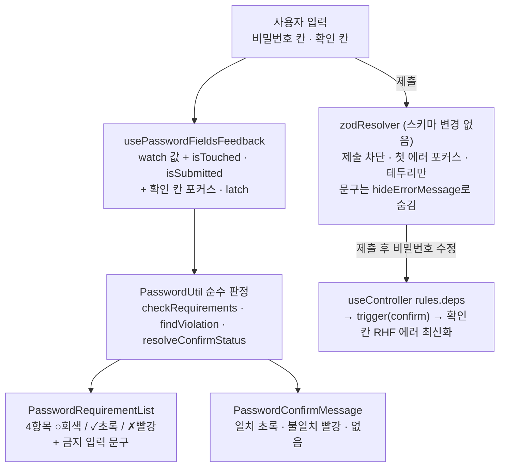
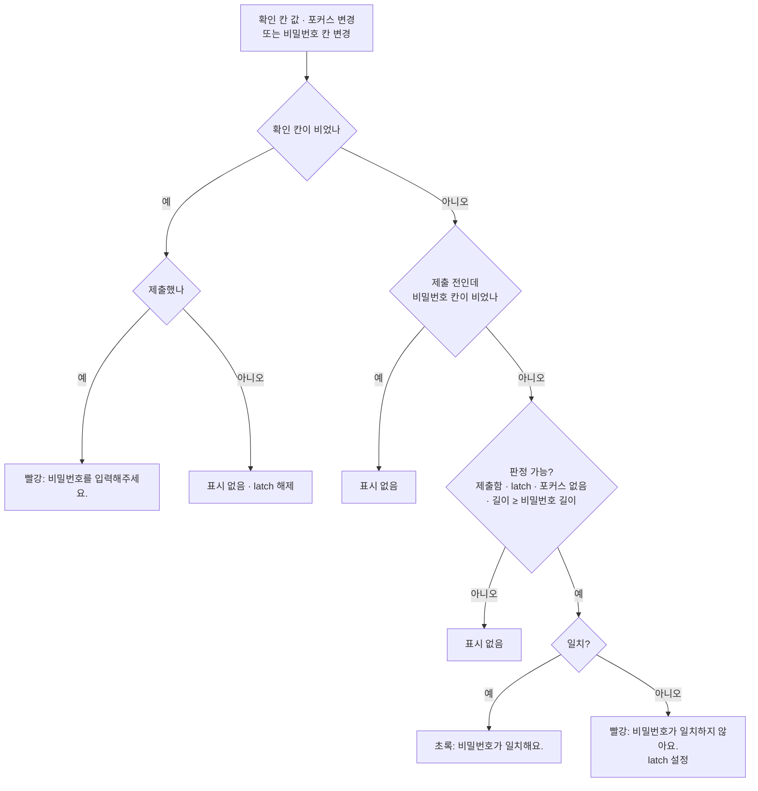

# 비밀번호 요구사항·확인 일치 실시간 표시

> 비밀번호를 새로 만드는 3개 폼(회원가입·재설정·변경)에 조건별 체크리스트와 확인 칸 일치
> 표시를 실시간으로 붙인다. 비밀번호 정책·스키마·API 계약은 바꾸지 않는다. FE 단독, PR 1개.

## Context

### 문제

- 닉네임·이메일은 입력하면 500ms 뒤 서버 조회 결과(초록 "사용 가능" / 빨강 "중복")가 뜬다
  (`useAvailabilityCheck.ts:23`, `SignUpForm.tsx:42-51`). 비밀번호는 `mode: 'onSubmit'`
  (`useSignUp.ts:31`)이라 **제출 전엔 아무 결과도 없다** — 고정 안내문 한 줄뿐(`SignUpForm.tsx:107`).
- 8자·영문·숫자·특수문자가 정규식 하나(`auth.schema.ts:10`)라 어떤 조건이 빠졌는지 알 수 없다.
  zodResolver는 필드당 첫 issue만 쓰므로(`@hookform/resolvers/zod/src/zod.ts:42`) 짧은 `'한글'`을
  제출하면 ASCII 문구가 아니라 조합 문구가 뜬다.
- **이미 있는 결함**: 제출 후 비밀번호 칸만 고치면 확인 칸의 "일치하지 않아요"가 남는다 — RHF가
  재검증 결과를 바뀐 필드 이름에만 반영한다(`react-hook-form/dist/index.esm.mjs:1874-1879`, 소스
  확인). [Baymard 2024](https://baymard.com/blog/inline-form-validation)가 L.L. Bean 실패 사례로
  든 모양과 같다.
- 같은 스키마·같은 폼 구조가 재설정(`ConfirmPasswordResetForm.tsx`)·변경(`ChangePasswordForm.tsx`)에도 있다.

### 리서치 요약 (상세·기각 대안은 구현 시 `docs/AUTH.md`에 기록)

- 일반 필드는 "칸을 벗어난 뒤 검증"이 정석이지만 새 비밀번호는 예외로 보는 쪽이 다수다.
  Wroblewski의 실험([A List Apart 2009](https://alistapart.com/article/inline-validation-in-web-forms/))은
  입력 중 검증(짧은 지연)이 _"안전한 비밀번호의 형식처럼 경계가 엄격한 질문에 가장 잘 맞았다"_ (번역)고
  했고, NN/g Krause([가이드라인](https://www.nngroup.com/articles/errors-forms-design-guidelines/))는
  _"새 비밀번호처럼 복잡한 입력에서는 입력하는 동안 나타나는 즉시 인라인 검증이 추측을 막아준다"_ (번역, 생략)고 쓴다.
  GOV.UK([Passwords 패턴](https://design-system.service.gov.uk/patterns/passwords/))는
  _"더 연구가 필요하다"_ (번역)며 유보한다.
- 틀리기 전에 빨강을 띄우면 안 된다 — NN/g Kaplan([링크](https://www.nngroup.com/articles/hostile-error-messages/)):
  _"입력 중 에러 메시지는 부당한 꾸지람처럼 느껴진다"_ (번역). 그래서 "reward early, punish late"
  ([Konjević](https://medium.com/wdstack/inline-validation-in-forms-designing-the-experience-123fb34088ce), Wayback 확인).
- NN/g Sherwin([링크](https://www.nngroup.com/articles/password-creation/))은 요구사항을 필드 선택 중 내내
  보이게 하고, 통과 개수를 보여주는 체크리스트는 _"강도 미터와 같은 게 아니다"_ (번역)라고 구분한다.
- 실서비스 직접 관찰: Apple(체크리스트, 빨강은 blur 시), Dropbox(체크리스트, 첫 글자부터 빨강),
  Google(제출 시 한 줄). 확인 칸 일치 **성공 문구를 띄우는 곳은 관찰한 6곳 중 0곳** — 이번 초록 성공
  문구는 업계 선례가 아니라 이 앱의 닉네임·이메일 "사용 가능" 톤과 맞추는 선택이다(사용자 선택).

### 전체 흐름

## 판단이 필요했던 항목

| 항목                     | 결정                                                                                                                                                                                                                                       | 근거·기각한 대안                                                                                                            |
| ------------------------ | ------------------------------------------------------------------------------------------------------------------------------------------------------------------------------------------------------------------------------------------ | --------------------------------------------------------------------------------------------------------------------------- |
| 요구사항 표시            | **항상 보이는 체크리스트** (2026-09-30 사용자 선택)                                                                                                                                                                                        | 포커스 시 펼침(Apple·Dropbox): 아래 칸이 밀리고 blur 순간 클릭 대상이 이동. 한 줄 안내+에러: 어떤 조건이 빠졌는지 안 보임   |
| 확인 칸                  | **일치는 즉시 초록, 불일치는 늦게** (사용자 선택)                                                                                                                                                                                          | 불일치만(Apple·Google): 닉네임·이메일과 톤이 다름. 매 키 즉시: 첫 글자부터 빨강(NN/g Kaplan)                                |
| 범위                     | **3곳 모두** (사용자 선택)                                                                                                                                                                                                                 | 회원가입만: 같은 규칙인데 화면마다 피드백이 달라짐                                                                          |
| 표시 상태의 출처         | 입력값에서 직접 계산, RHF 에러는 제출 차단·포커스·테두리만                                                                                                                                                                                 | `useSignUp.ts:61-80`의 setError 선례: 비동기 서버 결과용. 동기 판정에 쓰면 effect 2개 + `isSubmitted` 가드 필요             |
| 규칙 단일 출처           | 스키마 그대로 + `PasswordUtil.isValid ≡ schema.safeParse().success` 차등 테스트 (#270 `ec389cd` 형태)                                                                                                                                      | 스키마를 규칙 목록에서 조립: 에러 문구 순서·`auth.schema.test.ts` 단언이 바뀌고 확정된 정책 코드를 건드림                   |
| 확인 칸 재검증           | `useController` `rules.deps`                                                                                                                                                                                                               | effect에서 `trigger`: 제출 전 호출 시 RHF 에러가 일찍 떠서 가드 필요. deps는 제출 후에만 실행됨(소스 `:1854` vs `:1897`)    |
| 배치                     | 판정·훅·표시 UI는 `entities/auth`, shared에는 범용 opt-in prop만                                                                                                                                                                           | shared 범용 체크리스트 + 규칙 주입: prop 비대화, 3곳에 같은 연결 코드. features끼리는 import 불가                           |
| 확인 칸 판정 기준        | **포커스 기반** (벗어나는 그 시점에 판정)                                                                                                                                                                                                  | touched 기반: 빈 확인 칸을 Tab으로 지나간 뒤 첫 글자에 바로 빨강                                                            |
| 한글을 "특수문자"로 인정 | **인정 안 함** — 체크리스트의 특수문자 = 출력 가능 ASCII 중 영숫자 아닌 것(공백 포함, 현 정책 그대로)                                                                                                                                      | 현 정규식대로면 한글 입력 시 ✓와 ASCII 위반 문구가 동시에 뜸. 전체 통과 여부는 스키마와 수학적으로 동치(차등 테스트로 보증) |
| 세부 동작                | ① latch는 불일치를 보여준 경우에만 ② 빈 비밀번호 칸을 blur만 하면 회색 유지 ③ 빈 값 제출 시 "비밀번호를 입력해주세요." + 4항목 빨강 ④ 비밀번호가 빈 채 확인 칸 먼저 입력 시 표시 없음 ⑤ 비ASCII와 65자 초과 동시 해당 시 비ASCII 문구 우선 | 이 계획 승인으로 확정                                                                                                       |
| 스크린리더 낭독          | 항목 sr 문구("충족"/"미충족")는 상태가 바뀔 때만 변경, 디바운스 없음. 위반·확인 문구는 `aria-live="polite"`                                                                                                                                | 설계안의 500ms 디바운스: 상태 전환은 입력당 최대 몇 번뿐이라 과함. 실측(검증 7)에서 과다 낭독이면 그때 추가                 |

### 확인 칸 판정 (순수 함수 `PasswordUtil.resolveConfirmStatus`)

비밀번호 체크리스트 항목: 충족 → ✓초록 / 미충족이고 (제출함 또는 blur 이력+값 있음) → ✗빨강 / 그 외 ○회색.
금지 입력(비ASCII, 65자 이상)은 즉시 문구.

### 시안 후보 (§9 — 컴포넌트 반영 전 승인)

구현 1단계에서 Artifact 미리보기 한 페이지로 나란히 보여주고 고른 뒤에만 반영한다: 체크리스트 배치
(2열 그리드 / 세로 목록 / 가로 한 줄) × 상태(초기·입력 중·blur 후 미충족·전부 충족·금지 입력·확인 칸
일치/불일치) × 라이트/다크. 실제 Tailwind 클래스와 `globals.css` 토큰(`text-success`,
`text-destructive`, `text-muted-foreground`)을 그대로 쓴다.

## 세부 계획

| 위치                                                                                                   | 변경 내용                                                                                                                                                                                                                                                                                   |
| ------------------------------------------------------------------------------------------------------ | ------------------------------------------------------------------------------------------------------------------------------------------------------------------------------------------------------------------------------------------------------------------------------------------- |
| `src/entities/auth/config/auth.const.ts` (신규)                                                        | `PASSWORD_MIN_LENGTH = 8`, `PASSWORD_MAX_LENGTH = 64` (선례: `category.const.ts`)                                                                                                                                                                                                           |
| `src/entities/auth/utils/auth.util.ts` (신규)                                                          | `export class PasswordUtil` — `checkRequirements`, `findViolation`, `isValid`, `resolveRequirementState`, `resolveConfirmStatus` (§23, 선례: `comment.util.ts`)                                                                                                                             |
| `src/entities/auth/utils/auth.util.test.ts` (신규)                                                     | 항목 판정 표, 확인 칸 판정 표, zod 차등 비교(길이 {0,1,7,8,9,63,64,65,100} × 조합 × 추가 문자 {공백·한글·이모지·`\t`·`\n`·백틱})                                                                                                                                                            |
| `src/entities/auth/hooks/usePasswordFieldsFeedback.ts` (신규)                                          | form + 두 필드명을 받아 watch·`getFieldState().isTouched`·`isSubmitted`·확인 칸 포커스·latch를 계산, UI prop 묶음과 `useId` id 반환                                                                                                                                                         |
| `src/entities/auth/hooks/usePasswordFieldsFeedback.test.tsx` (신규)                                    | RTL 시나리오: 초기, 입력 중 빨강 없음, blur 후 미충족만 빨강, 한글 즉시 문구, latch, 짧게 blur, **제출 전·후 비밀번호 수정 시 즉시 재판정 + RHF 에러 소거**, 빈 값 제출, `form.reset` 복귀, aria 속성                                                                                       |
| `src/entities/auth/ui/PasswordRequirementList.tsx` (신규)                                              | 표시 전용 `ul` 4항목(아이콘 `aria-hidden` + sr 상태 문구) + 위반·필수 문구 `
` (선례: `entities/user/ui/UserAvatar.tsx`)                                                                                                                                               |
| `src/entities/auth/ui/PasswordConfirmMessage.tsx` (신규)                                               | 판정 결과 한 줄 `
`, 비었을 때 `empty:sr-only`                                                                                                                                                                                                                         |
| `src/entities/auth/ui/*.stories.tsx` (신규)                                                            | 상태별 스토리                                                                                                                                                                                                                                                                               |
| `src/shared/ui/elements/form/_base/FormField.tsx`                                                      | opt-in `hideErrorMessage?: boolean` (기본 false)                                                                                                                                                                                                                                            |
| `src/shared/ui/elements/form/FormInputPassword.tsx`                                                    | `deps?`(→ `rules.deps`), `hideErrorMessage?`, `belowInput?: ReactNode`, `onBlur` 합성(`{...props}`가 `field.onBlur`를 덮어쓰던 문제 수정, `:41,45`)                                                                                                                                         |
| `FormField.stories.tsx`, `FormInputPassword.stories.tsx`                                               | 새 prop 스토리 추가 (같은 커밋 필수)                                                                                                                                                                                                                                                        |
| `src/shared/ui/elements/form/FormInputPassword.test.tsx` (신규)                                        | 문구 숨김, deps 재검증, onBlur 합성 후 touched 유지 + 호출자 핸들러 호출                                                                                                                                                                                                                    |
| `src/features/auth/signup/{hooks/useSignUp.ts, ui/SignUpForm.tsx}`                                     | 엔티티 훅 호출·반환, `passwordGuide` 제거, `belowInput` 연결                                                                                                                                                                                                                                |
| `src/features/auth/password-reset/{hooks/useConfirmPasswordReset.ts, ui/ConfirmPasswordResetForm.tsx}` | 같은 연결(필드 `newPassword`)                                                                                                                                                                                                                                                               |
| `src/features/auth/password-change/{hooks/useChangePassword.ts, ui/ChangePasswordForm.tsx}`            | 같은 연결(필드 `newPassword`), 테스트에 reset 후 초기화 단언 추가                                                                                                                                                                                                                           |
| `src/shared/config/texts.ts`                                                                           | 삭제: `descriptions.passwordGuide`(유일 키라 `descriptions` 전체). 추가: `auth.password.requirements.{minLength,letter,digit,special}`, `auth.password.confirmMatch`('비밀번호가 일치해요.'), `ariaLabels.passwordRequirement{Met,Unmet}`. 키 이름은 `texts-conventions` skill 확인 후 확정 |
| `.claude/skills/texts-conventions/SKILL.md:42`                                                         | `descriptions.passwordGuide` 트리 줄 교체                                                                                                                                                                                                                                                   |
| `e2e/signup.spec.ts`                                                                                   | 추가: 체크리스트 초기 노출·충족 전환, 한글 입력 시 문구, 불일치 후 비밀번호 수정 → "일치해요" + 불일치 문구 0개(제출 전·후)                                                                                                                                                                 |
| `docs/AUTH.md`                                                                                         | 비밀번호 입력 피드백 절 추가(동작·판정 표·리서치 근거와 기각 대안 §8·§10), 마지막 검토 날짜 갱신                                                                                                                                                                                            |
| `docs/FE-ARCHITECTURE.md` §16                                                                          | `FormInputPassword` 새 prop 한 줄                                                                                                                                                                                                                                                           |
| `CHANGELOG.md`                                                                                         | `[Unreleased]` Added 항목 (`changelog-release` skill)                                                                                                                                                                                                                                       |
| `docs/plans/2026-09-30-password-live-feedback.md` (신규)                                               | 이 계획 스냅샷 (§11)                                                                                                                                                                                                                                                                        |

바꾸지 않음: `auth.schema.ts`, `auth.schema.test.ts`, `LoginForm`, 탈퇴 폼, BE.

### 작업 순서

0. `git log origin/main..main` 재확인 → `EnterWorktree` → `cp ../../../.env . && pnpm install`, `node -v` = v24
1. §9 Artifact 미리보기 → 사용자 승인
2. const + util + 단위·차등 테스트 → 변이 확인(공백 제외 / MAX 63 / 한글 허용 각각 실패하는지) 기록
3. TEXTS 추가 → shared prop 확장 + 스토리 + 테스트
4. 엔티티 UI + 훅 + 통합 테스트
5. 세 폼 연결, `passwordGuide` 삭제
6. e2e → 문서·CHANGELOG·계획 스냅샷
7. `browser-verification` 녹화(3화면) → 커밋 → fresh general-purpose 서브에이전트로 계획 대비 구현 대조 → PR 본문 `## 계획 대비 구현`

## 영향 범위 (§5)

**CRUD**: 요청 payload·스키마·API 불변 — 가입(create), 재설정·변경(update) 모두 전송 데이터 동일. 배포 순서 제약 없음.

**회귀 가능 지점**

- `useSignUp.ts:116-121` `isSubmitDisabled` — 비밀번호를 보지 않으므로 그대로(검증 실패를 disabled로 막지 않는 CLAUDE.md 규칙과도 일치)
- `useSignUp.ts:42-45` `useUnsavedChanges` — 새 훅은 setValue 없음, trigger는 dirty 불변
- 이름 충돌: 로컬 `isSubmitted`(가입 성공 화면)와 RHF `formState.isSubmitted` — 훅은 RHF 값을 내부에서만 읽음
- `useChangePassword.ts:25` 성공 후 `form.reset` → 값·touched·isSubmitted 초기화, latch는 확인 칸 `''`로 해제
- `FormInputPassword` 사용처 6곳 — 새 prop 전부 선택값, `onBlur` 미전달 시 동작 동일(로그인·탈퇴 영향 없음)
- `e2e/signup.spec.ts:76` `getByText(passwordMismatch)` — `hideErrorMessage` 누락 시 문구 2개로 strict mode 실패(위험 1건)
- `TEXTS.validation.passwordRegex` — 스키마 메시지로 남지만 화면 표시처가 사라짐
- MyAccountPage에 폼이 여럿 — id는 `useId`로 충돌 방지

## 검증 방법

1. `pnpm type-check` → `pnpm test` → `pnpm lint` → `pnpm check:docs`
2. `pnpm test:storybook` (새·수정 스토리)
3. `pnpm test:e2e` (chromium + mobile-chrome)
4. 차등 테스트 변이 확인 3건이 각각 실패하는지 PR에 기록
5. **L.L. Bean 재현 테스트**: 수정 전 코드에서 "제출 후 비밀번호만 수정 → 확인 칸 에러 잔존"이 실패하고, 수정 후 통과하는지
6. `browser-verification` skill로 가입·재설정·변경 3화면 녹화(라이트·다크, 모바일 폭 포함)
7. 스크린리더 수동 점검(VoiceOver+Safari): 체크리스트 상태 전환 낭독 빈도, `empty:sr-only` live region 낭독 — 과다 낭독이면 디바운스 추가
8. BE 레포 docs에 FE 비밀번호 안내 문구를 서술한 곳이 없는지 grep

## 남은 것

- **NIST SP 800-63B-4**([링크](https://pages.nist.gov/800-63-4/sp800-63b.html))는 조합 규칙을 금지하고
  비밀번호 단일 인증 시 최소 15자를 요구한다 — 2026-09-28 확정 정책과 다름. 정책 재검토는 별도 결정.
- 공통 `FormField`에 id·`aria-describedby`·`aria-invalid` 연결이 없음(모든 폼) — 이번엔 새 코드 범위만.
- `PasswordInput.tsx:22` sr-only 문구가 영어 하드코딩('Show password') — TEXTS 미사용.
- 이메일 중복확인은 trim한 값으로, 폼 검증은 원값으로 해서 `" a@b.co "`가 "사용 가능" 후 제출 실패.
- `e2e/signup.spec.ts:8`, `e2e/signup-unsaved-changes.spec.ts:9`의 "20자 이하" 주석이 현 정책(64자)과 불일치.
