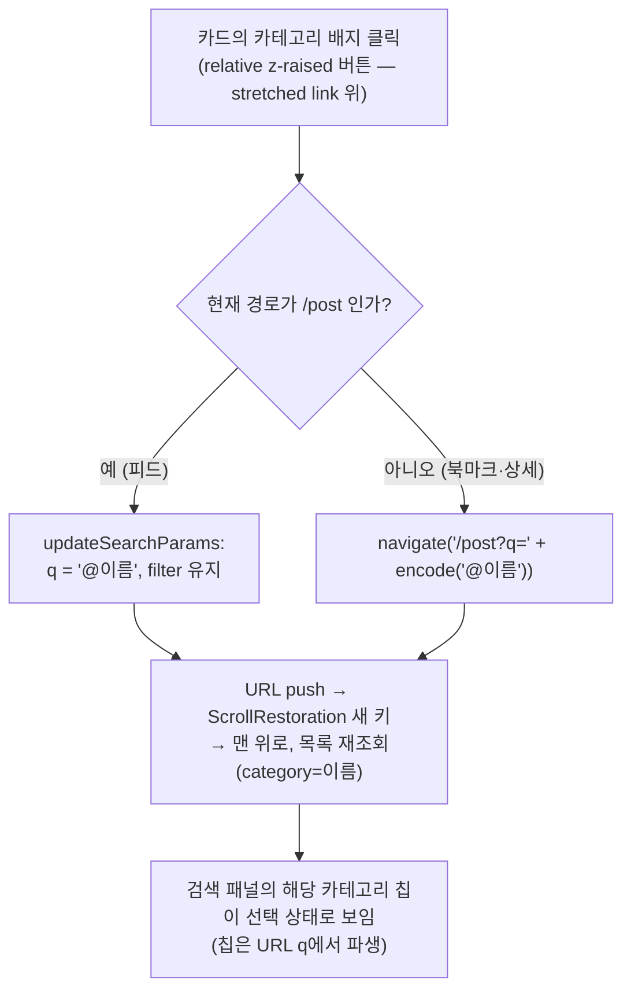

# 게시글 카드의 카테고리 배지 클릭 → 피드 카테고리 필터

## Context

PR #256(카드 전체 → 상세, stretched link)의 후속이다. 카드의 카테고리 배지는 지금 누르면
카드 전체 클릭의 일부로 상세로 간다. 사용자가 "카테고리 칩을 누른 것과 같은 기능"을 원했고,
조사 후 아래처럼 결정했다(2026-09-30).

**사용자 결정**

- 카테고리 배지 클릭 = **교체**: 검색어(`q`)를 `@이름` 하나로 바꾼다. 범위 칩(`filter`:
  북마크한/내 글/비공개)은 유지한다. 피드·북마크·상세 어디서 눌러도 같은 뜻("이 카테고리 글 보기").
  기각한 안: 칩과 동일한 토글 — 이미 그 카테고리로 필터 중일 때 카드에서 누르면 필터가 **풀려**,
  "이거 더 보기"라는 카드 클릭 의도와 반대로 동작한다.
- 태그: **변경 없음** — 지금처럼 누르면 상세로 간다(태그 전용 기능은 넣지 않는다).

## 흐름

## 재사용하는 것 (선례)

- **Navbar 검색 제출** `src/widgets/layout/navbar/ui/NavbarSearch.tsx:62-78` — `/post`면
  `useSearchParamsDraft().updateSearchParams`로 `q`만 교체(filter 보존), 아니면
  `navigate(`${ROUTES_PATHS.POST.ROOT}?q=…`)`. 이 형태를 그대로 따른다.
- 칩의 `label`은 BE `item.name` 그대로(`src/entities/category/api/category.api.ts:10`)라
  카드의 `category.name`으로 같은 `@이름`을 만든다. 파서는 `search-parser.ts`의 `parseSearchQuery`.
- 음수 마진으로 히트 영역은 키우고 레이아웃 기여분은 없애는 기법 — 같은 파일의 소유자 액션
  (`PostCard.tsx`, "음수 마진으로 아이콘 버튼(28/32px)이…" 주석).
- 배지 스타일은 `badgeVariants`(`src/shared/ui/atoms/badge.tsx`) + `CATEGORY_COLOR_CLASSNAME`을
  그대로 쓴다.

## 변경

1. **`src/widgets/post/post-card/hooks/usePostCard.ts`** — `handleCategoryClick(name: string)`
   추가. `useLocation().pathname`이 `ROUTES_PATHS.POST.ROOT`면
   `updateSearchParams(draft => draft.set('q', `@${name}`))`, 아니면
   `navigate(`${ROUTES_PATHS.POST.ROOT}?q=${encodeURIComponent(`@${name}`)}`)`.
2. **`src/widgets/post/post-card/ui/PostCard.tsx`** — 카테고리 `Badge`(div)를
   `Button variant="none"`으로 바꾸고, 안의 배지 모양은 `badgeVariants` + 색 클래스로 그린
   `span`으로 둔다(`div`는 `button` 안에 둘 수 없다). 버튼은:
   - `raisedClassName`(목록에서 stretched link 위로)
   - 히트 영역 24px 이상: `py-0.5 -my-0.5`(모양·줄 간격은 그대로, 누르는 영역만 확장).
     근거: [WCAG 2.2 — 2.5.8](https://www.w3.org/WAI/WCAG22/Understanding/target-size-minimum.html)
     _"최소 24×24 CSS 픽셀"_ (번역). 카드 전체가 링크 타깃이 되어 간격 예외도 받을 수 없다
     (겹치는 영역은 _"같은 동작을 하지 않으면 측정에서 제외"_ (번역)).
   - `aria-label`: 새 TEXTS 함수형 키(예: `TEXTS.ariaLabels.filterByCategory(name)`)
   - hover 표현: **구현 전에 Artifact 미리보기로 2~3안을 나란히 보여주고 고른다**(§9) —
     예: 없음(커서만) / 살짝 흐리게 / 테두리 링.
3. **`src/shared/config/texts.ts`** — 위 aria-label 키 추가.
4. 태그 영역은 건드리지 않는다.

## 영향 범위 (§5)

- CRUD: 데이터 변경 없음. 읽기 — 목록 쿼리 키에 `category`가 들어가 재조회된다(기존 칩과 같은 경로).
- 회귀 후보:
  - `e2e/post-card-click-area.spec.ts` "모든 버튼·링크가 가려지지 않는다" — 새 버튼도 자동 포함(승격 누락 시 실패)
  - 같은 스펙의 "태그 클릭 → 상세"는 그대로 통과해야 한다
  - 상세 진입 영역이 배지 면적만큼 줄어든다(사용자가 이미 받아들인 트레이드오프)
  - 뒤로가기: 피드에서 카테고리를 누르면 URL이 push되어 뒤로가기로 이전 필터·스크롤로 돌아간다(칩과 동일)
- 기존 한계(이번 범위 밖): 공백이 든 카테고리 이름은 파서가 공백에서 태그를 끊어 칩에서도
  똑같이 깨진다 — 이름에 공백이 있는지 구현 중 확인만 하고, 있으면 보고한다.

## 테스트·문서

- e2e(`e2e/post-card-click-area.spec.ts`에 추가):
  ① 피드에서 카테고리 클릭 → URL `q=@Frontend`, 목록 요청에 `category=Frontend`
  ② 범위 칩(`filter`)이 켜진 상태에서 눌러도 `filter` 유지
  ③ 상세 페이지에서 클릭 → `/post?q=@Frontend`로 이동
  ④ 이미 다른 검색어가 있을 때 → `q`가 `@Frontend` 하나로 교체
- `docs/SEARCH.md`(검색 기능 문서)에 "카드의 카테고리 배지로 들어오는 경로"와 교체 vs 토글
  비교·이유를 추가하고, 코드 지도 표에 한 줄 추가. 마지막 검토 날짜 갱신.
- `CHANGELOG.md` `[Unreleased] > Added`.
- 계획 파일을 `docs/plans/2026-09-30-post-card-category-filter.md`로 커밋(§11).
- `shared/ui/atoms`는 건드리지 않으므로 스토리 추가 대상이 아니다.

## 실행 순서

1. `git log origin/main..main` 확인 → `EnterWorktree`(새 이름) → `.env` 복사 + `pnpm install`
2. hover 미리보기 Artifact → 사용자 선택
3. 구현 → `pnpm type-check` / `pnpm test` / `pnpm lint` / `pnpm test:e2e` / `pnpm check:docs`
4. browser-verification 녹화(모킹 데이터): 피드 클릭 → 필터·맨 위 스크롤·칩 선택 상태,
   북마크·상세에서 클릭 → 피드 이동, 태그 클릭 → 상세, 뒤로가기
5. 사용자 승인 → 커밋 → fresh subagent 계획 대조 → PR → CI → (머지 지시 시) 배포 확인
