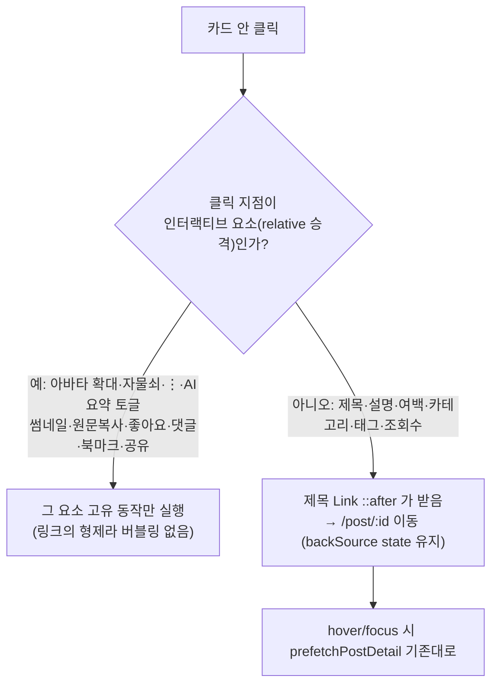

# 게시글 카드 전체를 상세 진입 영역으로 (stretched link)

## Context

목록(`PostList`·`BookmarkPostList`)에서 게시글 상세로 들어가는 경로가 제목 `Link`
(`PostCard.tsx:169`)와 댓글 버튼(`PostCard.tsx:316`) 두 곳뿐이다. 반면 카드 전체에 hover 시
떠오르는 효과(`PostCard.tsx:80`)가 있어 "전체가 눌린다"는 신호를 주고, 설명·여백·태그를
눌러도 아무 일이 없다. 사용자는 처음에 "제목 키우기"를 고민했으나, 늘어나는 면적이 한두 줄뿐이라
핵심 문제(여백 무반응)가 남는다.

**사용자 결정(2026-09-30)**: 카드 전체를 상세 진입 영역으로 넓히되, **버튼·댓글 등 다른 동작은
방해받지 않아야 한다.** 썸네일(원문 새 탭)도 "다른 동작"으로 보고 그대로 유지한다(A안).

근거:

- [NN/g — Cards](https://www.nngroup.com/articles/cards-component/): 카드의 _"어느 곳을 클릭하거나
  탭해도 상세 페이지로 연결"_ (번역), 부가 CTA 공존 가능.
- [Inclusive Components — Cards](https://inclusive-components.design/cards/): 카드 전체를 `<a>`로
  감싸지 말고 제목 링크의 `::after`를 카드 전체로 늘린다. 내부 버튼은 `position: relative`로 위에
  올린다. 단점: _"카드 안의 텍스트를 선택하기 어려워진다"_ (번역).

## 클릭 라우팅

## 변경 (단일 파일: `src/widgets/post/post-card/ui/PostCard.tsx`)

1. **제목 Link를 stretched link로** — `!isDetail`일 때만
   `after:absolute after:inset-0` 계열 클래스를 붙인다(Card는 이미 `relative`, L80).
   상세 페이지(`PostDetailPage.tsx:42`, `isDetail`)에서는 적용하지 않는다.
2. **인터랙티브 요소를 ::after 위로 승격** — `relative`(+필요 시 z 토큰)를 준다:
   작성자 `UserAvatar`(zoomable), 소유자 액션 묶음(L115), AI 요약 토글 박스(L221),
   썸네일 `<a>`(L249), 푸터의 좋아요/댓글 묶음(L309)·북마크/공유 묶음(L328).
   - 제목보다 DOM 앞에 있는 요소(아바타·소유자 액션)는 DOM 순서만으로는 ::after 아래에 깔리므로
     `z-raised` 토큰(`globals.css:101`)이 필요하다. 이때 수정 중 오버레이(L83, 역시 `z-raised`,
     Card 첫 자식)가 이들 아래로 깔리지 않도록 오버레이를 Card 마지막 자식으로 옮긴다
     (같은 z에서 DOM 뒤가 위). 하드코딩 z 값은 쓰지 않는다.
3. 제목의 기존 `hover:underline`은 유지 — 카드 어디에 hover해도 제목에 밑줄이 생겨 "누르면 이
   글로 간다"는 신호가 된다(추가 시각 변경 없음).
4. 드롭다운(⋮)·북마크 폴더 모달은 Portal(`dialog.tsx:59`, `dropdown-menu.tsx:171`)이라 ::after와
   겹치지 않는다 — 별도 조치 불필요.

## 사용자 체감 트레이드오프 (§7, 확인 필요)

- **설명·태그 텍스트를 드래그로 선택하기 어려워진다** — 그 위를 눌러도 상세로 가기 때문.
  이를 피하려고 설명을 승격하면 가장 넓은 텍스트 영역이 다시 무반응이 되어 목적과 충돌한다.
  → 기본안: 선택 불가를 수용(원문 링크는 썸네일 아래 복사 버튼으로 여전히 복사 가능).
- 부수 효과(이점): 카드 여백에서도 Cmd/Ctrl+클릭·가운데 클릭으로 새 탭 열기가 된다(진짜 `<a>`라서).

## 영향 범위 (§5)

- CRUD: 데이터 변경 없음. 수정 중 오버레이 순서만 이동 → 수정 중 dim·클릭 차단이 유지되는지 확인.
- 회귀 후보: `e2e/post-card-hover-menu.spec.ts`(⋮ 클릭), `post-card-footer-layout.spec.ts`,
  `bookmark-card-footer-layout.spec.ts`, `like.spec.ts`, `post-visibility.spec.ts`,
  `post-detail-back.spec.ts`(backSource). Playwright는 클릭 대상이 다른 요소에 가려지면 실패하므로,
  승격 누락은 이 스펙들이 잡는다.

## 테스트·문서

- e2e 추가(`e2e/post-card-click-area.spec.ts`, `post-list.spec.ts` 모킹 방식 본뜸):
  ① 설명 클릭 → `/post/:id` ② 카드 여백 클릭 → 상세 ③ 좋아요·북마크·⋮·썸네일 클릭 → URL 불변
  (썸네일은 새 탭 popup 발생) ④ 상세 페이지에서는 카드 여백 클릭해도 이동 없음.
- `docs/DECISIONS.md`에 UI/UX 근거(§8) 항목 추가 — 대안 A/B/C 비교와 채택 이유, 위 두 출처.
- `CHANGELOG.md` `[Unreleased]` 항목(changelog-release skill).
- 계획 파일을 `docs/plans/2026-09-30-post-card-stretched-link.md`로 커밋(§11).

## 검증

1. `pnpm type-check` → `pnpm test` → `pnpm lint` → `pnpm test:e2e`
2. browser-verification skill로 실제 브라우저 녹화: 데스크톱·모바일에서 여백/설명 클릭 → 상세,
   각 버튼 클릭 → 고유 동작만, 수정 중 오버레이 정상.
3. 워크트리에서 작업(`EnterWorktree` + `.env` 복사 + `pnpm install`), 사전에 `git log origin/main..main` 확인.
