# 규칙 준수 강화 Phase 3 — 배포 결과 감시, 파일명 훅 워크트리·BE 세션 대응, 응답 언어 실험, hookify 끄기

> 요약: push·PR 생성·병합한 SHA의 워크플로를 **백그라운드 훅이 감시하다 실패하면 세션을 깨운다**. 파일명 훅은 워크트리·BE 세션에서도 돌게 사용자 설정으로 옮기고 Node로 다시 쓴다. 응답 언어는 `language` 설정 하나로 14일 실험한다. hookify(규칙 0개인데 도구 호출마다 python 2회)는 끈다. 원 계획: `docs/plans/2026-09-29-rule-enforcement-hardening.md` "Phase 3~5 — 로드맵" 3행.
>
> 이 파일은 구현 PR에서 `docs/plans/2026-09-30-rule-enforcement-phase3.md`로 커밋한다(§11, 커밋 후 수정 금지). 판단 항목은 2026-09-30 사용자 답으로 확정했다.

## Context

### 왜 하는가

Phase 2가 도구 행동(git add·rm·편집)을 막았다. Phase 3은 원 계획이 "착수 시 결정"으로 남긴 네 가지다. 착수 조건은 "Phase 2 14일 지표"(2026-10-14 무렵)였지만 **2026-09-30 사용자 결정으로 앞당겼다** — Phase 3 항목은 Phase 2 목표 지표(M1·M2·M3·M4·M10)와 거의 겹치지 않는다. 10-14 대조는 예정대로 한다.

### 착수 시점 사실 (2026-09-30 직접 측정)

측정 방법: 트랜스크립트(`~/.claude/projects/-Users-baechan-project-link-sphere-link-sphere-*`, 08-31~09-30, 메인 192개·서브에이전트 696개)를 `rule-metrics.mjs`의 `classifyLanguage`·`shell-parse.mjs`의 `resolveSegments`로 읽기 전용 분석(Explore·Plan 서브에이전트, uuid 중복 제거). 워크플로 소요 시간은 `gh run list --limit 60`.

**① 파일명 훅 발동 0회 — 원인 확정**

- 설치(PR #172, 09-21 16:03Z) 이후 FE `src/`의 `.ts/.tsx` Write **65건 전부 워크트리 경로**, 메인 체크아웃 0건.
- 그중 훅이 검사할 수 있었던 건 **5건뿐**(세션을 워크트리에서 시작). 나머지:
  - 33건: FE 메인에서 시작한 세션 — `CLAUDE_PROJECT_DIR`가 메인이라 `filename-case-check.sh:48-51`의 `"${project_dir}/src/"*`에 워크트리 경로가 안 걸려 eslint 전에 exit 0. 합성 payload에 `bash -x`로 재현(50행 종료, 0.017초).
  - 27건: BE 워크트리 세션이 FE 워크트리에 쓴 것 — FE 프로젝트 settings 자체가 로드되지 않는다.
- 놓친 실제 위반 **1건**: 세션 b0ac1c3a, `errorToast.ts`·`errorToast.test.ts`(워크트리) → 5분 뒤 `pnpm lint`에서야 발견.
- 훅 문서(https://code.claude.com/docs/en/hooks)가 이 동작을 명시한다: `CLAUDE_PROJECT_DIR`는 세션을 시작한 루트에 머물고, 입력의 `cwd`만 워크트리를 따라간다.
- FE 워크트리 16개 모두 자기 `node_modules`가 있다. `pnpm`(`/opt/homebrew/bin`)은 node 셈이라 PATH에 nvm node가 있어야 돈다.

**② M5 영어는 "답변"이 아니라 "도구 호출 사이 서술"에 있다**

| 구분                                             | 영어 비율                                                  |
| ------------------------------------------------ | ---------------------------------------------------------- |
| 턴의 마지막 답변(final)                          | 3 / 1,323 (0.2%)                                           |
| 중간 서술(intermediate, 뒤에 도구 호출이 이어짐) | 1,951 / 14,244 (13.7%)                                     |
| 최근 7일 중간 서술                               | 25.6% (Sonnet 5 28.0%)                                     |
| 압축 세션 중간 서술                              | 압축 전 12.7% → 후 31.4% (최근 주의 상승과 겹쳐 인과 불명) |

- Sonnet 5 주간 추세(W36→W40): 9.3% → 11.7% → 9.6% → 15.2% → **27.5%**. Opus 5.5는 4.9% → 9.5%, Opus 5는 0~2.9%.
- **메인 스레드 모델**: Sonnet 5가 활동일 24일 전부에 등장, 최근 7일 블록의 86.8%. 사용자 설정 `"model": "opus[1m]"`과 달리 실제로는 대부분 Sonnet 5다.
- 최근 4일(09-27~) 최종 답변 394개 중 취소선 1건, 원문+번역 병기 5건.

**③ push·병합 뒤 워크플로 확인 — 기준선 83%**

- 30일간 push 649건(성공 634), `gh pr merge` 300건(성공 248). 하루 약 30건.
- main 반영 이벤트(main push + 병합, 성공분)의 **83%(260/314)** 가 같은 턴에 `gh run list|watch|view`·`gh pr checks`를 실행했다. FE 82%, BE 86%, 주별로 상승(W40 FE 39/43, BE 14/16). 명시적 main push는 66%. 한계: 그 확인이 해당 SHA의 성공을 봤는지는 판정하지 않았다.
- **PostToolUse는 실패한 Bash에서 발동하지 않는다**: Bash 오류 932건에 `PostToolUse:Bash` 기록 0건. 그런데 `gh pr merge` 오류 41건 중 약 25건은 워크트리에서 `--delete-branch`가 `'main' is already checked out`으로 exit 1 난 경우로, **원격 병합은 이미 성공**했다(main 반영 이벤트의 약 8%).
- 성공한 push 662건 중 238건(36%)은 husky pre-push의 테스트 출력 때문에 30KB를 넘었다 → push 출력에서 SHA를 읽는 방식은 취약하다.
- FE·BE `ci.yml`은 `concurrency.cancel-in-progress: true`라 연속 push 때 앞 run이 `cancelled`로 끝난다.

| 워크플로                | 평균  | 최대  |
| ----------------------- | ----- | ----- |
| FE CI(pull_request)     | 316초 | 923초 |
| FE Frontend Deploy      | 195초 | 316초 |
| FE Storybook Deploy     | 88초  | 130초 |
| BE CI                   | 90초  | 148초 |
| BE Deploy to AWS Lambda | 216초 | 236초 |

**④ hookify**

- FE 프로젝트 settings(`.claude/settings.json:29`)에서만 켜져 있고 규칙 파일은 어디에도 없다.
- 훅 4개(PreToolUse·PostToolUse·Stop·UserPromptSubmit)가 matcher 없이 걸려, **도구 호출마다 python3가 2번** 뜬다(1회 약 0.04초). 트랜스크립트에 hookify `hook_success` 기록 107,156건, `stop_hook_summary` 1,815건.

**⑤ 훅 문서에서 확인한 것**(https://code.claude.com/docs/en/hooks, https://code.claude.com/docs/en/settings-reference)

- `asyncRewake: true`: 백그라운드에서 돌고, exit 2로 끝나면 세션이 쉬고 있어도 Claude를 바로 깨운다(stderr가 시스템 리마인더로). exit 0이면 `additionalContext`가 다음 턴에 전달된다. `timeout`은 적용된다(command 기본 600초, 상한은 문서에 없음).
- 로컬 번들(v2.1.263)에서 백그라운드 실행 조건이 `async || (asyncRewake && <모드 조건>)`로 보여, **확장(stream-json 모드)에서는 asyncRewake가 동기로 돌 가능성**이 있다(코드 추론) → S3-1로 확인.
- `if` 필드는 권한 규칙 하나만 받고, 복합 명령의 하위 명령마다 검사한다. `PostToolUseFailure`에도 쓸 수 있다.
- `language`: 값을 _"항상 그 언어로 답하라"_ (번역)는 지시로 넘긴다. 모든 settings 파일에 둘 수 있다. 번들에서는 시스템 프롬프트 절로 들어가 압축 뒤에도 남을 것으로 추정(미검증).

### 전체 흐름

```mermaid
flowchart TD
  subgraph D["① 배포 결과 감시 — deploy-verify.mjs (사용자 설정, asyncRewake)"]
    P["Bash: git push · git -C x push · gh pr create · gh pr merge<br/>(PostToolUse, 병합은 PostToolUseFailure도)"] --> H["백그라운드 시작 — 도구 결과는 바로 반환"]
    H --> S{"link-sphere FE·BE인가, SHA 확정<br/>push: 원격 추적 ref · PR: gh pr view"}
    S -->|"아님·삭제·거부·up-to-date·미병합"| Q["exit 0 조용히 종료"]
    S --> K{"SHA 잠금 획득?"}
    K -->|"다른 감시가 보는 중"| Q
    K --> W["gh run list --commit SHA<br/>15초 간격 · 첫 run 최대 120초 대기"]
    W --> C{"전부 완료 + 30초 안정?"}
    C -->|"아니오"| W
    C --> M{"main SHA인가"}
    M -->|"예"| MD["배포 워크플로(고정 목록) 중 이 SHA가 안 돌린 것의<br/>main 최신 run이 failure로 남았는가"]
    M -->|"아니오"| R
    MD --> R{"failure·timed_out·startup_failure<br/>또는 내부 시한 초과?"}
    R -->|"예"| X["exit 2 → 세션 깨움<br/>실패 run · --log-failed 명령 · gh workflow run 명령"]
    R -->|"아니오 (cancelled·skipped는 중립)"| O["exit 0 + additionalContext<br/>다음 턴에 성공 요약"]
  end
  subgraph F["② 파일명 규칙 — filename-case-check.mjs (사용자 설정, Write)"]
    FW["Write *.ts/tsx"] --> FR{"repoOf가 FE인가<br/>루트 = 워크트리 루트 또는 메인"}
    FR -->|"아니오"| FQ["exit 0"]
    FR --> FE["루트의 node_modules/eslint로 그 파일 검사<br/>unicorn/filename-case 위반 → exit 2"]
  end
  subgraph L["③ 응답 언어 — language: korean (사용자 설정)"]
    L1["10-01 설정"] --> L2["10-14 M5 중간 서술 판정"]
    L2 --> L3{"판정 기준"}
    L3 -->|"유지"| L4["끝"]
    L3 -->|"부분 효과"| L5["2단계 SessionStart compact 한 줄 (별도 PR)"]
    L3 -->|"효과 없음·부작용"| L6["되돌림 + 모델 문제 재논의"]
  end
```

## 판단이 필요했던 항목

| 항목                                                                                   | 결정                                                                                                                                                                                                                                                   | 근거·기각한 대안                                                                                                                                                                                                                                                                                                    |
| -------------------------------------------------------------------------------------- | ------------------------------------------------------------------------------------------------------------------------------------------------------------------------------------------------------------------------------------------------------ | ------------------------------------------------------------------------------------------------------------------------------------------------------------------------------------------------------------------------------------------------------------------------------------------------------------------- |
| 배포 대기 방식 (**사용자 결정 2026-09-30**)                                            | **실패할 때만 깨우기**(`asyncRewake`). 성공은 다음 턴에 요약만 전달                                                                                                                                                                                    | 동기 대기는 하루 약 30건 × 3~15분 동안 세션이 멈춘다(FE CI 최대 923초 > 기본 timeout 600초). 스크립트만 두면 현행(규칙 + 83%)과 같다. 확장에서 asyncRewake가 동기로 돌거나 안 깨우면(S3-1) 멈추고 다시 묻는다. 기각: 끝날 때까지 기다림, 스크립트만                                                                 |
| reply-lint (**사용자 결정**)                                                           | **도입 안 함**, `rule-metrics.mjs`에 최종 답변 취소선·원문+번역 병기 카운터(M13) 추가                                                                                                                                                                  | Stop 훅은 마지막 답변만 본다. 영어의 99.8%는 중간 서술이라 M5를 못 줄인다. 취소선·병기는 394개 중 6건(1.5%)인데, 걸릴 때마다 답변 전체를 다시 써서 같은 내용이 두 번 보인다. 기각: 도입, 측정도 안 함                                                                                                               |
| 언어 실험 순서 (**사용자 결정**)                                                       | **순차**. 10-01 `language` 설정 → 10-14 판정. 기준은 "언어 실험" 절                                                                                                                                                                                    | 두 개를 동시에 바꾸면 효과를 가를 수 없다. 기각: 동시 적용, 압축 훅 먼저                                                                                                                                                                                                                                            |
| 언어 판정 기준 (**사용자 결정** — 처음 고른 상대 기준을 설계 검토 후 다듬어 다시 물음) | 세션별 중앙값 + 절대 기준. "언어 실험" 절                                                                                                                                                                                                              | 기준선이 주마다 오르는 중(9%→27%)이라 상대 감소는 평균회귀만으로도 나올 수 있고, 블록이 몇 세션에 몰려 블록 수 기준은 표본을 과대평가한다. 기각: 원안(블록 비율 상대 감소 50%·20%, 500블록)                                                                                                                         |
| 메인 스레드 모델 (**사용자 결정**)                                                     | **지금은 안 바꾼다**. 10-14에 모델별 결과를 보고 다시 판단                                                                                                                                                                                             | 모델을 같이 바꾸면 언어 설정 효과를 분리할 수 없다. 기각: link-sphere만 Opus 고정                                                                                                                                                                                                                                   |
| 감시 트리거                                                                            | PostToolUse `if` 세 개: `Bash(git push*)`·`Bash(git -C *)`·`Bash(gh pr *)`. PostToolUseFailure `Bash(gh pr *)` 하나. 최종 판정은 스크립트 파싱                                                                                                         | 실패한 Bash엔 PostToolUse가 안 뜨는데 병합 성공 + 브랜치 삭제 실패가 main 이벤트의 약 8%다. `if` 없이 모든 Bash에 걸면 하루 수백 번 node가 뜬다(hookify를 끄는 이유와 모순). `git -C x push`는 `Bash(git push*)`에 안 걸린다(Phase 0 S0-3). `gh pr create`는 PR을 push 뒤에 만들면 PR CI를 아무도 안 보는 빈틈 때문 |
| 중복 감시 방지                                                                         | SHA별 잠금(`os.tmpdir()/link-sphere-deploy-verify/<sha>`, 원자적 생성, 시한 지나면 무효, 끝나면 삭제)                                                                                                                                                  | 한 명령이 `if` 두 개에 걸리거나 push 뒤 PR 생성으로 같은 SHA를 두 번 볼 수 있다                                                                                                                                                                                                                                     |
| SHA 확정                                                                               | push: 명령의 원격·refspec(없으면 `@{push}`)으로 대상 ref를 정하고 push 뒤 `git rev-parse refs/remotes/<원격>/<대상>`. 출력은 삭제·거부·up-to-date 판별에만. PR: `gh pr view --json state,mergeCommit,baseRefName,headRefOid`                           | push 출력의 36%가 30KB를 넘는다. 원격 추적 ref는 fast-forward·강제·새 브랜치 모두 같은 방법으로 풀린다                                                                                                                                                                                                              |
| 실패로 볼 결론                                                                         | `failure`·`timed_out`·`startup_failure`만. `cancelled`·`skipped`·`neutral`은 중립                                                                                                                                                                      | CI가 `cancel-in-progress: true`라 연속 push마다 오경보가 난다                                                                                                                                                                                                                                                       |
| main에 실패로 남은 배포 검사                                                           | 배포 워크플로 **고정 목록**(FE `Frontend Deploy (S3 + CloudFront)`·`Storybook Deploy (S3 + CloudFront)`, BE `Deploy to AWS Lambda (SnapStart)`) 중 이 SHA가 돌리지 않은 것만, event push·workflow_dispatch, cancelled 제외 최신 1건이 failure면 깨운다 | 09-06 사고(docs만 고친 커밋이 경로 필터에 안 걸려 조용히 미배포) 유형이다. `--branch main` 전체를 보면 cron·repository_dispatch 워크플로 실패까지 걸린다. 기각: 검사 삭제                                                                                                                                           |
| 내부 시한                                                                              | 훅 `timeout` 1800초, 스크립트 시한은 그보다 60초 짧게. 시한 초과는 "아직 진행 중" + 확인 명령으로 깨운다                                                                                                                                               | FE CI 최대 923초. 상한이 600초로 판명되면(S3-1) 540초로 낮추고 시한 초과 안내에 의존                                                                                                                                                                                                                                |
| 새 훅 등록 층 (추천 기본값)                                                            | deploy-verify·filename-case-check 모두 **사용자 설정**. FE 프로젝트 settings의 filename 항목은 제거                                                                                                                                                    | BE 세션도 push하고 FE 파일을 쓴다(filename 대상 27/65). Phase 2 가드와 같은 층. 대가: 병합 뒤 FE 메인 pull + 붙여넣기 전까지 filename 훅이 꺼진다                                                                                                                                                                   |
| 구현 언어                                                                              | 둘 다 Node `.mjs` + `run-node.sh`. `filename-case-check.sh`는 `.mjs`로 교체(`git rm`)                                                                                                                                                                  | 사용자 설정이라 모든 프로젝트의 Write마다 돈다 → `repoOf` 문자열 판정으로 git 호출 없이 빠르게 거른다. eslint를 `process.execPath <루트>/node_modules/eslint/bin/eslint.js`로 직접 돌려 PATH의 node·pnpm·jq에 기대지 않는다. 판정 함수 단위 테스트가 된다. 원 계획의 `.sh` 이름·"경로 계산만"에서 벗어난다          |
| 스파이크 방식 (**사용자 결정**)                                                        | 스크래치패드의 빈 폴더(자체 `.claude/settings.json`)를 **Cursor 새 창**으로 열어 확인                                                                                                                                                                  | FE 메인 `settings.local.json`(allow 규칙 161개)을 고치면 실행 중인 FE 세션이 전부 즉시 다시 읽는다. JSON 한 글자 오류면 allowlist 전체가 무효가 되고, 스파이크 중 "항상 허용"을 누르면 파일이 다시 써져 백업 복원이 새 항목을 지운다. 기각: settings.local.json 임시 편집                                           |
| `language` 설정 층 (추천 기본값)                                                       | 사용자 설정 `"language": "korean"`                                                                                                                                                                                                                     | 전역 CLAUDE.md가 이미 "모든 대화는 한국어"다. FE·BE·모든 워크트리에 한 번에 적용, BE PR 불필요. 기각: FE·BE 프로젝트 settings                                                                                                                                                                                       |
| hookify 끄기 (추천 기본값)                                                             | FE `.claude/settings.json`의 `enabledPlugins`를 `false`로                                                                                                                                                                                              | 켜진 곳이 이 파일뿐이다. 설치 제거는 안 한다                                                                                                                                                                                                                                                                        |
| `*.test.mjs` CI 연결 (추천 기본값, #260에서 미룸)                                      | `ci.yml`에 `node --test .claude/hooks/*.test.mjs` 스텝                                                                                                                                                                                                 | 테스트 파일이 셋으로 는다. 설치 없이 몇 초                                                                                                                                                                                                                                                                          |
| M5 측정 정의 (추천 기본값)                                                             | `rule-metrics.mjs` M5를 최종/중간 × 모델 × 압축 전후로 나누고 세션 단위 비율도 낸다                                                                                                                                                                    | 기존 단일 비율은 모델 비중·최종 답변이 섞여 실험 효과를 못 가른다                                                                                                                                                                                                                                                   |
| Phase 2 가드 오탐 수정                                                                 | 착수 시점 사례 없음. 구현 중 나오면 그 수정을 먼저 한다                                                                                                                                                                                                | 사용자 지시(2026-09-30)                                                                                                                                                                                                                                                                                             |
| BE 변경                                                                                | 없음                                                                                                                                                                                                                                                   | 새 훅·`language`는 사용자 설정, hookify는 FE에서만 켜져 있다. 알림 메시지는 자체로 완결되게 쓴다                                                                                                                                                                                                                    |

### 뒤집힌 전제

| 발견                                                                               | 그래서 바뀐 것                                                                  |
| ---------------------------------------------------------------------------------- | ------------------------------------------------------------------------------- |
| filename 대상 Write 65건 중 27건은 BE 세션 — FE 프로젝트 settings가 아예 안 붙는다 | 경로 계산만 고쳐서는 부족 → 사용자 설정으로 옮기고 `.mjs`로 다시 쓴다           |
| 영어의 99.8%는 중간 서술이다                                                       | Stop reply-lint는 M5 대책이 아니다. M5를 최종/중간으로 나눈다                   |
| "기다려야 확인할 수 있다"                                                          | `asyncRewake`로 기다리지 않고 실패만 알릴 수 있다(확장 동작은 S3-1)             |
| 메인 스레드 기본 모델은 Opus(`opus[1m]`)                                           | 실제 블록의 87%가 Sonnet 5 → 언어 효과는 같은 모델끼리만 비교                   |
| PostToolUse는 명령이 실패해도 뜬다                                                 | 안 뜬다. 병합 성공 + 브랜치 삭제 실패를 놓치지 않게 PostToolUseFailure에도 등록 |
| push 출력에서 SHA를 읽으면 된다                                                    | 36%가 30KB를 넘는다 → 원격 추적 ref로 확정                                      |

## 세부 계획

**공통 원칙**: Phase 2와 같다 — fail-open, 메시지만 읽어도 다음 행동이 완결되게(사실 서술형), 각 훅은 별도 파일·별도 등록 항목(하나만 끌 수 있게), 새 훅에는 `node --test` 회귀 테스트.

**실행 순서**

1. S3-1 준비물 작성(스크래치패드) → 사용자가 새 창에서 실행 → 결과 판정. #1이 실패하면 멈추고 다시 묻는다
2. `git log origin/main..main` 확인 후 `EnterWorktree`(`rule-enforcement-phase3`) → `cp ../../../.env .` · `pnpm install`
3. 구현 → `node --test` → `pnpm type-check` · `pnpm test` · `pnpm lint` · `pnpm check:docs`
4. 이 계획을 `docs/plans/2026-09-30-rule-enforcement-phase3.md`로 커밋(새 파일은 `git add -- <파일>` 후 `git commit -m … -- <경로…>`)
5. fresh general-purpose 서브에이전트에게 §11 대조 → PR 본문 `## 계획 대비 구현`(S3-1 결과표·새 M5 기준선 포함)
6. **사용자 확인 후** `gh pr merge <번호> --squash` → main push 워크플로 결과 확인(`gh run list --commit <SHA>`) → FE 메인 pull 명령·붙여넣기 블록 전달
7. 사용자 적용 뒤 첫 실제 push·병합에서 발동 확인. 메모리 `rule-enforcement-rollout-status` 갱신(Phase 3 완료, 10-14 판정 두 건)

### 0단계 — 스파이크 S3-1 (구현 전, 레포·실제 설정 변경 없음)

Claude가 스크래치패드에 `s3-spike/`(자체 `.claude/settings.json` + 로그를 남기는 스크립트 + 붙여넣을 프롬프트 2개)를 만들고, **사용자가 Cursor 새 창으로 그 폴더를 열어 Claude 세션에서 프롬프트를 붙여넣는다**(약 15분, 대부분 대기). Claude는 로그 파일과 그 세션의 트랜스크립트를 읽어 판정한다.

| #   | 확인할 것                                                                      | 방법                                                                                     | 결과에 따라                                                                                    |
| --- | ------------------------------------------------------------------------------ | ---------------------------------------------------------------------------------------- | ---------------------------------------------------------------------------------------------- |
| 1   | asyncRewake가 도구 결과를 막지 않고, 쉬는 세션을 깨우는가                      | `echo S3A` → 훅이 20초 뒤 마커를 stderr로, exit 2. 프롬프트는 실행 직후 턴을 끝내게 한다 | 막히거나 안 깨우면 **멈추고 다시 묻는다**                                                      |
| 2   | exit 0 + `additionalContext`가 다음 턴에 오는가                                | `echo S3B` → JSON 출력, exit 0                                                           | 안 오면 성공 요약은 빼고 실패 알림만                                                           |
| 3   | `timeout` 600초 초과가 지켜지는가                                              | `echo S3T` → 700초 대기 후 exit 2, `timeout: 900`                                        | 600초 상한이면 내부 시한 540초                                                                 |
| 4   | PostToolUseFailure에서 asyncRewake가 돌고 입력에 `tool_input.command`가 있는가 | `echo S3F && false`                                                                      | 안 되면 병합+삭제 실패는 알려진 빈틈으로 남긴다                                                |
| 5   | 서브에이전트 안에서 발동한 훅이 누구를 깨우는가                                | general-purpose 서브에이전트에게 `echo S3S`                                              | 결과를 "영향 범위"에 기록                                                                      |
| 6   | 훅 PATH에 node·gh가 있는가                                                     | 모든 스크립트가 `PATH`·`command -v node gh pnpm jq`를 기록                               | gh가 없으면 `/opt/homebrew/bin/gh`·`/usr/local/bin/gh` 순으로 찾는다(구현에는 처음부터 넣는다) |
| 7   | 깨움이 트랜스크립트에 어떤 기록으로 남는가                                     | 스파이크 세션 jsonl                                                                      | M12 카운터 패턴에 반영                                                                         |

### FE PR (워크트리 `rule-enforcement-phase3`)

| 위치                                                                  | 변경 내용                                                                                                                                                                                                                                                                                                                                                                                                                                                                                                                                        |
| --------------------------------------------------------------------- | ------------------------------------------------------------------------------------------------------------------------------------------------------------------------------------------------------------------------------------------------------------------------------------------------------------------------------------------------------------------------------------------------------------------------------------------------------------------------------------------------------------------------------------------------ |
| `.claude/scripts/verify-deploy.mjs` (신규)                            | 감시 핵심 `watchSha({ sha, dir, repo, isMain, deadlineMs }, deps)`(`deps`로 gh 실행·시계 주입)와 CLI(`node .claude/scripts/verify-deploy.mjs <sha> [--dir <레포>] [--main]`, 실패 시 exit 1). `gh run list --commit <sha> --json databaseId,workflowName,status,conclusion,event,url` 15초 간격, 첫 run 최대 120초, 전부 완료 후 30초 안정이면 종료. 실패 결론 집합·배포 워크플로 고정 목록은 "판단" 표 그대로. gh는 PATH → Homebrew 경로 순으로 찾는다                                                                                          |
| `.claude/hooks/deploy-verify.mjs` (신규)                              | PostToolUse·PostToolUseFailure Bash 훅. `resolveSegments`로 link-sphere 레포의 `git push`(`--delete`·`-d`·`--dry-run`·`-n`·`--tags`·`--mirror`·`:dst` 제외)·`gh pr create`·`gh pr merge`(`-R` 유지) 세그먼트를 찾고, 실패 이벤트에선 `gh pr merge`만 본다. SHA 확정·잠금은 "판단" 표 그대로. 미병합(`--auto`·대기열)이면 안내 후 exit 0. 결과 메시지: `[deploy-verify]` + 레포·SHA·출처 + run별 결론·URL + `gh run view <id> --log-failed` / `gh workflow run "<이름>" --ref main` + "사용자에게 실패 경위를 함께 보고한다(CLAUDE.md 배포 규칙)" |
| `.claude/hooks/deploy-verify.test.mjs` (신규)                         | 가짜 gh·git·시계 주입. 세그먼트 판정(push 변형·`git -C`·삭제·dry-run·다른 레포·`gh pr create`/`merge`), SHA 확정(원격 추적 ref, `src:dst`, `@{push}`), 미병합, 잠금 중복, run 늦게 등장, 전부 성공, failure 1개, cancelled만(중립), 120초 동안 run 없음, 시한 초과, main에 failure로 남은 배포(고정 목록만, cron 워크플로 실패는 무시)                                                                                                                                                                                                           |
| `.claude/hooks/filename-case-check.mjs` (신규) + `.sh` 삭제(`git rm`) | `decideFilenameCheck({ filePath, cwd })`: `.ts/.tsx`만, `path.resolve(cwd, filePath)`, `repoOf`가 FE일 때만, 루트 = `worktreeRootOf` 또는 메인, `<루트>/src/` 아래·`<루트>/node_modules/eslint/bin/eslint.js` 있을 때만. `process.execPath`로 eslint `--format json` 실행(20초), `unicorn/filename-case` 위반이면 기존 문구(FE-ARCHITECTURE.md §18)로 stderr + exit 2                                                                                                                                                                            |
| `.claude/hooks/filename-case-check.test.mjs` (신규)                   | 판정 함수 단위(다른 레포·BE·`src/` 밖·`.md`·node_modules 없음 → 건너뜀, 워크트리·메인 → 대상) + 임시 `link-sphere_FE_NEW/.claude/worktrees/x/node_modules/eslint/bin/eslint.js`에 위반 JSON을 내는 가짜 스크립트를 두고 훅을 `spawnSync`로 실행 → exit 2                                                                                                                                                                                                                                                                                         |
| `.claude/hooks/run-node.sh` 머리말                                    | 사용자 붙여넣기 블록을 전체 hooks로 갱신: 기존 PreToolUse 두 항목 + PostToolUse(`matcher: "Bash"`, `if` 세 개 각각 `asyncRewake: true`·`timeout: 1800`·deploy-verify / `matcher: "Write"`, `timeout: 25`·filename-case-check) + PostToolUseFailure(`matcher: "Bash"`, `if: "Bash(gh pr *)"`, deploy-verify). `"language": "korean"` 한 줄 안내                                                                                                                                                                                                   |
| `.claude/settings.json`                                               | filename-case-check PostToolUse 항목 제거, `"hookify@claude-plugins-official": false`                                                                                                                                                                                                                                                                                                                                                                                                                                                            |
| `.claude/scripts/rule-metrics.mjs`                                    | **M5**: 턴의 마지막 text를 보류하다 tool_use가 오면 중간, 경계(tool_result가 아닌 모든 user 이벤트·`compact_boundary`·파일 끝)를 만나면 최종으로 확정. 분류는 중복 제거보다 먼저 하고 집계는 처음 본 블록만. 모델 × 최종/중간 × 압축 전후, 세션별 중간 서술 비율의 중앙값. **M12**: `filename-case-check.mjs`·`deploy-verify.mjs` 추가(옛 `.sh` 이름 유지), S3-1 #7 기록 형식 반영. **M13**: 최종 답변의 코드 밖 `~~`, `(번역:` 또는 영어 인용 뒤 한국어 괄호 건수                                                                               |
| `.github/workflows/ci.yml`                                            | `Run tests` 다음에 `node --test .claude/hooks/*.test.mjs`                                                                                                                                                                                                                                                                                                                                                                                                                                                                                        |
| `.claude/CLAUDE.md` 배포 규칙(Critical Rules "main에 push한 뒤…")     | "`deploy-verify.mjs`(사용자 설정 훅)가 push·PR 생성·병합한 SHA의 워크플로를 백그라운드로 감시하다 실패하면 세션을 깨운다. 성공을 확인하기 전 '배포됨' 보고 금지는 그대로" 한 문장                                                                                                                                                                                                                                                                                                                                                                |
| `docs/plans/2026-09-30-rule-enforcement-phase3.md` (신규)             | 확정한 이 계획                                                                                                                                                                                                                                                                                                                                                                                                                                                                                                                                   |

### 사용자 설정 (병합 후, 사용자 작업)

1. PR squash 병합 → `git -C /Users/baechan/project/link-sphere/link-sphere_FE_NEW pull --ff-only`(워크트리 세션은 실행 불가, 명령을 드린다)
2. `run-node.sh` 머리말 블록으로 `~/.claude/settings.json`의 `hooks`를 교체하고 `"language": "korean"` 추가(Claude가 `language`만 먼저 시도하고, 분류기가 거부하면 붙여넣기)
3. FE 세션은 `/reload-plugins` 또는 재시작(hookify 해제), 새 세션부터 `language` 적용
4. 첫 실제 push·병합에서 발동 확인

### 언어 실험 (10-01 ~ 10-14, 필요하면 ~10-28)

(2026-09-30 사용자 결정. 처음 고른 원안 "블록 비율 상대 감소 50% 유지 / 20~50% 2단계 / 20% 미만 되돌림, 500블록 미만이면 7일 연장"을 설계 검토 후 아래로 다듬었다)

- **지표**: 두 창 모두에서 쓰인 같은 모델(현재 Sonnet 5)의 **세션별 중간 서술 영어 비율의 중앙값**(중간 서술 20블록 이상인 세션만). 해당 세션 20개 미만이면 7일 연장.
- **기준선**: 새 M5로 `--since 2026-09-17 --until 2026-09-30`과 W36~W39를 함께 PR 본문에 남긴다.
- **10-14 판정**(Phase 2 14일 대조와 같은 날):
  - 부작용 → 즉시 되돌림. 확인 방법: `git log --since 2026-10-01`(FE·BE)의 커밋 제목이 `type(scope): ` 형식을 지키는지 + 중간 서술 20개 표본에서 코드·식별자·명령이 번역됐는지
  - 중앙값 5% 이하 → 유지, 끝
  - 5% 초과, 압축 전 층은 5% 이하인데 압축 후 층만 높다 → 유지 + 2단계(SessionStart `compact` 사실 한 줄, 별도 PR) 10-15~10-28
  - 10% 이상(W36~W38 Sonnet 5 수준 9~12%, 설정 효과 없음) → 되돌림, 메인 스레드 모델 문제를 다시 논의
  - 그 사이 → 유지, 10-28에 한 번 더 판정

## 영향 범위

- **세션이 깨어나는 빈도**: 실패·시한 초과일 때만. FE CI 18건 중 3건이 실패였으니 PR push에서 가끔, main 배포는 드물다. 깨어난 세션은 새 턴을 하나 쓴다.
- **gh API 사용량**: 이벤트당 약 20~120회 호출(15초 간격), 하루 약 30건 → 인증 한도(시간당 5,000)에 여유가 크다.
- **중복 확인**: Claude가 직접 `gh run watch`를 돌려도 둘 다 동작한다(무해).
- **알려진 빈틈**: push 뒤 120초 안에 PR이 안 생기고 `gh pr create`도 Bash가 아닌 경로로 만들면 PR CI를 못 본다. 서브에이전트가 발동한 깨움의 대상은 S3-1 #5 결과에 따른다. rebase 안 한 워크트리에서 **시작한** 세션은 자기 사본의 옛 filename 항목과 사용자 설정 항목이 둘 다 돌아 피드백이 두 번 뜰 수 있다.
- **임시 파일**: SHA 잠금 디렉터리가 `os.tmpdir()`에 생기고 감시가 끝나면 지운다(비정상 종료분은 시한 지나면 무효).
- **기존 훅**: filename-case-check는 FE 프로젝트 settings에서 빠진다 → 사용자 붙여넣기 전까지 꺼진다. plan-diagram-reminder·bash-guard·edit-guard 변경 없음.
- **hookify 해제**: 도구 호출당 python 2회가 사라지고 명령 4개·skill 1개·에이전트 1개가 목록에서 빠진다. 열린 워크트리는 rebase 전까지 켜진 채다.
- **`language`**: 사용자 설정이라 link-sphere 밖 프로젝트에도 적용된다(전역 CLAUDE.md와 같은 방향).
- **CI**: `node --test` 스텝 몇 초 추가(ubuntu에서 도는 Node 테스트라 macOS 전용 차이는 못 본다).
- **CHANGELOG**: 개발 도구 변경, 앱 동작 불변 → 항목 없음(Phase 1·2와 같은 기준).
- **되돌리기**: 사용자 설정 항목 삭제, `enabledPlugins` true, git revert.

## 검증 방법

- S3-1 결과표(# · 관찰 · 판정)를 PR 본문에.
- `node --test .claude/hooks/*.test.mjs` 전부 통과(기존 guards 포함).
- 과거 트랜스크립트의 실제 push·PR 생성·병합 명령 20건(변형 포함)을 세그먼트 판정 함수에 넣어 기대와 대조.
- `node .claude/scripts/verify-deploy.mjs <최근 main SHA> --dir <FE 메인> --main`이 `gh run list` 결과와 일치.
- 합성 payload로 `filename-case-check.mjs`를 기존 워크트리 파일에 돌려 eslint까지 가는지(위반 없음 → exit 0), `eslint --stdin --stdin-filename src/shared/utils/badName.ts`로 규칙 발동 확인.
- 새 M5로 기준선 재계산(08-31~09-30 전체 비율이 12.5%±0.5%로 재현되는지 포함).
- `pnpm type-check` → `pnpm test` → `pnpm lint` → `pnpm check:docs`(CLAUDE.md 수정).
- PR 전 §11 대조(fresh general-purpose 서브에이전트), PR 본문 `## 계획 대비 구현`.
- 병합 후: main push 워크플로 결과 확인 → 사용자 적용 → 첫 실제 push·병합에서 훅 동작 확인, 실패가 있었다면 M12 > 0.
- 10-14: 언어 판정표, Phase 2 대조와 함께.

## 남은 것

- **미검증**: 확장에서의 asyncRewake 동작·timeout 상한·PostToolUseFailure·서브에이전트 깨움(S3-1), `language`가 압축 뒤에도 남는지(번들 추론).
- **판정 안 함**: ③의 83%는 확인 명령 실행 여부만 셌다.
- **2단계 SessionStart compact 훅**: 10-14 판정 결과에 따라 별도 PR.
- **Phase 4·5**: 미착수. Phase 5 전에 `claude-md-split-findings` 메모리를 먼저 읽는다.
