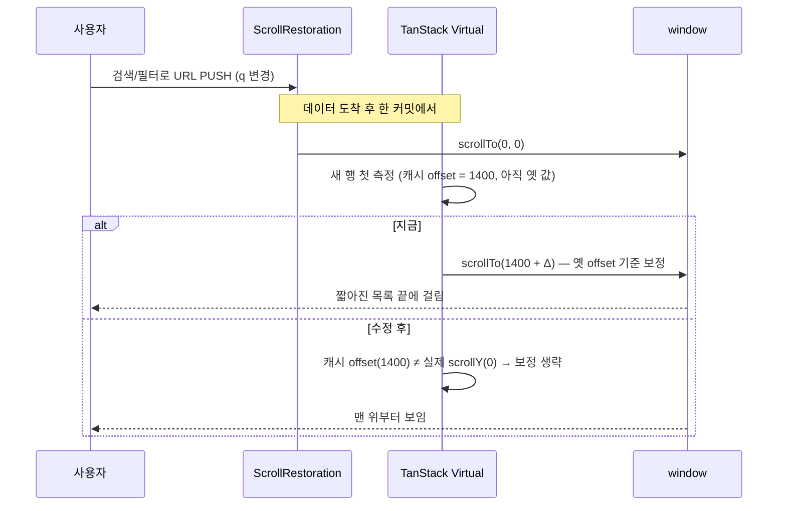

# URL이 바뀌면 맨 위로 — 전역 규칙이 가상 스크롤 목록에서 무효가 되는 원인 제거

## Context

PR #258에서 카드 카테고리 배지를 누르면 피드가 맨 위로 가도록 `usePostCard.ts`에
`window.scrollTo({ top: 0 })`를 **기능별로** 넣었다. 사용자는 "기능을 추가할 때마다 스크롤
상단 이동을 넣어야 하는 구조는 안 된다, URL이 바뀌면 근본적으로 상단으로 가야 한다"고 했다
(2026-09-30).

**조사 결과: 전역 규칙은 이미 있다.** `src/app/routes/layouts/RootLayout.tsx:42`의
`<ScrollRestoration />`(react-router-dom 6.30.3)은 검색 파라미터만 바뀐 PUSH/REPLACE에도
`window.scrollTo(0, 0)`을 실행한다(`node_modules/react-router-dom/dist/index.js:1311-1335` —
저장 위치가 있으면 복원(POP), `#hash`면 그 요소, `preventScrollReset`이면 무동작, 나머지는 전부
맨 위). 키 기본값은 `location.key`라 search만 바뀌어도 새 키다.

**그런데 가상 스크롤 목록이 같은 커밋에서 그 리셋을 되돌린다 — 직접 계측으로 확인.**
우회 코드가 없는 헤더 검색으로, 1400px에서 `@백엔드`를 제출하며 `window.scrollTo`를 감싸
호출 스택을 기록했다:

| 시각    | 호출 주체                                                                       | 호출                      |
| ------- | ------------------------------------------------------------------------------- | ------------------------- |
| t=10924 | `ScrollRestoration` layout effect                                               | `scrollTo(0, 0)`          |
| t=10927 | TanStack Virtual `measureElement`(ref) → `resizeItem` → `applyScrollAdjustment` | `scrollTo({ top: 1121 })` |

결과: 1121로 되돌아갔다가 짧아진 페이지 끝(310)에 걸림. 즉 **헤더 검색도 지금 같은 문제를
겪고 있고**, 북마크 목록도 같은 훅(`useWindowGridVirtualizer`)을 쓴다.

원인(`@tanstack/virtual-core` 3.17.11 `dist/esm/index.js:895-950`): 새 행을 처음 측정할 때
"그 행이 현재 스크롤 위쪽에 있으면 추정→실측 높이 차만큼 스크롤을 보정"한다. 이때 기준인
`scrollOffset` 캐시는 비동기 scroll 이벤트로만 갱신되므로, `ScrollRestoration`이 방금 0으로
보낸 사실을 모른 채 **옛 값 1400**으로 판정·보정한다.

## 흐름 (지금 vs 수정 후)

## 변경

1. **`src/shared/hooks/useWindowGridVirtualizer.ts`** — `useWindowVirtualizer` 인스턴스에
   `shouldAdjustScrollPositionOnItemSizeChange`(공개 훅, `index.d.ts:118`)를 지정한다.
   - 가드: `|window.scrollY − instance.scrollOffset|`가 한 화면(`window.innerHeight`)보다 크면
     `false` — 가상화 라이브러리가 아직 관찰하지 못한 **외부 스크롤**(ScrollRestoration 리셋 등)이
     방금 있었다는 뜻이라, 옛 offset 기준 보정은 틀린 보정이다. 한 화면 기준인 이유: 사용자
     스크롤은 프레임 사이에 한 화면씩 튀지 않으므로, 평소 스크롤 중의 정상 보정은 건드리지 않는다.
   - 가드를 통과하면 라이브러리 기본 판정을 그대로 재현한다(지정하면 기본 판정을 통째로
     대체하기 때문): 첫 측정이면 `item.start < offset`, 재측정이면
     `item.end <= offset && scrollDirection !== 'backward'` (`offset = scrollOffset +
scrollAdjustments`, 모두 공개 필드 `index.d.ts:100-111`). 라이브러리 버전과 원본 줄을
     주석에 남긴다(업그레이드 시 재확인 지점).
   - 한 곳만 고치면 피드·북마크 목록 둘 다 적용된다.
2. **`src/widgets/post/post-card/hooks/usePostCard.ts`** — #258의 `window.scrollTo({ top: 0 })`와
   그 주석을 제거한다(전역 규칙이 동작하므로 불필요).
3. **`src/widgets/layout/navbar/hooks/useMobileSearchPanel.ts:25`** — 검색 패널을 여는 state push에
   `preventScrollReset: true`를 추가한다(사용자 결정 2026-09-30: 이번 PR에 포함). 스크롤을 유지해야
   하는 이동 중 유일하게 빠져 있던 곳이라, 모바일에서 패널을 열면 배경이 맨 위로 튀었다
   (`docs/SEARCH.md:393`의 알려진 문제). 선례는 `useHistoryOverlay.ts:21`.
4. **문서**
   - `docs/FE-ARCHITECTURE.md`: "스크롤 규칙" 절 추가 — URL이 바뀌면 맨 위로는 `ScrollRestoration`
     이 전역으로 담당, 기능별 `scrollTo` 금지, 스크롤을 **유지**해야 하는 이동(오버레이·모달 등
     state만 싣는 push)은 `preventScrollReset: true`로 명시적으로 빠진다(선례:
     `useHistoryOverlay.ts:21`, `MarkdownContent.tsx:64`).
   - `docs/SEARCH.md`: #258의 "0으로 보내는 주체는 특정하지 못했다" 문단을 실제 원인(리셋=ScrollRestoration,
     되돌림=가상화 보정)과 이번 수정으로 갱신, 헤더 검색·칩이 "범위 밖"이던 문장 정리.
   - `docs/DECISIONS.md`: 대안 비교 기록(아래 표) — 모든 향후 기능에 영향을 주는 구조 결정이다.
   - `CHANGELOG.md` `[Unreleased] > Fixed`.

| 안                                        | 내용                                              | 채택 여부와 이유                                                                             |
| ----------------------------------------- | ------------------------------------------------- | -------------------------------------------------------------------------------------------- |
| 기능별 `scrollTo`(현재)                   | 목록 필터를 바꾸는 곳마다 직접 호출               | 기각. 기능을 추가할 때마다 넣어야 하고, 헤더 검색처럼 이미 빠진 곳이 생긴다                  |
| URL 변경 감지 전역 훅 추가                | 별도 `useEffect`로 location 변화 시 `scrollTo(0)` | 기각. `ScrollRestoration`이 이미 같은 일을 하고, 같은 커밋의 가상화 보정에 똑같이 되돌려진다 |
| 검색어가 바뀌면 목록을 key로 리마운트     | 가상화 인스턴스를 새로 만듦                       | 기각. Suspense 스켈레톤 깜빡임, 스냅샷 복원 경로와 충돌                                      |
| **가상화 보정에 "외부 스크롤 감지" 가드** | 캐시 offset이 실제와 크게 다르면 보정 생략        | **채택.** 원인 한 곳을 고쳐 전역 규칙이 모든 목록에서 동작                                   |

## 영향 범위 (§5)

- CRUD: 데이터 변경 없음.
- 회귀 후보와 확인 방법:
  - 뒤로가기 스크롤 복원 — `e2e/post-list-scroll-restore.spec.ts`·`.mobile.spec.ts`,
    `post-detail-back.spec.ts` (POP: ScrollRestoration이 저장 위치로 복원 + 스냅샷의 `initialOffset`
    으로 가상화 offset도 같은 값 → 가드에 안 걸려야 한다)
  - 가상 스크롤 자체 — `e2e/post-list-virtualization.spec.ts`
  - 열 수 변경 시 `scrollToIndex` 앵커 — 가상화 내부 스크롤이라 offset이 같이 갱신됨(가드 무관 예상, 확인)
  - 평소 스크롤 중 이미지 로드로 행 높이가 바뀔 때의 보정 — 가드 임계값(한 화면) 아래라 기존과 같아야 한다
  - `e2e/post-card-click-area.spec.ts` "목록 중간에서 눌러도 맨 위부터" — `scrollTo` 제거 후에도 통과해야
    한다(이제 전역 규칙을 검증하는 테스트가 된다)
- 모바일 검색 패널(변경 3): 패널 열기·닫기(`navigate(-1)` POP)·제출(`replace`로 `/post?q=`) 흐름 —
  `e2e/post-detail-search-overlay.mobile.spec.ts`, `mobile-search-scroll-lock.mobile.spec.ts`.
  제출은 replace라 여전히 맨 위로 가야 한다(결과 화면).

## 테스트

- e2e 추가: 헤더 검색을 목록 중간(scrollY > 1000)에서 제출 → `scrollY === 0`
  (#258에서 만든 "카테고리가 붙으면 다른 목록" mock 방식 재사용, 좌표 클릭 대신 입력 제출).
- 북마크 목록: 폴더 전환을 목록 중간에서 → `scrollY === 0` (같은 훅 적용 확인).
- 모바일(mobile-chrome): 피드 중간에서 검색 패널을 열면 배경 `scrollY`가 그대로 유지된다.
- 각 새 테스트는 가드를 빼면 실패하는지 mutation으로 확인한다(#258에서 두 번 헛테스트를 만든 교훈).
- 계측 재현: 수정 후 같은 `window.scrollTo` 기록 스크립트로 두 번째 호출(보정)이 사라졌는지 확인.

## 실행 순서

1. `git log origin/main..main` 확인 → 새 워크트리 → `.env` 복사 + `pnpm install`
2. 가드 구현 → `usePostCard` 우회 제거
3. `pnpm type-check` / `pnpm test` / `pnpm lint` / `pnpm test:e2e` / `pnpm check:docs`
4. browser-verification 녹화: 헤더 검색·칩·카드 배지를 목록 중간에서 → 맨 위, 뒤로가기 복원, 북마크 폴더 전환,
   모바일 검색 패널 열기 시 배경 유지
5. 사용자 승인 → 커밋 → fresh subagent 계획 대조 → PR → CI → (머지 지시 시) 배포 확인
