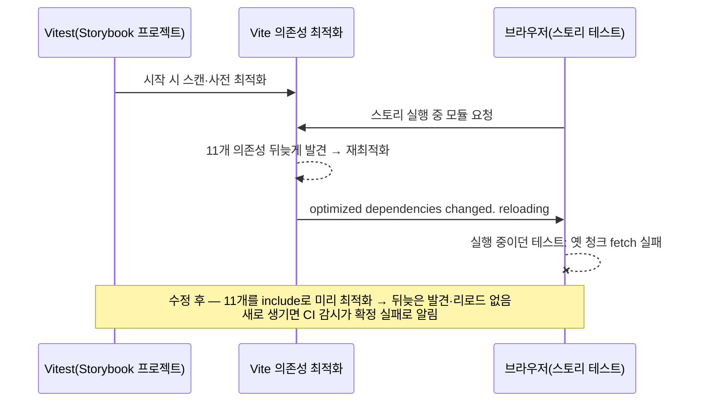
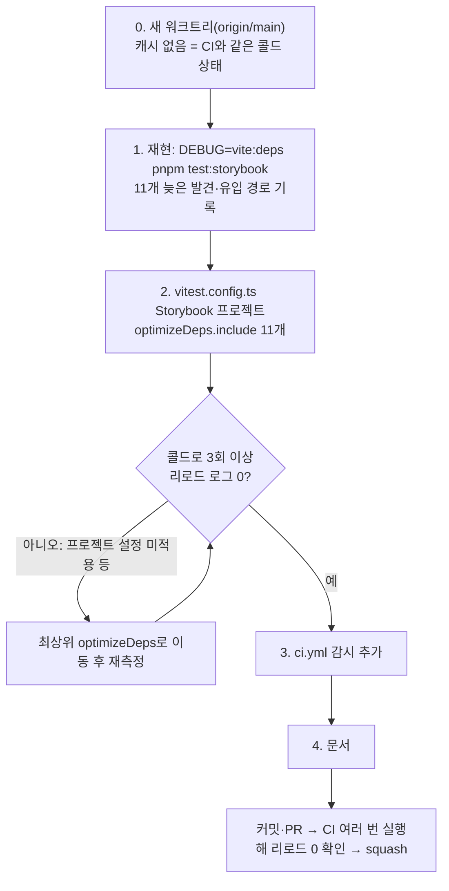

# Storybook a11y CI 간헐 실패 — 뒤늦은 의존성 최적화 리로드 제거와 재발 감시

## 구현 중 변경 (1단계 실험으로 원인 확정, 사용자 승인 2026-09-30)

아래 원래 계획은 "11개를 `optimizeDeps.include`에 미리 넣는다"였다. 1단계 실험에서 진짜 원인을 확정해
해결 방식을 바꿨다.

- **원인**: `DEBUG=vite:html-fallback pnpm test:storybook`에서 `Rewriting GET /broken-image.jpg to /index.html`.
  `src/shared/ui/atoms/avatar.stories.tsx`의 `Fallback` 스토리가 없는 경로 이미지를 요청했다. 개발 서버가 SPA
  폴백으로 `index.html`을 응답하며 `src/main.tsx`를 미리 변환했고, 거기서 앱 셸 의존성 11개를 새로 발견해
  재최적화·리로드했다. 로컬은 발견 시점이 테스트 종료 뒤라 실패하지 않았다.
- **바뀐 해결**: 스토리의 깨진 이미지를 네트워크 요청이 없는 `data:image/png;base64,`로 바꾼다(콜드 조건에서
  폴백·`main.tsx` 변환·뒤늦은 발견 모두 0회 확인). **`optimizeDeps.include`는 넣지 않는다** — 원인이 사라지면
  불필요하고, 넣으면 스토리가 쓰지 않는 앱 셸 의존성을 매번 미리 번들한다.
- **그대로**: CI 재발 감시(3단계), 문서(4단계). 문서의 시행착오 항목은 위 원인 기준으로 쓴다.
- 아래 원래 계획 본문의 2단계(`vitest.config.ts`)는 이 변경으로 수행하지 않는다.

> Storybook 테스트용 Vite 서버가 테스트 도중 의존성 11개를 뒤늦게 최적화하며 리로드해,
> 실행 중이던 스토리 테스트가 청크 로드 실패로 떨어진다. 이 의존성들을 미리 최적화하도록
> 지정하고, 새 의존성이 같은 문제를 다시 일으키면 CI가 확정 실패로 알리게 한다. PR 1개.

## Context

PR CI `e2e` job의 "Run Storybook a11y tests"(`pnpm test:storybook`) 단계가 이 변경과 무관한 스토리에서 간헐적으로
실패해, PR마다 실패 잡을 재실행해 왔다(2026-09-30 #269에서만 3회).

### 사전 조사 (2026-09-30, CI 로그·설치된 패키지 소스 직접 확인)

- **빈도**: 최근 CI 60회 중 재시도가 필요했던 run은 12개였다. 앞선 시도의 실패는 Storybook a11y 단계 12건,
  e2e 단계 3건(별개 문제, 범위 밖)이다.
- **원인은 매번 같다.** 로그를 본 실패 5건(job 109831467630·109836549999·109841600024·109135094726·109345420389)
  모두 순서가 같았다.
  1. 테스트 도중 `new dependencies optimized:` 로그에 같은 11개가 찍힌다: `react-dom/client`, `@tanstack/react-query`,
     `@tanstack/react-query-devtools`, `dayjs`, `firebase/messaging`, `react-remove-scroll`, `dayjs/locale/ko`,
     `dayjs/plugin/relativeTime`, `dayjs/plugin/customParseFormat`, `dayjs/plugin/utc`, `dayjs/plugin/timezone`
  2. 이어서 `optimized dependencies changed. reloading`이 찍힌다.
  3. 실행 중이던 테스트가 `Failed to fetch dynamically imported module …/sb-vitest/deps/*.js`로 실패한다.
- **성공 run도 같은 리로드를 겪을 때가 있다**(job 109833404325). 리로드 순간 실행 중인 테스트가 없으면 통과할 뿐이라,
  결과가 타이밍에 달린다.
- **Vitest의 공식 안내**: 경고를 띄우는 Vitest 소스(`packages/vitest/src/node/plugins/browserLoader.ts`)는
  _"안정적으로 쓰려면 새로 최적화된 의존성을 설정의 `optimizeDeps.include`에 직접 추가하라"_ (번역)고 안내한다.
- **지금 설정에 빠진 곳**:
  - `vite.config.ts:162-174`의 `optimizeDeps.include`에 이미 `@tanstack/react-query`·`dayjs`가 있다.
  - 하지만 Storybook 테스트 서버에는 이 목록이 들어가지 않는다. `vitest.config.ts`는 `vite.config.ts`를 읽지 않고,
    addon-vitest 플러그인은 Storybook의 `viteFinal`을 빈 설정(`{}`)에 적용한다
    (`@storybook/addon-vitest/dist/vitest-plugin/index.js:2417`, 설치 소스).
- **11개가 스토리 그래프의 어느 경로로 들어오는지는 코드를 읽는 것만으로 확정하지 못했다.**
  - 스토리가 앱 Provider를 import하는 곳은 없다(`git grep`).
  - Vitest 테스트 페이지는 프로젝트 `index.html`이 아니라 Vitest 자체 `tester.html`이다(Vitest 문서 `browser.testerHtmlPath`).
  - 그래서 1단계 실험에서 `DEBUG=vite:deps`로 확인해 기록한다. 이 해결책은 경로와 무관하게 동작한다
    (미리 최적화해 두면 뒤늦게 발견될 것이 없다).

## 판단이 필요했던 항목

| 항목           | 결정                                                                                                                            | 근거·기각한 대안                                                                                                                                                                                                                                                       |
| -------------- | ------------------------------------------------------------------------------------------------------------------------------- | ---------------------------------------------------------------------------------------------------------------------------------------------------------------------------------------------------------------------------------------------------------------------- |
| 해결 방식      | **`vitest.config.ts` Storybook 프로젝트에 `optimizeDeps.include`로 11개 지정**                                                  | Vitest 공식 안내. 기각: CI 캐시(캐시가 없는 첫 run은 그대로 실패하고, 키·무효화 관리가 늘어남), 테스트 자동 재시도(진짜 실패까지 가림), `optimizeDeps.entries`를 `src/**` 전체로 넓히기(스토리와 무관한 앱 셸까지 스캔하고, Vitest의 entries 병합 동작 추가 확인 필요) |
| 목록 위치      | Storybook 프로젝트 설정 안(`projects[1]`)                                                                                       | unit(jsdom) 프로젝트에는 불필요. 1단계 실험에서 프로젝트 단위 설정이 실제로 적용되는지 확인하고, 적용되지 않으면 최상위 `optimizeDeps`로 옮긴다                                                                                                                        |
| 재발 감시      | **CI에서 Storybook 테스트 로그에 `optimized dependencies changed`가 나오면 통과 여부와 상관없이 실패** (사용자 확정 2026-09-30) | 목록만 넣으면 새 의존성이 생길 때 같은 간헐 실패가 조용히 돌아온다. 감시는 이를 "원인과 해결책이 적힌 확정 실패"로 바꾸고, 그 의존성을 들여온 PR 안에서 잡는다. 기각: 문서만(재발이 여전히 간헐 실패로만 드러남)                                                       |
| 감시 구현 위치 | `ci.yml` 해당 단계 안에 셸로 직접                                                                                               | 몇 줄이고 CI 전용이다. 별도 스크립트 파일로 뺄 만큼 재사용처가 없다                                                                                                                                                                                                    |
| 문서           | `docs/DESIGN-SYSTEM.md`(a11y 게이트 기능 문서) 시행착오·코드 지도, `docs/CI-CHECK-GATE.md` e2e job 행                           | CI 설정만 바뀌어 사용자 영향이 없으므로 CHANGELOG 대상 아님(`changelog-release` skill). 되돌리기 쉬워 DECISIONS 대상 아님(메모리 `decisions-md-usage-criteria`)                                                                                                        |

## 세부 계획

### 0–1. 재현 (새 워크트리)

- 새 워크트리에는 `node_modules/.cache/storybook`이 없어 CI와 같은 콜드 상태다.
- `DEBUG=vite:deps pnpm test:storybook`을 실행한다.
  - 같은 11개가 `new dependencies optimized`로 뒤늦게 찍히는지 확인한다.
  - debug 로그로 각 의존성을 처음 요청한 모듈(유입 경로)을 찾아 문서에 남긴다.
- 로컬에서 재현되지 않으면(더 빠른 머신이라 타이밍이 달라서) "리로드 로그가 찍히는지"만 본다. 테스트 실패 여부로 판단하지 않는다.

### 2. `vitest.config.ts`

| 위치                                   | 변경 내용                                                                                                                                                                           |
| -------------------------------------- | ----------------------------------------------------------------------------------------------------------------------------------------------------------------------------------- |
| Storybook 프로젝트 객체(`projects[1]`) | `optimizeDeps: { include: [위 11개] }` 추가. 주석에 Vitest 공식 안내, `vite.config.ts`의 include가 이 서버에 안 들어오는 이유, 문서(`docs/DESIGN-SYSTEM.md` 시행착오) 위치를 적는다 |

### 3. `.github/workflows/ci.yml` — "Run Storybook a11y tests" 단계

| 변경 전                    | 변경 후                                                                                                                                                                                                                                                                                                                                                            |
| -------------------------- | ------------------------------------------------------------------------------------------------------------------------------------------------------------------------------------------------------------------------------------------------------------------------------------------------------------------------------------------------------------------ |
| `run: pnpm test:storybook` | `set +e`로 `pnpm test:storybook 2>&1 \| tee storybook-test.log`를 돌려 종료 코드를 보관한다. 로그에 `optimized dependencies changed`가 있으면 `::error::` 주석으로 "`new dependencies optimized:` 목록을 `vitest.config.ts` Storybook 프로젝트 `optimizeDeps.include`에 추가"를 안내하고, ANSI 색을 벗긴 목록을 출력한 뒤 실패한다. 없으면 원래 종료 코드로 끝낸다 |

GitHub Actions의 기본 셸은 `bash -eo pipefail`이다. 그래서 `set +e`와 `PIPESTATUS`로 테스트 실패와 감시를 따로 판정한다. 테스트가 리로드로 실패한 경우에도 안내 메시지가 나와야 하기 때문이다.

### 4. 문서

| 위치                                                      | 변경 내용                                                                        |
| --------------------------------------------------------- | -------------------------------------------------------------------------------- |
| `docs/DESIGN-SYSTEM.md` §10 시행착오                      | 증상·빈도·원인·유입 경로(1단계 결과)·해결·감시를 새 항목으로. "마지막 검토" 갱신 |
| `docs/DESIGN-SYSTEM.md` §8 자주 하는 수정                 | "CI가 `optimized dependencies changed`로 실패" → include에 추가하는 레시피 행    |
| `docs/CI-CHECK-GATE.md` §6 e2e job 행                     | Storybook 테스트 단계에 리로드 감시가 붙었음을 한 줄로                           |
| `docs/plans/2026-09-30-storybook-optimize-deps.md` (신규) | 이 계획 스냅샷                                                                   |

## 영향 범위 (§5)

**CRUD 실패 지점**: 앱 코드·데이터·API 변경 없음. 테스트 설정과 CI만 바뀐다.

**기존 기능의 회귀 후보**

| 회귀 후보                                            | 소유 파일                 | 확인 방법                                                                                                                                             |
| ---------------------------------------------------- | ------------------------- | ----------------------------------------------------------------------------------------------------------------------------------------------------- |
| unit 프로젝트(`pnpm test`)가 설정 변경의 영향을 받음 | `vitest.config.ts`        | `pnpm test` 전체 통과, 소요 시간 비교                                                                                                                 |
| Storybook 테스트 시작 시간 증가(11개를 미리 번들)    | `vitest.config.ts`        | 콜드 실행 시간 전후 비교(측정값 기록)                                                                                                                 |
| 감시가 정상 run을 잘못 실패시킴(오탐)                | `ci.yml`                  | 수정 후 CI 로그에 해당 문구가 없는지 확인. 문구가 Vite 버전에 따라 바뀌면 감시가 조용히 무력화될 수 있다 → 문서에 문구 출처(Vite optimizer 로그) 기록 |
| 감시가 테스트 실패 종료 코드를 삼킴                  | `ci.yml`                  | 일부러 실패하는 스토리가 없는 한 직접 확인은 어렵다 → 스크립트 논리 리뷰로 `exit $status` 경로 확인                                                   |
| `pnpm build-storybook`(정적 빌드)                    | `.storybook/main.ts` 계열 | 설정을 건드리지 않으므로 영향 없음. CI `check` job에서 확인                                                                                           |

배포 순서: 해당 없음(CI·테스트 설정).

## 검증 방법

1. 콜드 상태 재현(1단계) 결과를 기록한다: 리로드 로그 유무, 11개 목록, 유입 경로.
2. 수정 후 콜드 상태로 `pnpm test:storybook`을 3회 이상 돌려 `new dependencies optimized`·`optimized dependencies changed`가 0회인지 확인한다(`optimizeDeps.include`가 바뀌면 Vite가 캐시를 새로 만들어 매번 콜드에 가깝다. 필요하면 워크트리를 새로 만든다).
3. `pnpm check`, `pnpm test`, `pnpm test:storybook`, `pnpm check:docs`
4. 감시 셸 로직을 로컬에서 확인한다. 로그 파일에 문구를 넣은 가짜 입력으로 실패하는지, 문구 없는 입력으로 원래 종료 코드를 내는지 본다.
5. PR CI를 최소 3회(push + 재실행 2회) 돌려, e2e job 로그에 리로드 문구가 없고 Storybook 단계가 매번 통과하는지 확인한다.
6. §11: fresh `general-purpose` 서브에이전트로 계획 대비 구현 대조 → PR 본문 `## 계획 대비 구현`
7. squash 머지. CI 설정 변경이라 Frontend Deploy 경로 필터에 걸리는지 확인하고 결과를 보고한다(걸리지 않으면 배포 대상 아님을 밝힌다)

## 남은 것

- e2e 단계 간헐 실패 3건(최근 60회 중)은 원인이 다르다(범위 밖). 필요하면 별도로 조사한다
- 11개의 유입 경로가 예상 밖(예: 스토리가 앱 셸을 간접 import)으로 밝혀지면, 그 import 자체를 끊는 것이 더 나은지 결과를 보고 따로 제안한다
