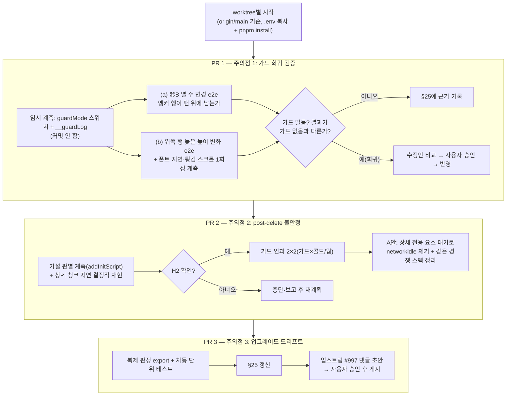

# 가상 스크롤 보정 가드(#261) 후속 — 남은 주의점 3가지

> PR #261 가드가 만들었을 수 있는 회귀를 실측으로 가려내고(1), post-delete 불안정의 **실제** 원인을
> 확인해 테스트를 고치고(2), virtual-core 업그레이드 때 복제한 기본 판정이 조용히 어긋나지 않게
> 차등 테스트를 둔다(3). PR 3개, 순서 1 → 2 → 3.

## Context

PR #261(2026-09-30 배포, `182d2bc`)은 `src/shared/hooks/useWindowGridVirtualizer.ts:127-146`의
`shouldAdjustScrollOnItemResize`를 virtual-core 공개 훅 `shouldAdjustScrollPositionOnItemSizeChange`에
지정해 "캐시된 스크롤 위치와 실제 `window.scrollY`가 한 화면 넘게 벌어졌으면 보정하지 않는다"는 가드를
넣었다. 가드를 통과하면 3.17.11 기본 판정을 옮겨 적은 로직을 쓴다(규칙 `docs/FE-ARCHITECTURE.md` §25,
경위 `docs/DECISIONS.md` 2026-09-30 "URL이 바뀌면 맨 위로"). 남은 주의점 3가지를 처리한다.

### 사전 조사로 확인한 사실 (plan mode, 읽기 전용)

**라이브러리 동작** (`node_modules/@tanstack/virtual-core/dist/esm/index.js`, 3.17.11)

- 캐시 `scrollOffset`은 scroll 이벤트 콜백에서만 갱신된다(451-472). `scrollToIndex`도 `window.scrollTo`만
  하고 캐시는 다음 scroll 이벤트까지 옛 값이다(1086-1107, 1171-1177).
- 대신 `scrollToIndex`는 `scrollState`를 세우고 rAF마다 `getOffsetForIndex`로 목표를 다시 맞춘다
  (`reconcileScroll`, 최대 5초, 1226-1270) → 가드가 중간 보정을 건너뛰어도 스스로 복구될 가능성(추론).
- ResizeObserver 재측정 경로는 스크롤 중에도 `resizeItem`을 부른다(218-250). 가상화의 모든 스크롤 쓰기는
  `window.scrollTo({ top })` 객체 형태(`scrollWithAdjustments`), `ScrollRestoration`은 `scrollTo(0, 0)`
  숫자 형태라 addInitScript 래퍼로 구분 기록 가능.

**주의점 1(b)의 전제 보정** — 썸네일은 늦게 와도 카드 높이를 바꾸지 못한다.

- `link-thumbnail.tsx:52`가 로드 전부터 `aspect-video` 박스를 잡고, 아바타는 `h-6 w-6` 고정.
- 실제로 늦게 높이를 바꿀 수 있는 건 **웹폰트**뿐이다: Pretendard dynamic subset(`index.html:185`,
  `font-display: swap`) — 새 카드가 스크롤로 들어오며 새 글자 subset을 받으면 3줄 미만 제목·설명의 줄 수가
  바뀔 수 있다. 그래서 (b)는 "위쪽 행의 늦은 높이 변화"로 재정의해 검증한다.

**주의점 2 — 테스트 주석의 원인 설명이 코드상 성립하지 않는다**(`e2e/post-delete.spec.ts:40-47`)

- prefetch(`post.queries.ts:169-174`)와 상세 조회(`159-166`)는 같은 키·queryFn → TanStack Query가 in-flight
  요청을 공유하고, 신선하면(staleTime 3분, `queryClient.ts:70`) 요청 자체를 안 보낸다. "요청 공유"는 이미 돼 있다.
- `useSuspenseQuery`는 데이터가 없을 때만 멈춘다 — 백그라운드 재조회로 재발동하지 않는다.

### 가설 (주의점 2)

- **H1(테스트 주석)**: onFocus prefetch의 두 번째 GET이 늦게 겹쳐 Suspense 재발동 → PostCard 리마운트.
  위 사실로 가능성 낮음. GET 횟수가 1이면 기각.
- **H2(유력, 추론)**: `RouterProvider.tsx`의 `v7_startTransition: true` + `routes/index.tsx:29-30`의
  `lazy(PostDetailPage)`. URL(`history.push`)이 먼저 바뀌어 `toHaveURL`은 통과하지만, 상세 청크가 오기 전까지
  React가 옛 목록 화면을 유지한다. 테스트가 **목록 카드의 ⋮**(같은 aria-label, 목 목록은 1개)를 열고, 청크 도착
  → 커밋 → 목록 언마운트 → 메뉴 항목 detached.
  - 설명되는 관찰: `networkidle`이 통하는 이유(청크 모듈 요청 대기), 실패가 초반 묶음·CI 첫 시도에 몰리는 이유
    (vite dev 서버 콜드 변환), "가드 있음 3/96"(가드 코드 수정 직후 모듈 무효화된 콜드 상태였을 가능성 — 교란).
- 로컬 비교 0/72 대 3/96은 단측 Fisher 정확검정 p≈0.18(직접 계산: `C(96,3)/C(168,3)`) — 차이를 말할 수 없는 수준.

### 흐름

## 판단이 필요했던 항목

| 항목                    | 결정                                                                                              | 근거·기각한 대안                                                                                                                                                                                                                                                                                                                                            |
| ----------------------- | ------------------------------------------------------------------------------------------------- | ----------------------------------------------------------------------------------------------------------------------------------------------------------------------------------------------------------------------------------------------------------------------------------------------------------------------------------------------------------- |
| PR 분할                 | **3개, 1 → 2 → 3 순차**                                                                           | 성격이 다르다: 1은 결과가 열린 조사(수정으로 바뀔 수 있음), 2는 다른 코드 영역(e2e)·전제 뒤집힘, 3은 결정적 안전장치. 1·3은 같은 파일(`useWindowGridVirtualizer.ts`, §25)을 건드리고, 3의 차등 테스트는 1에서 확정된 최종 가드 기준으로 써야 해 1 뒤. 2는 1의 가드 모드 스위치 계측을 재사용해 1 뒤. 기각: 1+3 합치기(1이 수정으로 번지면 리뷰 단위가 섞임) |
| 계획 파일               | 이 계획을 `docs/plans/2026-09-30-virtualizer-guard-followups.md`로 **PR 1에 커밋**, PR 2·3은 링크 | 한 계획을 PR마다 복제하면 SSOT가 깨진다. 각 PR의 `## 계획 대비 구현`은 자기 Phase만 대조                                                                                                                                                                                                                                                                    |
| 가드 유무 비교 방법     | 임시 코드에 `localStorage.__guardMode`(`on`/`off`/`always`) 스위치를 넣고 addInitScript로 설정    | 코드 수정·서버 재시작 없이 모드를 바꿔 콜드/웜 교란을 없앤다. 커밋 전 반드시 제거(`git diff`로 확인)                                                                                                                                                                                                                                                        |
| (b)의 재현 수단         | 영구 e2e는 결정적 높이 변경(위쪽 오버스캔 행 카드에 높이 추가), 튕김 스크롤은 1회성 계측          | 튕김 중 판정은 타이밍 의존이라 영구 테스트로 두면 불안정해진다. CDP `Input.synthesizeScrollGesture`(`preventFling: false`, 실험적 명령 — [Input.pdl](https://github.com/ChromeDevTools/devtools-protocol/blob/master/pdl/domains/Input.pdl))로 계측만 한다                                                                                                  |
| 주의점 2 범위           | **A안: 테스트만 고침** (사용자 결정 2026-09-30)                                                   | 불안정의 근본 원인은 "테스트가 전환 커밋 전에 조작"이다. 앱의 "URL 먼저, 화면은 청크 후"는 `v7_startTransition`의 의도된 동작. 기각: B안 청크 미리 로드(FSD상 프리로드 주입 경로 신설, 창을 줄일 뿐 못 없앰)                                                                                                                                                |
| 주의점 2 결과 기록 위치 | 스펙 주석 정정 + `docs/TESTING.md` "자주 발생하는 문제"에 항목 추가                               | 대안 비교 없는 디버깅 결과라 DECISIONS 기준(대안 비교 + 되돌리기 어려움) 미충족                                                                                                                                                                                                                                                                             |
| 주의점 1 결과 기록 위치 | §25에 "가드가 개입하지 않음을 확인한 경로"와 수치                                                 | DECISIONS는 append-only라 기존 항목을 못 고치고, 검증 결과는 새 결정이 아니다                                                                                                                                                                                                                                                                               |
| 주의점 3 방식           | **현행 공개 훅 유지 + 차등 단위 테스트 + 업스트림 요청 병행**                                     | 아래 표                                                                                                                                                                                                                                                                                                                                                     |
| 주의점 3 기록 위치      | 비교표는 이 계획 파일, §25에는 요약·테스트 위치                                                   | 되돌리기 쉬운 내부 구현 선택이라 DECISIONS 기준 2 미충족                                                                                                                                                                                                                                                                                                    |

### 주의점 3 대안 비교

사실: `package.json:57`이 `@tanstack/react-virtual`을 `3.14.13`으로 정확 고정 → 그 패키지가 `virtual-core`를
`3.17.11`로 정확 고정, dependabot/renovate 없음, 3.17.11이 현재 최신(npm). 업스트림에서 이 판정·보정 경로를
건드린 머지 PR이 2025-06~2026-07에 최소 6건(#1002, #1168, #1199, #1212, #1236, #1239 — 제목 기준, 각 diff는
미확인). 우리와 같은 증상이 [TanStack/virtual#997](https://github.com/TanStack/virtual/issues/997)로 열려 있다.

| 안                              | 판단                                                                                                                                                                                                                                                                                                                                                                    |
| ------------------------------- | ----------------------------------------------------------------------------------------------------------------------------------------------------------------------------------------------------------------------------------------------------------------------------------------------------------------------------------------------------------------------- |
| 버전 고정                       | 이미 사실상 고정. 위험 시점은 수동 업그레이드 PR인데, 거기서 무엇이 바뀌었는지 알려주지 못한다                                                                                                                                                                                                                                                                          |
| 버전 문자열 단언 테스트         | 기각 — 판정이 그대로인 업그레이드도 매번 실패하고, 무엇을 봐야 하는지 안 알려준다                                                                                                                                                                                                                                                                                       |
| dist 판정 블록 해시 비교        | 기각 — 빌드 포맷·주석 변화에 깨지고, 블록 밖 의미 변화(offset 계산, 콜백에 넘기는 item 모양)는 못 잡는다                                                                                                                                                                                                                                                                |
| **차등 단위 테스트**            | **채택** — jsdom에서 실제 `Virtualizer`(공개 `_willUpdate`, `resizeItem`)를 띄워 콜백 미지정(라이브러리 기본)과 우리 복제본의 스크롤 쓰기를 케이스 행렬로 비교. 의미가 바뀔 때만 실패하고 `pnpm test`(CI·pre-push)에서 자동으로 돈다                                                                                                                                    |
| `scrollToFn` 단에서 차단        | 기각 — `applyScrollAdjustment`가 쓰기 전에 내부 캐시(`scrollOffset += delta`)와 `_clampedAdjustment`를 이미 바꿔, 뒤늦게 `_retryClampedAdjustment`가 옛 목표로 다시 스크롤할 수 있다. iOS는 판정 시점에 쓰기를 미뤘다가 캐시 갱신 후 적용해 엉뚱한 위치가 된다. #997의 우회책 `scrollToFn: () => null`은 이 방식의 극단형으로 `scrollToIndex` 앵커·스냅샷 복원까지 끈다 |
| `resizeItem`을 감싸 캐시 동기화 | 보류 — 복제는 없어지지만 "측정 경로가 `this.resizeItem`을 거친다"는 구현 세부에 의존하고, 관찰 경로 밖에서 `scrollOffset`을 바꿔 `_intendedScrollOffset`·`scrollDirection`과의 상호작용을 새로 검증해야 한다. 업스트림이 거절하고 판정 변경이 잦으면 재검토                                                                                                             |
| 업스트림 요청                   | 병행 — #997에 원인(캐시가 scroll 이벤트로만 갱신돼 같은 태스크의 외부 `scrollTo`를 모름)과 제안(콜백 4번째 인자로 기본 판정 전달, 비파괴적)을 댓글로. 채택되면 복제 제거 가능. 외부 게시라 초안을 보여주고 승인 후 게시                                                                                                                                                 |

### 뒤집힌 전제

| 발견                                                                  | 그래서 바뀐 것                                                              |
| --------------------------------------------------------------------- | --------------------------------------------------------------------------- |
| 썸네일은 `aspect-video`로 자리를 잡아 늦게 와도 높이 불변             | (b)를 "위쪽 행의 늦은 높이 변화(실제 원인은 웹폰트 swap)"로 재정의          |
| prefetch와 상세 조회는 이미 요청을 공유                               | 주의점 2의 "요청 공유" 수정안은 불필요. 원인 가설을 H2로 교체하고 먼저 판별 |
| 가드 유무 로컬 비교는 통계적으로 무의미(p≈0.18)하고 콜드/웜 교란 가능 | 2×2(가드 × 서버 콜드/웜) 교차 설계로 다시 잰다                              |

### 위험 관리

- 임시 계측 코드가 커밋에 섞일 위험 → 커밋 직전 `git diff`에서 `__guardMode`·`__guardLog` 0건 확인.
- 영구 테스트가 헛테스트일 위험(#258·#261 교훈) → 각 테스트마다 "실패해야 하는 변이"를 정해 두고 확인(검증 방법 표).
- H2가 기각되면 A안을 그대로 적용하지 않는다 → 중단하고 계측 결과를 보고한 뒤 재계획.

## 세부 계획

### Phase 1 — PR 1 `test(shared)`: 가드가 정상 보정을 막지 않는지 검증 (주의점 1)

| 위치                                                              | 변경 내용                                                                                                                                                                                                                                                                                                                                                                                                                                                                                                   |
| ----------------------------------------------------------------- | ----------------------------------------------------------------------------------------------------------------------------------------------------------------------------------------------------------------------------------------------------------------------------------------------------------------------------------------------------------------------------------------------------------------------------------------------------------------------------------------------------------- |
| `src/shared/hooks/useWindowGridVirtualizer.ts` (임시, 커밋 안 함) | `shouldAdjustScrollOnItemResize`에 `__guardMode` 스위치(`on`/`off`=가드 제거/`always`=항상 보정 생략)와 `__guardLog` 기록 `{t, index, gap, innerHeight, isFirstMeasure, fired, result}`                                                                                                                                                                                                                                                                                                                     |
| `e2e/virtualizer-scroll-adjust.spec.ts` (신규)                    | 목: 글 60개, 설명 길이를 인덱스별로 달리해 행 높이가 추정치(654/635)와 다르고 서로 다르게. 테스트 (a) 1200×900(펼침 2열/접힘 3열 실측 경계, `post-card-footer-layout.spec.ts:115-117`)에서 3화면 이상 스크롤 → 화면 맨 위 행의 첫 카드를 앵커로 기록 → `Control+b` → 열 수 변경 대기 → 앵커 카드가 맨 위 행에 있고 그 행 top이 0±허용치(M0 실측으로 확정). 접기·펴기 양방향. 테스트 (b) 중간까지 스크롤·정지 → 화면 안 기준 카드 top 기록 → 화면 위 오버스캔 행 카드에 높이 추가 → 기준 카드 top 불변(±1px) |
| 1회성 계측 (커밋 안 함)                                           | 폰트 subset 응답을 `page.route`로 300~800ms 지연 + CDP 튕김 스크롤(속도 3000/8000/15000px/s, chromium은 mouse, mobile-chrome은 touch) × 20회 → 호출 수·발동 수·최대 \|gap\| vs `innerHeight`, 종료 시 기준 카드 변위를 on/off 비교                                                                                                                                                                                                                                                                          |
| (조건부) 가드 수정                                                | 회귀면 계측으로 원인을 특정한 뒤 후보(예: 앵커 이펙트의 자체 `scrollToIndex`를 가드가 구분하도록 ref 표시, 건너뛴 delta를 다음 scroll 이벤트 뒤 재적용)를 비교해 사용자 승인 후 반영. 그 경우 커밋 타입 `fix`, CHANGELOG `Fixed` 추가                                                                                                                                                                                                                                                                       |
| `docs/FE-ARCHITECTURE.md` §25                                     | "가드가 개입하지 않음을 확인한 경로" 문단: (a)·(b) 결과, 발동 수, 최대 gap 여유, 테스트 파일                                                                                                                                                                                                                                                                                                                                                                                                                |
| `docs/TESTING.md` e2e 표                                          | 신규 스펙 행 추가. **요청 외 제안**: 같은 표에서 누락된 `scroll-reset-on-navigation(.mobile).spec.ts`·`post-card-click-area.spec.ts` 행 보충(#261·카드 전체 링크 PR 누락분)                                                                                                                                                                                                                                                                                                                                 |
| `docs/plans/2026-09-30-virtualizer-guard-followups.md` (신규)     | 이 계획 스냅샷                                                                                                                                                                                                                                                                                                                                                                                                                                                                                              |

### Phase 2 — PR 2 `test(e2e)`: 상세 전환 커밋 전 조작하던 경쟁 제거 (주의점 2, A안)

| 위치                                                                 | 변경 내용                                                                                                                                                                                                                                                                                                                                                |
| -------------------------------------------------------------------- | -------------------------------------------------------------------------------------------------------------------------------------------------------------------------------------------------------------------------------------------------------------------------------------------------------------------------------------------------------- |
| 계측 (커밋 안 함)                                                    | addInitScript: capture 단계 `pointerdown` 기록 `{t, pathname, inList: target.closest('[data-index]') 여부}`, MutationObserver로 목록 컨테이너 제거·상세 셸 등장 시각, `PerformanceObserver`로 `PostDetailPage` 모듈 도착 시각. Playwright `page.on('request')`로 GET `/api/post/:id` 횟수. 로그는 테스트 끝에만 읽는다(경쟁 구간에 `page.evaluate` 금지) |
| 결정적 재현 (커밋 안 함)                                             | `page.route`로 vite dev의 `PostDetailPage` 모듈 요청만 지연, `networkidle` 제거 → H2면 매번 실패, H1이면 무관                                                                                                                                                                                                                                            |
| 가드 인과 2×2 (커밋 안 함)                                           | 원래 스펙 그대로, {가드 on, off} × {서버 콜드(블록마다 새로 기동), 웜}, ABBA 교차, 칸당 50회 + 이 흐름의 가드 발동 수. 요인별 Fisher 검정                                                                                                                                                                                                                |
| `e2e/post-delete.spec.ts:40-47`, `e2e/post-visibility.spec.ts:62-65` | `networkidle` 대신 상세 셸에만 있는 요소(데스크톱 뒤로가기 버튼 `TEXTS.post.detail.backToList`, `PostDetailPage.tsx:32-42`)가 보일 때까지 대기, 주석을 검증된 원인으로 정정. `post-delete`에는 상세 청크 지연을 영구로 둬 경쟁을 결정적으로 만든다(대기를 빼면 항상 실패 — 지연 값은 실측으로 최소화)                                                    |
| 같은 경쟁 감사                                                       | `like.spec.ts:39·66`, `dropdown-menu-scroll(.mobile).spec.ts:79·92`, `unsaved-changes.spec.ts:39·64·94`, `post-list.spec.ts:37`을 "URL만 단언(변경 없음)" / "목록·상세 공통 요소를 이어서 조작(같은 대기 추가)"으로 분류. 모바일은 뒤로가기 버튼이 숨겨져 있어 상세 전용 표지를 실행 시 골라 확인                                                        |
| `docs/TESTING.md` "자주 발생하는 문제"                               | 새 항목: `toHaveURL`은 화면 전환 커밋을 보장하지 않는다(`v7_startTransition` + lazy 라우트) — 증상·원인·대기 패턴                                                                                                                                                                                                                                        |

### Phase 3 — PR 3 `test(shared)`: 복제 판정 드리프트 차등 테스트 (주의점 3)

| 위치                                                   | 변경 내용                                                                                                                                                                                                                                                                                                                                                                                                                                                                                  |
| ------------------------------------------------------ | ------------------------------------------------------------------------------------------------------------------------------------------------------------------------------------------------------------------------------------------------------------------------------------------------------------------------------------------------------------------------------------------------------------------------------------------------------------------------------------------ |
| `src/shared/hooks/useWindowGridVirtualizer.ts:110-127` | `shouldAdjustScrollOnItemResize`를 export(선례: 같은 파일의 `chunkIntoRows`·`resolveColumnCount`가 테스트용 export). 주석 "라이브러리를 올릴 때 이 부분이 원본과 같은지 다시 확인한다"를 차등 테스트 위치 안내로 교체                                                                                                                                                                                                                                                                      |
| `src/shared/hooks/useWindowGridVirtualizer.test.ts`    | 새 `describe`: `@tanstack/react-virtual`이 re-export하는 `Virtualizer`를 스파이 `scrollToFn`, 캡처한 `observeElementOffset` 콜백, 고정 `observeElementRect`로 생성 → `_willUpdate()`. 행렬(offset 0/중간 × 행이 화면 위 전부/걸침/아래 × 첫 측정/재측정 × forward/backward/정지)마다 콜백 미지정과 우리 함수(`window.scrollY`를 캐시와 같게 스텁해 가드 미발동)의 `scrollToFn` 호출(`adjustments`)이 같은지 단언. 가드 케이스: gap > `innerHeight`면 우리 쪽은 쓰기 없음, 기본은 쓰기 있음 |
| `docs/FE-ARCHITECTURE.md` §25                          | 업그레이드 시 차등 테스트가 원본 판정 변화를 잡는다는 한 문단 + #997 링크                                                                                                                                                                                                                                                                                                                                                                                                                  |
| 업스트림 댓글 (레포 밖)                                | #997 댓글 초안(원인 추적, 기본 판정을 콜백 4번째 인자로 넘기는 제안)을 사용자에게 보여주고 승인 후 게시                                                                                                                                                                                                                                                                                                                                                                                    |

## 영향 범위 (§5)

- **CRUD**: 데이터·API 계약 변경 없음(세 PR 모두 테스트·문서, PR 1의 조건부 수정만 예외).
- **회귀 후보**
  - PR 1 조건부 가드 수정 시: 헤더 검색·카드 배지 리셋(`scroll-reset-on-navigation.spec.ts`, `post-card-click-area.spec.ts`), 뒤로가기 복원(`post-list-scroll-restore(.mobile).spec.ts`, `post-detail-back(.mobile).spec.ts`), 가상화(`post-list-virtualization.spec.ts`), ⌘B(`post-card-footer-layout.spec.ts`) 전부 재실행.
  - PR 2: 대기 조건 변경이 다른 단언의 타이밍을 바꿀 수 있음 → 수정한 스펙 전부 반복 실행. 상세 청크 영구 지연은 `post-delete` 실행 시간만 늘린다.
  - PR 3: 함수 export·주석만, 런타임 동작 불변.
- **문서**: §25, `docs/TESTING.md`(e2e 표·자주 발생하는 문제), 두 스펙의 틀린 주석 정정.

## 검증 방법

**변이 확인 표** — 각 영구 테스트가 헛테스트가 아닌지:

| 테스트                      | 반드시 실패해야 하는 변이                               | 결과를 기록만 하는 변이                                                  |
| --------------------------- | ------------------------------------------------------- | ------------------------------------------------------------------------ |
| (a) ⌘B 앵커                 | 앵커 이펙트 제거(`useWindowGridVirtualizer.ts:291-299`) | `off`, `always`(`always`에도 통과하면 (a)는 가드와 무관하다는 추가 근거) |
| (b) 위쪽 행 높이 변화       | `always`(과잉 가드가 정상 보정을 막으면 잡는지)         | `off`                                                                    |
| post-delete(청크 지연 포함) | 새 대기 제거                                            | —                                                                        |
| 차등 단위 테스트            | 복제본 변형(`<`↔`<=`, backward 조건 제거)               | —                                                                        |

**Phase별 실행**

1. 시작: `git log origin/main..main` → `EnterWorktree` → `cp ../../../.env .` + `pnpm install` (PR마다).
2. 매 PR: `pnpm type-check` → `pnpm test` → `pnpm lint` → `pnpm test:e2e` → `pnpm check:docs`(문서 수정 시).
3. 신규·수정 e2e는 `--repeat-each=20`(PR 2의 두 스펙은 100)로 불안정 0회, 서버 콜드 기동 직후 1회 포함.
4. PR 1 수치: (a)(b) M0 결과, 가드 발동 수, 튕김 계측의 최대 |gap|/`innerHeight` → §25와 PR 본문.
5. PR 2 판별: GET 횟수, `pointerdown`이 목록 행(`[data-index]`)이었는지, 커밋 시각 대비 클릭 시각, 2×2 표 → PR 본문.
6. 커밋 직전 `git diff`에서 임시 계측 0건 확인.
7. PR마다 fresh general-purpose 서브에이전트로 커밋된 계획 파일의 해당 Phase와 diff를 대조 → PR 본문 `## 계획 대비 구현`.
8. CI 통과 확인, 머지 지시 시 squash 머지 후 배포 워크플로우 결과까지 확인(테스트·문서만 바뀐 PR은 배포 경로 필터 확인).
9. 브라우저 녹화(`browser-verification`)는 UI 동작이 바뀌는 PR 1 조건부 수정 때만.

## 남은 것

- **iOS WebKit**: 관성 스크롤 중 보정 쓰기를 미루는 경로(`_iosDeferredAdjustment`)는 Playwright 프로젝트에 WebKit이 없어 검증 못 한다. 가드 판정이 지연보다 먼저 일어나 발동 시 그 delta가 누락되는 구조 — 발동 조건(gap > 한 화면)이 관성 중에 성립하는지는 미검증.
- **앱 전환 지연**(A안 결정으로 범위 밖): 목록에서 카드를 누르면 URL은 즉시 바뀌지만 상세 청크가 올 때까지 목록이 그대로 보이고 조작 가능하다. 다시 다룰 때 프로덕션 청크 로드 시간을 먼저 실측.
- **업스트림 #997 응답**: 콜백에 기본 판정이 넘어오게 되면 복제본과 차등 테스트를 제거. 거절 시 `resizeItem` 감싸기 안 재검토.
- PR 2 계측에서 H2가 기각되면 이 계획의 Phase 2는 중단하고 재계획.
