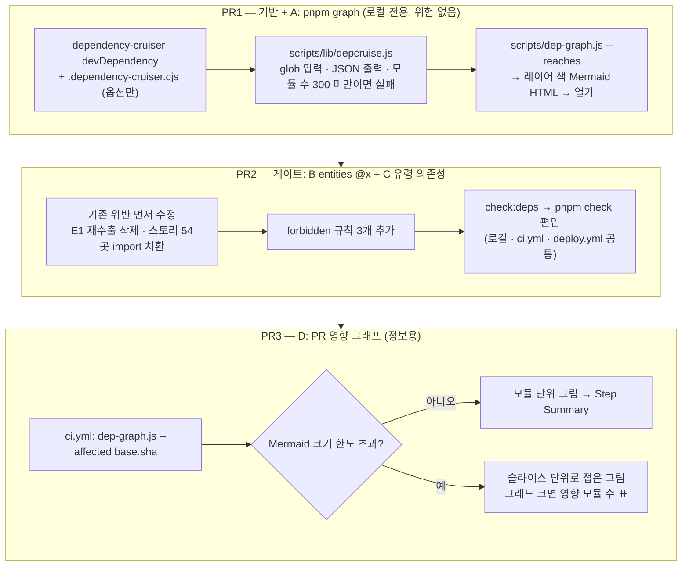
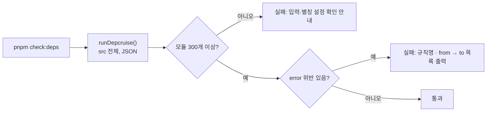

# dependency-cruiser 도입 — 그래프 명령 · entities `@x` 강제 · 유령 의존성 차단 · PR 영향 그래프

> Summary: 2026-10-01 일회성으로 돌려 본 dependency-cruiser를 상시 도구로 들인다. ESLint가 이미
> 하는 일(레이어 방향·순환 참조)은 맡기지 않고, ESLint로 표현하기 어렵거나 지금 아무것도 막지
> 않는 빈칸 네 가지만 맡긴다. PR 3개로 나눈다.

## Context

**계기**: `ToggleButton` 통합(#281) 뒤 "어떤 훅이 어떤 컴포넌트에 쓰이는지 한눈에 보는 도구"를
요청받아, dependency-cruiser `--reaches`로 훅 사용처 지도를 만들었다(스크래치패드에서 일회성
실행). 이어서 "이 라이브러리에서 우리 프로젝트에 어떤 기능을 도입하면 좋은가" 계획을 요청받았다.

**사용자가 고른 범위** (2026-10-01 AskUserQuestion): A 로컬 그래프 명령, B entities `@x` 강제,
C 유령 의존성 차단, D PR 영향 그래프. features·widgets 슬라이스 격리는 **이번엔 제외**한다.
기존 5건을 정리할 때 같이 도입한다("남은 것" 참고).

### 확인한 사실

- **ESLint가 이미 강제하는 것 — dependency-cruiser에 맡기지 않는다**
  - 레이어 하향 의존: `eslint.config.js`의 FSD 레이어 블록(`no-restricted-imports` 5블록)
  - 순환 참조: `import/no-cycle`. #171에서 dependency-cruiser로 순환을 처음 발견한 뒤, 재발 방지용으로
    ESLint 규칙만 남겼다(`eslint.config.js`의 `import/no-cycle` 주석, `CHANGELOG.md:590`)
- **B의 근거 — 문서가 "강제 수단 없음"이라고 적은 빈칸**
  - `docs/FE-ARCHITECTURE.md:46`: "동일 레이어 슬라이스 격리(entities는 `@x` 표기로 교차 참조
    허용) — ESLint 강제 없음, 컨벤션으로만 유지"
  - production 코드의 위반은 1건(E1)뿐이다. `src/entities/post/model/post.schema.ts:40`의
    `export * from '@/entities/comment/model/comment.schema'`로, 기존 경로 호환용 재수출이다
  - 이 경로로 comment 심볼(`commentContentFormSchema`·`CommentContentFormValues`·`Comment`·
    `MyComment`·`MyCommentListResponse`)을 가져가는 곳은 src·e2e 전체에서 **0곳**이다. 전부
    `comment.schema`를 직접 import한다(grep 전수 확인, 여러 줄 import 포함)
- **C의 근거 — 실제 유령 의존성 1종**
  - `.npmrc:1`이 `shamefully-hoist=true`라서 pnpm이 미선언 패키지 import를 막지 못한다
  - 스토리 54개 파일이 `import type { Meta, StoryObj } from '@storybook/react'`를 쓰는데,
    `package.json`에는 이 패키지가 없다. `@storybook/react-vite`의 하위 의존성이 끌어올려져서
    동작하고 있을 뿐이다
  - Storybook 공식 문서는 타입을 _"사용하는 프레임워크 패키지(예: react-vite)"_ (번역)에서
    import하라고 안내한다([Storybook TypeScript 문서](https://storybook.js.org/docs/configure/integration/typescript))
  - `node_modules/@storybook/react-vite/dist/index.d.ts`가 `export * from '@storybook/react'`이므로
    `Meta`·`StoryObj`를 그대로 가져올 수 있다(직접 확인)
- **devDependency를 production 코드에서 import하는 곳 1건**: `src/app/providers/QueryProvider.tsx:4`의
  `@tanstack/react-query-devtools`. TanStack 문서에 따르면 devtools는 _"`NODE_ENV === 'development'`일
  때만 번들에 포함되므로 production 빌드에서 따로 뺄 필요가 없다"_ (번역)
  ([TanStack Query Devtools](https://tanstack.com/query/latest/docs/framework/react/devtools))
- **dependency-cruiser 옵션 동작** ([options 레퍼런스](https://github.com/sverweij/dependency-cruiser/blob/main/doc/options-reference.md))
  - 기본값은 _"컴파일 후 JavaScript에 존재하지 않는 TypeScript 모듈 간 의존성을 고려하지
    않는다"_ (번역). `import type`만 쓰는 C의 54건은 `tsPreCompilationDeps: true`여야 보인다
  - `includeOnly`는 _"패턴에 맞지 않는 파일을 모두 버린다"_ (번역). node_modules가 결과에서 빠져
    C를 못 잡으므로, `doNotFollow`(방문은 하되 더 따라가지 않음)를 쓴다
  - 규칙의 `path`·`pathNot`은 정규식 배열을 받는다
- **죽은 코드는 이번 범위 밖**
  - 이 레포 계획 문서들이 발견한 죽은 코드(`prefetchCategoryData`, `FolderChips`, `authInvalidateQueries`
    등)는 대부분 "쓰이는 파일 안의 안 쓰이는 export"다
  - dependency-cruiser [규칙 레퍼런스](https://github.com/sverweij/dependency-cruiser/blob/main/doc/rules-reference.md)에는
    export 단위 검사가 없다. 이건 knip이 _"이 export를 참조하는 곳을 찾을 수 없음"_ (번역)으로
    잡는 영역이다([knip 이슈 종류](https://knip.dev/reference/issue-types))
- **2026-10-01 일회성 실행에서 직접 겪은 함정 2개** (재현: `npx dependency-cruiser@latest`)
  1. `--ts-config tsconfig.app.json`으로는 `@/` 별칭이 풀리지 않았다(엣지가 `@/shared/...` 그대로).
     webpack 형식 alias 설정(`resolve.alias {'@': <abs>/src}`)을 `--webpack-config`로 주자 풀렸다
  2. 워크트리(`.claude/worktrees/...`)에서 입력을 디렉터리 `src`로 주면 **"0 modules, 0
     dependencies cruised"로 조용히 통과**했다. glob `'src/**/*.{ts,tsx}'`로 주자 469 모듈·1,434
     의존성이 잡혔다. 원인은 미확인이다
     - 이 레포에는 같은 유형의 선례가 있다. `import/no-cycle`도 리졸버 설정이 하나 빠지면 0건으로
       조용히 통과했다(`eslint.config.js`의 `import/no-cycle` settings 주석)

### 전체 흐름



## 판단이 필요했던 항목

| 항목                  | 결정                                                                            | 근거·기각한 대안                                                                                                                                                                                                                                                                                                                             |
| --------------------- | ------------------------------------------------------------------------------- | -------------------------------------------------------------------------------------------------------------------------------------------------------------------------------------------------------------------------------------------------------------------------------------------------------------------------------------------- |
| 도입 범위             | A·B·C·D                                                                         | 사용자 선택(2026-10-01). 기각: 레이어 방향·순환 참조(ESLint와 중복), 죽은 파일(`no-orphans`/`reachable` — export 단위를 못 봐서 이 레포의 실제 죽은 코드 유형을 못 잡음, knip 영역), 폴더 단위 아키텍처 그림(`archi`)을 문서에 박제(코드와 금방 어긋남)                                                                                      |
| features·widgets 격리 | 이번엔 제외                                                                     | 사용자 결정. 기존 5건의 해결 방식을 먼저 정한다. 지금 넣으면 5건을 "임시 예외"로 등록했다가 다시 고쳐야 한다                                                                                                                                                                                                                                 |
| PR 순서               | A → B+C → D                                                                     | A가 별칭 해석·0건 안전장치 같은 공용 기반을 위험 없는 로컬 명령으로 먼저 검증한다. 배포까지 막는 게이트(B+C)는 그 기반이 검증된 뒤에 켠다. D는 A의 변환 코드를 재사용한다                                                                                                                                                                    |
| E1 처리               | 삭제                                                                            | 쓰는 곳이 0곳이다(Context). `@x` 파일로 옮기는 안은 아무도 안 쓰는 공개 표면을 새로 만드는 것이라 기각                                                                                                                                                                                                                                       |
| C 수정 방식           | 스토리 import를 `@storybook/react-vite`로 치환                                  | Storybook 공식 문서 권장, react-vite가 같은 타입을 재수출함(Context). `@storybook/react`를 devDependency로 추가하는 안은 문서 권장과 반대라 기각                                                                                                                                                                                             |
| `import type` 탐지    | `tsPreCompilationDeps: true`                                                    | 기본값으로는 C의 54건(전부 `import type`)이 안 보인다(Context, options 레퍼런스)                                                                                                                                                                                                                                                             |
| node_modules 처리     | `doNotFollow: node_modules`                                                     | `includeOnly: '^src'`(일회성 실행 때 쓴 옵션)는 npm 모듈을 결과에서 버려 C를 무력화한다(Context)                                                                                                                                                                                                                                             |
| devDependency 규칙    | `not-to-dev-dep` 채택 + `QueryProvider.tsx` 예외 1건                            | `msw` 같은 개발용 패키지가 런타임 코드로 새는 걸 막는다. devtools는 production 번들에서 자동으로 빠지므로(TanStack 문서) 사유를 단 예외로 둔다                                                                                                                                                                                               |
| 검사 위치             | `check:deps`를 `pnpm check`에 편입                                              | ESLint 아키텍처 규칙과 같은 자리라서 CI(`ci.yml` check 잡)·배포(`deploy.yml:50`)·로컬이 같은 명령으로 막힌다. `check:docs`처럼 CI 별도 스텝으로 두는 안은 배포 게이트에서 빠져 기각                                                                                                                                                          |
| 검사 실행 방식        | CLI `--output-type json` 결과를 스크립트가 해석                                 | 한 번 실행으로 모듈 수(안전장치)와 위반 목록을 같이 얻는다. JS API(`cruise()`) 세부 시그니처는 미확인이라 출력 형식이 문서화된 CLI를 쓴다                                                                                                                                                                                                    |
| 0건 안전장치          | glob 입력 + **300 모듈 미만이면 실패**                                          | 2026-10-01 직접 측정한 정상값은 469 모듈(glob 입력, src 전체). 300은 파일이 크게 줄어도 오탐하지 않을 여유                                                                                                                                                                                                                                   |
| `@/` 별칭 해석        | `tsConfig` 옵션을 먼저 시도하고, 안 풀리면 webpack alias 파일                   | npx 실행에서 `--ts-config`가 실패한 원인(전역 실행이라 typescript를 못 찾았는지 등)은 미확인이라, 로컬 설치본으로 프로브해서 확정                                                                                                                                                                                                            |
| A 렌더링              | 엣지 목록 → 레이어 색 Mermaid로 직접 변환                                       | 2026-10-01 같은 데이터로 두 방식을 렌더해 비교했다. 내장 mermaid 리포터는 폴더마다 중첩 상자가 생겨 오른쪽이 잘리고 읽기 어려웠다. Graphviz 기반 `dot-webpage`는 로컬에 Graphviz가 없어(`which dot` 결과 없음) 기각                                                                                                                          |
| A 출력 위치           | `node_modules/.cache/dep-graph/`                                                | gitignore·Prettier·ESLint 대상 밖이라 설정을 따로 추가할 필요가 없다. 루트 새 폴더는 `.gitignore` 추가가 필요하고, `.claude/browser-artifacts/`는 브라우저 검증 산출물 전용이라 기각                                                                                                                                                         |
| D 표시 위치           | GitHub Actions Step Summary                                                     | 사용자가 고른 형태. PR 댓글 방식은 `pull-requests: write` 권한과 댓글 갱신 로직이 추가로 필요해 기각                                                                                                                                                                                                                                         |
| D 실패 처리           | `continue-on-error: true` (정보용)                                              | 그림이 안 그려져도 코드 품질과는 무관하다                                                                                                                                                                                                                                                                                                    |
| D 크기 대응           | 텍스트 45,000자 또는 엣지 450개를 넘으면 슬라이스 단위로 접기, 그래도 넘으면 표 | [Mermaid 설정 문서](https://mermaid.js.org/config/schema-docs/config.html)의 기본 한도는 `maxTextSize` _"사용자 텍스트 다이어그램의 최대 허용 크기"_ (번역) 50,000자, `maxEdges` 500개다. GitHub 렌더러가 이 기본값을 그대로 쓰는지는 미확인이라 여유를 둔다. 공용 파일(`button.tsx`는 58개 파일이 import)을 바꾼 PR에서 실제로 걸릴 수 있다 |
| D 변경 파일 목록      | 스크립트가 `git diff --name-only <base>`로 직접 계산                            | dependency-cruiser `--affected`의 JSON 출력에서 변경 파일을 표시하는 속성은 미확인이다. 직접 계산하면 강조 표시도 자유롭다. 워킹트리 기준이라 로컬에서 커밋 전 미리보기도 된다                                                                                                                                                               |
| CHANGELOG             | 항목 없음                                                                       | 개발 도구·CI 변경이다. CLAUDE.md 기준 대상은 feat/fix/perf/동작이 바뀌는 refactor뿐이다                                                                                                                                                                                                                                                      |

### 위험 관리

| 위험                                                                   | 대응                                                                                                                                                        |
| ---------------------------------------------------------------------- | ----------------------------------------------------------------------------------------------------------------------------------------------------------- |
| 규칙 오탐이 배포를 막음                                                | PR2에서 프로브(일부러 위반 import 추가 → 실패 확인 → 제거)로 규칙이 의도한 것만 잡는지 확인한다. 오탐이면 규칙을 고치거나 `pathNot` 예외에 사유 주석을 단다 |
| 워크트리에서만 0건 통과                                                | 안전장치가 실패시킨다. PR1에서 디렉터리 입력으로 0건을 재현해 안전장치가 실제로 작동하는지 확인한다                                                         |
| `tsPreCompilationDeps: true`로 예상 못 한 `not-to-dev-dep` 위반이 나옴 | PR2 첫 실행 결과를 PR 본문에 그대로 기록한다. 실제 위반이면 고치고, 의도된 사용이면 사유를 단 예외로 둔다                                                   |
| `pnpm check` 시간 증가                                                 | PR2에서 전/후 실행 시간을 직접 측정해 PR 본문에 기록한다                                                                                                    |

## 세부 계획

### 공통 실행 절차

- 시작 전 `git log origin/main..main` 확인 → `EnterWorktree` → `cp ../../../.env .` + `pnpm install`
- PR1에 이 계획을 `docs/plans/2026-10-01-dependency-cruiser.md`로 함께 커밋한다(§11)
- 각 PR 본문에 `## 계획 대비 구현`을 단다. fresh general-purpose 서브에이전트가 계획 파일과 diff를
  대조한 결과를 넣는다
- squash 병합 → 배포 워크플로 success 확인 후 보고

### Phase 1 — PR1: 기반 + A (`pnpm graph`)

| 위치                              | 변경 내용                                                                                                                                                                                                                                                                                                                                                                                 |
| --------------------------------- | ----------------------------------------------------------------------------------------------------------------------------------------------------------------------------------------------------------------------------------------------------------------------------------------------------------------------------------------------------------------------------------------- |
| `package.json` devDependencies    | `dependency-cruiser` 추가(`pnpm add -D dependency-cruiser`, `.npmrc`가 `save-exact=true`라 정확한 버전으로 고정됨)                                                                                                                                                                                                                                                                        |
| `.dependency-cruiser.cjs` (신규)  | `options`만 둔다: `tsConfig: { fileName: 'tsconfig.app.json' }`, `tsPreCompilationDeps: true`, `doNotFollow: { path: 'node_modules' }`. 별칭이 안 풀리면 `webpackConfig`로 alias 파일을 지정한다(판단 항목 "`@/` 별칭 해석"). 규칙(`forbidden`)은 PR2에서 추가                                                                                                                            |
| `scripts/lib/depcruise.js` (신규) | `runDepcruise(extraArgs)`: `depcruise 'src/**/*.{ts,tsx}' --config .dependency-cruiser.cjs --output-type json ...extraArgs`를 실행해 JSON을 파싱한다. `summary.totalCruised < 300`이면 "입력 경로·별칭 설정 확인" 안내와 함께 실패. 스크립트 스타일은 `scripts/check-docs.js`(ESM, 상단 배경 주석)를 따른다                                                                               |
| `scripts/dep-graph.js` (신규)     | `--reaches <정규식>`: `runDepcruise(['--reaches', 정규식])` → src→src 엣지만, `src/app/`·`src/main.tsx`·`*.test.*`·`*.stories.*` 제외 → 노드 라벨 `파일명<br/>레이어/경로`, 레이어별 색(pages 빨강·widgets 노랑·features 초록·entities 보라·shared 파랑) Mermaid → HTML(`mermaid@11` ESM, cdn.jsdelivr.net) → `node_modules/.cache/dep-graph/<패턴>.html` 저장, 경로 출력, macOS면 `open` |
| `package.json` scripts            | `"graph": "node scripts/dep-graph.js --reaches"`                                                                                                                                                                                                                                                                                                                                          |
| `docs/FE-ARCHITECTURE.md` §19     | `pnpm graph <정규식>` 한 줄 추가                                                                                                                                                                                                                                                                                                                                                          |
| `README.md:89-91` 명령 표         | `pnpm graph` 행 추가                                                                                                                                                                                                                                                                                                                                                                      |

### Phase 2 — PR2: 게이트 (B entities `@x` + C 유령 의존성)



| 위치                                           | 변경 내용                                                                                                                                                         |
| ---------------------------------------------- | ----------------------------------------------------------------------------------------------------------------------------------------------------------------- |
| `src/entities/post/model/post.schema.ts:37-40` | `// ==== 2. Comment Schema ====` 주석 2줄과 `export * from '@/entities/comment/model/comment.schema'` 삭제                                                        |
| `src/**/*.stories.tsx` 54곳                    | `from '@storybook/react'` → `from '@storybook/react-vite'` (기계적 치환)                                                                                          |
| `.dependency-cruiser.cjs` `forbidden`          | 아래 규칙 3개 추가                                                                                                                                                |
| `scripts/check-deps.js` (신규)                 | `runDepcruise()` → `summary.violations`를 `규칙명: from → to` 형식으로 출력 → severity가 error인 위반이 있으면 exit 1                                             |
| `package.json` scripts                         | `"check:deps": "node scripts/check-deps.js"` 추가, `check`를 `type-check && lint && format:check && check:deps`로 변경                                            |
| `docs/FE-ARCHITECTURE.md:46` (§1 표)           | 동일 레이어 슬라이스 격리 행: entities `@x`는 "dependency-cruiser `entities-cross-import-only-via-x`로 강제", features 교차 참조는 계속 컨벤션. E1 예외 서술 삭제 |
| `docs/FE-ARCHITECTURE.md:56-75` (레이어 구조)  | "격리 규칙 자체가 없어 실제로 발생한다" 문장 정정, 다이어그램의 `EPost -.export *.-> EComment` 엣지 삭제                                                          |
| `docs/FE-ARCHITECTURE.md:84-86`                | "`@x` 표기의 마지막 예외 정리" 항목 삭제(완료)                                                                                                                    |
| `docs/FE-ARCHITECTURE.md` §2                   | 제목을 "ESLint·dependency-cruiser가 강제하는 아키텍처 규칙"으로 바꾸고, 표에 규칙 3개 행 추가                                                                     |
| `docs/FE-ARCHITECTURE.md:485` (§5)             | "이 표기는 강제되지 않는다(ESLint 규칙 없음)" → dependency-cruiser 강제로 정정                                                                                    |
| `docs/FE-ARCHITECTURE.md` §19, `README.md:89`  | `pnpm check` 설명에 `check:deps` 포함, `pnpm check:deps` 행 추가                                                                                                  |
| `.claude/CLAUDE.md` "작업 후 검증" 3번         | `pnpm lint`와 함께 `pnpm check:deps`(import 변경 시) 병기                                                                                                         |

추가할 규칙 (요지 — 정규식은 프로브로 확정):

```js
{
  name: 'entities-cross-import-only-via-x',
  comment: '다른 entity는 그 entity의 @x/ 공개 표면으로만 import한다 (docs/FE-ARCHITECTURE.md §5)',
  severity: 'error',
  // bookmark/folder처럼 그룹 폴더 아래 슬라이스도 한 슬라이스로 본다. 테스트는 다른 entity의
  // raw keys를 일부러 가져다 쓰므로 제외한다.
  from: { path: '^src/entities/(bookmark/[^/]+|[^/]+)/', pathNot: '[.]test[.]tsx?$' },
  to: {
    path: '^src/entities/',
    pathNot: ['^src/entities/$1/', '^src/entities/(bookmark/[^/]+|[^/]+)/@x/'],
  },
},
{
  name: 'no-non-package-json',
  comment: 'package.json에 없는 패키지 금지 — .npmrc가 shamefully-hoist=true라 pnpm이 못 막는다',
  severity: 'error',
  from: {},
  to: { dependencyTypes: ['npm-no-pkg', 'npm-unknown'] },
},
{
  name: 'not-to-dev-dep',
  comment: 'production 코드에서 devDependency import 금지',
  severity: 'error',
  from: {
    path: '^src/',
    pathNot: [
      '[.](test|stories)[.]tsx?$',
      '^src/(test|mocks)/',
      // devtools는 NODE_ENV=development일 때만 번들에 포함된다(TanStack 문서)
      '^src/app/providers/QueryProvider[.]tsx$',
    ],
  },
  to: { dependencyTypes: ['npm-dev'] },
},
```

### Phase 3 — PR3: D (PR 영향 그래프)

| 위치                                                   | 변경 내용                                                                                                                                                                                                                                                                                                                                                                                                                                                                                             |
| ------------------------------------------------------ | ----------------------------------------------------------------------------------------------------------------------------------------------------------------------------------------------------------------------------------------------------------------------------------------------------------------------------------------------------------------------------------------------------------------------------------------------------------------------------------------------------- |
| `scripts/dep-graph.js`                                 | `--affected <rev>` 모드 추가. `git diff --name-only --diff-filter=d <rev> -- src`로 변경된 `.ts`/`.tsx`를 구한다. 없으면 "src 변경 없음" 한 줄을 출력한다. 있으면 변경 파일 정규식으로 `--reaches`를 실행하고, 변경 파일을 굵은 테두리로 강조한 Mermaid를 마크다운으로 stdout에 낸다. 크기가 판단 항목의 한도를 넘으면 슬라이스 단위로 접어서 다시 그리고, 그래도 넘으면 레이어·슬라이스별 영향 모듈 수 표를 낸다. CI 출력에서는 `<small>` 대신 `<br/>`만 쓴다(GitHub 렌더러의 HTML 허용 범위 미확인) |
| `.github/workflows/ci.yml` check 잡, "Check docs" 다음 | 아래 스텝 추가                                                                                                                                                                                                                                                                                                                                                                                                                                                                                        |
| `docs/FE-ARCHITECTURE.md` §19                          | "PR마다 CI Step Summary에 영향 그래프가 붙는다" 한 줄 추가                                                                                                                                                                                                                                                                                                                                                                                                                                            |

```yaml
- name: PR 영향 그래프 (정보용 — 실패해도 잡은 통과)
  if: github.event_name == 'pull_request'
  continue-on-error: true
  run: node scripts/dep-graph.js --affected "${{ github.event.pull_request.base.sha }}" >> "$GITHUB_STEP_SUMMARY"
```

## 영향 범위 (§5)

- **CRUD**: 데이터·API 계약 변경 없음(개발 도구·CI만)
- **회귀 가능 지점**
  - `pnpm check`(로컬·`ci.yml`·`deploy.yml:50`): 새 검사가 배포까지 막는다. PR2는 기존 위반(E1,
    스토리 54곳)을 먼저 고친 상태로 규칙을 켠다
  - 스토리 54개 파일: import 경로만 바뀐다. `pnpm type-check`(`tsconfig.app.json`이 `.storybook`과
    src를 포함)와 `pnpm build-storybook`(`ci.yml` check 잡), Storybook a11y 테스트(`ci.yml` e2e 잡)로 확인
  - `post.schema.ts` 재수출 삭제: `pnpm type-check`로 확인. `tsc -b`가 `tsconfig.json` references로
    `tsconfig.app.json`(src)과 `tsconfig.e2e.json`(e2e)까지 검사한다
  - CI 시간: check 잡에 `check:deps`(PR2)와 영향 그래프(PR3)가 추가된다. PR2에서 측정
- **문서가 옛 동작을 서술하는 곳**: `docs/FE-ARCHITECTURE.md:46`·`:56`·`:84-86`·`:485`, §2 제목,
  §19와 `README.md:89`의 `pnpm check` 설명 — 모두 Phase 2 표에서 고친다
- **배포 순서**: 해당 없음(FE 단독, 데이터 계약 변경 없음)

## 검증 방법

### Phase 1

1. 설치 직후 별칭 프로브: `pnpm exec depcruise src/shared/ui/elements/ToggleButton.tsx --config .dependency-cruiser.cjs --output-type text`
   → 엣지가 `src/shared/...`로 풀리는지 본다. 안 풀리면 webpack alias 파일로 바꾸고 다시 확인한다
2. 안전장치 실증: 워크트리에서 입력을 디렉터리 `src`로 바꾼 임시 실행이 0건 → 안전장치 메시지로
   실패하는지 확인한다. 정상 glob 실행의 모듈 수(469 근처)를 PR 본문에 기록한다
3. 결과 대조: `pnpm graph 'useClickGuard[.]ts$'`의 그림을 2026-10-01 일회성 결과(26개 파일·28개
   import)와 비교한다. `tsPreCompilationDeps: true`로 `import type` 엣지가 추가돼 늘 수 있으니,
   차이가 있으면 그 이유를 PR 본문에 적는다
4. `pnpm check`(type-check·lint·format), `pnpm check:docs`

### Phase 2

1. 기존 위반 수정 후 `pnpm check:deps` 통과
2. 프로브 (커밋 전에 모두 제거)
   - (a) `entities/post`의 production 파일에 `@/entities/comment/api/comment.keys`를 직접 import → `entities-cross-import-only-via-x`로 실패
   - (b) 같은 import를 `entities/comment/@x/...` 경유로 바꿈 → 통과
   - (c) 같은 직접 import를 `*.test.ts`에 둠 → 통과
   - (d) 스토리 하나를 `@storybook/react`로 되돌림 → `no-non-package-json`으로 실패
   - (e) src production 파일에 `import { http } from 'msw'` → `not-to-dev-dep`으로 실패
3. `pnpm check` 전체(전/후 소요 시간 측정), `pnpm test`, `pnpm build-storybook`
4. PR CI green, 병합 후 배포 워크플로 success 확인(이 PR부터 `pnpm check`가 배포 게이트를 바꾼다)

### Phase 3

1. 로컬 프로브 (커밋 전에 되돌림)
   - 리프 파일(예: `ToggleButton.tsx`) 주석 한 줄 수정 → `node scripts/dep-graph.js --affected HEAD` → 모듈 단위 그림
   - `src/shared/ui/atoms/button.tsx` 주석 한 줄 수정 → 같은 명령 → 축약 경로(슬라이스 단위 또는 표)가 작동하는지, 출력 크기가 한도 안인지
2. 두 출력을 로컬 mermaid@11 HTML로 렌더해 깨지지 않는지 확인
3. GitHub 렌더 확인: PR3 자체는 src를 바꾸지 않아 "src 변경 없음"만 나온다. 그래서 검증용 draft PR(리프 파일 주석 1줄)을 열어 Step Summary 그림을 확인한 뒤 닫는다

## 남은 것

- **features·widgets 슬라이스 격리 + 기존 5건 정리** — 2026-10-01 대화에서 그린 그림과 건별 분석
  - F1·F2: 두 feature → `features/bookmark/select`의 `BookmarkFolderSelectDialog`.
    2026-09-09 `docs/DECISIONS.md`에서 감수한 트레이드오프
  - W1·W2: 목록 위젯 두 개 → `widgets/post/post-card`의 `PostCard`. 기록 없음
  - W3: `bookmark-grid.const.ts` → `post-grid.const.ts`의 카드 크기 상수. 기록 없음
  - FSD [Cross-imports 가이드](https://feature-sliced.design/docs/guides/issues/cross-imports)의
    전략(합치기·entities로 내리기·상위 조립·공개 API로만 허용) 중 무엇을 쓸지 정한 뒤 규칙을 들인다
- **미사용 export 탐지(knip)** 별도 검토 — 이번 도구로는 못 잡는, 이 레포의 주된 죽은 코드 유형
- **워크트리 0건 통과의 근본 원인** — 안전장치로 막되 원인은 미확인
- **e2e/·.storybook/의 유령 의존성** — 이번 게이트는 src만 검사한다(현재 두 곳의 미선언 import는 0건,
  2026-10-01 grep 확인)
- **D를 PR 댓글로 옮길지** — Step Summary는 Actions 실행 화면 안쪽에 있어 잘 안 보일 수 있다. 실제로
  써 보고 판단한다
