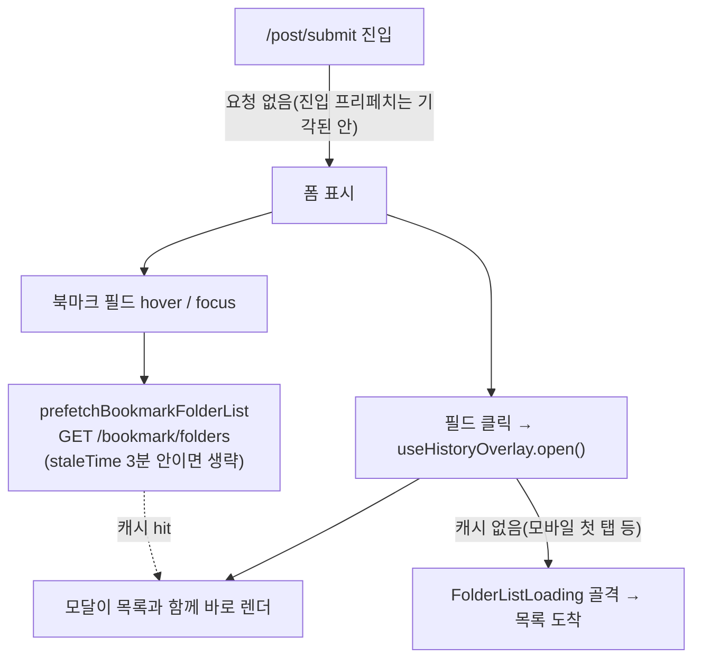

# 등록 폼 북마크 필드에도 폴더 목록 hover 프리페치

## Context

#262에서 피드·상세의 북마크 아이콘에 hover/focus 프리페치를 붙였다. 그런데 등록 폼(`/post/submit`)의 "북마크" 필드는 아직 모달이 열린 **뒤에** 폴더 목록을 요청한다. 근거: `usePostCreateBookmarkFolderField.ts:48`의 `useBookmarkFolderListQuery({ enabled: open })`.

그래서 데스크톱에서도 처음 열 때는 #275의 골격 화면을 거친다. 사용자 요청에 따라 등록 폼 필드에도 카드와 같은 프리페치를 붙인다.

- **2026-09-30 결정과의 관계**: 사용자는 "화면 진입 시 미리 불러오기"를 기각했다. 북마크를 안 쓰고 글만 등록하고 나가도 매번 요청이 나가기 때문이다(`docs/BOOKMARK.md:202`).
- hover/focus 프리페치는 필드에 다가갔을 때만 요청한다. 페이지에 들어오기만 할 때는 요청하지 않으므로 그 결정과 충돌하지 않는다.
- **알고 승인받을 트레이드오프**: 필드 순서는 URL → 제목 → 카테고리 → **북마크(전체 너비)** → 공개 여부 → 등록 버튼이다(`CreatePostForm.tsx:93-141`).
  - 마우스로 등록 버튼까지 내려가다 필드를 지나치기만 해도 요청이 1회 나갈 수 있다. 이후 staleTime 3분 동안은 다시 요청하지 않는다.
  - Tab으로 지나가는 경우도 같다.
  - 모바일은 hover가 없어 탭(=실제 사용)할 때만 focus로 요청된다. 따라서 동작은 지금과 같다. 첫 탭에 골격 화면이 보이는 것도 그대로다.

## 흐름

## 선례

- `src/features/bookmark/toggle/hooks/useBookmarkPostButton.ts`의 `handlePrefetch`, 그리고 `BookmarkPostButton.tsx`의 `onMouseEnter`·`onFocus`
- `prefetchBookmarkFolderList`(`src/entities/bookmark/folder/api/bookmark-folder.queries.ts:50`). 이미 있는 함수라 그대로 재사용한다. `useBookmarkFolderListQuery`와 같은 키·queryFn이라 모달 쿼리와 캐시를 공유한다.
- e2e: `e2e/bookmark-folder-dialog.spec.ts:98-121`(hover → 응답 대기 → 클릭 → 요청 1회 단정)

## 변경

1. **`src/features/post/create/hooks/usePostCreateBookmarkFolderField.ts`**
   - `useQueryClient`와 `prefetchBookmarkFolderList`를 import한다.
   - `handlePrefetch = () => { prefetchBookmarkFolderList(queryClient); }`를 추가하고, 반환 객체에 넣는다.
   - **로그인 가드는 두지 않는다.** `/post/submit`은 `ProtectedLayout` 아래라서, 비로그인이면 자식이 렌더되지 않고 리다이렉트된다(`ProtectedRoute.tsx:48-61`). 카드 버튼과 이 점이 다르다는 주석을 한 줄 남긴다.
2. **`src/features/post/create/ui/PostCreateBookmarkFolderField.tsx`**: 트리거 `Button`에 `onMouseEnter={handlePrefetch}`, `onFocus={handlePrefetch}`를 붙인다. 이 파일은 JSX만 바뀐다.
3. **`e2e/post-create-folder-picker.spec.ts`**: 테스트 1건을 추가한다.
   - 폼이 보인 시점의 `/api/bookmark/folders` 요청이 **0건**인지 확인한다. 진입 프리페치를 하지 않는다는 결정을 회귀 테스트로 고정한다.
   - hover → 응답을 기다린다.
   - 클릭 → 폴더 행이 보인다.
   - 요청이 **1건**인지 확인한다.

## 문서

- **`docs/BOOKMARK.md`**
  - §5 등록 폼 비교표(`:307-317`)에 "폴더 목록 불러오기" 행을 추가한다.
    - 카드: hover/focus 프리페치, 로그인일 때만
    - 등록 폼: hover/focus 프리페치, 보호 라우트라 가드 없음
  - `:324` 단락에 한 문장을 덧붙인다. 진입 프리페치가 아니라 hover라는 점, 그리고 지나치기만 해도 1회 요청된다는 트레이드오프를 적는다.
  - §8 코드 지도의 `usePostCreateBookmarkFolderField` 설명(`:488` 부근)에 "+ hover 프리페치"를 추가한다.
- **`CHANGELOG.md`** `[Unreleased]`: `feat(post)` 항목을 넣는다(`changelog-release` skill 형식).
- **계획 스냅샷**: `docs/plans/2026-10-01-post-create-folder-prefetch.md`를 같은 PR로 커밋한다. PR 전에 fresh general-purpose subagent로 계획 대비 구현을 대조한다(§11).

## 영향 범위(§5)

| 대상                            | 깨질 수 있는 것                                                                                                               | 대응                                                                                          |
| ------------------------------- | ----------------------------------------------------------------------------------------------------------------------------- | --------------------------------------------------------------------------------------------- |
| 폴더 목록 조회(R)               | 프리페치 키가 모달 쿼리와 어긋나면 이중 요청이 생긴다.                                                                        | 기존 `prefetchBookmarkFolderList`를 재사용한다(같은 키). e2e에서 요청 1건을 단정한다.         |
| 폴더 생성·수정·삭제(C/U/D)      | 없음. 읽기만 추가한다.                                                                                                        | —                                                                                             |
| 트리거 문구(`triggerText`)      | 프리페치로 캐시가 채워지면 닫힌 상태에서도 `data`가 생긴다. 다만 선택된 폴더는 모달을 열어야만 생기므로 표시는 바뀌지 않는다. | 기존 단위 테스트 `PostCreateBookmarkFolderField.test.tsx`를 돌려 확인한다.                    |
| 모달을 닫은 뒤 포커스 복귀      | Radix가 트리거로 포커스를 돌려줄 때 `onFocus`로 프리페치가 다시 불린다.                                                       | 방금 받은 데이터라 fresh여서 요청이 생략된다. 3분 넘게 열어 둔 경우에만 1회 재요청한다(무해). |
| 기존 e2e `post-create*.spec.ts` | 요청 수를 단정하는 테스트가 있으면 깨질 수 있다.                                                                              | 전부 실행해서 확인한다.                                                                       |

## 실행 순서

1. `git log origin/main..main` 확인 → `EnterWorktree` → `.env` 복사 → `pnpm install`
2. 위 1 → 2 → 3을 구현한다.
3. `pnpm type-check` → `pnpm test` → `pnpm lint` → `pnpm check:docs` → `pnpm test:e2e`(`pick-e2e-port`가 적용된 스크립트로 실행해 다른 세션 서버를 재사용하지 않는다)
4. 브라우저 녹화(모킹 서버, 데스크톱, 폴더 응답을 1.5초 지연)
   - 챕터 1: 진입 → hover → 클릭 → 목록이 바로 보임
   - 챕터 2(대조군): hover 없이 Tab 없이 바로 클릭하면 골격 화면이 보임

   영상은 워크트리의 `.claude/browser-artifacts/`에 남는다. **사용자가 확인하기 전에는 워크트리를 지우지 않는다.** 지난번에 정리하면서 영상이 함께 사라진 일이 있었다.

5. 사용자 승인 → 커밋 → PR(`## 계획 대비 구현` 포함) → CI → squash 머지 → 배포 run 성공 확인 후 보고

## 검증 방법

- 단위·타입·린트·문서 검사가 모두 통과한다.
- e2e 새 테스트: 진입 시 0건, hover 후 1건, 클릭 시 추가 요청 없이 폴더 행이 즉시 보인다.
- 녹화 영상에서 hover한 경우와 하지 않은 경우의 차이를 육안으로 확인한다.

## 범위 밖

- 모바일 첫 탭 지연. hover가 없어 효과가 없고, #275의 골격 화면이 담당한다.
- hover 의도 지연(일정 시간 머물러야 요청) 같은 장치. 카드 버튼 선례에 없고, 요청 1회의 비용이 작아서 넣지 않는다.
