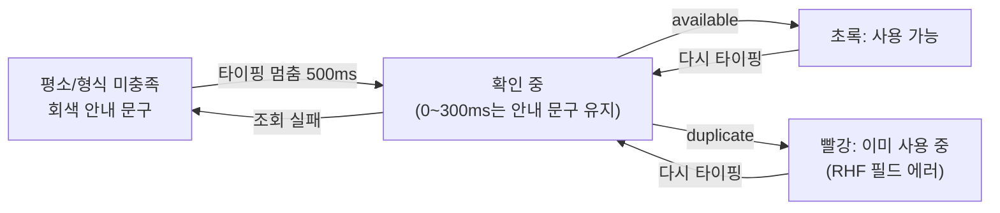

# 회원가입 닉네임·이메일 확인 문구 레이아웃 시프트 제거 (B안: 안내 문구로 줄 채우기)

## Context

회원가입 화면에서 닉네임(이메일도 같음)을 타이핑하면 "사용 가능한 닉네임이에요." 줄이
생겼다 사라졌다 하면서 아래 칸과 버튼이 위아래로 밀린다.

- 원인 1: [FormField.tsx:64](../../src/shared/ui/elements/form/_base/FormField.tsx) — `message`가 없으면 `
`를 렌더하지 않아 줄이 접힌다
- 원인 2: [SignUpForm.tsx:50-54](../../src/features/auth/signup/ui/SignUpForm.tsx) — 재확인이 시작되면 `isAvailable`이 false가 되고, "확인 중"은 `useDelayedLoading` 300ms 뒤에야 떠서 그 사이 문구가 빈다
- 이력: 2026-08-11 `44f43b3`에서 "빈 줄 상시 확보"를 시도했다가 평소 간격이 넓어 보여 되돌렸다

사용자가 고른 방향은 B안이다(Material Design의 "오류 문구가 helper text를 대신한다" 방식, MUI의
`helperText=" "` 줄 확보 관례). 평소에는 규칙 안내 문구를 회색으로 띄워 두고, 확인 중·사용 가능·
중복·형식 오류가 같은 줄을 갈아 끼운다. 그러면 줄이 늘 차 있어서 시프트가 0이고, 08-11에 문제였던
"빈 간격"도 생기지 않는다.

모든 상태가 **같은 한 줄**에 들어가므로 줄 높이는 변하지 않는다.

## 실행 순서

1. **미리보기 먼저 (CLAUDE.md §9)** → verify: 사용자 승인
   - 실제 Tailwind 클래스(`text-sm font-medium min-h-5 pl-0.5`, `text-muted-foreground`/`text-success`/`text-destructive`)로
     회원가입 폼 상단 2칸의 상태별 모습(평소/확인 중/사용 가능/중복/형식 오류)을 나란히 보여주는 Artifact 페이지
   - 같은 페이지에서 정할 것: 안내 문구 문안(닉네임·이메일), 0~300ms 구간에 안내 문구를 보여줄지 직전 문구를 유지할지
2. **워크트리 생성 + 부트스트랩** (`git log origin/main..main` 확인 → `EnterWorktree` → `.env` 복사, `pnpm install`)
3. **TEXTS 키 추가** — `texts-conventions` skill 먼저 읽기. [texts.ts](../../src/shared/config/texts.ts) `auth.signup`에
   `nicknameHint`, `emailHint` 추가(해요체). 닉네임 문안은 [account.schema.ts:6-10](../../src/entities/account/model/account.schema.ts) 규칙(2~20자, 한글·영문·숫자·`_.-`)과 일치시킨다
4. **SignUpForm 수정** — `nicknameDescription`/`emailDescription`의 마지막 `undefined`를 각 hint로 바꾼다.
   `descriptionVariant`는 기존 그대로(`isAvailable`일 때만 success, 그 외 muted). 중복·형식 오류는
   [FormField.tsx:45](../../src/shared/ui/elements/form/_base/FormField.tsx)가 이미 `error.message ?? description`으로 우선 표시하므로 손대지 않는다
5. **CHANGELOG `[Unreleased]`** 항목 추가 (`changelog-release` skill)

공용 컴포넌트(`FormField`, `FormInput`), `useAvailabilityCheck`, `useSignUp`은 바꾸지 않는다.

## 영향 범위 (CLAUDE.md §5)

- 데이터 CRUD: 없음 (표시 문구만 바뀜, API·스키마 계약 불변)
- 회귀 가능 지점
  - [useSignUp.test.tsx](../../src/features/auth/signup/hooks/useSignUp.test.tsx) — 훅은 안 바꾸므로 영향 없을 것. SignUpForm 렌더 테스트가 "문구 없음"을 단정하는 게 있으면 갱신 필요(구현 시 grep)
  - e2e(`e2e/`)에 회원가입 문구를 단정하는 시나리오가 있는지 확인
  - 마이페이지 [UpdateAccountForm.tsx](../../src/features/account/update/ui/UpdateAccountForm.tsx)도 같은 증상이 있을 수 있지만 **범위 밖** — 회원가입만 고치고 언급만 한다

## 검증 방법

1. `pnpm type-check` → `pnpm test` → `pnpm lint`
2. `browser-verification` skill로 `/signup`에서 닉네임을 여러 번 고쳐 치며 녹화 — 비밀번호 칸·가입 버튼의 y좌표가 움직이지 않는지 확인(`browser_evaluate`로 버튼 `getBoundingClientRect().top`을 상태별로 찍어 비교)
3. 중복 닉네임, 형식 오류(1자·특수문자) 제출, 네트워크 실패(조회 에러 → 안내 문구로 복귀) 각각 확인

## 남은 것

- 마이페이지 닉네임 수정 폼에도 같은 방식을 적용할지는 별도 결정
