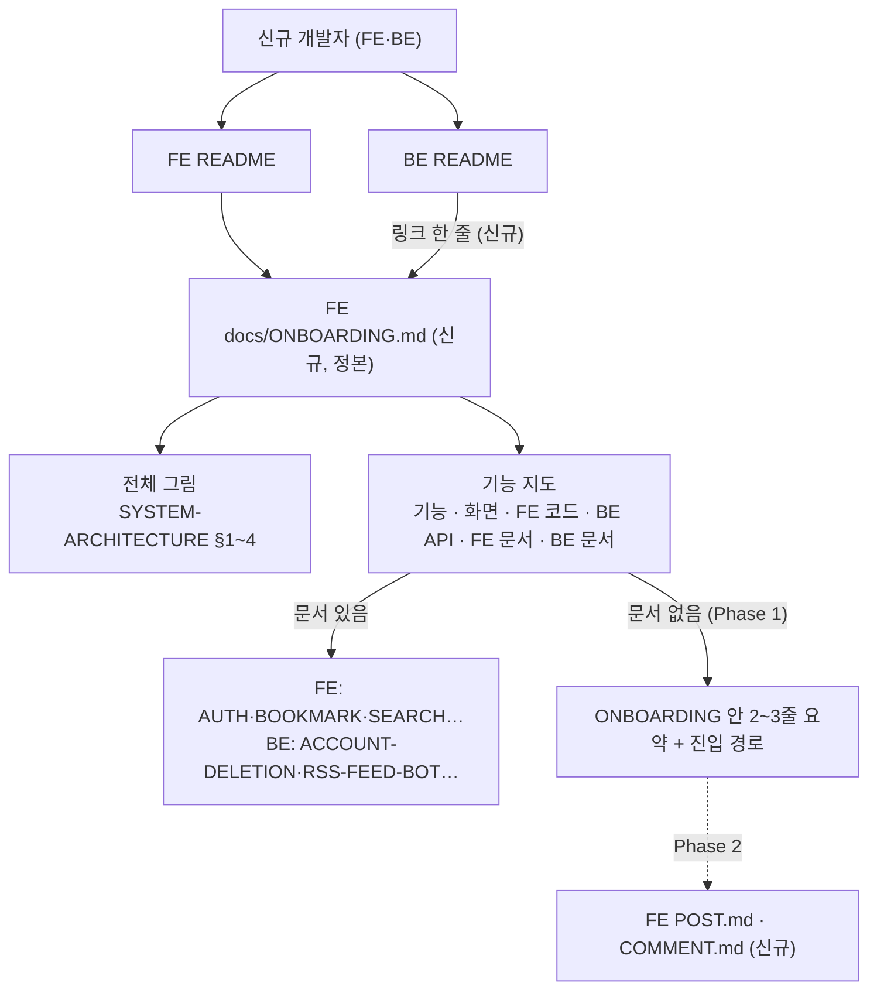

# 프로젝트 전체(FE·BE) 온보딩 문서 — 길잡이(ONBOARDING.md) + 빈 기능 문서 단계별 보강

> 처음 합류한 개발자가 FE·BE 구분 없이 "이 서비스에 어떤 기능이 있고, 각 기능을 어느 레포의 어느 문서·코드에서 보면 되는가"를 한 문서에서 출발해 따라갈 수 있게 한다.

## Context

- 사용자 요청(2026-10-02): "처음 온 사람이 이 프로젝트를 궁금해하면 기능별 설명을 어떻게 문서로 만들어 전달할지" 계획을 세운다.
- 사용자 결정:
  - **대상** = 신규 개발자(FE·BE 구분 없음, 비개발자 제외)
  - **형태** = 레포 마크다운
  - **범위** = 길잡이 먼저, 빈 기능 문서는 단계별
  - **정본 위치** = FE 레포. BE README는 링크만 둔다.
- 조사 결과(2026-10-02):
  - **"여기서 시작" 문서·읽는 순서 안내·레포 전체 용어집이 FE·BE 어디에도 없다.** 두 README의 `## 시작하기`는 설치·실행만 다룬다.
  - **레포가 둘이고 공통 상위 레포가 없다.** `link-sphere/`는 git 레포가 아니고 워크스페이스 파일만 있다.
  - **"통합 문서는 FE 레포" 선례가 이미 있다.**
    - BE `HISTORY.md`·`VERSION-COMPATIBILITY.md`는 보관 처리하면서 "FE 레포에서 통합 관리"라고 적었다(BE README `## 문서` 보관 절).
    - FE `SYSTEM-ARCHITECTURE.md`가 BE 구조(§4)와 BE 배포(§2)까지 다룬다.
  - **기능 문서 분포**:
    - FE 13개: AUTH·BOOKMARK·SEARCH·MYPAGE·FCM 등
    - BE 5개: RSS-FEED-BOT·AI-ASYNC-PROCESSING·ACCOUNT-DELETION·PERFORMANCE·CI-CHECK-GATE
    - BE README `## API 엔드포인트`(BE README.md:165~)에 도메인별 API 목록이 있다.
  - **양쪽 다 문서가 없는 핵심 기능**: 홈 피드·게시글 목록/카드, 게시글 작성·수정·삭제, 댓글 CRUD·내 댓글, 좋아요(게시글·댓글). 레이아웃·에러 페이지는 FE에만 해당하고 동작 스펙이 얇다.
  - **CI 제약**: FE `scripts/check-docs.js`(`pnpm check:docs`)가 다음을 검사한다.
    - `docs/*.md`가 README `## 문서`에 등록됐는지
    - 문서 속 FE 경로가 실제로 있는지, 인용한 줄 번호가 파일 범위 안인지
    - BE 경로(`src/main/kotlin/…`)는 존재 검사에서 건너뛴다.

## 판단이 필요했던 항목

| 항목               | 결정                                                                                                                               | 근거·기각한 대안                                                                                                                                                                         |
| ------------------ | ---------------------------------------------------------------------------------------------------------------------------------- | ---------------------------------------------------------------------------------------------------------------------------------------------------------------------------------------- |
| 정본 위치          | FE `docs/ONBOARDING.md` 하나에 두고, BE README는 링크만 둔다                                                                       | 사용자 결정. BE가 이미 HISTORY·버전 매트릭스를 "FE 통합 관리"로 넘긴 선례와 같은 방식이다. 기각: 양쪽 레포에 각자 두기(기능 지도 두 벌이 어긋남), 별도 문서 레포(새 저장소·CI 신설 비용) |
| 문서 분류          | FE CLAUDE.md "docs/ 내부 분류"에 **길잡이(온보딩)** 종류를 추가하고, FE README `## 문서` 맨 위 "처음 왔다면"에 등록한다            | 기존 6종 중 맞는 종류가 없다. 길잡이는 사실을 담지 않고 다른 문서를 엮기만 한다. "절차"에 억지로 넣으면 분류 의미가 흐려진다                                                             |
| 사실을 옮겨 적을까 | 옮겨 적지 않고 링크로 가리킨다. 양쪽 다 문서가 없는 기능만 2~3줄 요약과 진입 경로를 적는다                                         | SSOT 원칙. 기술 스택·설치·API 목록·FSD 트리는 각 README와 FE-ARCHITECTURE가 정본이다                                                                                                     |
| BE 링크 형식       | `https://github.com/BAECHAN/link-sphere_BE_NEW/blob/main/...` 절대 URL을 쓰고, 경로는 파일·폴더까지만 적는다                       | 레포가 따로 있어 상대 경로를 쓸 수 없다. `check:docs`가 BE 경로를 검사하지 않으므로 줄 번호는 넣지 않아 낡을 여지를 줄인다                                                               |
| 빈 기능 문서       | Phase 2에서 FE `POST.md`·`COMMENT.md`를 작성한다. 좋아요는 각 문서 안에 절로 넣고, 회원 탈퇴는 BE ACCOUNT-DELETION 링크로 충분하다 | 좋아요는 interaction entity를 공유하는 하위 동작이다. 탈퇴는 이미 BE 문서가 있어 구멍이 아니다(앞선 FE만 조사했을 때의 판단을 정정)                                                      |

## 세부 계획

### Phase 1 — 길잡이 (FE PR 1개 + BE PR 1개)

**프론트엔드**

| 위치                                  | 변경 내용                                                                                                                                                                             |
| ------------------------------------- | ------------------------------------------------------------------------------------------------------------------------------------------------------------------------------------- |
| `docs/ONBOARDING.md` (신규)           | 머리말 인용 블록: 문서 성격 = 길잡이, 대상 독자 = 이 프로젝트(FE·BE)에 처음 합류한 개발자, 읽고 나면 = 기능별로 어느 레포·문서·코드를 볼지 안다, **마지막 검토**. 절 구성은 아래 참고 |
| `README.md:167~` `## 문서`            | 맨 위에 "**처음 왔다면**" 항목을 추가하고 `docs/ONBOARDING.md`를 링크한다. `## 시작하기` 끝에 한 줄 포인터를 추가한다                                                                 |
| `.claude/CLAUDE.md` "docs/ 내부 분류" | **길잡이(온보딩)** 종류를 추가한다: 사실 복제 금지. FE·BE 기능 문서를 추가·삭제하면 기능 지도도 갱신한다                                                                              |

**백엔드**

| 위치                                 | 변경 내용                                                                                               |
| ------------------------------------ | ------------------------------------------------------------------------------------------------------- |
| `README.md` `## 문서` 맨 위          | "**처음 왔다면** → FE 레포 `docs/ONBOARDING.md`(프로젝트 전체 길잡이)" 링크 한 줄                       |
| `.claude/CLAUDE.md` "문서 파일 위치" | "프로젝트 전체 길잡이는 FE 레포가 정본이고, BE 기능 문서를 추가·삭제하면 그 기능 지도도 갱신한다" 한 줄 |

`docs/ONBOARDING.md`의 절 구성:

1. **이 서비스는 무엇인가** — 한 문단. 배포 URL·테스트 계정은 FE README 링크로 대신한다.
2. **전체 그림** — Mermaid 1개(브라우저 → CloudFront → S3(FE) / Lambda(BE) → Supabase·Gemini 등). 상세는 `SYSTEM-ARCHITECTURE.md` §1~4 링크. FE 내부 import 구조는 `pnpm graph:archi`로 본다고 한 줄 안내한다.
3. **두 레포 소개** — 레포별 역할·스택 한 줄과 각 README 링크.
4. **첫날 할 일** — FE·BE 로컬 실행 순서(BE 8080 → FE 31119 프록시)와 각 README `## 시작하기` 링크. 명령 원문은 복제하지 않는다.
5. **기능 지도(핵심)** — 표 `기능 | 화면 경로(라우트) | FE 코드 위치 | BE API(도메인) | FE 문서 | BE 문서`.
   - 라우트는 FE 라우터 파일에서 실제로 추출한다.
   - BE API 칸은 BE README `## API 엔드포인트`의 해당 절로 링크한다.
   - 화면이 없는 BE 기능(RSS 봇·AI 분석·탈퇴 만료 배치)도 행으로 넣는다.
   - 양쪽 다 문서가 없으면 "문서 없음 — 요약:" 2~3줄을 적는다.
6. **읽는 순서** — 공통 1일차: SYSTEM-ARCHITECTURE §1. 이후 역할별로 갈린다.
   - FE: FE-ARCHITECTURE §1·3·5·6 → AUTH.md 1~5장 → TESTING.md
   - BE: BE README 프로젝트 구조 → AI-ASYNC-PROCESSING → BE DEPLOY
   - DECISIONS.md는 필요할 때 검색해서 읽는다.
7. **공통 용어** — 여러 문서에 걸치는 용어(FSD·3-Layer API·`TEXTS`·SnapStart·OAC·SSOT·낙관적 업데이트 등)만 1줄로 정의하고 정본 링크를 단다.
8. **작업 규칙 요약** — 워크트리·커밋 형식·PR squash·CHANGELOG 같은 핵심만 적고, 양 레포 `.claude/CLAUDE.md` 링크.
9. **관련 문서**.

### Phase 2 — 빈 기능 문서 (Phase 1 병합 후 별도 계획·PR)

| 위치                              | 변경 내용                                                                                                              |
| --------------------------------- | ---------------------------------------------------------------------------------------------------------------------- |
| FE `docs/POST.md` (신규)          | 홈 피드·목록/카드·작성·수정·삭제·게시글 좋아요. 독립 기능 문서 13절 순서를 따르고, BE API·AI 분석은 BE 문서로 링크한다 |
| FE `docs/COMMENT.md` (신규)       | 댓글 CRUD·답글·내 댓글·댓글 좋아요. 알림은 FCM-PUSH-NOTIFICATION.md로 링크한다                                         |
| FE `docs/ONBOARDING.md` 기능 지도 | "문서 없음" 칸을 새 문서 링크로 교체한다                                                                               |

착수할 때 POST → COMMENT 순서로 다시 plan mode를 거친다.

## 영향 범위

- **코드 변경 없음.** 양 레포의 문서·README·CLAUDE.md만 바뀐다.
- **배포 순서**: FE PR을 먼저 병합하고, 그다음 BE PR을 병합한다. BE README 링크가 가리킬 파일이 먼저 있어야 한다. 순서가 뒤집혀도 그 사이에는 링크가 404일 뿐 다른 영향은 없다.
- **FE `pnpm check:docs`**: 새 문서를 README에 등록하지 않거나 FE 경로가 틀리면 CI가 실패한다. 이는 의도된 감시다. BE 링크는 검사되지 않는다. 그래서 BE 쪽 파일 이동은 BE CLAUDE.md에 추가하는 갱신 규칙에 의존한다.
- **BE 영향**: BE `docs/`에 새 파일이 생기지 않으므로 BE 문서 검사 스크립트 유무와 관계없다. 다만 BE의 기존 README 검사 규칙은 착수할 때 확인한다.
- **CLAUDE.md 수정 반영 시점**: 양 레포 모두, 수정 이후에 시작한 세션부터 반영된다.
- **문서 간 겹침**: SYSTEM-ARCHITECTURE.md와 내용이 겹치지 않게, ONBOARDING의 전체 그림은 요약 그림 1개 + 링크로만 둔다.

## 검증 방법

1. FE `pnpm check:docs`를 통과한다.
2. 기능 지도를 실제와 대조한다.
   - FE: 표에 빠진 `src/pages/`·`src/features/` 슬라이스가 없는지 `ls` 결과와 표 행을 대조한다.
   - BE: 표에 빠진 API 도메인이 없는지 BE README `## API 엔드포인트` 절 목록과 대조한다.
   - 모든 BE GitHub URL이 실제 파일을 가리키는지 `ls`로 확인한다.
3. **독자 리뷰 대행**: 맥락 없는 fresh general-purpose subagent 2개(FE 역할·BE 역할)에게 ONBOARDING.md만 주고 과제를 풀게 한 뒤, 답이 정답 파일과 맞는지 확인한다.
   - FE 과제 예: "댓글 수정 버그는 어디부터 보나"
   - BE 과제 예: "탈퇴 유예기간 만료 처리는 어디인가", "RSS 봇 수집 주기는 어디서 바꾸나"
4. CLAUDE.md §11: 계획을 FE `docs/plans/2026-10-02-onboarding-docs.md`로 FE PR에 커밋한다. fresh subagent로 계획과 구현을 대조하고, 결과를 양 PR 본문 `## 계획 대비 구현`에 남긴다.

## 남은 것

- Phase 2(FE POST.md·COMMENT.md)는 별도 계획으로 진행한다.
- SYSTEM-ARCHITECTURE.md에 표준 머리말과 마지막 검토일이 없다. ONBOARDING이 이 문서로 사람을 보내므로 신선도 확인이 필요하다. 이번 범위에서는 언급만 한다.
- AWS 실제 리소스와 SYSTEM-ARCHITECTURE §1 그림의 대조는 이번 범위 밖이다.
- BE 링크의 낡음을 자동 감지하는 장치가 없다. 필요하면 나중에 FE `check:docs`가 로컬 BE 체크아웃을 선택적으로 검사하게 하는 방안을 검토한다.
