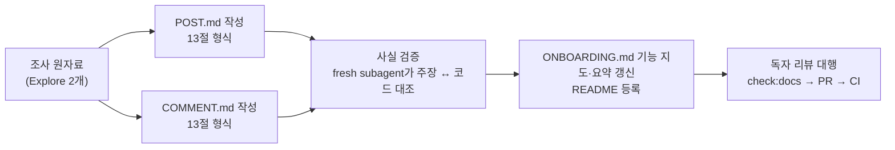

# 온보딩 Phase 2 — 게시글(POST.md)·댓글(COMMENT.md) 독립 기능 문서 작성

> FE·BE 둘 다 기능 문서가 없던 게시글·댓글 기능을 독립 기능 문서 두 개로 채우고, 길잡이(ONBOARDING.md)의 "문서 없음" 칸을 링크로 바꾼다.

## Context

- Phase 1(FE #292, BE #60, 2026-10-02 병합)에서 `docs/ONBOARDING.md` 기능 지도를 만들었다. 그때 "문서 없음"으로 남긴 기능은 다음과 같다.
  - 게시글: 목록(홈 피드), 작성·수정·삭제
  - 댓글: 댓글·답글, 내 댓글
  - 좋아요(게시글·댓글)
- Phase 1 계획에서 정한 범위: POST.md와 COMMENT.md를 쓴다. 좋아요는 각 문서 안의 절로 넣는다. 레이아웃·에러 페이지는 길잡이 요약으로 충분하다.
- 2026-10-02 사용자가 "phase2 진행"을 지시했다.
- 조사 결과(Explore 2개, 2026-10-02). 원자료는 문서 작성 단계에서 다시 코드로 확인한다.
  - **게시글**
    - 대상 범위: 피드(가상 그리드·무한 스크롤), 상세(404 처리), 작성(응답 기다리지 않는 제출 + page 0 앞에 끼워 넣기), 수정(direct patch), 삭제(낙관적 + 북마크 폴더 카운트 보정), 공개 토글, 좋아요(낙관적·롤백).
    - **코드와 다르게 짐작하기 쉬운 사실 3가지**
      - AI 요약 대기 표시나 폴링이 없다. SSE 훅은 2026-03에 삭제됐다.
      - 좋아요는 `ToggleButton`을 쓰지 않는다.
      - 제목 길이 상한이 없다.
  - **댓글**
    - 대상 범위: 트리 2단계, 톰스톤, 낙관적 작성, 이미지 최대 5장(서명 URL로 직접 업로드), 바이트 상한(6,000B / 전송 7,500B, WAF 8KB 배경), 수정 재귀 patch, 내 댓글 해시 스크롤, 모바일 하단 바·플로팅 버튼, 댓글 좋아요.
  - **이미 다른 문서가 다루는 부분은 링크만 건다**: SEARCH, UNSAVED-CHANGES-GUARD, POST-DETAIL-BACK-NAVIGATION, BOOKMARK §5, FE-ARCHITECTURE §5·§8·§10·§11, AUTH(이메일 인증 게이트), FCM(댓글 푸시), DECISIONS(WAF 8KB 사건 등).

## 판단이 필요했던 항목

| 항목                    | 결정                                                                                                                                                                                                                | 근거·기각한 대안                                                                                                                 |
| ----------------------- | ------------------------------------------------------------------------------------------------------------------------------------------------------------------------------------------------------------------- | -------------------------------------------------------------------------------------------------------------------------------- |
| 문서 형식               | 독립 기능 문서 13절 순서. 머리말 인용 블록, 1장 끝 Mermaid 순서도                                                                                                                                                   | CLAUDE.md "독립 기능 문서 내부 순서" 규칙. 선례는 `BOOKMARK.md`·`MYPAGE.md`                                                      |
| 문서 경계               | POST.md는 게시글 + 게시글 좋아요 + 공개 토글. COMMENT.md는 댓글·답글 + 댓글 좋아요 + 내 댓글. 좋아요 낙관적 업데이트 패턴 자체는 FE-ARCHITECTURE §11로 링크                                                         | Phase 1에서 확정. 기각: 좋아요 독립 문서(interaction 엔티티를 공유하는 하위 동작이라 따로 떼면 흐름이 끊긴다)                    |
| 중복 처리               | 검색·이탈 가드·돌아가기·북마크 폴더 필드·이메일 게이트·푸시는 해당 문서 링크와 한 줄 요약만 둔다                                                                                                                    | SSOT 원칙                                                                                                                        |
| 조사 중 발견한 공백     | 문서 "남은 것" 절에 기록만 하고 코드는 고치지 않는다. 대상: 좋아요 실패 시 무음, 상세 삭제 후 push 이동, `totalElements`를 `Math.max` 없이 감소, 내 댓글 카드에 이미지 URL 노출 가능성, FCM 딥링크에 댓글 해시 없음 | 이번 작업은 문서 작업이고 범위를 넘는 코드 수정은 하지 않는다(CLAUDE.md §3). 고칠지는 사용자가 따로 정한다                       |
| DECISIONS와 코드 불일치 | DECISIONS 2026-09-14 항목은 해시 스크롤을 `center`로 적었지만 코드는 `start`다. COMMENT.md에는 코드 기준으로 쓰고 시행착오 절에 차이를 밝힌다. DECISIONS는 고치지 않는다                                            | DECISIONS는 append-only                                                                                                          |
| PR 단위                 | PR 1개(POST.md + COMMENT.md + ONBOARDING·README 갱신)                                                                                                                                                               | 둘 다 ONBOARDING 기능 지도의 같은 표를 고쳐서, 나누면 충돌이 나거나 순서가 묶인다. squash로 커밋 1개가 된다. 기각: 문서별 PR 2개 |

## 세부 계획

| 위치                                                             | 변경 내용                                                                                                                                                                                                                   |
| ---------------------------------------------------------------- | --------------------------------------------------------------------------------------------------------------------------------------------------------------------------------------------------------------------------- |
| `docs/POST.md` (신규)                                            | 머리말과 13절. 아래 "절별 핵심" 참고                                                                                                                                                                                        |
| `docs/COMMENT.md` (신규)                                         | 머리말과 13절. 아래 "절별 핵심" 참고                                                                                                                                                                                        |
| `docs/ONBOARDING.md` §5 기능 지도                                | 게시글 목록·작성/수정/삭제·댓글·내 댓글·좋아요 행의 "없음(아래 요약)"을 POST/COMMENT 링크로 바꾼다. "문서가 아직 없는 기능 — 요약" 절에서 해당 항목을 지우고 레이아웃·에러 페이지만 남긴다. **마지막 검토** 날짜를 갱신한다 |
| `README.md` `## 문서` 독립 기능 문서 목록                        | POST.md·COMMENT.md를 가나다순 위치에 등록한다(`check:docs` 요구)                                                                                                                                                            |
| `docs/plans/2026-10-02-onboarding-phase2-feature-docs.md` (신규) | 이 계획의 스냅샷                                                                                                                                                                                                            |

### POST.md 절별 핵심

- **1 쉬운 설명**: 피드 → 상세 → 작성 → 수정 → 삭제 → 좋아요·공개 토글을 Mermaid 순서도 하나로 그린다. 노드마다 API 호출과 캐시 처리를 적는다.
- **4 왜 만들었나**: 링크 공유가 서비스의 핵심 행위라는 점. 제출을 기다리지 않는 이유(BE 크롤링·AI 분석이 느림, keepalive).
- **5 구조**: 엔티티·피처·위젯·페이지 책임 분리, mutation별 캐시 전략 표(page 0 끼워 넣기 / direct patch / 낙관적 삭제 / 낙관적 좋아요 / 공개 토글은 낙관적 아님).
- **6 상태 모델**: `postKeys` 계층, 다른 엔티티가 post 캐시를 무효화하는 표(comment·account·auth·bookmark), 스키마 필드 표. 원본 파일은 링크한다.
- **7 운영 파라미터**: `POST_PAGE_SIZE`, staleTime, 지연·최소 노출 시간, 그리드 상수, 프리페치 행 수. `파일:줄`로 적는다.
- **8 코드 지도와 자주 하는 수정**: "카드에 필드 추가", "폼에 입력 추가", "캐시 갱신 범위 변경" 레시피.
- **9 검증 결과**: 관련 단위 테스트와 e2e 목록.
- **10 시행착오**: 2026-08-13 새 글 미표시, 삭제 후 폴더 카운트, 2026-09-10 롤백 누락, file:// URL, keepalive 누락, 카드 전체 클릭 영역. 커밋 해시와 DECISIONS 링크를 단다.
- **11 남은 것, 12 용어 사전, 13 관련 문서.**

### COMMENT.md 절별 핵심

- **1 쉬운 설명**: 목록 조회 → 작성(검증 → 이미지 업로드 → 낙관적 삽입 → 치환/롤백) → 수정 → 삭제(톰스톤/hard) → 좋아요 → 내 댓글 해시 이동을 순서도 하나로 그린다.
- **5 구조**: 트리 깊이 제한, 낙관적 작성 수명주기(temp id, blob URL 해제), 수정 재귀 patch를 쓰는 이유, 모바일 바·플로팅 버튼 배치.
- **6 상태 모델**: `commentKeys`, 성공 핸들러 3종이 무효화하는 범위 표, 폼 스키마.
- **7 운영 파라미터**: 이미지 장수, 바이트 상한 2종(WAF 8KB와의 관계는 CLAUDE.md·DECISIONS 링크), 업로드 동시성, 리사이즈·파일 상한, 강조 시간, rootMargin.
- **10 시행착오**: 2026-09-06 403 추적(WAF 상한 완화 시도 → 원복 → 상한 3단계 하향 → 전송 바이트 안전망 → XSS 룰 오탐이 진짜 원인), `space-y` 레이아웃 흔들림, 수정 후 깜빡임, 해시 스크롤 center → start 불일치.
- **나머지 절**은 POST.md와 같은 방식으로 쓴다.

## 영향 범위

- **코드 변경 없음.** `docs/`, `README.md`만 바뀐다.
- **`pnpm check:docs`**: 새 문서의 `파일:줄`은 범위만 검사되고, 그 줄의 내용이 맞는지는 검사되지 않는다. 그래서 줄 번호의 정확성은 아래 사실 검증 단계로 보증한다.
- **줄 번호는 코드가 바뀌면 낡는다.** `scripts/check-doc-drift.js`가 트래킹 이슈로 일부(삭제된 export·경로)를 잡는다.
- **ONBOARDING 기능 지도**: 행을 지우지 않고 칸만 바꾼다. Phase 1 독자 리뷰에서 확인한 경로는 그대로 유지된다.

## 검증 방법

1. `pnpm check:docs` 통과(README 등록, 경로, 줄 범위, `
` 짝).
2. **사실 검증**: fresh general-purpose subagent 2개(POST, COMMENT 각 1개)에게 문서와 코드를 주고, 다음을 대조해 불일치 목록을 받는다. 지적된 항목을 고친다.
   - 문서의 모든 `파일:줄` 인용이 실제로 그 내용을 가리키는지
   - 동작 서술(낙관적 여부, 토스트 유무, 이동 방식)이 코드와 맞는지
3. **독자 리뷰 대행**: 맥락 없는 subagent에게 ONBOARDING → POST/COMMENT 경로만 주고 과제를 풀게 한다.
   - 과제 예: "게시글 좋아요 실패 시 화면은 어떻게 되나", "댓글 이미지 최대 장수는 어디서 바꾸나", "새 글을 올린 직후 피드 맨 위에 보이는 원리는"
4. **문서 자체 점검**: CLAUDE.md "독립 기능 문서" 체크(① 정의 없는 용어 ② 이 문서만으로 수정 가능한가 ③ 정본 중복 ④ 스니펫 일치)를 직접 수행한다.
5. **§11**: 계획 스냅샷을 커밋하고, fresh subagent로 계획 대비 구현을 대조해 PR 본문에 남긴다.

## 남은 것

- 조사 중 발견한 코드 공백 5건(판단 표 참고)을 고칠지는 별도로 결정한다.
- 레이아웃·에러 페이지는 계속 길잡이 요약으로 둔다.
