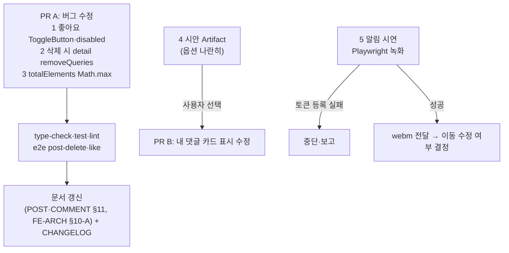

# 문서화 중 발견한 게시글·댓글 문제 수정 + 댓글 알림 시연

> POST.md·COMMENT.md(#294)를 쓰며 찾은 코드 문제 가운데 사용자가 고르신 4건을 고친다. 몰랐던 댓글·답글 푸시 알림은 실제 동작을 녹화해 보여준다.

## Context

- 2026-10-02 Phase 2 문서화 중에 코드 문제 5건을 찾았고, 사용자가 처리 방향을 정했다.
  1. **좋아요 버튼**: `ToggleButton`(400ms 연타 방지)을 적용하고, 댓글 좋아요에도 `disabled={isPending}`을 넣는다.
  2. **상세에서 삭제한 뒤**: detail 캐시를 `removeQueries`로 지운다.
  3. **목록 삭제 시 `totalElements`**: `Math.max(0, …)` 보호를 넣는다.
  4. **내 댓글 카드의 이미지 URL 노출**: 이번에 포함하되, 시안을 먼저 보여드리고 고르신 뒤 반영한다.
  5. **댓글·답글 푸시 알림**: Playwright로 녹화해 보여준다. "알림을 누르면 해당 댓글로 이동" 수정은 시연을 본 뒤 결정한다.
- 조사로 확인한 사실(2026-10-02).
  - **`disabled={isPending}`**: 폼 제출 버튼, 북마크 폴더 행, 공개 전환 버튼에 널리 쓰인다. 토글형 버튼은 `LikePostButton`(`src/features/post/like/ui/LikePostButton.tsx:33`) 한 곳뿐이다. `LikeCommentButton`에는 `disabled`도 연타 방지도 없다.
  - **`ToggleButton`**(`src/shared/ui/elements/ToggleButton.tsx`): `onClick`만 `useClickGuard`로 감싸고 나머지 props는 `Button`에 그대로 넘긴다. 그래서 바꿔도 겉모습은 그대로다. 지금 쓰는 5곳은 모두 서버를 부르지 않는 로컬 토글이고, 좋아요를 일부러 뺐다는 기록은 없다.
  - **삭제 mutation**(`src/entities/post/api/post.queries.ts:246-317`): `onSuccess`가 북마크 폴더만 무효화하고 `postKeys.detail(id)`는 그대로 둔다. 상세에서 삭제하면 push로 `/post`에 가고(`usePostCard.ts:56-58`), 뒤로가기하면 staleTime 3분 안에서는 캐시의 삭제된 글이 다시 그려질 수 있다(코드상 추론).
  - **`totalElements` 감소**: `post.queries.ts:284`에 `Math.max`가 없다. 지금은 화면 어디에도 표시하지 않아 체감 영향은 없다.
  - **내 댓글 카드**(`MyCommentCard.tsx:20`): `content`를 그대로 출력한다. BE가 이미지를 "한 줄에 URL 하나"로 본문에 이어 붙이고, `splitContentImages`(`src/shared/lib/content/imageContent.ts:13`)가 그 역변환이다.
  - **푸시 알림**(`docs/FCM-PUSH-NOTIFICATION.md`)
    - 남이 내 글에 댓글을 달거나 내 댓글에 답글을 달면 온다. 권한은 로그인할 때 자동으로 요청한다.
    - 탭을 보고 있으면 앱 안에 토스트("보러가기")가 뜨고, 백그라운드면 OS 알림이 온다.
    - 로컬 BE에서는 발송되지 않는다. 로컬 FE의 `.env`가 원격 BE를 가리키므로 데모는 운영 DB를 거친다.

## 판단이 필요했던 항목

| 항목                                         | 결정                                                                                                              | 근거·기각한 대안                                                                                                                                                                                                                       |
| -------------------------------------------- | ----------------------------------------------------------------------------------------------------------------- | -------------------------------------------------------------------------------------------------------------------------------------------------------------------------------------------------------------------------------------- |
| 좋아요에 ToggleButton과 disabled를 함께 둘지 | 둘 다 쓴다                                                                                                        | 사용자 지시. ToggleButton은 400ms 안의 재클릭을, `disabled`는 요청 중 재요청을 막는다. 막는 구간이 서로 다르다                                                                                                                         |
| removeQueries 위치                           | 엔티티 삭제 mutation의 `onSuccess`에서 `postKeys.detail(postId)`를 지운다. `post.keys.ts`에 헬퍼를 두고 호출한다  | CLAUDE.md "캐시 조작은 keys 헬퍼로". **위험**: 상세 화면이 아직 떠 있을 때 캐시를 지우면 재조회 → 404 → "찾을 수 없어요" 토스트가 잠깐 뜰 수 있다. e2e로 확인하고, 뜨면 지우는 시점을 화면 이동 뒤(`usePostCard`의 onSuccess)로 옮긴다 |
| totalElements                                | `Math.max(0, …)`만 넣는다                                                                                         | 사용자 지시. 지운 글이 없는 필터 목록까지 개수를 줄이는 문제는 범위 밖이라 POST.md §11에 기록으로 남긴다                                                                                                                               |
| PR 단위                                      | PR A(1·2·3)와 PR B(4)로 나눈다                                                                                    | 4번은 시안 승인을 기다려야 해서, 묶으면 1~3이 묶여 대기한다                                                                                                                                                                            |
| 알림 시연 방법                               | Playwright MCP 영상(`browser-verification` skill). 받는 쪽 A와 보내는 쪽 B를 서로 다른 브라우저 컨텍스트로 띄운다 | 사용자 선택. 앱 안 토스트까지만 찍히고 OS 알림은 찍히지 않는다                                                                                                                                                                         |

## 세부 계획

### PR A — 버그 수정 (1·2·3)

| 위치                                                 | 변경 내용                                                                                          |
| ---------------------------------------------------- | -------------------------------------------------------------------------------------------------- |
| `src/features/post/like/ui/LikePostButton.tsx`       | `Button`을 `ToggleButton`으로 바꾼다. `disabled={isLiking}`은 유지                                 |
| `src/features/comment/like/ui/LikeCommentButton.tsx` | `Button`을 `ToggleButton`으로 바꾸고 `disabled={likeMutation.isPending}`을 추가                    |
| `src/entities/post/api/post.keys.ts`                 | detail 캐시를 지우는 헬퍼 추가(기존 `postInvalidateQueries` 옆, 같은 형태)                         |
| `src/entities/post/api/post.queries.ts`              | 삭제 mutation `onSuccess`에서 헬퍼 호출. `:284`를 `Math.max(0, page.totalElements - 1)`로          |
| `src/entities/post/api/post.queries.test.ts`         | 삭제 성공 시 detail 캐시가 사라지는지, totalElements가 0 아래로 내려가지 않는지 케이스 추가        |
| `e2e/post-delete.spec.ts`                            | 상세에서 삭제 → 뒤로가기 → 삭제된 글이 다시 그려지지 않고, 404 토스트가 깜빡이지 않는지 단계 추가  |
| `docs/FE-ARCHITECTURE.md` §10-A                      | ToggleButton 사용처에 좋아요 버튼 2개 추가. 서버 토글은 `disabled={isPending}`을 함께 둔다는 한 줄 |
| `docs/POST.md` §5·§11, `docs/COMMENT.md` §5·§11      | 좋아요 버튼 서술, "삭제 후 404 경유"(틀린 추론), totalElements 항목을 고친 상태에 맞게 갱신        |
| `CHANGELOG.md` `[Unreleased]`                        | fix 항목 2개(좋아요 연타 방지, 삭제한 글이 뒤로가기로 다시 보임)                                   |

### PR B — 내 댓글 카드 (4)

1. **시안**: `MyCommentCard`의 실제 Tailwind 클래스와 `globals.css` 토큰을 그대로 쓴 Artifact 한 장에 옵션을 나란히 놓는다(CLAUDE.md §9). 경우마다(텍스트만, 텍스트+이미지, 이미지만) 보여준다.
   - **A**: 텍스트 + `🖼 2` 개수 배지
   - **B**: 텍스트 + 작은 썸네일 줄(최대 3장 + "+N")
   - **C**: 텍스트만. 이미지만 있는 댓글은 "(이미지)" 대체 문구
2. 사용자가 고른 뒤 `MyCommentCard.tsx`에서 `splitContentImages`로 텍스트·이미지를 나눠 반영한다. 새 문구는 `TEXTS`에 추가한다.
3. 테스트 `MyCommentCard.test.tsx`(신규): 이미지 URL 줄이 본문에 노출되지 않는지 확인한다.
4. 문서 `COMMENT.md` §11 갱신, CHANGELOG fix 항목 추가.

### 시연 — 댓글 알림 (5, 코드 변경 없음)

1. `browser-verification` skill 절차를 따른다.
   - 받는 쪽 A: 저장된 인증 상태(`~/.claude/link-sphere-e2e-auth-state.json`)나 `tester_new_999` 계정. 비밀번호는 그때 묻는다.
   - 보내는 쪽 B: 사용자에게 두 번째 계정을 받는다.
2. A 컨텍스트에 `notifications` 권한을 부여하고 로그인 또는 세션 복원을 한다. 녹화 전에 콘솔과 `POST /fcm/token` 200 응답을 확인하고, **실패하면 중단하고 보고한다.**
3. `browser_start_video`로 녹화한다.
   - A가 데모 글을 쓴다.
   - B가 별도 컨텍스트에서 댓글을 단다.
   - A 화면에 토스트가 뜬다.
   - "보러가기"를 눌러 상세로 이동한다.
   - `browser_video_chapter`로 단계를 구분한다.
4. 녹화한 `.webm`을 전달한다.
5. 데모로 만든 글과 댓글을 삭제해 운영 DB를 원상태로 돌린다.

## 영향 범위

- **`LikePostButton`** → `PostCard` 한 곳에서 쓴다(`pnpm graph:focus` 확인). 피드·상세·북마크 그리드의 카드 전부에 적용된다. 겉모습은 그대로이고, 400ms 안에 다시 누르면 무시된다.
- **`LikeCommentButton`** → `CommentItem`에서 쓴다. 요청 중에는 비활성 상태가 되어 흐려진다(게시글 좋아요와 같은 동작). 이건 화면에서 보이는 변화다.
- **삭제 mutation**: 목록·북마크 폴더의 기존 낙관적 처리와 롤백은 그대로 두고, 성공 후 detail 캐시 제거만 더한다. 실패 시 롤백 경로는 건드리지 않는다.
- **`MyCommentCard`** → `MyCommentList` 한 곳에서 쓴다.
- **시연**: 운영 DB에 글 1개·댓글 1개가 생겼다 지워진다. 알림 토큰도 등록되며, 로그아웃하면 해제된다.

## 검증 방법

1. `pnpm type-check` → `pnpm test`(추가 케이스 포함) → `pnpm lint`·`pnpm check:deps` → `pnpm check:docs`.
2. e2e `post-delete.spec.ts`(새로 넣은 뒤로가기 단계)와 `like.spec.ts`를 통과시킨다.
3. PR B: 시안 승인 → 반영 → `browser-verification`으로 내 댓글 화면을 녹화한다.
4. CLAUDE.md §11: 계획 스냅샷을 커밋하고, fresh subagent로 계획과 구현을 대조한다.

## 남은 것

- 알림을 누르면 해당 댓글로 이동하는 수정은 시연을 본 뒤 결정한다.
- 지운 글이 없는 필터 목록까지 개수를 줄이는 문제는 기록만 한다.
- 좋아요 실패 시 안내 토스트는 이번 범위가 아니다(사용자가 고르지 않음).
