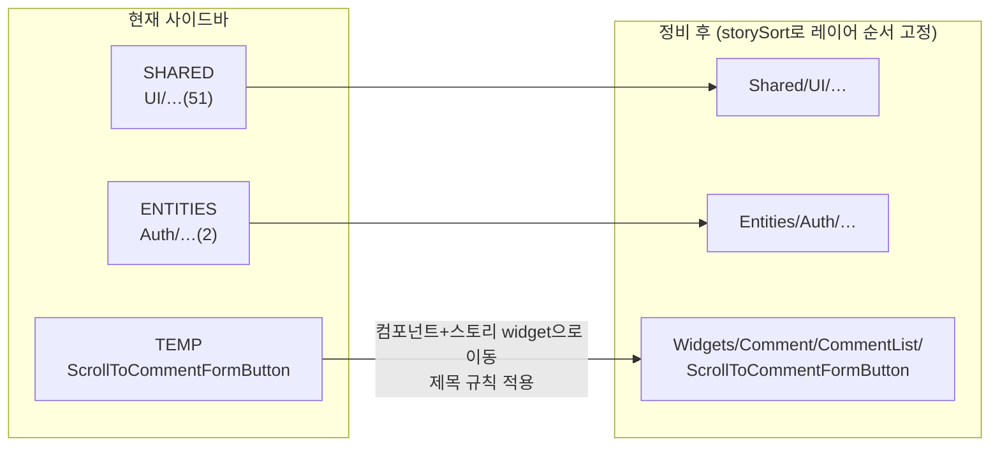

# Storybook 사이드바 구조 정비 — TEMP 해소·제목 규칙·허용 범위 문서화

> Summary: 검증용으로 남은 `Temp/` 스토리를 정식 위치로 옮기고(버튼 컴포넌트도 실제 사용처인
> widget으로 이동), 문서화된 적 없던 스토리 제목·허용 범위 규칙을 정해 문서로 남긴다.

## Context (Motivation)

Storybook 사이드바에 `ENTITIES`·`SHARED`·`TEMP` 세 루트 그룹이 보인다. 조사한 사실:

- 54개 스토리 전부 `title:`을 명시한다(auto-title 미사용). `.storybook/main.ts:8`에 `titlePrefix`도,
  `preview.tsx`에 `storySort`도 없어 루트 그룹 순서가 FSD 레이어 순서와 무관하다.
- **TEMP**: `src/features/comment/create/ui/ScrollToCommentFormButton.stories.tsx:24`
  (`title: 'Temp/...'`) 하나. `2c126c6`(2026-09-21, framer-motion→CSS)에서 실제 앱이 안 떠
  격리 검증용으로 만든 뒤 그대로 남아 공개 Storybook에 배포 중.
- **ENTITIES**: `src/entities/auth/ui/*.stories.tsx` 2개(#278). 계획 파일에 제목 규칙 없음.
- 제목·허용 범위 규칙은 어디에도 없다. 유일한 규칙은 `.claude/CLAUDE.md:393`(shared atoms·elements는
  스토리 필수). `README.md:19`·`docs/DEPLOY.md:87`은 "shared/ui 50개 파일"이라 서술하나 실제 54개,
  entities·features 스토리도 배포된다.
- `ScrollToCommentFormButton`은 API·엔티티 없이 IntersectionObserver + `scrollIntoView`만 하고,
  유일한 사용처는 `src/widgets/comment/comment-list/ui/CommentList.tsx:5,116`.

업계 근거 요약(조사 상세는 대화 기록, DECISIONS.md 항목에 링크와 함께 옮긴다):

- FSD 현행 공식 문서·steiger는 Storybook을 다루지 않는다(폐기된 v1 스펙에만 `stories.tsx` 한 줄).
- Storybook 공식: 스토리 파일은 컴포넌트 옆([Writing stories](https://storybook.js.org/docs/writing-stories)),
  제목은 파일 경로를 따르는 중첩을 권장([Sidebar & URLs](https://storybook.js.org/docs/configure/user-interface/sidebar-and-urls)).
- 실제 FSD 레포 6곳 모두 colocation, 제목은 레이어명으로 시작하되 하위 단계는 제각각.
- 전 레이어 스토리를 권하는 출처는 없음. Storybook 테스트 가이드는 노력·가치 균형의 혼합 방식을 말하고,
  page/connected 스토리는 MSW·decorator를 전제로 한다.

## 판단이 필요했던 항목

| 항목      | 결정(사용자 확정)                                                                         | 근거·기각한 대안                                                                                                                                                                                                                                                                                                                                  |
| --------- | ----------------------------------------------------------------------------------------- | ------------------------------------------------------------------------------------------------------------------------------------------------------------------------------------------------------------------------------------------------------------------------------------------------------------------------------------------------- |
| 제목 방식 | 명시 `title` 유지 + 규칙 문서화 + `storySort`                                             | auto-title 전환 기각: 54개 스토리 ID가 바뀌어 공개 Storybook 링크가 깨지고, 소문자 파일명·`_base/`·`alert/` 폴더가 사이드바에 그대로 노출될 수 있음(공식 문서 기준 추론, 미실측)                                                                                                                                                                  |
| 버튼 위치 | `features/comment/create/ui` → `widgets/comment/comment-list/ui`                          | FSD [Layers](https://feature-sliced.design/docs/reference/layers): 모든 것이 feature일 필요는 없고 재사용이 feature의 신호. v2.1 [#756](https://github.com/feature-sliced/documentation/discussions/756): widget 밖에서 안 쓰는 코드는 widget에. 비즈니스 동작·재사용 둘 다 없음. shared 일반화(`ScrollToTargetButton`)는 사용처 1곳이라 기각(§2) |
| 허용 범위 | "Provider 없이 props만으로 렌더되면 레이어 무관 허용"을 규칙으로만 정함. 인프라 도입 없음 | 인프라 도입(QueryClient·라우터·MSW decorator) 기각: Provider 필요 48/61개, `msw-storybook-addon`·worker 파일·CI 부담 증가, pages는 e2e 45개와 대부분 중복. shared만 기각: entities 2개는 정당한 props 기반 스토리                                                                                                                                 |

제목 규칙(문서화할 내용):

| 레이어           | 형식                                                 | 예                                                      |
| ---------------- | ---------------------------------------------------- | ------------------------------------------------------- |
| shared           | `Shared/UI/<세그먼트>/<컴포넌트>` (기존 그대로)      | `Shared/UI/Atoms/Button`                                |
| entities         | `Entities/<슬라이스>[/<하위>]/<컴포넌트>`            | `Entities/Auth/PasswordConfirmMessage`                  |
| features·widgets | `<레이어>/<도메인>/<슬라이스 PascalCase>/<컴포넌트>` | `Widgets/Comment/CommentList/ScrollToCommentFormButton` |
| pages            | `Pages/<슬라이스>/<컴포넌트>`                        | `Pages/Version/VersionPage`                             |

공통: PascalCase, `ui` 세그먼트는 생략, 임시 그룹(`Temp`·`WIP`) 금지.

## 세부 계획

| 위치                                                                                                                                 | 변경 내용                                                                                                                            |
| ------------------------------------------------------------------------------------------------------------------------------------ | ------------------------------------------------------------------------------------------------------------------------------------ |
| `src/features/comment/create/ui/ScrollToCommentFormButton.tsx` → `src/widgets/comment/comment-list/ui/ScrollToCommentFormButton.tsx` | `git mv` (내용 무변경)                                                                                                               |
| `…/ScrollToCommentFormButton.stories.tsx` (같은 이동)                                                                                | `git mv` + import 경로 갱신 + `title: 'Widgets/Comment/CommentList/ScrollToCommentFormButton'`                                       |
| `src/widgets/comment/comment-list/ui/CommentList.tsx:5`                                                                              | import 경로 갱신                                                                                                                     |
| `.storybook/preview.tsx`                                                                                                             | `parameters.options.storySort: { order: ['Shared', 'Entities', 'Features', 'Widgets', 'Pages'] }`                                    |
| `docs/FE-ARCHITECTURE.md` §18 네이밍 컨벤션                                                                                          | `### Storybook 스토리` 하위 절 신설: 위치(colocation)·제목 규칙 표·허용 범위 기준                                                    |
| `docs/FE-ARCHITECTURE.md:199` 디렉터리 트리 주석                                                                                     | `create` 주석에서 버튼 제거, `widgets/comment/comment-list` 주석에 추가                                                              |
| `.claude/CLAUDE.md:393`                                                                                                              | 문장 끝에 "제목·허용 범위 규칙은 `docs/FE-ARCHITECTURE.md` §18 참고" 추가                                                            |
| `.claude/skills/motion-ux/SKILL.md:77`                                                                                               | 경로 갱신                                                                                                                            |
| `README.md:19`, `docs/DEPLOY.md:87`                                                                                                  | "shared/ui 50개" 서술을 실제 범위(shared/ui 중심 + Provider 없이 렌더되는 다른 레이어 컴포넌트)와 `build-storybook` 실측 수치로 갱신 |
| `docs/DECISIONS.md`                                                                                                                  | 2026-10-02 항목: 제목 방식·허용 범위 대안 비교와 출처 링크(번역 인용)                                                                |
| `docs/plans/2026-10-02-storybook-structure.md` (신규)                                                                                | 이 계획 스냅샷(§11)                                                                                                                  |

CHANGELOG·DECISIONS 과거 항목, `docs/plans/*` 기존 파일의 옛 경로는 역사 기록이라 고치지 않는다.

## 영향 범위 (§5)

- **CRUD**: 데이터 변경 없음(UI 파일 이동·문서).
- **회귀 후보**
  - `CommentList.tsx` — 유일한 import 사용처(grep 확인, 구현 시 `pnpm graph:focus "src/features/comment/create/ui/ScrollToCommentFormButton.tsx" --text`로 재확인).
  - ESLint 레이어 경계·dependency-cruiser: widget이 자기 슬라이스 `ui/`를 import → 위반 없어야 함.
  - 공개 Storybook URL: `temp-scrolltocommentformbutton--default` → `widgets-comment-commentlist-scrolltocommentformbutton--default`로 바뀜(검증용 스토리라 외부 링크 영향 미미). 나머지 53개 URL 불변.
  - Storybook a11y CI(`pnpm test:storybook`): 이동한 스토리도 계속 검사됨.
  - e2e: 버튼을 참조하는 spec 없음(grep 확인). 동작 무변경.

## 검증 방법

1. 워크트리 진입 → `cp ../../../.env . && pnpm install`
2. `pnpm type-check` · `pnpm lint` · `pnpm check:deps` · `pnpm test`
3. `pnpm test:storybook` (a11y 포함 통과)
4. `pnpm build-storybook` → 스토리 파일·케이스 수 실측해 README/DEPLOY 수치에 반영
5. `pnpm storybook` 사이드바 스크린샷: 루트 순서 Shared → Entities → Widgets, TEMP 사라짐
6. `pnpm check:docs` (README·docs·CLAUDE.md 경로·줄 번호)
7. PR 전 fresh general-purpose 서브에이전트로 계획 대비 구현 대조(§11)

## 남은 것

- "라우터만" 필요한 4개(`MyCommentCard`, 403/404/500 페이지)와 props 기반 미작성 7개 스토리 추가는 이번 범위 밖.
- Provider 필요 컴포넌트용 decorator·MSW 인프라는 e2e로 못 덮는 상태가 필요해질 때 별도 계획.
- 문서화만으로는 제목 규칙 이탈을 못 막는다 — 필요해지면 ESLint 규칙(파일 경로 ↔ `title` 대조) 검토.
