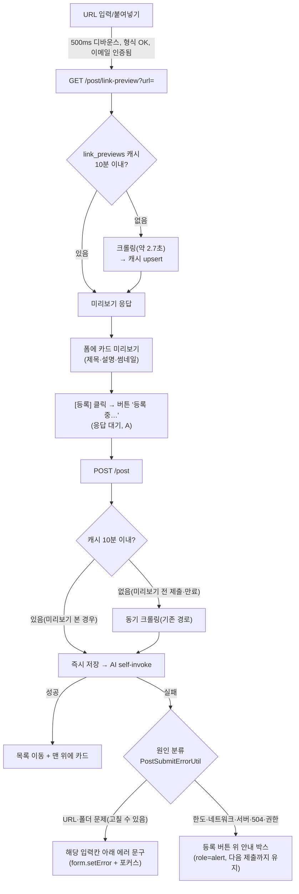

# 글 등록: 응답 대기(A) + 작성 중 링크 미리보기(E) + 실패 원인 노출(F)

## Context

글 등록은 지금 "기다리지 않고 바로 목록으로 이동"한다. 그래서 등록이 실패하면(429·500·WAF 403)
입력이 사라지고 토스트만 남는다. 이 구조는 "BE 크롤링이 느리다"는 전제에서 나왔다
(FE `docs/POST.md:215`, `docs/DECISIONS.md` 2026-08-13·2026-09-29).

2026-10-03 운영 로그 실측 결과 글 등록 소요 시간은 중앙값 2.7초, p95 4.0초, 최대 6.5초였다
(74건, 10초 이상 0건). 비동기 크롤링(D)도 검토했다. 이력상 "크롤링을 동기로 둔다"고 비교·결정한
기록은 없었다. 다만 빈 카드를 먼저 띄우면 사용자가 불안해한다는 근거가 많아 접었다
(Maister 대기 심리, NN/g, Google CLS).

사용자 결정(2026-10-03): **A + E를 등록과 수정 모두에 적용**.

- 수정은 대부분 크롤링이 없는 0.3초 요청이다. URL 변경 재크롤링은 30일에 1건(2.6초)이었다.
- 기다리는 비용은 거의 없고, 지금은 실패하면 고친 내용이 사라진다. 같은 종류의 폼이 다르게 동작하지 않도록 맞춘다.
- **A**: 등록 버튼에서 응답을 기다린다("등록 중…"). 성공하면 목록으로 이동하고, 실패하면 폼을 그대로 둔다.
- **E**: URL을 입력하면 카드 미리보기를 먼저 보여준다(Slack·LinkedIn 방식). 미리보기 결과는 BE가
  10분 캐시해 두고 등록 때 재사용한다. 그래서 등록이 빠르고, 저장되는 내용이 본 미리보기와 같다.

추가 결정(2026-10-03, A 구현 후): **F — 실패 원인을 고칠 수 있게 보여준다**.

- 지금은 등록·수정 실패가 대부분 "포스트 생성/수정에 실패했어요." 토스트 하나로 덮인다(`post.queries.ts` `meta.errorMessage`). 서버 에러를 입력칸에 매핑하는 곳은 레포에 하나도 없다.
- 사용자 결정은 두 가지다.
  - **원인별 분리**: 입력으로 고칠 수 있는 건 해당 입력칸 아래에, 나머지는 등록 버튼 위 안내 박스에 남긴다. 토스트는 띄우지 않는다. 시안을 먼저 보여준다.
  - **BE에서 URL 에러 코드를 나눈다.** 지금은 원인 6가지가 모두 `INVALID_INPUT` 하나이고 영어 메시지로만 구분된다.
- 근거
  - [NN/g 에러 메시지 가이드](https://www.nngroup.com/articles/error-message-guidelines/): _"처음부터 다시 시작하게 하지 말고, 원래 했던 동작을 고쳐서 오류를 바로잡게 한다"_ (번역)
  - [GOV.UK 검증 패턴](https://design-system.service.gov.uk/patterns/validation/): 입력을 유지한 채 폼을 다시 보여준다. 이 패턴은 입력 오류를 다루며, 서버 장애는 범위 밖이다.
  - "토스트는 사라져서 고치는 동안 안내가 없어진다"는 우리 판단이다. 연구로 확인하지 않았다.

## 0. 현재 상황 (조사로 확인한 사실)

| 영역             | 현재                                                                                           | 위치                                                            |
| ---------------- | ---------------------------------------------------------------------------------------------- | --------------------------------------------------------------- |
| FE 등록          | `mutate` 직후 `clearNow`·reset·navigate. 실패 시 입력 유실                                     | `features/post/create/hooks/useCreatePost.ts:36-49`             |
| FE 진행 표시     | 폼이 언마운트돼 하단 "등록 중..." 토스트로 대신함                                              | `app/ui/PostMutationLoadingToast.tsx:34-59`                     |
| FE 규칙          | "저장 중 라벨" 규칙에서 게시글 작성/수정은 예외                                                | `docs/FE-ARCHITECTURE.md:775-782`                               |
| BE 등록          | 트랜잭션 안에서 `UrlMetadataExtractor.extract` 동기 크롤링 → 저장 → 본문 있으면 AI self-invoke | `domain/post/PostService.kt:41-100`                             |
| BE 크롤러        | 예외를 던지지 않음. 실패하면 title=URL 100자, 나머지 null                                      | `domain/post/UrlMetadataExtractor.kt:73-119`                    |
| 캐시 선례        | Postgres 테이블 + native upsert, 수동 SQL(`ddl-auto: none`)                                    | `sql/create_auth_rate_limits.sql`, `AuthRateLimitRepository.kt` |
| 미리보기 UI 선례 | 댓글 링크 미리보기 카드(LinkThumbnail + 제목·설명·URL)                                         | `widgets/comment/comment-list/ui/CommentItem.tsx:90-112`        |
| 디바운스 선례    | `useDebounce(value, 500)` + zod 형식 검사 후 호출                                              | `features/auth/signup/hooks/useAvailabilityCheck.ts`            |

## 1. 전체 계획

배포 순서: **PR1(FE A)** → **SQL 수동 적용 → PR2(BE E + URL 에러 코드)** → **PR3(FE F 실패 원인 노출)** → **PR4(FE E 미리보기)**.

- PR1은 단독 배포가 가능하다.
- PR2는 하위 호환이다.
  - 새 엔드포인트만 추가되고, 기존 등록은 캐시가 없으면 원래대로 동작한다.
  - 새 URL 에러 코드는 지금 FE가 모르는 코드라 기존 일반 문구로 보인다.
- PR3·PR4는 BE 배포 후 `codegen:fetch`로 타입을 받아서 진행한다.
- PR4의 미리보기 API도 같은 URL 에러 코드를 돌려준다. 그래서 PR3의 분류 유틸을 미리보기 카드에서 재사용해, 등록 전에 "이 주소를 찾을 수 없어요"를 보여줄 수 있다.

## 2. 세부 계획

### PR1 — FE A: 응답 대기 + 실패 시 폼 유지, 등록·수정 (FE만)

1. `useCreatePost.onSubmit`을 바꾼다.
   - 기존: `createPost(...)` 후 바로 이동.
   - 변경: `await createPostAsync(...)`(mutateAsync)가 성공한 뒤에만 `clearNow` → reset → `navigate(replace)` 한다.
   - 실패하면 아무것도 하지 않는다. 폼과 이탈 경고는 유지되고, 에러 토스트는 기존처럼 전역 핸들러가 1개만 띄운다(429면 `rateLimited`).
   - mutateAsync의 reject는 catch로 삼킨다(토스트 중복 방지).
2. `CreatePostForm`: 버튼 라벨을 `isCreating` 동안 `TEXTS.common.submitting`("등록 중...")으로 바꾼다. 비활성화는 기존 `canSubmit`의 `!isCreating`을 그대로 쓴다.
3. **수정도 같은 패턴으로 바꾼다.**
   - `useUpdatePost.onSubmit`(`features/post/update/hooks/useUpdatePost.ts:68-73`): `await` 성공 후에만 `clearNow` → `goBack`, 실패하면 폼과 이탈 경고를 유지한다.
   - `UpdatePostForm` 버튼 라벨을 `isUpdating` 동안 `TEXTS.common.updating`("수정 중...")으로 바꾼다.
4. `PostMutationLoadingToast`에서 create·update 감시를 뺀다. 두 폼 모두 화면에 남아 버튼 라벨과 중복되기 때문이다. account update는 그대로 둔다.
5. 카드 위 "수정 중" 오버레이(`PostCard.tsx:85-105`, `usePostCard.ts:45-49`)는 이동 전에 응답이 끝나므로 더 이상 보일 일이 없다.
   - 제거 여부는 6번 시각 미리보기에서 확인받는다.
   - 제거하면 관련 훅 상태와 TEXTS 키 중 고아가 된 것도 함께 지운다.
6. `docs/FE-ARCHITECTURE.md` §10-A의 게시글 작성/수정 예외 문구를 삭제한다. 이제 둘 다 "저장 중 라벨" 규칙을 따른다.
7. 테스트를 고친다.
   - `useCreatePost` 훅 테스트(신규): 성공하면 이동, 실패하면 이동하지 않고 값이 유지되는지.
   - `useUpdatePost.test.tsx`에 실패 시 유지 케이스를 추가한다.
   - e2e: `post-create.spec.ts:32`의 "기다리지 않고 이동" 기대를 고치고, `post-update.spec.ts:54`의 "수정 중" 오버레이 검증을 버튼 라벨 검증으로 바꾼다.
8. **시각 변경은 §9 절차를 따른다**: 버튼 "등록 중…/수정 중…" 상태와 오버레이 제거 전후를 Artifact로 먼저 보여주고 승인받는다.

### PR2 — BE E: 링크 미리보기 API + 캐시 + URL 에러 코드 분리 (BE)

0. **URL 에러 코드 분리(F의 BE 몫)**
   - `SafeUrlValidator`(`domain/post/SafeUrlValidator.kt:20-51`)의 실패를 원인별 코드로 나눈다.
     - `INVALID_URL`: blank·문법·스킴·host 없음
     - `URL_UNRESOLVABLE`: DNS 실패
     - `URL_NOT_ALLOWED`: 사설·루프백 등
   - 새 예외 `InvalidUrlException(code, message)`가 `InvalidInputException`을 상속하고, `GlobalExceptionHandler`에 전용 핸들러를 둔다.
     - 다른 호출부(댓글 링크 등)가 `INVALID_INPUT`에 기대는지는 구현 전에 grep으로 확인한다.
     - 기대는 곳이 있으면 그 경로는 기존 코드를 유지한다.
   - `@Operation` 설명을 실제 실패 목록으로 고친다. 지금 `PostController.kt:21`은 400만 적고 있다.
     - create: 400 `INVALID_URL`/`URL_UNRESOLVABLE`/`URL_NOT_ALLOWED`, 403 `EMAIL_NOT_VERIFIED`, 404 `FOLDER_NOT_FOUND`, 429
     - update: 404 `POST_NOT_FOUND`, 403 `FORBIDDEN`
   - 테스트: `SafeUrlValidatorTest`에서 원인별 코드를 확인하고, 핸들러 응답 형태도 확인한다.

1. SQL `sql/create_link_previews.sql`(신규, 수동 적용, **배포 전에 실행**). `create_auth_rate_limits.sql` 형식을 따른다.
   - 컬럼: `url_hash VARCHAR(64) PK`(sha256(url)), `url TEXT`, `title TEXT NOT NULL`, `description TEXT`, `og_image TEXT`, `tags TEXT[]`, `page_content TEXT`, `fetched_at TIMESTAMPTZ NOT NULL`, 인덱스 `fetched_at`.
2. `TableLinkPreview` + `LinkPreviewRepository`(native upsert, `AuthRateLimitRepository` 형태). `LinkPreviewService`:
   - `get(url)`: 10분 이내 캐시면 그대로 쓰고, 아니면 `extract` 후 upsert.
   - `findFresh(url)`: 캐시만 조회한다.
3. `GET /post/link-preview?url=`(로그인 필요, `PostController`).
   - 순서: 이메일 인증 확인(`createPost`와 같은 게이트) → `SafeUrlValidator` → `RateLimitService.consume("link-preview:member:$userId", 60, 1h)` → `get`.
   - 응답 `LinkPreviewResponse(url, title, description, ogImage)`. 본문(`page_content`)은 응답에 넣지 않는다.
4. `PostService.createPost`: `linkPreviewService.findFresh(url)?.toMetadata() ?: urlMetadataExtractor.extract(url)`.
   - 봇 경로(`fallbackContent`)와 그 밖의 로직은 그대로 둔다.
   - `PostService.updatePost`의 재크롤링(`PostService.kt:222`)에도 같은 캐시 우선 조회를 적용한다. 재크롤링 조건(URL 변경·제목 비움)과 그 뒤 로직은 그대로 둔다.
5. 테스트: 캐시 hit/miss·만료 경계(`LinkPreviewServiceTest`), `createPost`가 캐시를 쓰는지(`PostServiceTest`), 미리보기 한도.
6. 문서
   - `@Operation` 설명을 단다.
   - `docs/TRAFFIC-MANAGEMENT.md` §7-1에 미리보기 한도를 추가한다.
   - `docs/AI-ASYNC-PROCESSING.md`에 "등록 크롤링은 캐시 우선"을 한 줄 넣는다.
   - CHANGELOG에 항목을 추가한다.

### PR3 — FE F: 실패 원인 노출, 등록·수정 (FE)

1. **분류 유틸** `entities/post/utils/post.util.ts`의 `PostUtil.resolveSubmitError(error, context)`(신규).
   - 순수 함수이고 단위 테스트를 단다. 선례는 `shared/utils/*.util.ts`의 클래스 형태다.
   - 반환값은 `{ field: 'url' | 'folderIds', message }` 또는 `{ form: message }`다.

   | 원인          | 판별                                               | 표시      | 문구(초안, 해요체)                                                                                             |
   | ------------- | -------------------------------------------------- | --------- | -------------------------------------------------------------------------------------------------------------- |
   | 도메인 없음   | `URL_UNRESOLVABLE`                                 | URL 칸    | 이 주소를 찾을 수 없어요. 도메인에 오타가 없는지 확인해주세요.                                                 |
   | 내부망 주소   | `URL_NOT_ALLOWED`                                  | URL 칸    | 내부망 주소는 등록할 수 없어요.                                                                                |
   | URL 형식      | `INVALID_URL` 또는 `INVALID_INPUT`                 | URL 칸    | 올바른 URL이 아니에요. http:// 또는 https://로 시작하는지 확인해주세요.                                        |
   | 폴더 사라짐   | `FOLDER_NOT_FOUND`, 폴더를 고른 상태의 `FORBIDDEN` | 북마크 칸 | 선택한 폴더를 찾을 수 없어요. 폴더를 다시 골라주세요. (폴더 목록 무효화)                                       |
   | 한도 초과     | status 429                                         | 안내 박스 | 등록 한도를 넘었어요. 약 N분 뒤 다시 시도해주세요. (`Retry-After` 기준, 없으면 "잠시 후")                      |
   | 네트워크      | `ErrorUtil.isServerError`(Failed to fetch)         | 안내 박스 | 인터넷 연결을 확인하고 다시 시도해주세요.                                                                      |
   | 응답 지연     | status 504                                         | 안내 박스 | 응답이 늦어 등록됐는지 확인하지 못했어요. 피드에서 먼저 확인한 뒤 다시 시도해주세요. (중복 글 방지. 피드 링크) |
   | 이메일 미인증 | `EMAIL_NOT_VERIFIED`                               | 안내 박스 | 기존 `emailVerificationRequired`                                                                               |
   | 보안 정책     | `EDGE_BLOCKED`                                     | 안내 박스 | 기존 `edgeBlocked`                                                                                             |
   | (수정) 삭제됨 | `POST_NOT_FOUND`                                   | 안내 박스 | 이 포스트는 삭제돼서 수정할 수 없어요.                                                                         |
   | (수정) 권한   | `FORBIDDEN`                                        | 안내 박스 | 내가 쓴 포스트만 수정할 수 있어요.                                                                             |
   | 그 외         | 500 등                                             | 안내 박스 | 일시적인 문제로 등록하지 못했어요. 잠시 후 다시 시도해주세요.                                                  |

2. `Retry-After` 노출: `shared/api/client.ts`가 429일 때 `ApiError`에 `retryAfterSeconds`(선택 필드)를 담는다. 공용 파일이므로 `pnpm graph:focus`로 영향 범위를 뽑는다.
3. mutation: `useCreatePostMutation`·`useUpdatePostMutation`에 `meta.manualErrorHandling: true`를 붙이고 `errorMessage`를 뺀다. 전역 토스트를 끄고, 분류와 표시는 feature 훅이 맡는다(§13 결정표 "직접 처리").
   - 대가: 저장 중 이탈 확인창에서 "나가기"를 골라 폼이 먼저 사라진 경우에는 실패가 안 보인다. 드문 경우라 받아들이고 문서에 적는다.
4. `useCreatePost`·`useUpdatePost`의 catch에서 분류 결과를 처리한다.
   - 필드 오류: `form.setError(field)` + 포커스.
   - 폼 오류: 훅 상태 `submitError`에 담는다. 다음 제출이나 해당 필드 수정 시 지운다.
5. 안내 박스: `shared/ui/elements/FormAlert.tsx`(신규, `role="alert"`, destructive 토큰)와 스토리를 함께 만든다.
   - 등록·수정 폼의 버튼 바로 위에 둔다.
   - 모바일에서는 하단 고정 등록 바 위에 붙는다(responsive-ux skill 확인).
6. TEXTS 키를 추가한다(`messages.error.postSubmit.*`, texts-conventions 해요체·`texts.test.ts`).
7. **시각 변경은 §9 절차를 따른다**: URL 칸 에러와 안내 박스(데스크톱·모바일)를 실제 클래스로 만든 시안 Artifact로 먼저 보여주고, 승인받은 뒤 반영한다.
8. 테스트
   - 유틸: 표의 모든 행.
   - 훅: 필드 오류 시 `setError`, 폼 오류 시 `submitError`.
   - e2e: 404 `FOLDER_NOT_FOUND`·`URL_UNRESOLVABLE`·429를 `page.route`로 흉내 내 표시 위치를 확인한다.
9. 문서
   - `docs/POST.md`: 실패 처리 절을 추가한다.
   - `docs/FE-ARCHITECTURE.md` §13: 서버 에러를 필드로 매핑하는 실제 선례로 이 파일을 가리킨다.
   - `DECISIONS.md` 2026-10-03 항목에 F를 이어 적는다. 같은 PR 안 새 항목이 아니라, 아직 머지 전인 PR1 항목이면 그 항목에 추가한다.
   - CHANGELOG에 항목을 추가한다.

### PR4 — FE E: 작성 중 미리보기 카드, 등록 + 수정(URL 변경 시) (FE)

1. `pnpm codegen:fetch && pnpm codegen`으로 `LinkPreviewResponse` 타입을 받는다.
2. entity 3-layer(`post.api.ts` → `post.keys.ts` → `post.queries.ts`):
   - `postApi.fetchLinkPreview(url)`, `postKeys.linkPreview(url)`.
   - `useFetchLinkPreviewQuery(url, enabled)`: `staleTime` 10분, `retry: false`, `meta.manualErrorHandling: true`. 실패해도 토스트 없이 인라인 표시만 한다.
3. `useCreatePost`(feature hook):
   - URL 필드를 watch → `useDebounce(500)` → 스키마 통과 + 이메일 인증됨일 때만 조회한다.
   - 상태 `idle / loading / ready / failed`를 반환한다.
4. `features/post/create/ui/LinkPreviewCard.tsx`(신규): 댓글 미리보기 카드 형태를 재사용한다.
   - loading: 스켈레톤 + "링크 정보를 가져오는 중이에요"(높이 미리 확보, CLS 방지).
   - ready: 썸네일·제목·설명. 사용자가 제목을 입력하면 그 제목으로 표시한다.
   - URL 에러 코드(`URL_UNRESOLVABLE` 등): PR3의 `PostUtil.resolveSubmitError`를 재사용해 URL 칸 아래에 같은 문구를 미리 띄운다. 등록 전에 고칠 수 있게 하기 위해서다.
   - 그 외 실패·429: "미리보기를 불러오지 못했어요. 그래도 등록할 수 있어요".
   - 썸네일과 설명이 모두 없으면 기존 `TEXTS.post.card.metadataUnavailable`을 쓴다.
5. **수정 폼**: URL이 원래 값과 달라졌을 때만 같은 `LinkPreviewCard`를 보여준다.
   - 조회 로직은 등록과 공유한다. 훅을 `entities/post/hooks/`의 공용 훅으로 두고 두 feature에서 쓴다. 선례는 `useCategoryOptions`다.
   - URL이 원래 값과 같으면 조회하지 않는다.
6. TEXTS 키를 추가한다(texts-conventions 해요체). 스토리북은 해당 없다(feature UI).
7. **시각 변경은 §9 절차를 따른다**: 카드 위치(URL 필드 바로 아래 vs 폼 하단)와 로딩·실패 상태, 수정 폼에서 URL을 바꿨을 때를 옵션별로 Artifact에 나란히 보여주고, 고르신 뒤에 반영한다.
8. 테스트: 훅의 디바운스·조건부 조회(수정에서는 URL 변경 시에만), 카드의 상태별 렌더, MSW 핸들러 추가.
9. 문서: FE `docs/POST.md` 등록 흐름·Mermaid 갱신. `docs/DECISIONS.md` 2026-10-03 항목(PR1에서 생성)의 상태를 "E 적용"으로 갱신한다.

## 영향 범위 (CLAUDE.md §5)

- **CRUD**
  - 새 테이블 `link_previews`: URL당 1행 upsert, 정리 배치 없음. 행 크기는 본문 최대 5000자로 작다. 정리는 남은 것으로 둔다.
  - 게시글 생성이 캐시를 쓰면 저장 내용이 미리보기와 같아진다. 캐시가 없거나 만료됐으면 기존 동작과 같다.
  - 중복·멱등: 같은 URL의 동시 미리보기는 upsert로 마지막 값이 남는다.
- **회귀 후보**
  - FE
    - 등록·수정 흐름 e2e: `post-create.spec.ts`, `post-create.mobile.spec.ts`, `post-update.spec.ts`
    - `PostMutationLoadingToast`: account update 표시는 유지
    - 카드 "수정 중" 오버레이: `PostCard`·`usePostCard`
    - 등록·수정 성공 시 캐시 갱신: `post.queries.ts:68-109, :323-358`. 이제 이동 전에 완료되므로 오히려 단순해진다
    - (PR3) `client.ts`의 `ApiError` 생성(전 API 공용). `retryAfterSeconds`는 선택 필드라 기존 사용처는 영향이 없다.
    - (PR3) 등록·수정 전역 토스트가 꺼진다(`manualErrorHandling`). `error-toast.test.ts`의 기대값은 그대로다(전역 판정 로직은 안 바뀜).
  - BE
    - `PostServiceTest`의 createPost·updatePost 재크롤링 계열, 봇 `FeedItemProcessorTest`(캐시 miss → 기존 경로).
    - (PR2) `SafeUrlValidator`를 쓰는 다른 경로(댓글 링크 등). 코드가 바뀌면 그쪽 FE가 `INVALID_INPUT`에 기대는지 확인한다.
  - 공용 파일은 구현 전 `pnpm graph:focus`로 사용처를 뽑는다: `useCreatePost`, `useUpdatePost`, `post.queries.ts`, `PostMutationLoadingToast`, `PostCard`, `client.ts`.
- **데이터 계약 변경**
  - 새 엔드포인트와 응답 타입 1개, 그리고 새 에러 코드 3개(`INVALID_URL`·`URL_UNRESOLVABLE`·`URL_NOT_ALLOWED`)가 추가된다.
  - 기존 `PostResponse`는 그대로다. 새 에러 코드도 400 상태는 같아서, PR3 이전 FE는 기존 일반 문구로 보여준다(하위 호환).
  - 배포 순서는 SQL → BE → FE(PR3·PR4)다.
- **비용·트래픽**: 미리보기만 하고 등록하지 않는 경우 크롤링이 1번 늘어난다. 회원당 시간 60회로 제한한다. 미리보기를 본 등록은 크롤링이 없어져 Lambda 칸 점유가 약 3초에서 0.3초로 준다.

## 실행 전략

- PR 4개, 각각 별도 워크트리를 쓴다.
- PR1은 구현과 녹화를 마쳤고 커밋 전이다(2026-10-03). 브라우저 녹화로 확인받았다.
- PR2의 SQL은 사용자가 Supabase SQL Editor에서 실행한다. 이 레포는 DB에 직접 접속하지 않는다.
- PR3·PR4는 PR2 배포 확인 후 진행한다. PR3(실패 원인)를 먼저 한다. PR4 미리보기 카드가 PR3 분류 유틸을 쓰기 때문이다.
- 별도로 `browser-verification` skill 갱신 PR을 하나 둔다. 내용은 영상 열기, 운영 쓰기 흐름은 모킹 녹화, 마지막 화면 유지다. 병합 후 같은 내용의 개인 메모리는 지운다.
- 각 PR에 `docs/plans/2026-10-03-post-create-preview.md`를 커밋하고(PR1에서 최초 커밋), 서브에이전트로 계획 대비 구현을 대조한다.

## 검증 방법

- PR1
  - `pnpm type-check && pnpm test && pnpm lint && pnpm test:e2e`.
  - 브라우저 검증 녹화(browser-verification skill): 등록·수정 각각 MSW로 성공·429·500을 띄워 확인한다.
    - "등록 중…/수정 중…" 라벨
    - 실패 시 폼 유지·토스트 1개
    - 성공 시 이동, 수정 후 카드 갱신
- PR2
  - `./gradlew ktlintCheck test`.
  - 배포 후 curl(본문 해시 헤더)로 같은 URL을 미리보기 2회 호출해 두 번째가 빠른지(캐시) 확인한다.
  - 미리보기 후 등록 응답 시간이 1초 미만인지, CloudWatch REPORT로 확인한다.
  - 배포 후 curl로 없는 도메인(`https://no-such-domain-xyz.invalid`)을 등록해 400 `URL_UNRESOLVABLE`이 오는지 확인한다.
- PR3
  - 유틸·훅 단위 테스트, e2e.
  - 모킹 녹화로 확인한다. 녹화 전용 스펙 방식이며, 마지막 화면을 2~3초 유지한다.
    - URL 칸 에러: 도메인 없음
    - 북마크 칸 에러: 폴더 사라짐
    - 안내 박스: 429 "약 N분 뒤", 네트워크, 504
  - 영상은 짧은 이름으로 복사해 Cursor에서 연다.
- PR4
  - 단위 테스트 + 브라우저 녹화: URL 붙여넣기 → 스켈레톤 → 카드 → 등록 → 목록 맨 위 카드가 미리보기와 같은지. 실패·429 상태 표시와, 도메인 없음이 등록 전에 URL 칸에 뜨는지도 본다.
- 배포는 각 PR마다 `gh run list`로 해당 SHA가 success인지 확인한 뒤 보고한다.

## 남은 것

- `link_previews` 오래된 행 정리 배치.
- 작성 중 미리보기에서 제목을 직접 고치는 기능(LinkedIn식 편집). 지금은 기존 제목 입력란을 그대로 쓴다.
- D(비동기 크롤링)는 p95가 10초를 넘거나 Throttles가 반복되는 신호가 있을 때 재검토한다.
