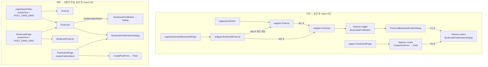

# features·widgets 슬라이스 교차 import 5건 제거 — render prop으로 위층 조립

> Summary: 같은 레이어 슬라이스끼리 import하던 5건(W1·W2·W3·F1·F2)을 FSD Cross-imports 가이드의
> Strategy C(상위 레이어 조립, render prop)로 끊고, dependency-cruiser 규칙으로 재발을 막는다.

## Context (Motivation)

FSD 레이어 하향 의존(ESLint)과 entities `@x`(dependency-cruiser)는 강제되지만, features·widgets의
같은 레이어 슬라이스 격리는 강제 수단이 없어 5건이 남아 있다(2026-10-01 dependency-cruiser 도입 때
발견해 보류, `docs/FE-ARCHITECTURE.md:46`). origin/main 실측(2026-10-02)도 같은 5건이다.

| #   | 위치                                                                        | import 대상                                             |
| --- | --------------------------------------------------------------------------- | ------------------------------------------------------- |
| W1  | `src/widgets/post/post-list/ui/PostList.tsx:1`                              | `widgets/post/post-card` `PostCard`                     |
| W2  | `src/widgets/bookmark/bookmark-post-list/ui/BookmarkPostList.tsx:2`         | 같음                                                    |
| W3  | `src/widgets/bookmark/bookmark-post-list/config/bookmark-grid.const.ts:2-5` | `widgets/post/post-list` 카드 치수 상수                 |
| F1  | `src/features/bookmark/toggle/ui/PostCardBookmarkFolderDialog.tsx:2`        | `features/bookmark/select` `BookmarkFolderSelectDialog` |
| F2  | `src/features/post/create/ui/PostCreateBookmarkFolderField.tsx:6`           | 같음                                                    |

사용자 결정(2026-10-02~03 대화): "전부 구조 개선", W·F 모두 C(render prop) 방식.

## 판단이 필요했던 항목

| 항목                   | 결정                                                                                                                                 | 근거·기각한 대안                                                                                                                                                                                                                                                                                                                                                                                                        |
| ---------------------- | ------------------------------------------------------------------------------------------------------------------------------------ | ----------------------------------------------------------------------------------------------------------------------------------------------------------------------------------------------------------------------------------------------------------------------------------------------------------------------------------------------------------------------------------------------------------------------- |
| W1·W2 방식             | C: 목록이 `renderPost`를 받고 페이지가 `PostCard`를 넘긴다                                                                           | FSD [Cross-imports](https://feature-sliced.design/docs/guides/issues/cross-imports) Strategy C 예제(`CommentList` + `renderUserAvatar`)와 같은 형태, FSD 공식 skills 레포 `WishlistItems renderAddToCart`도 같은 형태. React Hooks FAQ가 render prop이 남을 자리로 "가상 스크롤의 `renderItem`"을 직접 든다. A(합치기)는 "늘 함께 바뀜" 전제가 약해 기각(커밋 이력상 post-card 46건 중 post-list와 동시 변경 15건, 33%) |
| W3 위치                | 카드 치수를 `widgets/post/post-card/config/post-card-grid.const.ts`의 객체 `POST_CARD_GRID`로 모으고 페이지가 목록에 `grid`로 넘긴다 | 값(최소 폭 330, 행 높이 추정)은 PostCard 실측치라 카드 슬라이스 소유. shared/config 이동은 가이드 전략이 아니라 기각. 북마크 쪽의 손 복사본(gap·행 높이)도 이 객체로 일원화                                                                                                                                                                                                                                             |
| F1·F2 방식             | C: 창을 쓰는 feature가 `renderFolderSelect`를 받고, 위층(PostCard 위젯·PostSubmitPage)이 `BookmarkFolderSelectDialog`를 넘긴다       | 같은 가이드 Strategy C. React 공식 문서는 몇 단계 props 전달을 "명시적"이라며 우선 권한다([Before you use context](https://react.dev/learn/passing-data-deeply-with-context#before-you-use-context)). D(예외 문서화)는 FSD FAQ "feature가 다른 feature를 직접 import해서는 안 된다"·steiger 기본 규칙과 어긋나 기각. B'(창은 shared, 훅은 entities)는 B 조건 "도메인 로직만"에 맞지 않아 기각                           |
| F1 조립 위치           | PostCard(widget)                                                                                                                     | 가이드 문장은 "pages/app"이지만 IoC 원리상 바로 위 레이어(widgets)도 같다고 판단(사용자에게 고지함). PostCard를 렌더하는 3곳(피드·북마크·상세)에서 중복을 피함                                                                                                                                                                                                                                                          |
| render 함수 props 타입 | 각 feature가 자기 render prop 인자 타입을 선언(구조적 타입)                                                                          | `select`의 Props 타입을 import하면 type-only 교차 import가 다시 생김(depcruise `tsPreCompilationDeps: true`). 조립 지점에서 `BookmarkFolderSelectDialog`에 그대로 넘기므로 어긋나면 TS가 잡는다                                                                                                                                                                                                                         |
| 테스트의 교차 import   | 새 규칙에서 `*.test.ts(x)` 제외                                                                                                      | 두 feature 테스트는 실제 창까지 검증하는 통합 테스트라 `BookmarkFolderSelectDialog`를 직접 넘긴다. entities 규칙도 테스트를 같은 방식으로 제외(`.dependency-cruiser.cjs:15`)                                                                                                                                                                                                                                            |
| 성능                   | render 함수는 모듈 최상단에 선언(안정 참조), 목록은 `Fragment key`로 감싼다                                                          | React [memo](https://react.dev/reference/react/memo#minimizing-props-changes) "함수는 컴포넌트 밖에 선언하거나 useCallback". `PostCard`는 `memo`(`PostCard.tsx:51`)이고 받는 props는 이전과 같아 memo 유지. `PostList`·`BookmarkPostList`는 원래 memo 아님. React Compiler 미사용(`package.json` React 18)                                                                                                              |

## 세부 계획

### Phase 1 — PR 1: W1·W2·W3 (widgets)

| 위치                                                                                                                                          | 변경 내용                                                                                                                                                                                                                            |
| --------------------------------------------------------------------------------------------------------------------------------------------- | ------------------------------------------------------------------------------------------------------------------------------------------------------------------------------------------------------------------------------------ |
| `src/shared/hooks/useWindowGridVirtualizer.ts`                                                                                                | `CardGridSpec` 타입 export 추가(`className`·`minColumnWidth`·`maxColumns`·`rowGap`·`rowHeightEstimate`) — `GapBreakpoint` 옆                                                                                                         |
| `src/widgets/post/post-card/config/post-card-grid.const.ts` (신규)                                                                            | `POST_CARD_GRID: CardGridSpec` — `post-grid.const.ts` 값·주석(실측 근거) 이전                                                                                                                                                        |
| `…/post-card/config/post-card-grid.const.test.ts` (신규)                                                                                      | 기존 `post-grid.const.test.ts`·`bookmark-grid.const.test.ts`의 클래스↔간격 일치 검사를 하나로                                                                                                                                        |
| `src/widgets/post/post-list/config/post-grid.const.ts`(+test), `src/widgets/bookmark/bookmark-post-list/config/bookmark-grid.const.ts`(+test) | 삭제(`git rm`)                                                                                                                                                                                                                       |
| `src/widgets/post/post-list/ui/PostList.tsx`                                                                                                  | `PostCard` import 제거. props `renderPost: (post: Post, rowIndex: number) => ReactNode`, `grid: CardGridSpec`. 행 렌더는 `<Fragment key={post.id}>{renderPost(post, virtualRow.index)}</Fragment>`, 그리드 클래스는 `grid.className` |
| `src/widgets/post/post-list/hooks/usePostList.ts`                                                                                             | `usePostList(grid)` — 상수 import 대신 인자 사용                                                                                                                                                                                     |
| `src/widgets/post/post-list/ui/PostCardSkeleton.tsx`                                                                                          | `PostListSkeleton`이 `grid`를 prop으로 받음                                                                                                                                                                                          |
| `src/widgets/bookmark/bookmark-post-list/ui/BookmarkPostList.tsx`, `hooks/useBookmarkPostList.ts`                                             | PostList와 같은 방식(`renderPost(post)`, `grid`)                                                                                                                                                                                     |
| `src/pages/post/index.tsx`                                                                                                                    | 모듈 최상단 `renderFeedPost`(첫 행 `priorityThumbnail`) + `<PostList renderPost={renderFeedPost} grid={POST_CARD_GRID} />`                                                                                                           |
| `src/pages/bookmark/BookmarkPage.tsx:81,113`                                                                                                  | 모듈 최상단 `renderBookmarkPost` + 두 곳에 같은 props                                                                                                                                                                                |
| `src/widgets/post/post-list/hooks/usePostList.test.tsx`                                                                                       | 훅 시그니처 변경 반영                                                                                                                                                                                                                |

### Phase 2 — PR 2: F1·F2 (features) + 규칙

| 위치                                                                                  | 변경 내용                                                                                                                               |
| ------------------------------------------------------------------------------------- | --------------------------------------------------------------------------------------------------------------------------------------- | --------------------------------------------------------------------------- |
| `src/features/bookmark/toggle/ui/PostCardBookmarkFolderDialog.tsx`                    | `select` import 제거. prop `renderFolderSelect: (props: FolderSelectRenderProps) => ReactNode`(이 파일에 타입 선언)로 기존 props를 넘김 |
| `src/features/bookmark/toggle/ui/BookmarkPostButton.tsx`                              | `renderFolderSelect` prop을 받아 그대로 전달                                                                                            |
| `src/widgets/post/post-card/ui/PostCard.tsx:359`                                      | 모듈 최상단 `renderBookmarkFolderSelect = (p) => <BookmarkFolderSelectDialog {...p} />`를 `BookmarkPostButton`에 전달                   |
| `src/features/post/create/ui/PostCreateBookmarkFolderField.tsx`                       | F1과 같은 방식(이 파일에 타입 선언)                                                                                                     |
| `src/features/post/create/ui/CreatePostForm.tsx:112`                                  | `renderFolderSelect` prop을 받아 필드에 전달                                                                                            |
| `src/pages/post/PostSubmitPage.tsx`                                                   | 모듈 최상단 render 함수 + `<CreatePostForm renderFolderSelect={…} />`                                                                   |
| `…/PostCardBookmarkFolderDialog.test.tsx`, `…/PostCreateBookmarkFolderField.test.tsx` | 렌더 헬퍼(`renderDialog`, `Harness`)에서 `renderFolderSelect`로 실제 창을 넘김 — 케이스 본문 무변경                                     |
| `.dependency-cruiser.cjs`                                                             | `features-widgets-no-cross-slice-import` 추가: from `^src/(features                                                                     | widgets)/([^/]+/[^/]+)/`(테스트 제외), to `^src/$1/`중`^src/$1/$2/` 아닌 것 |
| `scripts/check-deps.js:1-3`                                                           | 머리 주석의 규칙 목록에 추가                                                                                                            |

### 문서 (해당 PR에 함께)

| 위치                                              | 변경 내용                                                                                                                          |
| ------------------------------------------------- | ---------------------------------------------------------------------------------------------------------------------------------- |
| `docs/FE-ARCHITECTURE.md` §1(:46, :50-52, :84-85) | 슬라이스 격리 행을 "✅ 채택, dependency-cruiser 강제"로, 강제 규칙 수 갱신                                                         |
| `docs/FE-ARCHITECTURE.md` §2 표                   | 새 규칙 행 추가, "규칙 4개" → 5개                                                                                                  |
| `docs/FE-ARCHITECTURE.md` §3 트리                 | config 파일 이동 반영                                                                                                              |
| `docs/FE-ARCHITECTURE.md` §26 (신설)              | "위층 조립(render prop) 패턴": 이름 `render<대상>`, 모듈 최상단 선언, 목록은 `Fragment key`, 인자 타입은 받는 쪽이 선언, 근거 링크 |
| `docs/POST-DETAIL-BACK-NAVIGATION.md:128,142`     | `backSource`를 정하는 곳이 목록 위젯 → 페이지의 render 함수로                                                                      |
| `docs/BOOKMARK.md:430-436`                        | bookmark-post-list 구조·"PostList와 폭 공유" 서술                                                                                  |
| `docs/DECISIONS.md`                               | 2026-10-03 항목: A/B'/C/D 비교와 React·FSD·실사례 근거(번역 인용), 2026-09-09 "감수한 트레이드오프"를 이 결정이 대체함             |
| `.claude/CLAUDE.md` 패턴 레퍼런스 표              | §26 한 줄 추가                                                                                                                     |

## 영향 범위 (§5)

- **CRUD**: 데이터·API 변경 없음. 렌더 구조만 바뀐다.
- **회귀 후보**
  - 피드·북마크 목록 가상 스크롤(행 측정·`scrollMargin`·무한 스크롤) — `usePostList`·`useBookmarkPostList`가 같은 값을 인자로 받는지
  - 첫 행 썸네일 우선 로딩(LCP) — `priorityThumbnail`이 `rowIndex === 0`에서만 켜지는지
  - 상세 뒤로가기 라벨(`backSource` feed/bookmark)
  - 북마크 버튼 → 폴더 창(즉시 저장·되돌리기·400ms 가드), 글쓰기 폼 폴더 필드(지연 선택)
  - `PostDetailPage`는 `PostCard`를 직접 렌더 → 북마크 창이 PostCard 안에서 조립되므로 그대로 동작해야 함
- **import 사용처**: 구현 전 `pnpm graph:focus "<파일>" --text`로 `PostCard`·`BookmarkPostButton`·`CreatePostForm`·`useWindowGridVirtualizer` 사용처 재확인
- **함수 시그니처 변경**: `usePostList`·`useBookmarkPostList`·`PostList`·`BookmarkPostList`·`BookmarkPostButton`·`CreatePostForm` props — 사용자 승인 범위(C 방식)

## 검증 방법

1. 워크트리 진입 → `cp ../../../.env . && pnpm install`
2. 각 PR: `pnpm type-check` · `pnpm lint` · `pnpm check:deps` · `pnpm test` · `pnpm check:docs`
3. PR 2: 규칙 프로브 — 교차 import 1줄을 임시로 되살려 `check:deps` 실패 확인 → 되돌려 통과, 같은 슬라이스·widgets→features import는 통과 확인(커밋 전 원복)
4. `pnpm test:e2e` 전체 — 특히 `post-list*`, `virtualizer-scroll-adjust`, `post-card-*`, `post-detail-back*`, `bookmark*`, `bookmark-folder-dialog`, `post-create-folder-picker`, `guest-guard`
5. 브라우저 확인(`browser-verification` skill): 피드·북마크 목록 스크롤, 첫 행 썸네일 `fetchpriority`, 북마크 창·글쓰기 폴더 필드 동작
6. `scripts/` 실측: origin/main 기준 교차 import 스캔 0건
7. PR 전 fresh general-purpose 서브에이전트로 계획 대비 구현 대조(§11)

## 남은 것

- FSD 2026-07 개정은 Widgets 레이어 사용 자체를 권하지 않는다(카드는 엔티티 UI + 슬롯, 조립은 페이지). 레포 전체 구조 문제라 이번 범위 밖.
- `PostCardSkeleton`은 PostCard 모양을 흉내 내지만 post-list에 남는다(import 관계는 없음).
- steiger(FSD 공식 린터) 도입 여부는 별도 검토 — 이 레포는 `index.ts` 배럴을 금지해 public API 규칙과 충돌한다.
