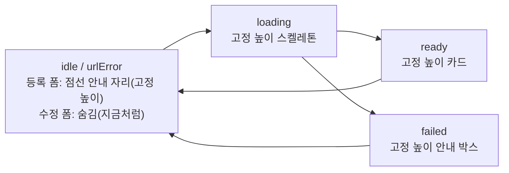

# 등록 폼 링크 미리보기로 인한 데스크톱 제출 버튼 레이아웃 밀림 해결

## Context

#310에서 등록·수정 폼의 URL 칸 아래에 `LinkPreviewCard`가 들어갔다. 데스크톱에서는 제출 버튼이
일반 흐름(`md:static`, `src/features/post/create/ui/CreatePostForm.tsx:139-145`)에 있어서 카드 높이가
바뀔 때마다 버튼이 위아래로 움직인다. 모바일은 `fixed`라 영향이 없다.

- idle(높이 0) → loading(스켈레톤 ~72px): URL을 붙여넣고 버튼으로 가는 사이(디바운스 500ms 뒤)에 버튼이 밀린다
- loading → ready(설명 줄 수에 따라 72~92px) / failed(한 줄, ~42px): 한 번 더 커지거나 줄어든다
- URL을 지우면 idle로 돌아가 다시 당겨진다

(높이는 클래스 값으로 계산한 추정치다. 구현할 때 실측한다.)

근거: [web.dev "Optimize CLS"](https://web.dev/articles/optimize-cls)는 _"(플레이스홀더나 스켈레톤 UI 등으로)
뷰포트에 미리 충분한 자리를 확보해, 콘텐츠가 들어와도 페이지가 갑자기 밀리지 않게 하라"_ (번역)를 권한다.
같은 글의 _"사용자 입력 후 500ms 안의 이동은 CLS에 넣지 않는다"_ (번역)는 기준도 이 폼에는 적용되지 않는다.
디바운스가 500ms라 카드가 그 뒤에 나타나기 때문이다.

**사용자 결정(2026-10-04)**: A안 "자리 항상 확보"를 쓰고, 등록 폼에만 적용한다. 수정 폼은 URL을 바꿨을 때만
카드가 뜨므로 빈 자리를 두지 않고, 상태 간 높이 통일만 함께 받는다.

## 세부 계획

1. **§9 시각 미리보기 먼저** → verify: 사용자가 Artifact 페이지를 보고 승인함
   - 실제 Tailwind 클래스와 `globals.css` 토큰으로 정적 목업을 만든다. 등록 폼 데스크톱 화면에서
     idle 안내 자리 / loading / ready(설명 0·1·2줄) / failed를 같은 높이로 나란히 보여준다
   - 안내 자리 시안은 2개다. ① 점선 테두리 + 안내 문구 ② 옅은 `bg-muted/30` 박스 + 안내 문구
2. **워크트리 + 부트스트랩** (`EnterWorktree` 전에 `git log origin/main..main` 확인, 진입 후 `.env` 복사 + `pnpm install`)
3. **`LinkPreviewCard` 수정** (`src/entities/post/ui/LinkPreviewCard.tsx`)
   - 네 가지 표시 상태(안내 자리·loading·ready·failed)가 같은 고정 높이를 쓰게 한다. 높이는 ready의
     최대 높이(제목 truncate + 설명 line-clamp-2 + URL truncate)를 실측해 정하고 `CARD_GRID_CLASSNAME`
     옆에 상수로 둔다. failed `
`도 같은 높이의 박스로 감싸 세로 가운데 정렬한다
   - 선택 prop `reserveSpace?: boolean`을 추가한다(기본 false). true이면 idle·urlError일 때 `null` 대신
     승인된 안내 자리를 렌더한다. urlError일 때 URL 칸 아래에 뜨는 필드 에러 한 줄은 기존 `FormField`
     동작이라 이번 범위에서 빼고, 보고할 때 언급한다
4. **등록 폼 연결** (`CreatePostForm.tsx:117`): `<LinkPreviewCard ... reserveSpace />`. `UpdatePostForm.tsx`는
   손대지 않는다(높이 통일만 자동으로 받는다)
5. **TEXTS**: `TEXTS.post.form.preview.placeholder` 키를 추가한다(texts-conventions skill 확인, 해요체)
6. **테스트**: `LinkPreviewCard.test.tsx`에 두 케이스를 추가한다. ① `reserveSpace`일 때 idle이면 안내 문구를 렌더
   ② 기본값일 때 idle이면 아무것도 없음. `e2e/post-create.spec.ts`가 idle 때 카드가 없다고 단정하는지 확인하고 맞춘다
7. **문서**: `docs/POST.md`의 "작성 중 링크 미리보기" 항목(256행 부근)에 자리 확보 동작과 근거 링크를 넣고,
   `CHANGELOG.md` `[Unreleased]`에 fix 항목을 넣는다. 계획 파일은 `docs/plans/2026-10-04-post-preview-layout-shift.md`로 커밋한다(§11)

## 영향 범위 (§5)

- CRUD: 데이터·API 변경은 없다. 순수 표시 변경이다
- 회귀 후보: `LinkPreviewCard`를 쓰는 곳은 `CreatePostForm.tsx`·`UpdatePostForm.tsx` 두 곳뿐이다(구현 전
  `pnpm graph:focus src/entities/post/ui/LinkPreviewCard.tsx --text`로 확정). 고정 높이 때문에 긴 설명이 잘리는지
  봐야 한다(이미 line-clamp-2라 잘리는 양은 같다). 모바일 하단 고정 바와 토스트 오프셋에는 영향이 없다
- 기존 테스트 `LinkPreviewCard.test.tsx`·`useLinkPreview.test.tsx`·e2e `post-create.spec.ts`

## 검증 방법

1. `pnpm type-check` → `pnpm test` → `pnpm lint` · `pnpm check:deps` → `pnpm check:docs`
2. browser-verification skill로 데스크톱(1280×800)에서 `page.route` 모킹 상태를 녹화한다:
   빈 폼 → URL 붙여넣기 → loading → ready(설명 2줄) / 실패 응답 → URL 지움.
   각 단계에서 제출 버튼의 `getBoundingClientRect().top`을 기록해 **모든 값이 같은지** 확인한다
3. 수정 폼에서 URL을 바꿨을 때 loading → ready/failed 사이에 버튼 위치가 같은지 확인한다(나타나는 순간 1회 밀림은 의도된 결과다)
4. PR을 열기 전에 fresh general-purpose subagent로 계획 대비 구현을 대조한다(§11)

## 남은 것

- URL 칸의 필드 에러 문구가 나타날 때 생기는 한 줄 밀림(기존 FormField 공통 동작, 이번 범위 밖)
