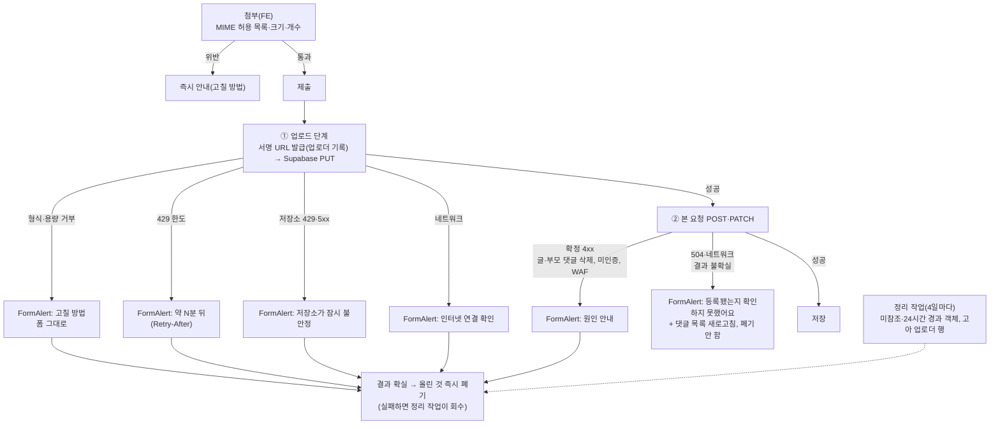

# 이미지 업로드: 실패 안내·소유권·고아 회수 (재검토판)

> 업로드나 제출이 실패하면 원인과 조치를 정확히 알려준다. 남의 이미지를 지울 수 있는 기존 구멍을 막는다.
> 쓰이지 않는 파일은 자동으로 회수한다. 이 결정과 업계 근거를 면접 꼬리질문 6개에 답할 수 있는 문서로 남긴다.
> 2026-10-05 재검토: 이전 판(상태 머신 B)은 계획을 덧붙이며 생긴 결함이 있어 폐기하고 다시 썼다. 이전 판과 달라진 점은 맨 아래 "이전 판 대비 변경"에 있다.

## Context

### 왜 하나

- 면접 꼬리질문 6개(첨부 스레드)를 계기로 업로드 흐름을 점검했다.
- 사용자의 목적은 업계 방식을 이 레포에 녹여 참고 자료로 쓰는 것이다(2026-10-05).
- 재검토 중 사용자가 물은 것(2026-10-05): "제출했는데 첨부가 실패하면 무엇을 보여주나. 크기·형식 문제면 조치를, 서버·트래픽 문제면 그 내용을 알려야 하지 않나."

### 확인한 사실

BE는 `origin/main` 기준이다. 로컬 `main`이 8커밋 뒤처져 있어서 이전 판은 그걸 기준으로 잘못 읽었다.

**1. 보안 구멍이 있다(기존). 남의 이미지를 지울 수 있다.**

- 댓글을 삭제·수정하거나 게시글을 삭제하면 본문에 든 우리 버킷 URL을 전부 지운다. 누가 올렸는지는 보지 않는다(`CommentService.kt:299`, `:338`, `:400`).
- 그래서 남의 댓글 이미지나 아바타 URL을 내 댓글에 붙여넣고 그 댓글을 지우면, 원래 주인의 파일이 지워진다.

**2. 실패 원인이 거의 다 "서버 오류"로 합쳐진다.**

- **댓글:** mutation에 `meta`가 없어 전역 핸들러가 처리한다.
  - `UserFacingError`와 네트워크 끊김(`TypeError`)은 `serverError`가 된다(`error-toast.ts:121`).
  - 서명 단계의 확장자 거부는 404 `NOT_FOUND`라서 역시 `serverError`가 된다.
  - 한도 429는 `rateLimited`로 나가지만 `Retry-After`를 쓰지 않는다. 한도는 최대 1시간이다(`error-toast.ts:87`).
- **아바타:** `ApiError`면 원인과 상관없이 `accountUpdateFailed`가 된다(`account.queries.ts:30-40`).
- **본 요청:** 504로 실패하면 서버에는 저장됐을 수도 있는데, 폼을 복원하고 "서버 오류"를 띄운다. 그대로 다시 누르면 중복으로 저장될 수 있다.

**3. 허용 형식 목록이 네 곳에서 어긋난다.**

- FE 첨부는 `image/*`를 모두 받는다(`useImageAttachments.ts:114`). 아바타는 형식 검사가 없다(`useUpdateAccount.ts:64`).
- 확장자를 파일명에서 뽑는다(`uploadImageAndGetUrl.ts:17`). 그래서 `.jfif`나 확장자 없는 파일은 BE 허용 목록(`UploadService.kt:13-14`, 9종)에서 거부된다.
- 렌더러 판정 목록에는 svg가 없다(`MarkdownContent.tsx:15`, `imageContent.ts:2`). 그래서 SVG는 업로드는 되지만 댓글에서 링크로 보이고, 수정 폼에서는 본문 텍스트로 들어간다. 처음부터 빠져 있었고 회귀는 아니다.

**4. 업로드 한도는 이미 있다.** 회원당 시간당 30회를 넘으면 429와 `Retry-After`를 보낸다(BE `UploadController.kt`, #61).

**5. Supabase가 업로드 실패를 돌려주는 방식**

- 업로드 실패는 대부분 HTTP 400이다. 원인은 본문 `statusCode` 문자열에 담긴다: 용량 초과는 `"413"`, 형식 불허는 `"415"`, 토큰 문제는 `"400"`(에이전트가 storage 소스를 열어 확인).
- DB 포화는 HTTP 429, 내부 오류는 500, DB 타임아웃은 544다.

**6. 고아를 회수하는 수단**

- 로컬에서 손으로 실행하는 `OrphanImageCleanupRunner.kt` 하나뿐이다.
- 아바타 교체(`MemberService.kt:88`)와 탈퇴 퍼지(`AccountDeletionService.kt:94`)는 파일을 지우지 않는다.

**7. "업로드 실패 + 제출 성공"은 우리 FE에서는 생기지 않는다.** 업로드를 다 기다린 뒤에야 본 요청을 보낸다(`comment.api.ts:37`, `:45`, `:60`, `account.api.ts:17-19`). 서버 쪽 확인은 없다.

### 업계 근거

아래 원문은 조사 에이전트가 2026-10-05에 열어 확인했다. 나는 그 보고를 옮긴 것이다(재인용).

**에러 문구**

- [NN/g Error-Message Guidelines](https://www.nngroup.com/articles/error-message-guidelines/)는 이렇게 쓴다.
  - _"사용자가 무슨 일이 일어났는지 이해하도록 정확한 문제를 설명하라"_ (번역)
  - _"가능한 해결책을 제시하라"_ (번역)
  - _"처음부터 다시 하게 하지 말고 원래 동작을 고쳐서 바로잡게 하라"_ (번역)
- [GOV.UK File upload](https://design-system.service.gov.uk/components/file-upload/)는 원인별 문구를 쓴다.
  - _"선택한 파일은 [최대 크기]보다 작아야 합니다"_ (번역)
  - _"선택한 파일은 [형식 목록]이어야 합니다"_ (번역)
  - _"선택한 파일을 업로드할 수 없습니다 – 다시 시도하세요"_ (번역)

**HTTP 상태 의미**

- [RFC 9110](https://www.rfc-editor.org/rfc/rfc9110) §15.5.14(413)·§15.5.16(415)·§15.6.4(503)·§10.2.3(Retry-After)
- [RFC 6585](https://www.rfc-editor.org/rfc/rfc6585) §4(429). 429에는 Retry-After를 MAY로 보낸다.

**업로드 구조**

- Slack은 완료 메서드를 _"호출하지 않으면 업로드된 파일과 메타데이터는 폐기된다"_ (번역,
  [files.completeUploadExternal](https://docs.slack.dev/reference/methods/files.completeUploadExternal))고 쓴다.
  즉 서버가 자기가 발급한 업로드를 알고 있다.
- Supabase에는 현재 객체를 자동 만료하는 규칙이 없다
  ([getBucketLifecycle](https://supabase.com/docs/reference/javascript/file-buckets-getbucketlifecycle)).
  Collaborator가 제시한 방법은 cron과 API 삭제다([#37979](https://github.com/orgs/supabase/discussions/37979)).
- SQL로 `storage.objects`를 지우면 실제 객체는 남는다
  ([Schema Design](https://supabase.com/docs/guides/storage/schema/design)).
- [OWASP File Upload](https://cheatsheetseries.owasp.org/cheatsheets/File_Upload_Cheat_Sheet.html)는 Content-Type이 _"신뢰할 수 없다"_ (번역)고 쓴다.
- [MDN](https://developer.mozilla.org/en-US/docs/Web/API/Window/fetch)에 따르면 네트워크 오류일 때 `fetch`는 `TypeError`로 reject한다.

**제출할 때 존재 확인에 관한 업계 관행**

조사 에이전트가 2026-10-05에 확인했다. 인용 문구는 WebFetch 요약을 번역한 것이라 원문 대조가 필요하다.

- **Slack은 확정 단계에서 검사한다.** 오류 표에 `file_not_found`(_"업로드 티켓으로 파일을 찾을 수 없다"_, 번역), `access_denied`(_"사용자가 파일 소유자가 아니다"_, 번역), `file_type_not_allowed`가 있다
  ([files.completeUploadExternal](https://docs.slack.dev/reference/methods/files.completeUploadExternal)).
  즉 확정할 때 **존재·소유자·형식**을 함께 본다. 업로드 URL을 받을 때는 `length`를 필수로 받는다.
- **Cloudflare Images는 서버가 상태를 조회한다.** URL을 발급하면 draft 레코드가 생기고, 서버가 `GET`으로 `draft` 여부를 확인한다
  ([Direct Creator Upload](https://developers.cloudflare.com/images/upload-images/direct-creator-upload/)).
- **Shopify·Mux는 비동기로 처리하고 상태 필드로 결과를 알린다.**
  - Shopify `fileStatus`는 UPLOADED·PROCESSING·READY·FAILED다. 크기·형식이 틀리거나 원본을 내려받지 못하면 `FAILED`가 되고 오류 코드가 붙는다
    ([fileCreate](https://shopify.dev/docs/api/admin-graphql/latest/mutations/fileCreate)).
- **AWS와 Supabase는 스토리지 이벤트를 쓴다.**
  - S3 Event Notifications는 _"최소 한 번"_ (번역) 전달된다.
  - Supabase는 `storage.objects` INSERT에 Database Webhook을 거는 예제가 있다.
- **"커밋할 때 HeadObject로 확인하라"는 AWS 공식 권고는 찾지 못했다.**

**정리:** 확정 단계에서 존재와 소유자를 동기로 검사하는 곳(Slack)이 있다. 업로드를 요청자에게 묶는 것(소유권)은 Slack과 Supabase `owner_id`에서 문서로 확인된다.
우리 구조(제출할 때 동기로 본 요청)에 맞는 것은 Slack 형태다. 확정 단계(= 댓글·아바타 저장)에서 **소유자 + 존재 + 메타데이터**를 확인한다.

## 판단이 필요했던 항목

| 항목                      | 결정                                                                                                                                                                                                                                                                                        | 근거·기각한 대안                                                                                                                                                                                                                                                                                                                                                                                                                                           |
| ------------------------- | ------------------------------------------------------------------------------------------------------------------------------------------------------------------------------------------------------------------------------------------------------------------------------------------- | ---------------------------------------------------------------------------------------------------------------------------------------------------------------------------------------------------------------------------------------------------------------------------------------------------------------------------------------------------------------------------------------------------------------------------------------------------------- |
| 삭제 규칙(소유권)         | **(나) 업로더 기록**: 서명 URL을 발급할 때 `uploaded_images(object_name, uploader_id, created_at)`를 남긴다. 지우는 행동의 주체가 업로더일 때만 지운다. 기록이 없는 기존 파일은 (가) 참조 확인으로 판단한다                                                                                 | 사용자 선택(2026-10-05). (가)만 쓰면 남이 내 URL을 붙여넣어 두었을 때 내가 지워도 파일이 남는다. 상태 머신(PENDING/ATTACHED/DETACHED)은 기각했다. 외부 이미지 링크가 든 댓글 수정이 400으로 깨지고, 결과가 불확실할 때 즉시 폐기하는 경합이 있고, 같은 회수를 세 번 했다                                                                                                                                                                                   |
| 보안 수정 순서            | (가) 참조 확인을 먼저 단독 PR로 낸다                                                                                                                                                                                                                                                        | 기존 구멍이라 빨리 막아야 한다. (가) 코드는 (나) 이후에도 기존 파일용 판단으로 남으므로 버려지지 않는다                                                                                                                                                                                                                                                                                                                                                    |
| 즉시 폐기                 | 결과가 **확실한** 실패에서만 FE가 `DELETE /upload`를 부른다. 업로드 단계 실패나 본 요청의 확정 4xx다. 서버는 `업로더 = 나` + 아무도 안 쓸 때만 지운다                                                                                                                                       | 504·네트워크처럼 결과가 불확실한 실패에서 부르면, 서버가 아직 저장 중인 내 댓글 이미지를 지울 수 있다(리뷰 지적). 잘못 불러도 깨지는 건 내 댓글뿐이다                                                                                                                                                                                                                                                                                                      |
| 고아 회수                 | 참조 스캔 정리 작업(A)을 EventBridge로 자동화한다. 업로더 기록 행도 같이 정리한다                                                                                                                                                                                                           | 즉시 삭제(커밋 후)가 실패하거나 즉시 폐기를 못 한 경우의 최종 보장이다. 따로 DETACHED 상태를 두지 않는다                                                                                                                                                                                                                                                                                                                                                   |
| 에러 분류                 | 단계(업로드 / 본 요청)와 원인(고칠 수 있음 / 기다려야 함 / 서버·네트워크 / 결과 불확실)으로 나눈다                                                                                                                                                                                          | 선례 `PostUtil.resolveSubmitError`(DECISIONS 2026-10-03)와 NN/g·GOV.UK                                                                                                                                                                                                                                                                                                                                                                                     |
| 에러 표시 위치            | 댓글 폼에 `FormAlert`를 둔다. **구현 전에 시안을 나란히 보여준다**(§9)                                                                                                                                                                                                                      | 사용자 선택(2026-10-05). 낙관적으로 띄운 댓글이 사라지고 글이 폼으로 돌아오는데, 그 이유가 몇 초 뒤 사라지는 토스트에만 있으면 놓친다                                                                                                                                                                                                                                                                                                                      |
| 형식 허용 목록            | MIME 기준 목록 하나(jpeg·png·gif·webp·avif·heic·heif·svg+xml)를 FE 첨부·아바타·BE 확장자·버킷 MIME·렌더러가 함께 따른다. 확장자는 MIME에서 뽑는다                                                                                                                                           | 네 곳이 어긋나 "서버 오류"로 보이던 문제를 해결한다. bmp·tiff처럼 목록 밖 형식은 첨부할 때 형식 안내로 막는다. "항상 webp로 변환해 허용"하는 안은 경로가 늘어서 기각                                                                                                                                                                                                                                                                                       |
| SVG                       | 렌더러 판정 목록에 svg를 추가한다                                                                                                                                                                                                                                                           | 사용자 선택. 크기 보정 코드(`resizeImage.ts:164`)로 보아 의도된 지원이다. 지금은 링크라서 누르면 SVG를 직접 연다. ``로 보여주면 [MDN](https://developer.mozilla.org/en-US/docs/Web/SVG/Guides/SVG_as_an_image)대로 _"JavaScript가 꺼진다"_ (번역). 단 MDN은 이걸 "일부 브라우저"라고 쓴다                                                                                                                                                             |
| 네트워크 판별             | `fetch`의 reject를 `NetworkError`(신규, `common.type.ts`)로 감싼다. 위치는 `client.ts`와 `upload.api.ts`                                                                                                                                                                                    | 지금 `ErrorUtil.isServerError`는 Chrome 문구 `'Failed to fetch'`만 비교한다(`error.util.ts:17`). `instanceof TypeError` 전체로 잡으면 코드 버그까지 네트워크로 오인한다                                                                                                                                                                                                                                                                                    |
| BE 에러 코드              | `UNSUPPORTED_IMAGE_TYPE`(400, 지금은 404 `NOT_FOUND`), `COMMENT_NOT_FOUND`(404, 지금은 범용 `NOT_FOUND`), `COMMENT_DELETED`(409, 지금은 500)                                                                                                                                                | 원인별 안내에 필요하다. 이미 있는 코드: 429 `RATE_LIMIT_EXCEEDED` + `Retry-After`, `EMAIL_NOT_VERIFIED`, `POST_NOT_FOUND`, WAF `EDGE_BLOCKED`                                                                                                                                                                                                                                                                                                              |
| 제출할 때 확인(확정 단계) | **넣는다(추천 변경).** BE PR 4에서 댓글·아바타를 저장할 때 **새로 붙는 우리 버킷 URL**마다 세 가지를 본다: 업로더 기록이 있고 업로더 = 나, 객체가 실제로 있음, 크기·MIME이 허용 범위. 하나라도 어긋나면 400 `INVALID_IMAGE`. 외부 URL과 기존 첨부(수정 전 본문에 있던 것)는 검사하지 않는다 | Slack 확정 단계와 같은 형태다. 이전 추천 "보류"는 존재 확인 하나만 놓고 본 판단이었다. 소유권과 묶으면 `images`로 남의 업로드를 붙이는 것도 막는다. 새 실패 지점(Supabase 조회)은 방금 업로드가 성공한 직후라 업로드와 같이 실패하는 경우가 대부분이다. "새 URL만" 검사하는 이유는 외부 이미지 줄이 든 댓글 수정이 깨지는 회귀를 피하기 위해서다(리뷰 지적). 기록이 없는 새 URL은 배포 직후 몇 초 동안만 생기므로 거부하고, FE의 재시도가 새로 올리게 둔다 |
| 확정 단계 조회 수단       | 먼저 같은 DB의 `storage.objects`를 읽기 전용 SELECT로 시도한다(`name`, `metadata.size`·`mimetype`). 우리 DB 계정이 읽을 수 없으면 Storage `info` API를 쓴다                                                                                                                                 | Supabase 문서가 _"API 없이 이 테이블을 직접 조회해 파일 정보를 가져올 수 있다"_ (번역)며 읽기 전용 조회를 허용한다. 네트워크 호출이 없다. 읽기 권한(RLS)은 확인하지 못해 구현 첫 단계에서 읽기 전용으로 확인한다                                                                                                                                                                                                                                           |
| 버킷 제한                 | `file_size_limit` = 31,457,280바이트(FE 30MiB와 같은 값), `allowed_mime_types` = 위 목록. FE 형식 통일을 배포한 **뒤에** 설정한다                                                                                                                                                           | 단위가 어긋나지 않게 바이트로 정한다. 먼저 걸면 아바타의 검사 안 된 형식이 Supabase "415"로 막힌다                                                                                                                                                                                                                                                                                                                                                         |
| 탈퇴 이미지               | 아바타는 퍼지 때 삭제하고(업로더 = 본인), 댓글 속 이미지는 유지한다. 안내 문구에 "프로필 사진"을 추가한다                                                                                                                                                                                   | 사용자 확인(2026-10-05). 기존 정책 `docs/plans/2026-09-28-auth-hardening.md:99`                                                                                                                                                                                                                                                                                                                                                                            |
| 넣지 않는 것              | 상태 머신, 백필, 참조 카운트, 매직 바이트 검사, 재시도 시 URL 재사용                                                                                                                                                                                                                        | 상태 머신은 위에서 기각. 백필 없이 기존 파일은 (가)로 처리한다. 매직 바이트 검사는 바이트가 서버를 지나지 않아(WAF 8KB) 범위 밖. URL 재사용은 남은 것                                                                                                                                                                                                                                                                                                      |

### 위험 관리

- **삭제는 되돌릴 수 없다.**
  - 정리 작업은 dry-run을 먼저 돌려 확인한 뒤 자동 실행에 붙인다.
  - 참조 집합이 비었는데 후보가 있으면 중단한다.
  - 한 번 실행에 지우는 개수에 상한을 두고, 90초 마감을 둔다(`AccountPurgeService.kt:27-28`).
- **업로더 기록 INSERT가 업로드 경로에 들어간다.** 이게 실패하면 업로드도 실패한다(새 실패 지점). 배포는 SQL 먼저 한다.
- **에러 코드 변경은 API 계약 변경이다.**
  - FE는 모르는 코드를 기본 안내로 처리하므로, BE를 먼저 배포해도 깨지지 않는다.
  - 404→400처럼 status가 바뀌는 곳은 FE가 옛 코드와 새 코드를 둘 다 처리하게 한다.

## 세부 계획



### BE PR 1: 남의 이미지 삭제 구멍 막기 (단독, 가장 먼저)

| 위치                                                               | 변경 내용                                                                                    |
| ------------------------------------------------------------------ | -------------------------------------------------------------------------------------------- |
| `domain/comment/CommentService.kt:299`·`:338`·`:400`               | 커밋 후 삭제 대상에서 다른 댓글 본문(지우는 대상 제외)이나 `members.image`가 쓰는 URL을 뺀다 |
| `domain/comment/CommentRepository.kt`·`member/MemberRepository.kt` | 참조 존재 확인 쿼리(`LIKE`, 이스케이프 처리). 선례는 `findAllContentByPostId`                |
| 테스트                                                             | 남의 URL을 붙여넣은 댓글 삭제·수정·게시글 삭제 시 미삭제, 내 단독 이미지는 삭제              |
| `docs/plans/2026-10-05-image-upload-lifecycle.md`                  | 계획 스냅샷                                                                                  |
| `CHANGELOG.md`                                                     | `[Unreleased]` 보안 수정                                                                     |

### BE PR 2: 고아 정리 작업 자동화

| 위치                                           | 변경 내용                                                                      |
| ---------------------------------------------- | ------------------------------------------------------------------------------ |
| `global/common/SupabaseStorageService.kt`      | 이름과 `created_at`을 함께 돌려주는 목록 함수(storage list API 응답 필드)      |
| `domain/upload/OrphanImageGcService.kt` (신규) | 미참조 + 24시간 경과만 삭제. 안전 중단, 상한, 마감. `AccountPurgeService` 형태 |
| `LambdaHandler.kt`                             | `"orphan-image-gc"` 분기와 `dryRun`                                            |
| `tools/OrphanImageCleanupRunner.kt`            | 이 서비스에 위임                                                               |
| `docs/DEPLOY.md`                               | §10 형식의 절. dry-run → 확인 → 타겟 추가                                      |

### BE PR 3: 원인별 에러 코드

| 위치                                         | 변경 내용                                                                           |
| -------------------------------------------- | ----------------------------------------------------------------------------------- |
| `domain/upload/UploadService.kt`             | 허용 목록 밖 확장자 → `UnsupportedImageTypeException`(400 `UNSUPPORTED_IMAGE_TYPE`) |
| `domain/comment/CommentService.kt`           | 부모·대상 댓글 없음 → `COMMENT_NOT_FOUND`, 삭제된 댓글 수정 → 409 `COMMENT_DELETED` |
| `global/exception/GlobalExceptionHandler.kt` | 위 예외 등록                                                                        |
| Swagger 설명·`README` API 표                 | 실패 코드 갱신                                                                      |

### FE PR A1: 형식 통일과 SVG (화면 변화는 SVG 표시뿐)

| 위치                                                                                | 변경 내용                                 |
| ----------------------------------------------------------------------------------- | ----------------------------------------- |
| `shared/config/` (신규 상수)                                                        | 허용 MIME → 확장자 표                     |
| `shared/hooks/useImageAttachments.ts:114`                                           | 허용 MIME만 받고 위반 시 형식 목록을 안내 |
| `features/account/update/hooks/useUpdateAccount.ts:64`                              | 같은 형식 검사 추가                       |
| `shared/lib/upload/uploadImageAndGetUrl.ts:17`                                      | 확장자를 MIME에서 뽑는다                  |
| `shared/ui/elements/MarkdownContent.tsx:15`, `shared/lib/content/imageContent.ts:2` | svg 추가                                  |
| `shared/config/texts.ts`                                                            | 형식 안내 문구(GOV.UK 패턴)               |
| 테스트                                                                              | jfif·확장자 없음·bmp·svg 경우             |
| `docs/plans/…`, `CHANGELOG.md`                                                      | 스냅샷, `[Unreleased]`                    |

**수동 작업(A1 배포 후):** Supabase 버킷의 `file_size_limit`과 `allowed_mime_types`를 설정한다. 현재 값을 먼저 확인한다.

### FE PR A2: 원인별 실패 안내 (시안 승인 후)

| 위치                                               | 변경 내용                                                                                                                                                 |
| -------------------------------------------------- | --------------------------------------------------------------------------------------------------------------------------------------------------------- |
| Artifact 시안 (구현 전)                            | 데스크톱 목록 폼, 모바일 하단 바(`MobileCommentBar.tsx`), 답글(`CommentItem.tsx:157`), 수정 폼(`CommentEditForm`)의 FormAlert 위치·모양을 나란히 보여준다 |
| `shared/types/common.type.ts`                      | `NetworkError`, `ImageUploadError(reason, retryAfterSeconds)`                                                                                             |
| `shared/api/client.ts`, `shared/api/upload.api.ts` | `fetch` reject → `NetworkError`. PUT 실패는 본문 `statusCode`로 형식·용량·혼잡·장애를 분류                                                                |
| `shared/utils/error.util.ts:17`                    | `NetworkError`도 네트워크로 판정(기존 문구 비교는 유지)                                                                                                   |
| `entities/comment/utils/comment.util.ts`           | `resolveSubmitError(error, { stage })` 신설. `PostUtil.resolveSubmitError` 형태                                                                           |
| `entities/comment/api/comment.queries.ts`          | 작성·답글·수정 mutation에 `manualErrorHandling`                                                                                                           |
| `features/comment/{create,update}/hooks`, `ui`     | 실패 시 `submitError` 상태와 FormAlert. 결과가 불확실하면 댓글 목록을 무효화                                                                              |
| `entities/account/api/account.queries.ts:30`       | 같은 분류를 쓴다(429·네트워크·업로드 원인)                                                                                                                |
| `shared/config/texts.ts`                           | 원인별 문구(고칠 방법·대기 시간·서버·네트워크·불확실)                                                                                                     |
| `shared/lib/react-query/config/error-toast.ts`     | `UserFacingError` 분기(전역 경로를 쓰는 남은 곳용)                                                                                                        |
| `docs/DECISIONS.md`                                | 이번 재검토 결정: 소유권 (나), 상태 머신 기각, 에러 분류                                                                                                  |
| 테스트                                             | 분류 표 전 경우, FormAlert 노출, 불확실 시 목록 무효화                                                                                                    |

### BE PR 4: 업로더 기록 (SQL 먼저)

| 위치                                                                      | 변경 내용                                                                                                                                                           |
| ------------------------------------------------------------------------- | ------------------------------------------------------------------------------------------------------------------------------------------------------------------- |
| `src/main/resources/sql/create_uploaded_images.sql` (신규)                | `object_name` PK, `uploader_id`(FK members), `created_at`. 형식은 `create_member_action_tokens.sql`을 따른다                                                        |
| `domain/upload/TableUploadedImage.kt`·`UploadedImageRepository.kt` (신규) | 엔티티·조회                                                                                                                                                         |
| `domain/upload/UploadService.kt`                                          | 서명 URL을 발급할 때 행 INSERT                                                                                                                                      |
| `domain/upload/UploadController.kt`                                       | `DELETE /upload {urls}`(최대 5개). `업로더 = 나` + 미참조일 때만 Storage 삭제 → 행 삭제                                                                             |
| `domain/upload/UploadedImageVerifier.kt` (신규)                           | 확정 단계 검사: 새 우리 버킷 URL마다 업로더 = 요청자, 객체 존재, 크기 ≤ 31,457,280, MIME이 허용 목록 안. 위반이면 `InvalidImageException`(400 `INVALID_IMAGE`)      |
| `CommentService.kt` 작성·답글·수정, `MemberService.kt:88`                 | 저장 전에 검사기를 호출한다. 수정은 이전 본문에 없던 URL만, 아바타는 값이 바뀌었을 때만 검사한다. 아바타가 외부 URL로 바뀌면 거부한다(FE는 그런 값을 보내지 않는다) |
| `CommentService.kt` 삭제 경로                                             | 기록이 있으면 "업로더 = 댓글 작성자"일 때만 지운다. 기록이 없으면 PR 1의 참조 확인으로 판단한다                                                                     |
| `domain/member/MemberService.kt:88`                                       | 아바타가 바뀌면 이전 파일을 커밋 후 같은 규칙으로 삭제                                                                                                              |
| `domain/auth/AccountDeletionService.kt:94`                                | 퍼지 때 아바타 파일을 같은 규칙으로 삭제(신청 단계에서는 유지)                                                                                                      |
| `OrphanImageGcService.kt`                                                 | 객체가 없는 업로더 행(24시간 경과)과 삭제된 객체의 행을 정리                                                                                                        |
| `docs/IMAGE-UPLOAD.md` (신규, 서사형)                                     | 전체 흐름, 소유권, 에러 분류, 운영 파라미터, "꼬리질문 6개와 우리의 답"                                                                                             |
| `docs/ACCOUNT-DELETION.md`                                                | 퍼지에 아바타 파일 삭제 추가, CDN 캐시 한계                                                                                                                         |
| `README.md` 문서 목록, `docs/DEPLOY.md`                                   | 등록, SQL 먼저 배포 절차                                                                                                                                            |

### FE PR B: 즉시 폐기와 탈퇴 문구 (BE PR 4 이후)

| 위치                                                                         | 변경 내용                                                                                                                            |
| ---------------------------------------------------------------------------- | ------------------------------------------------------------------------------------------------------------------------------------ |
| `shared/api/upload.api.ts`, `shared/config/api.ts`                           | `discardUploads(urls)`                                                                                                               |
| `shared/lib/upload/` (신규 헬퍼)                                             | 업로드 → 제출 → **확실한 실패**면 올린 것을 폐기하고(실패는 삼킴) 원래 에러를 다시 던진다. 업로드 일부만 성공했을 때도 성공분을 폐기 |
| `entities/comment/api/comment.api.ts`, `entities/account/api/account.api.ts` | 이 헬퍼를 쓴다                                                                                                                       |
| `shared/config/texts.ts:198`                                                 | "14일이 지나면 프로필 사진·북마크·좋아요·조회 기록이…"                                                                               |
| `entities/comment/utils/comment.util.ts`, `account.queries.ts`               | `INVALID_IMAGE` → "첨부한 이미지를 확인하지 못했어요. 이미지를 다시 첨부해 주세요." 확정 실패라 올린 것을 폐기한다                   |
| `src/mocks/handlers/upload.handlers.ts`, 테스트                              | 폐기 핸들러. 확실/불확실 경우를 나눠 검증                                                                                            |
| `docs/ONBOARDING.md` §5                                                      | BE `IMAGE-UPLOAD` 링크                                                                                                               |

## 영향 범위

### CRUD 실패 지점

- **Create:**
  - 업로더 기록 INSERT가 실패하면 업로드도 실패한다(서버 오류로 안내).
  - 형식 통일 후에는 bmp·tiff 등이 첨부 단계에서 막힌다. 지금은 1600px을 넘는 bmp가 webp로 바뀌어 통과하기도 한다. 사용자가 체감하는 변화다.
- **Read:** SVG가 링크에서 이미지로 바뀐다. 이미 올라간 SVG 댓글도 바뀐다.
- **Update:** 댓글 수정 폼에서 SVG 줄이 본문 텍스트에서 첨부 썸네일로 바뀐다.
- **Delete:**
  - PR 1부터 남이 쓰는 URL은 지우지 않는다. 의도된 변경이다.
  - 정리 작업이 오판하면 되돌릴 수 없다(위험 관리 참고).
- **동시성:** 결과가 불확실한 실패에서는 폐기하지 않으므로 저장 중인 댓글과 경합하지 않는다.

### 기존 기능 회귀

- **전역 토스트를 덜 쓰게 된다.** 댓글 mutation에 `manualErrorHandling`이 붙어 전역 토스트가 꺼지고 FormAlert로 옮겨진다.
- **`ErrorUtil.isServerError`를 쓰는 곳에 영향이 간다.** `PostUtil`과 에러 바운더리다. `NetworkError`가 추가될 뿐 기존 판정은 유지한다.
- **기존 테스트 계약이 바뀐다.** BE `CommentServiceTest.kt`, `UploadServiceTest.kt`. FE `account.queries.test.ts`, `error-toast` 테스트, `MarkdownContent` 테스트.
- **반대편 레포 문서를 확인한다.** FE `docs/COMMENT.md`·`MYPAGE.md`·`SYSTEM-ARCHITECTURE.md`의 업로드 서술을 본다.

### 배포 순서

```
BE PR 1(보안) ─→ BE PR 2(정리 작업) ─→ dry-run 확인 ─→ EventBridge 타겟 추가
BE PR 3(에러 코드) ─→ FE PR A1(형식 통일·SVG) ─→ 버킷 제한 설정
시안 승인 ─→ FE PR A2(실패 안내)
SQL 실행 ─→ BE PR 4(업로더 기록) ─→ FE PR B(즉시 폐기·탈퇴 문구)
```

## 검증 방법

- **BE 단위 테스트:** 위 PR별 항목.
- **보안(PR 1):** 로컬에서 계정 A의 이미지 URL을 계정 B의 댓글에 넣고 삭제한다. A의 이미지가 200인지 확인한다.
- **정리 작업:** `aws lambda invoke`에 `{"linksphereJob":"orphan-image-gc","dryRun":true}`를 넣어 실행한다. CloudWatch에서 수를 확인하고 후보를 표본으로 대조한다. 실삭제 뒤 다시 dry-run해서 후보가 0인지 본다.
- **에러 안내:** 실패 경우마다 FE를 실제로 띄워 확인한다. MSW로 재현하거나 버킷 제한을 걸고 실제로 업로드한다.
  - 경우: 형식, 30MiB 초과, 서명 429(`Retry-After`), Supabase "413"·"415"·5xx, 오프라인(개발자 도구), 본 요청 504·404·`EMAIL_NOT_VERIFIED`
  - 문구와 FormAlert 위치는 `browser-verification` skill로 녹화한다.
- **Supabase 실제 응답:** 버킷 제한을 건 뒤 실제 PUT의 HTTP 상태와 본문을 기록한다. 소스 조사와 맞는지 확인하는 것이다.
- **SVG:** 댓글 목록, 라이트박스, 수정 폼 썸네일.
- **확정 단계 검사:** 아래 세 경우가 모두 400 `INVALID_IMAGE`인지 확인한다. 외부 이미지 줄이 든 기존 댓글 수정은 여전히 성공하는지도 확인한다.
  - 서명만 받고 업로드하지 않은 URL
  - 다른 계정이 올린 URL
  - 기록 없는 URL로 직접 `POST`
- **`storage.objects` 읽기 권한:** 구현 첫 단계에서 읽기 전용 SELECT로 확인한다. 실패하면 `info` API로 전환한다.
- **즉시 폐기:** 확실한 실패에서는 Storage 404와 행 삭제를 확인한다. 불확실한 실패에서는 폐기를 호출하지 않는지 확인한다. 남의 URL로 폐기를 부르면 거부되는지 확인한다.
- **탈퇴:**
  - 신청 후 아바타 URL이 200이고, 복구하면 그대로인지 확인한다.
  - 퍼지 후 원본과 변환 URL(`supabaseImage.ts`)이 404인지 확인하고, CDN 캐시 무효화 여부를 기록한다.
- **FE 공통:** `pnpm type-check`, `test`, `lint`, `check:deps`, `check:docs`.
- **§11:** PR마다 fresh subagent로 계획 대비 구현을 대조한다.

## 남은 것

- 재시도할 때 이미 올린 URL을 재사용하면 시간당 30회 한도 소모와 고아가 준다. 다만 폐기 규칙과 맞물려 있어 따로 다룬다.
- 매직 바이트 검사·서버 재인코딩은 업로드 후 처리(Lambda)가 필요하다. 확정 단계의 MIME 확인도 업로드할 때 보낸 Content-Type 기준이라 위조를 막지는 못한다.
- 참조 확인 `LIKE`는 댓글이 많아지면 `pg_trgm` 인덱스가 필요하다.
- 댓글 작성 중 업로드가 도는 동안 이탈 경고가 꺼진다.
- WAF `RateLimit-PerIP`가 Block으로 바뀌면 트래픽 차단도 같은 403으로 온다(BE `docs/TRAFFIC-MANAGEMENT.md`). `edgeBlocked` 문구가 두 경우를 함께 포괄해야 한다.

## 이전 판 대비 변경

- **상태 머신 B를 기각했다.** 400 전환 회귀, 불확실할 때 폐기하는 경합, 회수 3중 중복, 백필 때문이다. 대신 업로더 기록만 둔다.
- **기존 보안 구멍을 PR 1로 따로 냈다.** 이전 판에서는 놓쳤고, Phase 1의 아바타 삭제가 같은 구멍을 새로 열 뻔했다.
- **에러 안내 설계를 추가했다.** 분류, FormAlert, BE 코드, 형식 통일, 네트워크 판별이다.
- **"업로드 한도 없음"을 정정했다.** 한도는 이미 있다.
- **확정 단계 검사를 추가했다.** 이전 추천은 "보류"였다. 업계 조사(Slack 형태)를 반영해, 소유자·존재·메타데이터를 새 URL에만 확인한다.
- **SVG 표시를 고친다.** 버킷 제한은 바이트로 정하고, 순서를 FE 형식 통일 뒤로 옮겼다.
