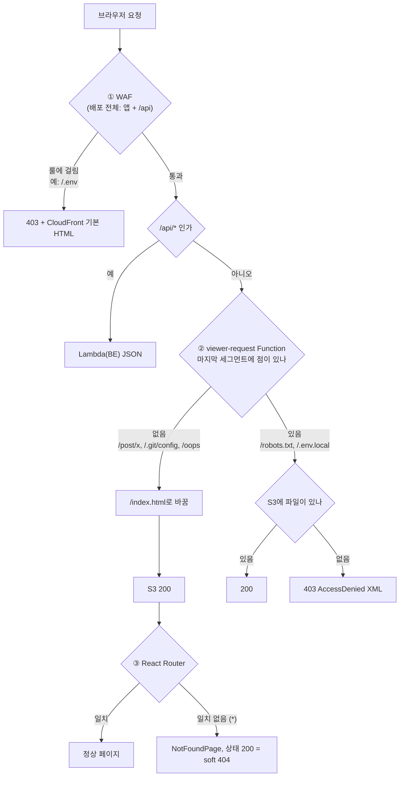
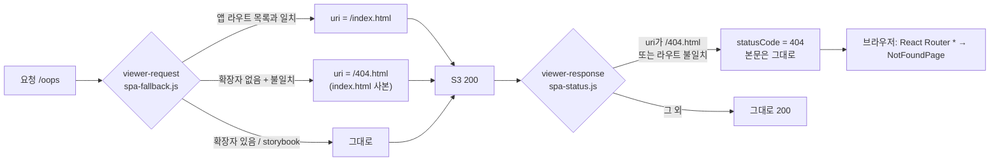
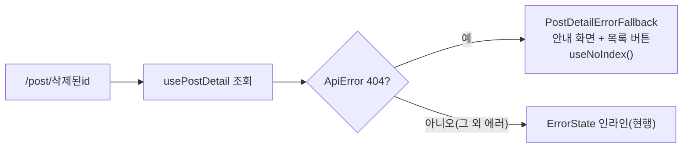
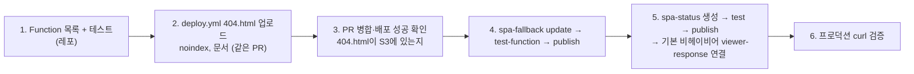

# URL 접근별 에러 응답 정리 계획

## Context

`https://linksphere.click/.env`은 CloudFront 기본 403 HTML("Request blocked.")로, `/.git/config`는 앱의
404 화면으로 뜬다. 사용자는 둘의 차이, 없는 경로의 응답 방식을 물었다. 그리고 공식 문서가 soft 404(200 + 에러 화면)를
권하지 않으니 **없는 경로가 200으로 응답하면 안 된다**는 목표를 정했다(2026-10-05).

확정된 결정:

- `/.env`처럼 WAF가 막는 경로는 WAF 403을 유지한다(사용자 선택).
- 없는 앱 경로는 **화면은 앱 404 그대로, HTTP 상태는 404**로 만든다(사용자 요구: 200 금지).

## 0. 현재 상황 (2026-10-05 프로덕션 실측)

| 경로 예                                         | 지금 응답              | 처리한 층                                                                               |
| ----------------------------------------------- | ---------------------- | --------------------------------------------------------------------------------------- |
| `/.env`, `/post/.env`                           | 403 HTML               | WAF `KnownBadInputs` → `ExploitablePaths_URIPATH`(sampled requests로 확인)              |
| `/.git/config`, `/wp-admin`, `/no-such-page`    | **200** + 앱 404 화면  | `infra/cloudfront-functions/spa-fallback.js:28-33` → `src/app/routes/index.tsx:210-214` |
| `/robots.txt`, `/.env.local`, `/assets/nope.js` | 403 XML                | S3. 버킷 정책이 `s3:GetObject`만 허용                                                   |
| `/post/<없는 id>`                               | 200 → toast 후 홈 이동 | `src/pages/post/hooks/usePostNotFoundRedirect.ts`                                       |

## 1. 공식 문서 근거 (§10)

- [Google HTTP 상태 코드](https://developers.google.com/search/docs/crawling-indexing/http-network-errors): _"429를 제외한 모든
  4xx 에러는 똑같이 취급된다"_ (번역). 2xx로 에러 화면을 보이면 _"Search Console이 soft 404 에러를 표시한다"_ (번역).
- [Google JS SEO 기본](https://developers.google.com/search/docs/crawling-indexing/javascript/javascript-seo-basics): SPA
  soft 404 회피 방법으로 _"서버가 404를 응답하는 URL로 JavaScript 리다이렉트"_ (번역)와 _"에러 페이지에 JavaScript로
  `<meta name="robots" content="noindex">` 추가"_ (번역)를 제시한다.
- [RFC 9110 §15.5.4](https://www.rfc-editor.org/rfc/rfc9110.html#name-403-forbidden): _"금지된 대상 리소스의 존재를
  '숨기고' 싶은 오리진 서버는 대신 404로 응답해도 된다"_ (번역).
- [S3 GetObject](https://docs.aws.amazon.com/AmazonS3/latest/API/API_GetObject.html): 객체가 없을 때 `s3:ListBucket`
  권한이 있으면 404, 없으면 403을 반환한다(번역, 요약).
- [CloudFront Functions event structure](https://docs.aws.amazon.com/AmazonCloudFront/latest/DeveloperGuide/functions-event-structure.html)
  (context7 `/websites/aws_amazon_amazoncloudfront_developerguide`로도 확인):
  - viewer-response Function은 _"응답 상태 코드를 바꾸거나, 본문 전체를 새 본문으로 바꾸거나, 본문을 제거할 수 있다"_ (번역).
    _"viewer response 함수에서 body 필드를 지정하지 않으면 캐시나 오리진이 반환한 원래 본문이 그대로 뷰어에게 간다"_ (번역).
    → **index.html 본문은 그대로 두고 상태만 404로 바꿀 수 있다.** 이 계획의 핵심 근거다.
  - _"오리진이 400 이상의 HTTP 에러를 반환하면 CloudFront Function은 실행되지 않는다"_ (번역). → S3 403 XML은 Function으로 못 바꾼다.
  - Custom error responses는 배포 단위라 `/api/*`까지 가린다(2026-07-28 사고, `spa-fallback.js:6-9`).
- React Router 6.30([FAQ](https://reactrouter.com/6.30.3/start/faq), context7 `/websites/reactrouter_6_30_3`): 404는
  `path="*"` catch-all로 처리한다. 브라우저 안의 라우터라 HTTP 상태 코드는 바꾸지 못한다(상태는 CloudFront가 이미 보냈다).

## 2. 목표 상태 (경로 종류별)

| 경로 종류                    | 예                                   | 목표 화면                      | 목표 상태                  | 바뀜       |
| ---------------------------- | ------------------------------------ | ------------------------------ | -------------------------- | ---------- |
| WAF 탐지 경로                | `/.env`                              | CloudFront 403 HTML            | 403                        | 유지       |
| 앱 라우트 일치               | `/`, `/post/abc`, `/auth/login`      | 정상 페이지                    | 200                        | 유지       |
| 확장자 없음 + 앱 라우트 아님 | `/oops`, `/.git/config`, `/wp-admin` | 앱 404 화면                    | **404**                    | **A**      |
| 앱 라우트 일치 + 데이터 없음 | `/post/<삭제된 id>`                  | 같은 URL에 안내 화면 + noindex | 200(엣지는 DB를 모름)      | **D**      |
| 확장자 있음 + 파일 없음      | `/robots.txt`, `/.env.local`         | S3 XML                         | 403(현행) / 404(B 선택 시) | 선택 **B** |
| `/api/*`                     |                                      | BE JSON                        | BE가 정함                  | 유지       |

`/.git/*` 같은 탐색 경로를 사람용 없는 페이지와 따로 처리하지 않는다. A가 적용되면 둘 다 "앱 라우트가 아닌 경로"로
똑같이 404가 된다. 별도 분기(전용 짧은 응답)는 상태 코드상 차이가 없어 이득이 작다 → 넣지 않는다.

## 3. 세부 계획

### A. 없는 앱 경로를 진짜 404로 (핵심)

1. **앱 라우트 목록**을 Function에 둔다(`spa-fallback.js`).
   - 대상은 `src/shared/config/route-paths.ts` + `src/app/routes/index.tsx`의 경로 16개 남짓이다.
   - `/post/:id`·`/post/edit/:id`는 패턴으로, 나머지는 정확히 일치로 비교한다. 끝 슬래시는 정규화한다.
   - 불일치하면 `/404.html`로 리라이트한다.
2. **viewer-response Function `link-sphere-spa-status`**(신규, `infra/cloudfront-functions/spa-status.js`)를 기본 비헤이비어에만 연결한다.
   - `event.request.uri`가 `/404.html`이면 `statusCode: 404`로 바꾼다.
   - 문서가 viewer-response의 `request.uri`가 리라이트 후 값인지 원래 값인지 명시하지 않는다. 그래서 원래 URI가 와도
     동작하도록 같은 라우트 판정을 한 번 더 한다. `/404.html`이거나 확장자 없는 불일치 경로면 404다.
   - 본문은 건드리지 않는다. 원래 index.html 본문이 그대로 간다.
3. **배포 파이프라인**(`.github/workflows/deploy.yml:78-102`)을 고친다.
   - `dist/index.html`을 `404.html`로도 같은 `no-store` 헤더로 업로드한다.
   - `sync --delete`의 exclude에 `404.html`을 추가한다(안 하면 매 배포마다 지워진다).
   - 배포 후 검증 단계(`:126-150` 부근)에 `/no-such-page` → 404 확인을 추가한다.
4. **목록이 어긋나지 않게 막는 장치**: `infra/cloudfront-functions/__tests__/spa-fallback.test.ts`(가칭)를 Vitest로 만든다.
   - 함수 파일 텍스트를 읽어 `handler`를 실행한다.
   - `ROUTES_PATHS`의 모든 경로(파라미터는 샘플 값)가 `/index.html`로 가는지 확인한다.
   - `/oops`·`/.git/config`가 `/404.html`로, `/assets/x.js`·`/storybook/`가 기존대로 가는지 확인한다.
   - **새 라우트를 추가하고 Function 목록을 안 고치면 이 테스트가 실패한다.**
   - 위치는 기존 Vitest include 범위에 맞춰 정한다.
5. **noindex 보강**: `src/shared/hooks/useNoIndex.ts`(신규)를 만든다.
   - 마운트 시 `<meta name="robots" content="noindex">`를 `document.head`에 넣고, 언마운트 시 뺀다.
   - `NotFoundPage`와 D의 삭제 글 화면 두 곳에서 쓰므로 shared에 둔다.
   - 선례는 없다(`document.head` 조작 grep 0건). 코드 형태는 Google 예제(`createElement('meta')` → `appendChild`)를 따른다.
   - 상태 404가 1차 수단이고, 이건 클라이언트 이동으로 404 화면에 왔을 때를 위한 보조 수단이다.

**트레이드오프(사용자 체감 없음, 운영 부담 있음)**:

- Function을 수정한 뒤에는 수동 배포가 필요하다(`docs/DEPLOY.md` "CloudFront Function" 절차). 라우트를 추가하는 PR마다
  Function 재배포가 따라온다. 테스트가 누락은 잡지만 재배포는 사람이 한다.
- **Function 배포를 잊으면 새 라우트에 직접 접속할 때 상태가 404가 된다.** 화면은 앱이 라우팅하므로 정상으로 보인다.
  그래서 사용자는 모르고 검색엔진·링크 미리보기만 영향을 받는다.
- 기본 비헤이비어 요청마다 viewer-response Function이 한 번 더 실행된다. Free 플랜에서 Functions 호출 한도나 과금이
  어떻게 되는지는 **출처 미상, 실행 전 확인 필요**하다.

### B. 없는 정적 파일을 404로 (선택, 추천하지 않음)

- 버킷 정책에 `s3:ListBucket`을 추가하면 403 XML이 404 XML로 바뀐다. 본문은 여전히 XML이다.
- 대가: Function이 빠지면 버킷 루트 `GET /`에서 객체 목록이 노출된다. 사람 사용자가 체감하는 차이는 없다.

### D. 삭제·비공개 포스트는 그 자리에서 안내 (2026-10-05 사용자 선택 ②)

근거:

- React Router 6.30 공식 패턴은 레코드가 없으면 404를 throw하고, 그 라우트의 `errorElement`가 같은 URL에서 "없음" 화면을
  그리는 것이다([tutorial](https://reactrouter.com/6.30.3/start/tutorial),
  [errorElement](https://reactrouter.com/6.30.3/route/error-element), context7 `/websites/reactrouter_6_30_3`).
- Google JS SEO 방법 2는 noindex 메타다.
- [NN/g](https://www.nngroup.com/articles/improving-dreaded-404-error-message/)는 에러 메시지가 _"사용자가 할 수 있는
  다음 단계를 제안"_ (번역)해야 한다고 쓴다.

채택하지 않은 안:

- ① 현행(toast 후 `/post`로 replace): 사라지는 toast에 의존하고 원래 URL을 잃는다. Google 두 방법 어디에도 해당하지 않는다.
- ③ `/not-found`로 `window.location.replace`: 진짜 404 상태를 얻지만 원래 URL을 잃고 전체 새로고침이 일어난다.

1. **먼저 미리보기를 만든다(§9).** 실제 `globals.css` 토큰과 기존 컴포넌트(`shared/ui/elements/EmptyState.tsx`,
   `ErrorState.tsx`, `shared/ui/layouts/ErrorLayout.tsx`)로 후보 2~3개를 Artifact 한 페이지에 나란히 둔다. 사용자가
   고른 뒤에 구현한다. 비교 포인트는 AppShell 안 인라인인지 전체 화면인지, 버튼 구성(목록으로 / 홈)이다.
2. `src/pages/post/PostDetailPage.tsx:51-63`의 `PostDetailErrorFallback`에서 404일 때 스피너 + 리다이렉트를 안내 화면으로 바꾼다.
   `useNoIndex()`를 호출한다.
3. 쓰이지 않게 되는 `src/pages/post/hooks/usePostNotFoundRedirect.ts`를 지운다. toast 문구 `TEXTS.post.detail.notFound`는
   안내 제목으로 재사용할지 미리보기에서 정한다. 새 문구는 `texts-conventions` skill에 따라 `texts.ts`에 추가한다.
   BE가 삭제와 비공개를 같은 404로 응답하므로, 문구는 "삭제됐거나 볼 수 없는 글"처럼 둘을 함께 덮는다.
4. 테스트: 404 응답(MSW)일 때 안내 화면·버튼이 보이고, 경로가 그대로이며, head에 noindex가 있는지 확인한다.
   기존 리다이렉트 테스트가 있으면 새 동작으로 교체한다.
5. CHANGELOG `[Unreleased]`에 동작 변경을 기록한다(`changelog-release` skill).
6. 이 부분은 Function 작업과 독립적이라 FE PR 하나로 먼저 낼 수 있다.

### C. 문서

- `docs/DEPLOY.md`에 "URL별 에러 응답" 절을 새로 만든다. 2번 표, A 흐름도, 진단 요령(403 HTML=WAF, 403 XML=S3,
  404 + 앱 화면=라우트 없음)을 넣는다.
- "CloudFront Function" 절에 `spa-status` 함수와 테스트 케이스 표(기존 6 + `/oops`·`/.git/config`·`/post/abc`·`/post/abc/`)를 추가한다.
- `docs/SYSTEM-ARCHITECTURE.md`의 infra 절에 새 함수 파일을 추가한다.
- 라우트를 추가하는 사람이 Function 재배포를 놓치지 않도록 `docs/FE-ARCHITECTURE.md`의 라우트 추가 체크리스트(§21/§22)에 한 줄을 넣는다.

## 실행 순서

- D(삭제 글 안내 화면)는 위 흐름과 독립이다. 미리보기 승인 → FE PR 순서로 먼저 진행해도 된다. 그때 `useNoIndex`도 같이 들어간다.
- 순서가 중요하다. 4번(Function이 `/404.html`로 리라이트)이 3번(파일 업로드)보다 먼저 가면 없는 경로가 S3 403 XML이 된다.
- 4~5번은 AWS 리소스를 직접 바꾸는 작업이라, 실행 직전에 명령을 보여 주고 확인을 받는다. 되돌리기는 이전 함수 코드를
  다시 publish하고 viewer-response 연결을 해제하는 것이다.
- 워크트리에서 작업한다(`git log origin/main..main` 먼저 확인).

## 검증 방법

1. 레포: `pnpm type-check`, `pnpm test`(Function 판정 테스트 포함), `pnpm lint`, `pnpm check:docs`.
2. `test-function`: 각 함수를 케이스 표대로 실행한다.
3. 프로덕션 curl:
   - `/no-such-page`, `/.git/config`, `/wp-admin` → **404**, 본문은 index.html
   - `/`, `/post/<실제 id>`, `/auth/login`, `/my/account`, `/storybook/` → 200
   - `/.env` → WAF 403(그대로), `/api/post/0000…` → BE JSON 404(그대로)
4. 브라우저: `/no-such-page`에서 앱 404 화면이 뜨고 DevTools Network에 404가 찍히는지, head에 noindex가 있는지 확인한다.
   `browser-verification` skill 절차로 녹화한다.

## 남은 것 / 범위 밖

- `/post/<없는 id>`의 상태 코드는 D 이후에도 200이다(엣지가 DB를 모름, noindex로 보완). 진짜 404가 필요해지면 ③안이나
  SSR·엣지 조회가 필요하다.
- `robots.txt`가 없다(크롤링 정책을 정하는 별도 작업).
- 라우트 목록을 빌드 때 자동 생성해 Function에 주입하는 방식(KeyValueStore 등)은 수동 배포 구조라 이번에는 하지 않는다.
